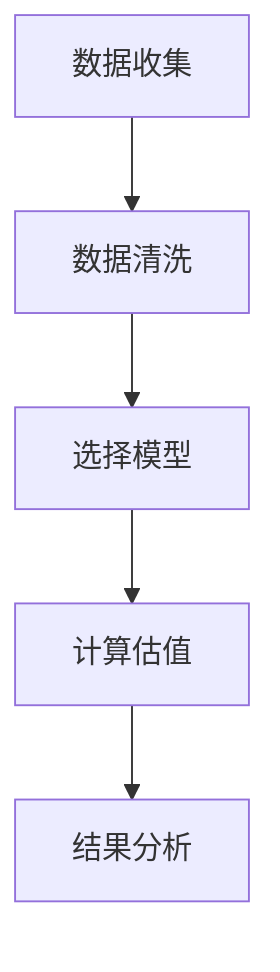

                 

# 全球股市估值与深海资源勘探技术的发展

> 关键词：股市估值，深海资源，技术发展，数学模型，系统架构，人工智能，大数据

> 摘要：本文系统地探讨了全球股市估值与深海资源勘探技术的发展。首先，从股市估值的核心概念、影响因素、数学模型和实际应用等方面进行深入分析，结合大数据和人工智能技术，展示了股市估值的创新方法。其次，重点研究了深海资源勘探技术的发展，从技术原理到设备创新，再到实际应用案例，详细阐述了该领域的最新进展。文章还通过实际案例分析，总结了股市估值与深海资源勘探技术的结合与未来发展方向，为读者提供了全面而深入的技术洞察。

---

## 第一部分：全球股市估值

### 第1章：股市估值的核心概念与数学模型

#### 1.1 股市估值的基本概念
- 股市估值的定义
- 股市估值的核心要素（公司基本面、市场情绪、宏观经济指标）
- 股市估值的分类与特点

#### 1.2 股市估值的数学模型
- 市盈率（P/E）模型
- 市净率（P/B）模型
- 现金流折现模型（DCF）

#### 1.3 股市估值的算法流程

### 第2章：股市估值的技术应用与系统架构

#### 2.1 基于大数据的股市预测
- 数据采集与预处理
- 数据分析与特征提取
- 机器学习算法（如随机森林、神经网络）的应用

#### 2.2 人工智能在股市估值中的应用
- 深度学习模型（如LSTM）的介绍
- 自然语言处理（NLP）在新闻和财报分析中的应用

#### 2.3 系统架构设计

### 第3章：股市估值的实战案例

#### 3.1 案例背景
- 案例选择与目标设定
- 数据来源与处理方法

#### 3.2 案例分析与实现
- 使用Python实现的估值模型代码
- 结果分析与优化策略

#### 3.3 案例总结与启示
- 案例成果展示
- 经验总结与实际应用的启示

---

## 第二部分：深海资源勘探技术的发展

### 第4章：深海资源勘探技术概述

#### 4.1 深海资源的定义与分类
- 深海资源的主要类型（石油、天然气、矿产资源）
- 深海勘探的目标与意义

#### 4.2 深海资源勘探的核心技术
- 海底地震勘探
- 重力勘探
- 磁法勘探

#### 4.3 深海资源勘探的设备与技术
- 海底钻探设备
- 水下机器人（ROV）
- 声呐与多波束测深技术

### 第5章：深海资源勘探技术的挑战与解决方案

#### 5.1 深海勘探的主要挑战
- 技术难题（如高压、高温环境）
- 经济成本高昂
- 环境风险

#### 5.2 深海资源勘探的技术创新
- 新型传感器与探测技术
- 自动化与智能化设备的应用
- 数据处理与分析的优化

#### 5.3 深海资源勘探的解决方案
- 优化勘探流程
- 提高设备可靠性
- 降低环境影响

### 第6章：深海资源勘探技术的未来趋势

#### 6.1 技术发展的驱动因素
- 科技进步
- 环保需求
- 资源短缺压力

#### 6.2 深海资源勘探的未来方向
- 智能化与自动化
- 绿色勘探技术
- 多学科交叉研究

#### 6.3 技术创新的案例分析
- 国际领先企业的创新实践
- 典型项目的成功经验

---

## 总结

通过系统分析全球股市估值与深海资源勘探技术的发展，我们不仅能够更好地理解这两个领域的内在联系，还能为未来的投资决策和技术创新提供有价值的参考。股市估值与深海资源勘探技术的发展都需要结合最新的技术和数学模型，通过不断的实践和优化，才能实现更高的效率和更好的成果。希望本文能够为相关领域的读者提供有益的启发和指导。

