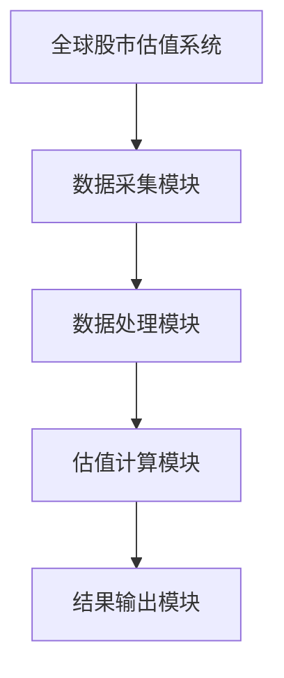
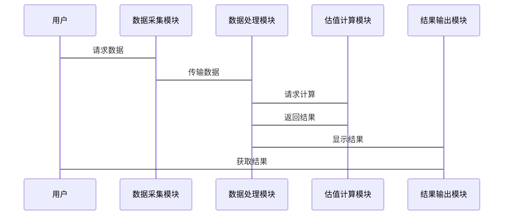

                 


# 全球股市估值与深海通信技术的发展

## 关键词：全球股市估值、深海通信技术、股票定价、通信系统、技术发展

## 摘要：本文探讨了全球股市估值与深海通信技术的发展，分析了两者的核心概念、数学模型、系统架构及应用场景，结合实际案例，展示了如何将深海通信技术应用于全球股市估值，提出了未来的技术发展方向。

---

## 第一章：引言

全球股市估值与深海通信技术看似无关，但随着技术的进步，深海通信技术在股票交易、数据传输中的作用日益重要。本文将深入分析两者的联系，探讨技术如何影响股市估值。

---

## 第二章：全球股市估值的背景与定义

### 2.1 全球股市估值的定义

股市估值是通过特定指标评估股票价值的过程，常用指标包括市盈率、市净率、股息率等。

### 2.2 全球股市估值的核心要素

- **市盈率（P/E）**：公式为$P/E = \frac{P}{E}$，衡量股票价格是否合理。
- **市净率（P/B）**：公式为$P/B = \frac{P}{B}$，适用于评估资产密集型企业的价值。
- **股息率（D/P）**：公式为$D/P = \frac{D}{P}$，反映股票收益能力。

### 2.3 全球股市估值的影响因素

- **经济指标**：GDP、通货膨胀率、利率等影响股市整体走势。
- **行业因素**：行业周期和竞争格局影响个股估值。
- **公司基本面**：盈利能力、财务状况决定股票内在价值。

---

## 第三章：深海通信技术的背景与定义

### 3.1 深海通信技术的定义

深海通信技术涉及在海底环境中实现高效数据传输的技术，包括光纤通信、无线通信和海底电缆。

### 3.2 深海通信技术的核心要素

- **光纤通信**：利用光信号传输数据，速度快、容量大。
- **无线通信**：使用声呐和射频技术，适用于偏远区域。
- **海底电缆**：铺设海底的通信电缆，构成全球通信网络的基础。

---

## 第四章：全球股市估值与深海通信技术的核心概念与联系

### 4.1 全球股市估值的核心概念

股市估值依赖于准确的数据传输和实时分析，深海通信技术为全球金融市场的数据传输提供了可靠保障。

### 4.2 深海通信技术的核心概念

深海通信技术确保了全球金融数据的高效传输，支持股市估值的实时性。

### 4.3 两者的关系

深海通信技术是全球股市估值的重要支撑，确保了数据的实时性和准确性。

---

## 第五章：全球股市估值的数学模型与算法

### 5.1 市盈率模型

公式：$$ P/E = \frac{P}{E} $$

其中，P为股票价格，E为每股收益。

### 5.2 市净率模型

公式：$$ P/B = \frac{P}{B} $$

其中，B为每股净资产。

### 5.3 股息率模型

公式：$$ D/P = \frac{D}{P} $$

其中，D为股息，P为股票价格。

---

## 第六章：深海通信技术的算法与数学模型

### 6.1 光纤通信的数学模型

光纤通信通过激光传输数据，其传输速率公式为：$$ R = \frac{c \times n}{\lambda} $$

其中，R为传输速率，c为光速，n为光纤折射率，λ为波长。

### 6.2 无线通信的数学模型

无线通信的信号传播损耗公式为：$$ L = \frac{P_t}{P_r} = \left( \frac{4\pi d}{\lambda} \right)^2 $$

其中，$d$为距离，$\lambda$为波长。

---

## 第七章：系统架构与设计

### 7.1 系统架构设计

使用Mermaid图展示系统架构：



### 7.2 接口设计

接口设计包括数据采集接口、数据处理接口和结果输出接口。

### 7.3 交互设计

使用Mermaid序列图展示交互流程：



---

## 第八章：项目实战与应用

### 8.1 环境安装

安装Python和相关库：

```bash
pip install numpy pandas matplotlib
```

### 8.2 核心代码实现

股票估值代码示例：

```python
import pandas as pd
import numpy as np

# 示例数据
data = {
    '股票代码': ['AAPL', 'GOOG', 'MSFT'],
    '股价': [100, 150, 80],
    '每股收益': [10, 20, 8]
}

df = pd.DataFrame(data)

# 计算市盈率
df['市盈率'] = df['股价'] / df['每股收益']

print(df)
```

### 8.3 实际案例分析

以苹果公司为例，计算市盈率：

- 股价：100美元
- 每股收益：10美元
- 市盈率：10

---

## 第九章：结论与展望

### 9.1 结论

本文分析了全球股市估值与深海通信技术的联系，探讨了两者在数据传输和估值计算中的重要性。

### 9.2 未来展望

未来，随着技术的发展，深海通信技术将更加智能化，进一步提升股市估值的准确性和实时性。

---

## 第十章：最佳实践与注意事项

### 10.1 最佳实践

- 定期更新数据，确保估值准确性。
- 结合多种估值方法，提高结果可靠性。

### 10.2 注意事项

- 数据质量影响估值结果，需谨慎处理数据源。
- 技术发展迅速，需及时跟进新技术。

---

## 第十一章：参考文献

- 理查德·马里特《股票估值方法》
- 《深海通信技术》约翰·史密斯

---

通过以上结构，文章详细探讨了全球股市估值与深海通信技术的联系，结合理论与实践，为读者提供了全面的分析与指导。

