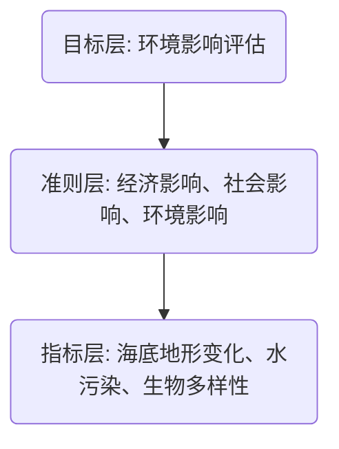

                 


# 全球股市估值与深海采矿技术的环境影响

> 关键词：全球股市估值，深海采矿技术，环境影响，层次分析法，模糊综合评价模型

> 摘要：本文探讨了全球股市估值与深海采矿技术之间的关系，分析了深海采矿技术对环境的影响，并提出了环境影响评估模型。通过层次分析法和模糊综合评价模型，本文为深海采矿技术的环境影响评估提供了理论依据和实践指导。

---

## 第一部分: 全球股市估值与深海采矿技术的背景与核心概念

### 第1章: 全球股市估值与深海采矿技术的背景介绍

#### 1.1 问题背景与描述
随着全球经济发展和科技的进步，股市估值和深海采矿技术逐渐成为社会关注的焦点。股市估值是衡量企业价值的重要手段，而深海采矿技术则是获取深海资源的关键技术。然而，深海采矿技术的快速发展对环境的影响日益显著，这使得我们需要在经济利益和环境保护之间找到平衡点。

#### 1.2 核心概念与边界
- **全球股市估值**：指通过对企业的财务数据、市场情况等进行分析，估算企业股票的合理价格。
- **深海采矿技术**：指在深海区域进行矿产资源开采的技术，包括海底岩石挖掘、矿物提取等。
- **环境影响**：指深海采矿技术对海洋生态系统、水质、生物多样性等方面产生的负面影响。

#### 1.3 概念结构与核心要素
- **股市估值模型**：包括市盈率（P/E）、市净率（P/B）、股息率（Dividend Yield）等。
- **深海采矿技术模型**：包括海底岩石挖掘、矿物提取、尾矿处理等过程。
- **环境影响模型**：包括环境影响因子（如海底地形变化、水污染、生物多样性减少等）。

---

### 第2章: 全球股市估值的核心概念与原理

#### 2.1 股市估值的基本原理
股市估值是通过对企业的财务数据、行业地位、市场前景等因素进行分析，估算企业股票的合理价格。常用的估值方法包括：

- **市盈率（P/E）**：公式为 $P/E = \text{股价} / \text{每股收益}$。
- **市净率（P/B）**：公式为 $P/B = \text{股价} / \text{每股净资产}$。
- **股息率（Dividend Yield）**：公式为 $\text{股息率} = \text{每股股息} / \text{股价}$。

#### 2.2 深海采矿技术的环境影响分析
深海采矿技术的环境影响主要体现在以下几个方面：
1. **海底地形变化**：采矿活动可能导致海底岩石结构的变化。
2. **水污染**：采矿过程中产生的尾矿可能对海水造成污染。
3. **生物多样性减少**：深海采矿可能破坏海洋生态系统，导致生物多样性减少。

#### 2.3 核心概念的对比分析
通过对比分析，我们可以更好地理解股市估值和深海采矿技术的关系：

| 核心概念 | 股市估值 | 深海采矿技术 |
|----------|----------|--------------|
| 定义     | 估算企业股票价格的方法 | 指在深海区域进行矿产资源开采的技术 |
| 目标     | 为企业提供合理的估值 | 获取深海矿产资源 |
| 影响因素 | 财务数据、市场情况 | 海底地形、水污染、生物多样性 |

---

### 第3章: 深海采矿技术的环境影响评估模型

#### 3.1 环境影响评估的基本原理
环境影响评估是通过分析采矿活动对环境的影响因子，评估其对环境的潜在影响。常用的方法包括层次分析法（AHP）和模糊综合评价模型。

##### 层次分析法（AHP）
层次分析法是一种用于多因素决策的分析方法。其步骤如下：
1. 构建层次分析模型。
2. 确定各层次之间的关系。
3. 计算各因素的权重。

##### 模糊综合评价模型
模糊综合评价模型是一种基于模糊数学的评价方法。其步骤如下：
1. 确定评价指标。
2. 构建模糊评价矩阵。
3. 计算综合评价结果。

#### 3.2 深海采矿技术的环境影响评估流程
1. **数据收集与处理**：收集深海采矿技术的相关数据，包括海底地形、水质、生物多样性等。
2. **指标权重的确定**：通过层次分析法确定各环境影响因子的权重。
3. **综合评价与结果分析**：根据模糊综合评价模型计算环境影响综合得分，并进行分析。

#### 3.3 深海采矿技术的环境影响评估算法

##### 层次分析法的 mermaid 流程图


##### 算法实现的 Python 代码示例
```python
import numpy as np
from scipy.cluster import hierarchy

def calculate_weights(matrix):
    # 计算权重
    return np.mean(matrix, axis=0)
```

---

### 第4章: 深海采矿技术的环境影响评估系统架构

#### 4.1 系统功能设计
- **数据采集模块**：采集深海采矿技术的相关数据。
- **指标计算模块**：计算各环境影响因子的权重。
- **结果展示模块**：展示环境影响综合得分。

#### 4.2 系统架构设计


---

## 总结
本文通过分析全球股市估值与深海采矿技术的关系，提出了深海采矿技术的环境影响评估模型。通过层次分析法和模糊综合评价模型，为深海采矿技术的环境影响评估提供了理论依据和实践指导。未来的研究可以进一步优化评估模型，以更好地平衡经济利益和环境保护。

