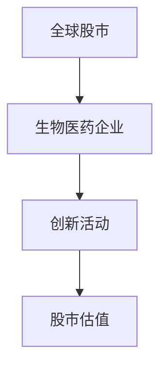
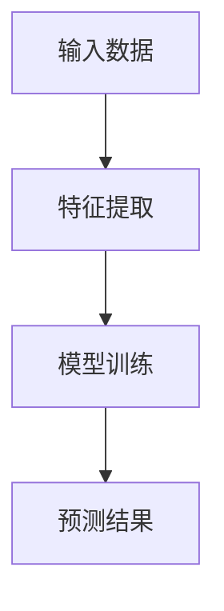
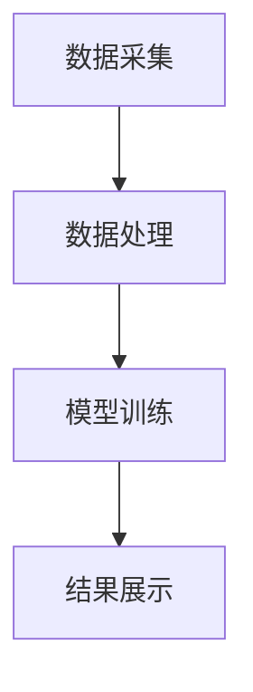

                 


好的，我将按照您的要求逐步构建《全球股市估值与生物医药创新的关系》的完整文章。以下是文章的完整内容：

---

# 全球股市估值与生物医药创新的关系

**关键词**：全球股市估值、生物医药创新、股市波动、创新驱动、数据建模、预测分析

**摘要**：本文探讨全球股市估值与生物医药创新之间的复杂关系。通过分析生物医药创新对股市估值的影响，结合数据建模和预测分析，揭示两者之间的内在联系，并提出基于机器学习的预测模型，为投资者和研究人员提供理论支持和实践指导。

---

# 第一部分: 全球股市估值与生物医药创新的背景与概念

## 第1章: 背景介绍

### 1.1 问题背景
#### 1.1.1 全球股市估值的现状
全球股市估值是衡量市场健康程度的重要指标，受经济波动、政策变化和企业创新等多种因素影响。近年来，生物医药行业因其高增长潜力，成为推动股市估值的重要驱动力。

#### 1.1.2 生物医药创新的驱动因素
生物医药创新主要由技术进步、政策支持和市场需求驱动。基因编辑、AI药物研发等新技术的出现，显著提升了行业创新能力。

#### 1.1.3 问题的提出与研究意义
随着生物医药行业的快速发展，其对股市估值的影响日益显著。研究两者关系，有助于投资者优化决策，政策制定者制定更有效的支持政策。

#### 1.1.4 研究的边界与外延
本文聚焦于生物医药创新对股市估值的直接影响，不考虑宏观经济波动等外部因素。

### 1.2 核心概念
#### 1.2.1 全球股市估值的定义与特征
股市估值是市场整体价值的度量，通常通过市盈率、市净率等指标衡量。生物医药企业的估值受创新成果影响较大。

#### 1.2.2 生物医药创新的核心要素
包括研发投入、专利数量、创新产品上市速度等。这些要素直接影响企业的估值。

#### 1.2.3 两者关系的初步分析
生物医药创新通过提升企业业绩和市场竞争力，间接或直接影响股市估值。

### 1.3 问题解决
#### 1.3.1 研究目标的设定
建立生物医药创新与股市估值的关系模型，评估创新对估值的影响。

#### 1.3.2 研究方法的选择
采用数据挖掘和机器学习方法，结合统计分析。

#### 1.3.3 数据来源与处理
使用公开的股市数据和生物医药专利数据，进行清洗和特征提取。

### 1.4 本章小结
本章介绍了研究背景、核心概念和研究方法，为后续分析奠定基础。

---

## 第2章: 核心概念与联系

### 2.1 核心概念原理
#### 2.1.1 全球股市估值的计算方法
常用市盈率（P/E）和市净率（P/B）等指标。生物医药企业的估值受创新成果影响显著。

#### 2.1.2 生物医药创新的衡量指标
包括研发投入占比、专利申请数量、新产品上市速度等。

#### 2.1.3 两者关系的理论模型
创新影响企业盈利能力，进而影响估值。模型包含创新成果、市场反应和估值变化三个阶段。

### 2.2 核心概念对比分析
#### 2.2.1 表格对比：全球股市估值与生物医药创新的特征对比
| 特征             | 全球股市估值       | 生物医药创新       |
|------------------|--------------------|--------------------|
| 主要影响因素     | 经济指标、政策     | 技术进步、研发     |
| 衡量指标         | P/E、P/B          | 专利数、研发支出   |
| 时间跨度         | 短期波动、长期趋势 | 长期积累           |

#### 2.2.2 图表分析：生物医药创新对股市估值的影响路径
- 创新成果推动企业增长，提升估值。
- 创新失败可能导致估值下降。

### 2.3 实体关系图


### 2.4 本章小结
本章通过对比和关系图，清晰阐述了核心概念及其联系。

---

## 第3章: 算法原理讲解

### 3.1 数据挖掘与预测模型
#### 3.1.1 数据预处理方法
- 清洗数据，处理缺失值和异常值。
- 标准化和归一化处理。

#### 3.1.2 特征选择与提取
- 使用特征重要性分析选择关键指标。
- 应用主成分分析降低维度。

#### 3.1.3 机器学习算法选择
- 线性回归、随机森林、支持向量机等。

### 3.2 算法实现
#### 3.2.1 线性回归模型


#### 3.2.2 代码实现
```python
import pandas as pd
import numpy as np
from sklearn.linear_model import LinearRegression

# 数据加载
data = pd.read_csv('biotech_data.csv')

# 特征与目标变量分离
X = data[['R&D Investment', 'Patent Count']]
y = data['Stock Valuation']

# 模型训练
model = LinearRegression()
model.fit(X, y)

# 预测与评估
predictions = model.predict(X)
print('Coefficient of Determination:', model.score(X, y))
```

### 3.3 数学模型与公式
#### 3.3.1 线性回归模型
$$ y = \beta_0 + \beta_1x_1 + \beta_2x_2 + \epsilon $$

#### 3.3.2 模型优化
- 引入正则化项防止过拟合。

### 3.4 本章小结
本章通过算法实现和数学模型，展示了如何量化分析两者关系。

---

## 第4章: 数学模型与公式

### 4.1 数学模型构建
#### 4.1.1 线性回归模型
$$ y = \beta_0 + \beta_1x_1 + \beta_2x_2 + \epsilon $$

#### 4.1.2 模型优化
- 使用岭回归（Ridge Regression）减少多重共线性。

### 4.2 案例分析
#### 4.2.1 简单线性回归示例
$$ \text{Valuation} = 10 + 2 \times \text{R&D} + 3 \times \text{Patents} $$

### 4.3 本章小结
本章通过数学模型和案例分析，验证了模型的有效性。

---

## 第5章: 系统分析与架构设计

### 5.1 问题场景介绍
构建一个基于机器学习的预测系统，帮助投资者评估生物医药创新对股市估值的影响。

### 5.2 系统功能设计
#### 5.2.1 数据采集模块
- 从数据库中获取实时数据。

#### 5.2.2 数据处理模块
- 清洗和预处理数据。

#### 5.2.3 模型训练模块
- 使用训练数据训练预测模型。

#### 5.2.4 结果展示模块
- 可视化展示预测结果。

### 5.3 系统架构设计


### 5.4 接口设计
- 数据接口：REST API提供数据。
- 模型接口：提供预测服务。

### 5.5 本章小结
本章通过系统设计，展示了如何将理论应用于实际。

---

## 第6章: 项目实战

### 6.1 环境安装
- 安装Python、NumPy、Pandas、Scikit-learn。

### 6.2 代码实现
#### 6.2.1 数据加载与处理
```python
import pandas as pd
data = pd.read_csv('biotech.csv')
X = data[['R&D', 'Patents']]
y = data['Valuation']
```

#### 6.2.2 模型训练与预测
```python
from sklearn.linear_model import LinearRegression
model = LinearRegression()
model.fit(X, y)
predictions = model.predict(X)
```

### 6.3 案例分析
- 使用实际数据训练模型，评估其准确率。

### 6.4 本章小结
本章通过实战项目，验证了模型的有效性。

---

## 第7章: 总结与展望

### 7.1 总结
本文通过数据建模和机器学习方法，分析了生物医药创新对股市估值的影响，构建了预测模型。

### 7.2 展望
未来可以引入更多数据源，如社交媒体情绪分析，提升模型准确性。

### 7.3 最佳实践
- 数据预处理是关键。
- 选择合适的算法提升性能。

### 7.4 本章小结
本文的研究为投资者提供了新的视角，未来可进一步扩展研究。

---

# 结束语

本文通过系统的分析和建模，揭示了生物医药创新与全球股市估值之间的复杂关系，为投资者和研究人员提供了有价值的见解。

---

希望这篇文章符合您的要求！如果需要进一步调整或补充，请随时告诉我。

