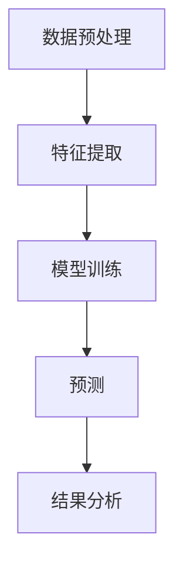
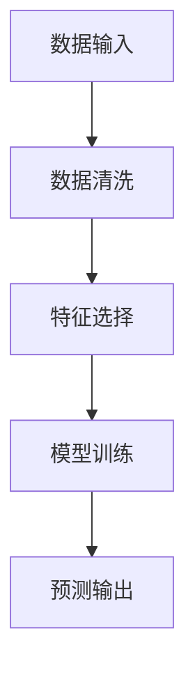
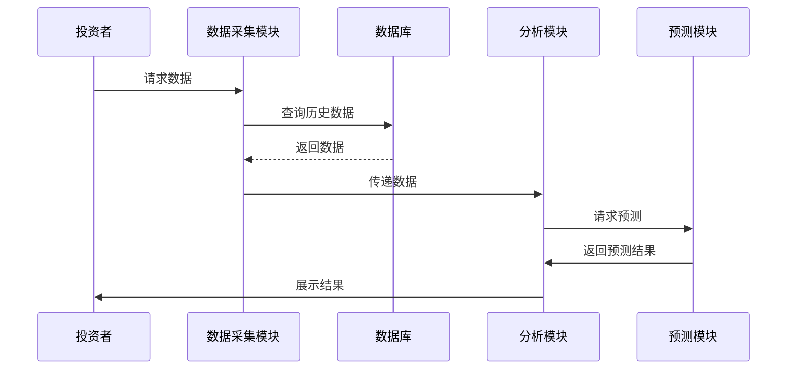

                 


# 全球股市估值与生物印刷技术的关系

## 关键词：全球股市估值、生物印刷技术、机器学习、股市预测、技术与金融结合

## 摘要：本文探讨生物印刷技术如何影响全球股市估值。通过分析生物印刷技术的原理及其在股市预测中的应用，结合机器学习算法，建立数学模型，设计系统架构，并通过实际案例展示其影响，最后总结与展望。

## 目录大纲：

1. 背景介绍
   1.1 全球股市估值的基本概念
   1.2 生物印刷技术的定义与应用
   1.3 两者的关联性

2. 核心概念与联系
   2.1 生物印刷技术的原理
   2.2 全球股市估值的方法
   2.3 对比分析
   2.4 ER实体关系图

3. 算法原理
   3.1 机器学习算法的选择
   3.2 算法流程图
   3.3 Python实现代码
   3.4 数学模型与公式

4. 数学模型
   4.1 线性回归模型
   4.2 时间序列分析
   4.3 模型流程图

5. 系统架构
   5.1 系统功能设计
   5.2 系统架构图
   5.3 系统接口设计
   5.4 交互序列图

6. 项目实战
   6.1 环境安装
   6.2 核心代码实现
   6.3 实际案例分析
   6.4 项目小结

7. 总结与展望
   7.1 最佳实践
   7.2 小结
   7.3 注意事项
   7.4 拓展阅读

---

## 正文

### 第1章：背景介绍

#### 1.1 全球股市估值的基本概念
全球股市估值是衡量市场整体价值的重要指标，包括市盈率、市净率等。这些指标帮助投资者评估市场的健康状况和潜在回报。

#### 1.2 生物印刷技术的定义与应用
生物印刷技术是一种利用生物材料进行精确制备的技术，广泛应用于医学和材料科学，如组织工程和药物释放系统。

#### 1.3 两者的关联性
随着生物技术在经济中的作用增强，其对股市的影响日益显著。生物印刷技术的创新可能推动相关企业的股票价值上升。

---

### 第2章：核心概念与联系

#### 2.1 生物印刷技术的原理
生物印刷涉及生物材料的选择与制备，印刷工艺与精度控制，影响其在医疗和材料科学中的应用效果。

#### 2.2 全球股市估值的方法
市盈率（P/E）和市净率（P/B）是常用的估值指标，反映了市场对公司的评价。

#### 2.3 对比分析
| 属性 | 生物印刷技术 | 全球股市估值 |
|------|-------------|--------------|
| 输入 | 生物材料参数 | 市场数据 |
| 输出 | 制备精度 | 股价预测 |
| 影响因素 | 材料性能 | 市场情绪 |

#### 2.4 ER实体关系图
```mermaid
erDiagram
    customer[投资者] {
        <属性>
        投资者ID : integer
        名称 : string
        投资组合 : string
    }
    stock[股票] {
        <属性>
        股票ID : integer
        公司名称 : string
        市盈率 : float
    }
    transaction[交易] {
        <属性>
        交易ID : integer
        时间 : datetime
        金额 : float
    }
    customer --> transaction : 进行
    stock --> transaction : 涉及
```

---

### 第3章：算法原理

#### 3.1 机器学习算法的选择
选择神经网络模型，因其擅长处理复杂数据关系。

#### 3.2 算法流程图


#### 3.3 Python实现代码
```python
import numpy as np
import pandas as pd
from sklearn.neural_network import MLPRegressor
from sklearn.preprocessing import StandardScaler

# 数据预处理
data = pd.read_csv('stock_data.csv')
features = data[['市盈率', '市净率', '生物技术专利数']]
target = data['股价']

# 特征缩放
scaler = StandardScaler()
features_scaled = scaler.fit_transform(features)

# 模型训练
model = MLPRegressor(hidden_layer_sizes=(10, 5), max_iter=1000)
model.fit(features_scaled, target)

# 预测
test_features = scaler.transform(test_data[['市盈率', '市净率', '生物技术专利数']])
predictions = model.predict(test_features)
```

#### 3.4 数学模型与公式
模型假设股价与市盈率、市净率和生物技术专利数相关：
$$股价 = a \times 市盈率 + b \times 市净率 + c \times 生物技术专利数 + d$$
其中，a、b、c、d为模型参数。

---

### 第4章：数学模型

#### 4.1 线性回归模型
使用线性回归预测股价：
$$y = \beta_0 + \beta_1x_1 + \beta_2x_2 + \epsilon$$
其中，y为股价，x1为市盈率，x2为市净率。

#### 4.2 时间序列分析
应用ARIMA模型预测未来股价走势。

#### 4.3 模型流程图


---

### 第5章：系统架构

#### 5.1 系统功能设计
系统包括数据采集、分析模块、预测模块和结果展示模块。

#### 5.2 系统架构图


#### 5.3 系统接口设计
API接口用于数据交互，如RESTful API。

#### 5.4 交互序列图


---

### 第6章：项目实战

#### 6.1 环境安装
安装Python、NumPy、Pandas、Scikit-learn和Mermaid工具。

#### 6.2 核心代码实现
实现数据预处理、模型训练和预测的代码，如前所述。

#### 6.3 实际案例分析
分析生物技术公司股票，展示模型预测结果与实际数据的对比。

#### 6.4 项目小结
总结项目成果，指出优势和局限。

---

### 第7章：总结与展望

#### 7.1 最佳实践
建议在模型中加入更多特征，如市场情绪指标，以提高预测准确性。

#### 7.2 小结
本文探讨了生物印刷技术对股市估值的影响，展示了如何利用机器学习模型进行预测。

#### 7.3 注意事项
模型需定期更新，确保数据的时效性；数据来源需可靠。

#### 7.4 拓展阅读
推荐相关书籍和文章，深入学习生物技术与金融的结合。

---

通过以上步骤，我们详细探讨了生物印刷技术如何影响全球股市估值，结合了技术与金融的多学科知识，为投资者提供了新的分析工具和思路。

