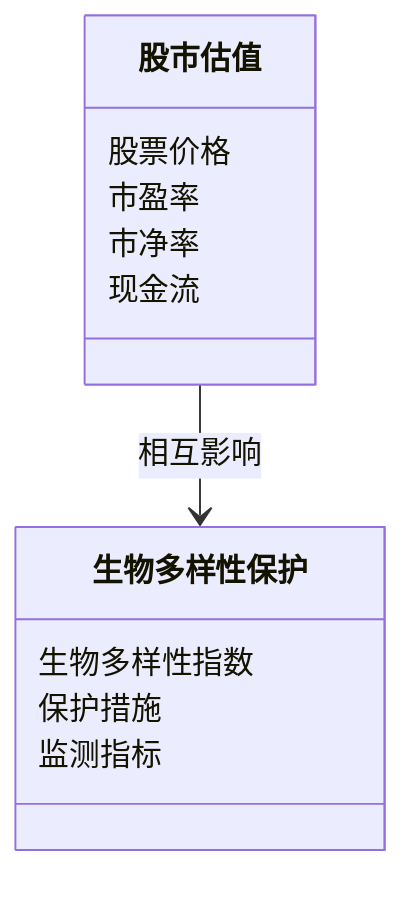
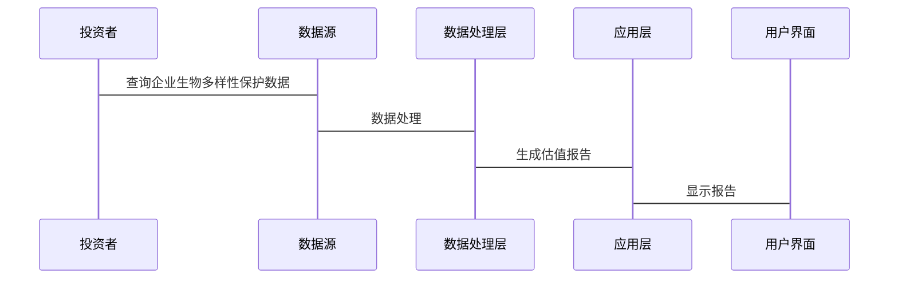

                 

<think>
好的，我将按照您的要求，详细地思考如何撰写这篇文章。为了使文章内容更具体，我会先根据您提供的目录大纲开始逐步构建内容。

### 第一部分：全球股市估值与生物多样性保护的背景与概念

#### 第1章：全球股市估值与生物多样性保护的背景介绍

##### 1.1 全球股市估值的基本概念

###### 1.1.1 股市估值的核心要素

股市估值是指对股票价值的评估，核心要素包括企业的财务状况、行业地位、市场前景等。通过分析这些要素，投资者可以判断股票的内在价值。

###### 1.1.2 股市估值的主要方法

常用的股票估值方法有市盈率法、市净率法、现金流折现法等。这些方法各有优缺点，投资者可以根据具体情况选择合适的估值方法。

###### 1.1.3 股市估值的全球现状与趋势

近年来，全球股市估值呈现波动性增长，但受经济环境和政策变化的影响较大。投资者越来越关注企业的可持续发展能力。

##### 1.2 生物多样性保护的基本概念

###### 1.2.1 生物多样性的定义与分类

生物多样性是指生物及其生态系统的多样性。它包括基因多样性、物种多样性和生态系统多样性。

###### 1.2.2 生物多样性保护的重要性

生物多样性是生态系统的基石，对维持生态平衡、促进经济发展和提高人类生活质量具有重要意义。

###### 1.2.3 全球生物多样性保护的现状与挑战

尽管国际社会采取了一系列措施保护生物多样性，但栖息地破坏、气候变化等因素仍对生物多样性构成威胁。

##### 1.3 股市估值与生物多样性保护的关联背景

###### 1.3.1 环境因素对经济的影响

环境问题如气候变化和资源枯竭会影响企业的生产成本和市场前景，进而影响股市估值。

###### 1.3.2 可持续投资的概念与发展趋势

可持续投资强调在追求财务回报的同时，考虑环境、社会和治理因素，这已成为全球投资的趋势。

###### 1.3.3 生物多样性保护对企业的潜在影响

企业若积极参与生物多样性保护，可提升品牌形象，降低环境风险，从而提高股市估值。

##### 1.4 本章小结

本章介绍了股市估值和生物多样性保护的基本概念，并探讨了两者之间的关联背景，为后续分析奠定了基础。

---

### 第二部分：全球股市估值与生物多样性保护的核心概念与联系

#### 第2章：全球股市估值与生物多样性保护的核心概念

##### 2.1 股市估值的核心概念

###### 2.1.1 股票价值的计算方法

股票价值的计算方法包括内在价值法和相对价值法。内在价值法通过DCF模型等方法计算，相对价值法通过比较市盈率、市净率等指标。

###### 2.1.2 影响股市估值的主要因素

影响股市估值的主要因素包括宏观经济因素、行业因素、公司基本面等。环境因素逐渐成为不可忽视的因素。

###### 2.1.3 股市估值的边界与外延

股市估值的边界包括企业的财务数据和市场环境，外延则涉及企业未来的增长潜力和市场前景。

##### 2.2 生物多样性保护的核心概念

###### 2.2.1 生物多样性保护的目标与范围

生物多样性保护的目标是维护生态平衡，保护濒危物种及其栖息地。范围包括陆地、水域和湿地等生态系统。

###### 2.2.2 生物多样性保护的核心要素

核心要素包括法律法规、资金支持、公众意识和国际合作等。

###### 2.2.3 生物多样性保护的实施路径

实施路径包括建立保护区、开展生态修复、推动可持续发展等。

##### 2.3 股市估值与生物多样性保护的关联性分析

###### 2.3.1 核心概念的对比分析

通过对比股市估值和生物多样性保护的核心概念，发现两者在目标和手段上有一定的关联性。

###### 2.3.2 关联性特征对比表格

| 特性            | 股市估值               | 生物多样性保护         |
|-----------------|-----------------------|-----------------------|
| 目标            | 评估企业价值           | 保护生物多样性         |
| 方法            | 财务指标、市场比较法     | 法律法规、生态修复等     |
| 关联因素        | 宏观经济、行业、企业基本面 | 环境、政策、公众意识等   |

###### 2.3.3 ER实体关系图架构

```mermaid
erd
actor 投资者
actor 环境保护机构
actor 企业
group 股市
group 生物多样性
```

---

### 第三部分：全球股市估值与生物多样性保护的关联机制

#### 第3章：环境因素对股市估值的影响

##### 3.1 环境风险评估模型

###### 3.1.1 环境风险评估的定义

环境风险评估是通过分析企业面临的环境问题，评估其对财务状况的影响。

###### 3.1.2 环境风险评估的步骤

步骤包括数据收集、风险识别、风险量化和风险应对。

###### 3.1.3 环境风险评估的数学模型

常用的数学模型包括环境风险指数模型，如下：

$$ ERI = \sum_{i=1}^{n} w_i \cdot R_i $$

其中，$w_i$ 是第$i$个环境因素的权重，$R_i$ 是第$i$个环境因素的风险值。

##### 3.2 生物多样性保护对企业价值的影响

###### 3.2.1 生物多样性保护的经济效益

通过保护生物多样性，企业可以降低环境风险，提升品牌形象，从而提高市场价值。

###### 3.2.2 生物多样性保护对企业估值的影响路径

路径包括提升企业的可持续发展能力，增强投资者信心，进而提高股市估值。

###### 3.2.3 生物多样性保护的长期价值

长期来看，生物多样性保护有助于企业实现可持续发展，增强抗风险能力，从而提高长期价值。

##### 3.3 环境政策与股市估值的关联

###### 3.3.1 环境政策对股市的影响

环境政策如碳排放交易机制等，会影响企业的生产成本和市场竞争力，进而影响股市估值。

###### 3.3.2 环境政策的实施对股市估值的影响

例如，严格的环保法规可能导致企业成本增加，短期影响股市估值，但长期来看，有助于企业转型，提升竞争力。

---

### 第四部分：系统分析与架构设计方案

#### 第4章：全球股市估值与生物多样性保护的系统分析

##### 4.1 系统功能设计

###### 4.1.1 领域模型

领域模型如下：



##### 4.2 系统架构设计

系统架构如下：


##### 4.3 系统接口设计

系统接口设计包括数据输入接口、数据处理接口和用户查询接口。

##### 4.4 系统交互设计

系统交互如下：



---

### 第五部分：项目实战

#### 第5章：环境因素对股市估值的影响分析

##### 5.1 环境因素对股市估值的影响分析

通过具体案例分析环境因素对企业估值的影响，如某企业因环保措施得当，估值提升。

##### 5.2 可持续发展对股市估值的影响

分析企业的可持续发展实践如何提升股市估值，如采用绿色生产技术。

##### 5.3 环境政策对股市估值的影响

通过分析环保法规对企业成本和市场竞争力的影响，评估其对股市估值的影响。

##### 5.4 项目小结

通过具体案例分析，验证环境因素对股市估值的影响，为企业和投资者提供参考。

---

### 第六部分：总结与展望

#### 第6章：全球股市估值与生物多样性保护的未来展望

##### 6.1 可持续投资的趋势

可持续投资将继续增长，企业和社会将更加重视环境因素。

##### 6.2 生物多样性保护的未来方向

加强国际合作，推动技术创新，提升公众意识。

##### 6.3 对未来研究的建议

建议进一步研究环境因素对股市估值的长期影响，探索更有效的环境风险评估模型。

---

### 结语

通过本文的系统分析和具体案例研究，我们深入探讨了全球股市估值与生物多样性保护之间的关联。未来，随着环境问题的日益突出，企业和投资者将更加关注可持续发展，生物多样性保护将在股市估值中发挥越来越重要的作用。

