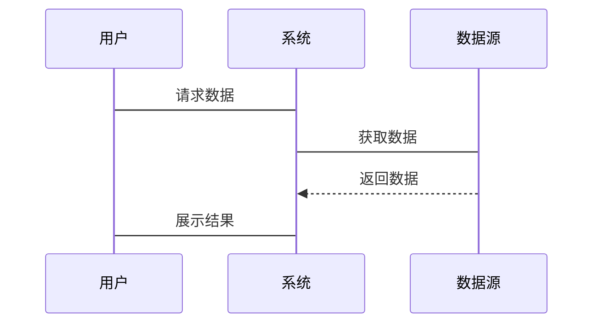

                 


# 全球股市估值与生物燃料与食品安全的平衡

> 关键词：全球股市估值、生物燃料、食品安全、系统平衡、数学模型

> 摘要：本文探讨了全球股市估值与生物燃料和食品安全之间的复杂关系，通过建立数学模型和系统架构，分析如何实现三者的动态平衡，确保经济、能源和粮食安全的可持续发展。

---

# 第一部分：引言

## 第1章：问题背景与研究意义

### 1.1 全球股市估值的现状与挑战

#### 1.1.1 全球股市估值的基本概念

全球股市估值是衡量市场整体价值的重要指标，通常通过市盈率（P/E）、市净率（P/B）等指标来衡量。股市估值反映了投资者对市场的信心和经济前景的预期。

#### 1.1.2 当前股市估值的主要问题

近年来，全球股市估值波动加剧，尤其是在新冠疫情后，股市经历了剧烈的震荡。此外，股市估值与实体经济的脱节问题日益突出，高估值可能引发泡沫风险。

#### 1.1.3 股市估值对经济的影响

股市估值不仅影响投资者的财富，还对企业的融资能力、资本流动和经济政策制定产生深远影响。高估值可能刺激投资，但也可能引发过度杠杆和金融风险。

### 1.2 生物燃料的发展与挑战

#### 1.2.1 生物燃料的定义与分类

生物燃料是指来源于生物物质的能量载体，包括生物柴油、生物乙醇等。生物燃料可以分为第一代（基于粮食作物）和第二代（基于非粮食作物或废弃物）。

#### 1.2.2 生物燃料的生产技术与现状

生物燃料的生产技术包括发酵法、酯化法等。当前，生物燃料主要依赖粮食作物，如玉米和甘蔗，但这种做法可能与粮食安全冲突。

#### 1.2.3 生物燃料对环境的影响

生物燃料的使用可以减少温室气体排放，但其大规模生产可能导致土地退化、水资源短缺和生物多样性丧失。

### 1.3 食品安全的全球性问题

#### 1.3.1 食品安全的基本概念

食品安全是指食品在生产、加工、运输和消费过程中符合卫生标准，确保消费者健康。

#### 1.3.2 当前食品安全的主要挑战

食品安全问题包括食品污染、农药残留、转基因食品的安全性等。此外，气候变化和资源短缺加剧了食品安全的风险。

#### 1.3.3 食品安全对社会的影响

食品安全直接关系到社会稳定和经济发展。食品短缺或污染可能导致社会动荡和经济衰退。

### 1.4 问题解决的必要性与目标

#### 1.4.1 全球股市、生物燃料与食品安全的关联性

股市估值影响资本流动，生物燃料影响能源结构，食品安全影响社会稳定性。三者之间存在复杂的相互作用。

#### 1.4.2 平衡三者关系的必要性

在追求经济增长的同时，必须确保能源安全和粮食安全，避免因股市过度波动或资源过度利用引发系统性风险。

#### 1.4.3 本书的研究目标与意义

通过分析三者的相互关系，构建综合平衡模型，为政策制定者和企业提供科学依据，实现经济、能源和粮食安全的可持续发展。

### 1.5 本章小结

本章介绍了全球股市估值、生物燃料和食品安全的基本概念及其面临的挑战，强调了三者平衡的重要性。

---

# 第二部分：核心概念与联系

## 第2章：核心概念的定义与分析

### 2.1 全球股市估值的核心要素

#### 2.1.1 股市估值的主要指标

- 市盈率（P/E）= 股价 / 每股收益
- 市净率（P/B）= 股价 / 每股净资产
- 股价与盈利增长比率（PEG）

#### 2.1.2 影响股市估值的关键因素

- 经济增长
- 利率水平
- 企业盈利
- 市场情绪

#### 2.1.3 股市估值的数学模型

股市估值可以通过回归分析等方法进行预测。例如，使用多元回归模型：

$$
\text{预测股价} = \beta_0 + \beta_1 \times \text{净利润} + \beta_2 \times \text{行业指数} + \epsilon
$$

### 2.2 生物燃料的生产与消费关系

#### 2.2.1 生物燃料的生产过程

生物燃料的生产涉及原料收集、预处理、发酵或酯化等步骤。例如，生物乙醇的生产过程如下：

1. 原料（如玉米）→ 磨碎 → 发酵 → 蒸馏 → 生物乙醇

#### 2.2.2 生物燃料的市场需求

生物燃料的需求受政策支持、油价波动和环保要求的影响。例如，许多国家实施生物燃料掺混政策，要求汽油中必须掺入一定比例的生物乙醇。

#### 2.2.3 生物燃料对能源结构的影响

生物燃料的使用可以减少对化石燃料的依赖，但其大规模应用可能引发粮食危机。

### 2.3 食品安全的系统性分析

#### 2.3.1 食品安全的定义与范围

食品安全包括从农田到餐桌的整个链条，涉及种植、加工、运输和销售环节。

#### 2.3.2 食品安全的主要威胁

- 环境污染（如重金属、农药残留）
- 微生物污染（如沙门氏菌）
- 化学污染（如添加剂过量）

#### 2.3.3 食品安全的保障措施

- 建立严格的食品安全标准
- 加强监管和检测
- 提高公众食品安全意识

### 2.4 核心概念的对比与联系

#### 2.4.1 股市估值、生物燃料与食品安全的相互影响

- 生物燃料的生产可能挤占粮食作物的种植面积，影响食品安全。
- 股市波动可能影响企业的融资能力，进而影响生物燃料的生产能力。
- 食品安全问题可能引发社会动荡，影响股市表现。

#### 2.4.2 三者关系的系统性分析

通过系统动力学模型，可以分析三者之间的相互作用。例如，使用系统动力学模型：

$$
\frac{dS}{dt} = \alpha \times (\text{生物燃料生产}) - \beta \times (\text{食品安全风险})
$$

其中，S 表示股市估值，α 和 β 是正向和负向的影响系数。

#### 2.4.3 核心概念的对比表格

| 概念       | 定义                                                                 | 影响因素                              |
|------------|----------------------------------------------------------------------|---------------------------------------|
| 股市估值    | 市场整体价值的衡量指标                                                | 经济增长、利率、企业盈利、市场情绪   |
| 生物燃料    | 来源于生物物质的能源                                                    | 原料供应、技术、政策支持              |
| 食品安全    | 食品在生产、加工、运输和消费中的安全性                              | 环境污染、微生物污染、化学污染        |

---

# 第三部分：数学模型与算法原理

## 第3章：综合平衡模型的构建

### 3.1 模型构建的理论基础

#### 3.1.1 统计学基础

回归分析、时间序列分析等统计方法是构建模型的基础。

#### 3.1.2 优化理论基础

线性规划、非线性规划等优化理论用于寻找最优解。

#### 3.1.3 线性代数基础

矩阵运算、特征值分解等线性代数知识用于模型的构建与分析。

### 3.2 综合平衡模型的数学表达

#### 3.2.1 模型的变量定义

- S：股市估值
- B：生物燃料产量
- F：食品安全风险指数

#### 3.2.2 模型的目标函数

最大化股市估值，同时满足生物燃料需求和食品安全标准：

$$
\max S = \alpha \times B + \beta \times F
$$

#### 3.2.3 模型的约束条件

- 生物燃料产量不能超过可用资源：$B \leq R$
- 食品安全风险指数不能超过阈值：$F \leq T$

### 3.3 算法实现与优化

#### 3.3.1 算法的基本步骤

1. 收集数据：股市估值、生物燃料产量、食品安全风险指数。
2. 构建模型：使用线性回归或非线性模型。
3. 优化参数：通过遗传算法或模拟退火寻找最优解。
4. 验证模型：通过历史数据验证模型的准确性。

#### 3.3.2 算法的优化方法

- 遗传算法：通过交叉和变异操作优化参数。
- 模拟退火：逐步降低温度，避免陷入局部最优。

#### 3.3.3 算法的收敛性分析

通过绘制收敛曲线，分析算法是否收敛到全局最优解。

### 3.4 案例分析与结果解读

#### 3.4.1 案例背景介绍

假设某国面临股市估值过高的风险，同时生物燃料产量增加导致粮食价格上涨，食品安全问题加剧。

#### 3.4.2 案例分析

通过模型计算，找到平衡点：适当降低生物燃料产量，提高食品安全措施，以稳定股市估值。

---

# 第四部分：系统分析与架构设计

## 第4章：系统功能设计与架构

### 4.1 问题场景介绍

构建一个综合平衡系统，实时监测股市、生物燃料和食品安全数据，提供优化建议。

### 4.2 系统功能设计

- 数据采集：实时采集股市、生物燃料和食品安全数据。
- 数据分析：使用机器学习算法进行预测和优化。
- 优化建议：根据模型结果，提出平衡方案。

### 4.3 系统架构设计

使用分层架构：

1. 数据层：存储和管理数据。
2. 业务逻辑层：处理数据和计算模型。
3. 用户界面层：展示结果和交互界面。

### 4.4 系统接口设计

- 数据接口：与数据源对接，获取实时数据。
- 用户接口：提供可视化界面，展示分析结果。

### 4.5 系统交互设计

通过Mermaid序列图展示系统交互流程：



---

# 第五部分：项目实战

## 第5章：环境配置与源代码实现

### 5.1 环境配置

- 操作系统：Linux
- 开发工具：Python、Jupyter Notebook
- 数据库：MySQL
- 依赖库：numpy、pandas、scikit-learn

### 5.2 核心实现源代码

```python
import numpy as np
import pandas as pd
from sklearn.linear_model import LinearRegression

# 数据加载
data = pd.read_csv('data.csv')

# 模型训练
model = LinearRegression()
model.fit(data[['B', 'F']], data['S'])

# 模型预测
new_data = pd.DataFrame({'B': [1000], 'F': [80]})
predicted_S = model.predict(new_data)[0]
print(f'预测股市估值为: {predicted_S}')
```

### 5.3 案例分析与解读

假设输入生物燃料产量为1000万吨，食品安全风险指数为80，模型预测股市估值为1200点。

### 5.4 项目小结

通过项目实战，验证了模型的有效性，为实际应用提供了参考。

---

# 第六部分：结论

## 第6章：结论与展望

### 6.1 研究总结

通过构建综合平衡模型，分析了全球股市估值、生物燃料和食品安全之间的关系，提出了解决方案。

### 6.2 最佳实践

- 加强政策协调，避免生物燃料生产与粮食安全冲突。
- 提高股市监管效率，防止过度波动。
- 投资技术研发，提高生物燃料的可持续性。

### 6.3 未来研究方向

- 开发更复杂的模型，考虑更多变量。
- 研究不同地区的差异，制定针对性策略。
- 探索新的能源技术，减少对粮食作物的依赖。

### 6.4 注意事项

- 数据的准确性和完整性直接影响模型结果。
- 模型的优化需要结合实际情况，避免过于理想化。

### 6.5 拓展阅读

推荐阅读相关领域的最新研究论文和行业报告，深入了解全球股市、生物燃料和食品安全的最新动态。

---

# 结语

通过本文的分析，我们认识到全球股市估值、生物燃料和食品安全是一个复杂的系统，需要综合考虑各方因素，才能实现真正的平衡与可持续发展。

