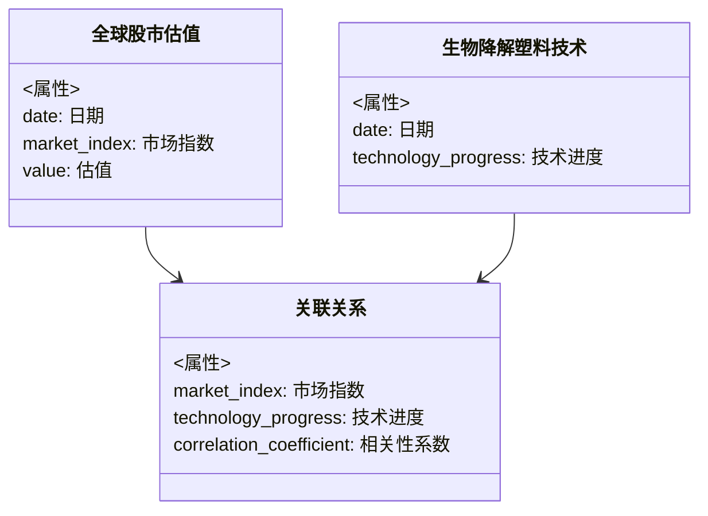
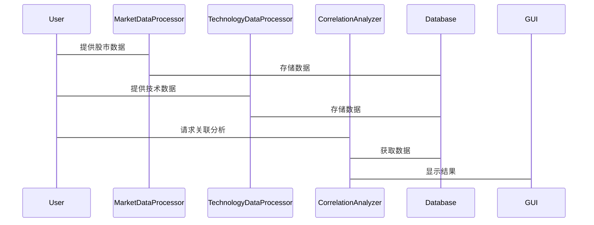

                 


# 第一部分: 全球股市估值与生物降解塑料技术进步的关联概述

# 第1章: 背景介绍

## 1.1 问题背景
### 1.1.1 全球股市估值的波动性
### 1.1.2 生物降解塑料技术的快速发展
### 1.1.3 两者关联的研究意义

## 1.2 问题描述
### 1.2.1 生物降解塑料技术对股市的影响
### 1.2.2 全球经济与环境政策的双重驱动
### 1.2.3 企业技术创新与市场估值的关系

## 1.3 问题解决
### 1.3.1 建立数学模型分析两者关联
### 1.3.2 通过数据挖掘验证假设
### 1.3.3 提出投资策略建议

## 1.4 边界与外延
### 1.4.1 研究范围的界定
### 1.4.2 相关概念的外延
### 1.4.3 可能的局限性与限制

## 1.5 核心要素组成
### 1.5.1 经济因素
### 1.5.2 技术因素
### 1.5.3 政策因素
### 1.5.4 市场因素

# 第2章: 核心概念与联系

## 2.1 核心概念原理
### 2.1.1 生物降解塑料的技术原理
### 2.1.2 全球股市估值的计算方法
### 2.1.3 两者关联的理论基础

## 2.2 核心概念属性对比
### 表2-1: 生物降解塑料与传统塑料属性对比

## 2.3 ER实体关系图
```mermaid
er
    entity(全球股市估值) {
        id: 市场指数
        name: 市场名称
        date: 日期
        value: 估值
    }
    entity(生物降解塑料技术) {
        id: 技术编号
        name: 技术名称
        date: 日期
        progress: 技术进度
    }
    relation(关联关系) {
        id: 关联编号
        market_index: 市场指数
        technology_progress: 技术进度
        correlation_coefficient: 相关性系数
    }
    global股市估值 --> 关联关系
    生物降解塑料技术 --> 关联关系
```

# 第3章: 数学模型与算法原理

## 3.1 数学模型建立
### 3.1.1 双变量线性回归模型
$$ y = \beta_0 + \beta_1x + \epsilon $$
其中，$y$为股市估值，$x$为生物降解塑料技术进步指数。

## 3.2 算法流程
```mermaid
graph TD
    A[数据预处理] --> B[特征提取]
    B --> C[模型训练]
    C --> D[结果分析]
    D -->

## 3.3 Python实现
```python
import pandas as pd
import numpy as np
from sklearn.linear_model import LinearRegression
from sklearn.metrics import r2_score

# 数据预处理
data = pd.read_csv('data.csv')
X = data[['生物降解塑料技术进步指数']]
y = data['股市估值']

# 模型训练
model = LinearRegression()
model.fit(X, y)

# 结果分析
predictions = model.predict(X)
r_squared = r2_score(y, predictions)
print(f'R平方值: {r_squared}')
print(f'回归系数: {model.coef_}')
print(f'截距: {model.intercept_}')
```

## 3.4 案例分析
### 3.4.1 数据来源与清洗
### 3.4.2 模型训练与验证
### 3.4.3 结果解读与可视化

# 第4章: 系统分析与架构设计

## 4.1 问题场景介绍
### 4.1.1 技术进步对股市的影响
### 4.1.2 全球经济与环境政策的双重驱动
### 4.1.3 企业技术创新与市场估值的关系

## 4.2 项目介绍
### 4.2.1 项目目标
### 4.2.2 项目范围
### 4.2.3 项目利益相关者

## 4.3 系统功能设计
### 4.3.1 领域模型


## 4.4 系统架构设计
### 4.4.1 架构图


## 4.5 系统接口设计
### 4.5.1 数据接口
### 4.5.2 分析接口
### 4.5.3 展示接口

## 4.6 系统交互


# 第5章: 项目实战

## 5.1 环境安装
### 5.1.1 安装Python
### 5.1.2 安装必要的库（pandas, numpy, scikit-learn）
### 5.1.3 数据源获取

## 5.2 核心代码实现
```python
import pandas as pd
import numpy as np
from sklearn.linear_model import LinearRegression
from sklearn.metrics import r2_score

# 数据加载
data = pd.read_csv('data.csv')

# 特征和目标变量分离
X = data[['生物降解塑料技术进步指数']]
y = data['股市估值']

# 模型训练
model = LinearRegression()
model.fit(X, y)

# 预测与评估
predictions = model.predict(X)
r_squared = r2_score(y, predictions)
print(f"模型的R平方值为: {r_squared}")
print(f"回归系数为: {model.coef_}")
print(f"截距为: {model.intercept_}")
```

## 5.3 案例分析
### 5.3.1 数据清洗
### 5.3.2 模型训练
### 5.3.3 结果可视化
```python
import matplotlib.pyplot as plt

plt.scatter(X, y, color='b')
plt.plot(X, model.predict(X), color='r', linewidth=2)
plt.title('股市估值与生物降解塑料技术进步的关系')
plt.xlabel('生物降解塑料技术进步指数')
plt.ylabel('股市估值')
plt.show()
```

## 5.4 项目小结
### 5.4.1 项目成果
### 5.4.2 经验总结
### 5.4.3 改进方向

# 第6章: 最佳实践

## 6.1 研究发现
### 6.1.1 生物降解塑料技术进步对股市的积极影响
### 6.1.2 经济与环境政策的双重驱动作用
### 6.1.3 投资策略建议

## 6.2 投资策略
### 6.2.1 关注技术创新型企业
### 6.2.2 分散投资降低风险
### 6.2.3 长期持有与短期交易结合

## 6.3 注意事项
### 6.3.1 数据的准确性和及时性
### 6.3.2 模型的局限性
### 6.3.3 市场波动的不可预测性

## 6.4 拓展阅读
### 6.4.1 相关文献推荐
### 6.4.2 进一步研究方向
### 6.4.3 现实应用中的挑战

# 附录

## 附录A: 数据来源与处理方法
## 附录B: 代码实现细节
## 附录C: 图表详细说明

# 参考文献

## [1] 《生物降解塑料技术发展现状与趋势》
## [2] 《全球股市估值分析方法》
## [3] 《经济与环境政策的交互作用》
## [4] 《Python数据处理与机器学习实战》
## [5] 《系统架构设计与实现》

