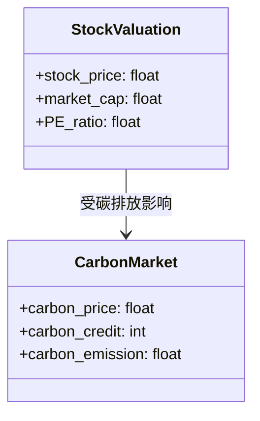
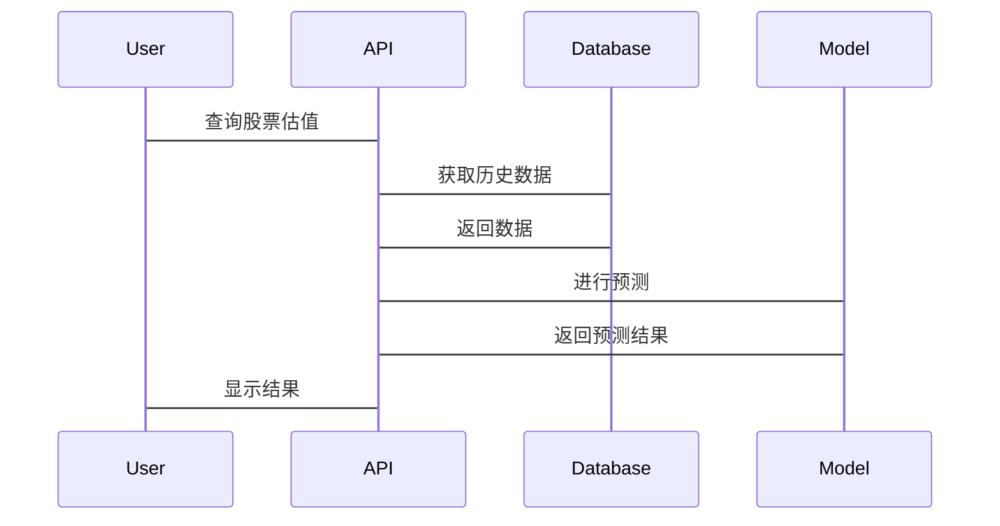

                 


# 全球股市估值与碳交易市场发展的关系

> 关键词：全球股市估值，碳交易市场，关系分析，数学模型，系统架构

> 摘要：本文探讨了全球股市估值与碳交易市场发展的关系，通过分析核心概念、构建数学模型、设计系统架构，并结合项目实战，揭示两者之间的内在联系。文章从背景介绍、核心概念对比、算法原理、数学模型、系统架构、项目实战等方面展开，结合mermaid图表和Python代码示例，全面分析了股市估值与碳交易市场的相互影响。

---

## 第1章: 全球股市估值与碳交易市场概述

### 1.1 股市估值的基本概念

#### 1.1.1 股市估值的定义与作用
股市估值是通过对企业财务数据和市场因素的分析，对股票的内在价值进行评估的过程。其作用在于帮助投资者做出理性的投资决策，同时也反映了市场的整体健康状况。

#### 1.1.2 股市估值的主要指标
- 市盈率（P/E Ratio）
- 市净率（P/B Ratio）
- 股息率（Dividend Yield）
- 每股收益（EPS）

#### 1.1.3 股市估值与经济发展的关系
股市估值是经济的晴雨表，反映了整体经济的健康状况。当经济繁荣时，股市估值通常上升；反之，经济衰退时，股市估值下降。

### 1.2 碳交易市场的基本概念

#### 1.2.1 碳交易市场的定义与机制
碳交易市场是通过买卖碳配额或碳信用来实现碳排放权交易的市场。其机制基于政府分配的碳配额，企业可以在市场上交易剩余或不足的配额。

#### 1.2.2 碳配额与碳信用的运作模式
- 碳配额：政府分配给企业的碳排放额度。
- 碳信用：企业通过减少碳排放获得的可交易凭证。

#### 1.2.3 碳交易市场的全球发展趋势
随着全球气候变化问题的加剧，碳交易市场正成为各国实现减排目标的重要工具，市场规模持续扩大。

### 1.3 本章小结
本章介绍了股市估值和碳交易市场的基本概念，为后续分析奠定了基础。

---

## 第2章: 全球股市估值与碳交易市场的核心概念

### 2.1 股市估值与碳交易市场的核心要素

#### 2.1.1 股市估值的核心要素
- 公司财务数据
- 市场供需关系
- 宏观经济环境

#### 2.1.2 碳交易市场的核心要素
- 碳配额分配
- 碳信用交易
- 市场监管机制

#### 2.1.3 两者的关联性分析
股市估值受碳交易市场的影响，特别是碳相关政策对企业盈利能力的影响。

### 2.2 股市估值与碳交易市场的属性对比

#### 2.2.1 股市估值的属性特征
- 波动性高
- 受宏观经济影响
- 反映市场信心

#### 2.2.2 碳交易市场的属性特征
- 受政策驱动
- 价格波动性较大
- 市场流动性较低

#### 2.2.3 属性对比分析
通过对比分析，发现两者在波动性、驱动因素和市场参与主体上有显著差异。

### 2.3 股市估值与碳交易市场的ER实体关系图

```mermaid
er
actor Investor {
  id: int
  name: string
}
actor Carbon Trader {
  id: int
  name: string
}
actor Regulator {
  id: int
  name: string
}
company Stock {
  id: int
  name: string
}
company Carbon {
  id: int
  name: string
}
```

---

## 第3章: 股市估值与碳交易市场关系的算法原理

### 3.1 股市估值与碳交易市场关系的量化模型

#### 3.1.1 模型的构建思路
通过统计分析和机器学习方法，建立股市估值与碳排放量之间的关系模型。

#### 3.1.2 模型的输入变量与输出变量
- 输入变量：碳排放量、相关政策、市场情绪
- 输出变量：股市估值

#### 3.1.3 模型的算法选择
使用线性回归和随机森林算法进行建模。

### 3.2 碳排放对股市估值的影响分析

#### 3.2.1 碳排放对股市估值的影响路径
- 企业碳排放成本上升，影响盈利能力
- 碳政策收紧，影响市场预期

#### 3.2.2 碳排放对股市估值的影响程度
通过回归分析，量化碳排放对股市估值的具体影响。

### 3.3 碳交易定价模型

#### 3.3.1 碳交易定价模型的构建
基于供给需求模型，建立碳配额价格预测模型。

#### 3.3.2 碳交易定价模型的参数设定
- 需求弹性系数
- 供给弹性系数
- 市场调节因子

#### 3.3.3 模型的验证与优化
通过历史数据验证模型，并进行参数调优。

---

## 第4章: 股市估值与碳交易市场关系的数学模型

### 4.1 股市估值与碳排放量的回归模型

#### 4.1.1 线性回归模型
$$ y = \beta_0 + \beta_1 x + \epsilon $$
其中，$y$为股市估值，$x$为碳排放量。

#### 4.1.2 逐步推导与解释
通过最小二乘法估计回归系数，分析碳排放量对股市估值的影响程度。

### 4.2 碳交易定价模型的构建

#### 4.2.1 碳配额价格预测模型
$$ P = a \times Q_d - b \times Q_s $$
其中，$P$为碳配额价格，$Q_d$为需求量，$Q_s$为供给量。

#### 4.2.2 模型的数学推导
通过供需均衡点，推导碳配额价格的预测公式。

### 4.3 模型的验证与应用

#### 4.3.1 数据来源与处理
使用全球碳市场交易数据和股市估值数据，进行清洗和特征提取。

#### 4.3.2 模型的验证
通过交叉验证评估模型的准确性和稳定性。

---

## 第5章: 股市估值与碳交易市场关系的系统架构设计

### 5.1 问题场景介绍

#### 5.1.1 问题背景
分析股市估值与碳交易市场的动态关系，为投资者和政策制定者提供决策支持。

#### 5.1.2 项目目标
构建量化模型，预测股市估值受碳交易市场的影响。

### 5.2 系统功能设计

#### 5.2.1 领域模型


#### 5.2.2 系统架构设计
```mermaid
client
    server
        database
        service
            carbon_market
            stock_market
```

#### 5.2.3 系统接口设计
- 接口名称：`get_stock_valuation`
- 输入参数：`symbol`（股票代码）
- 输出参数：`valuation`（估值）

#### 5.2.4 系统交互设计


---

## 第6章: 股市估值与碳交易市场关系的项目实战

### 6.1 项目环境安装

#### 6.1.1 环境配置
- Python 3.8+
- Pandas、NumPy、Scikit-learn、Plotly

### 6.2 核心代码实现

#### 6.2.1 数据获取与处理
```python
import pandas as pd
import numpy as np

# 获取股票数据
stock_data = pd.read_csv('stock.csv')
carbon_data = pd.read_csv('carbon.csv')

# 数据预处理
stock_data['date'] = pd.to_datetime(stock_data['date'])
carbon_data['date'] = pd.to_datetime(carbon_data['date'])
merged_data = pd.merge(stock_data, carbon_data, on='date')
```

#### 6.2.2 模型训练与预测
```python
from sklearn.linear_model import LinearRegression
from sklearn.ensemble import RandomForestRegressor

# 构建特征矩阵和目标变量
X = merged_data[['carbon_emission', 'policy_indicators']]
y = merged_data['stock_valuation']

# 训练模型
model = RandomForestRegressor()
model.fit(X, y)

# 预测
new_data = pd.DataFrame({
    'carbon_emission': [100],
    'policy_indicators': [0.8]
})
prediction = model.predict(new_data)
print(prediction)
```

### 6.3 项目实战分析

#### 6.3.1 数据分析与可视化
使用Plotly绘制碳排放与股市估值的关系图。

#### 6.3.2 模型验证与优化
通过交叉验证评估模型性能，并进行超参数调优。

---

## 第7章: 总结与展望

### 7.1 本章总结
本文通过理论分析、模型构建和项目实战，揭示了全球股市估值与碳交易市场之间的复杂关系。

### 7.2 研究局限性
- 数据获取的局限性
- 模型的简化假设

### 7.3 未来研究方向
- 更精确的模型构建
- 更多市场数据的引入
- 碳交易市场对股市长期影响的研究

### 7.4 最佳实践 tips
- 定期更新模型
- 结合实时数据进行预测
- 注意政策变化对市场的影响

### 7.5 小结
理解和把握股市估值与碳交易市场的关系，对投资者和政策制定者具有重要的现实意义。

### 7.6 注意事项
- 数据清洗的重要性
- 模型验证的必要性
- 政策风险的防范

### 7.7 拓展阅读
- 《气候变化经济学》
- 《金融市场分析》

---

通过以上分析，我们不仅理解了股市估值与碳交易市场的关系，还掌握了如何利用技术手段进行深入分析和预测。希望本文能为相关领域的研究和实践提供有价值的参考。

