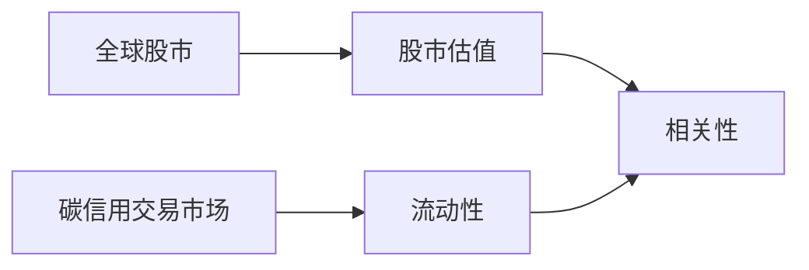
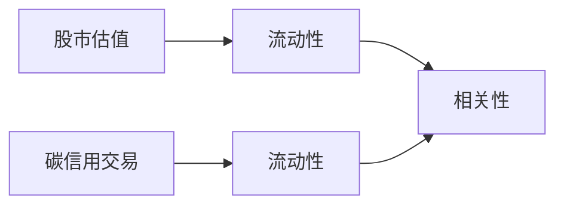
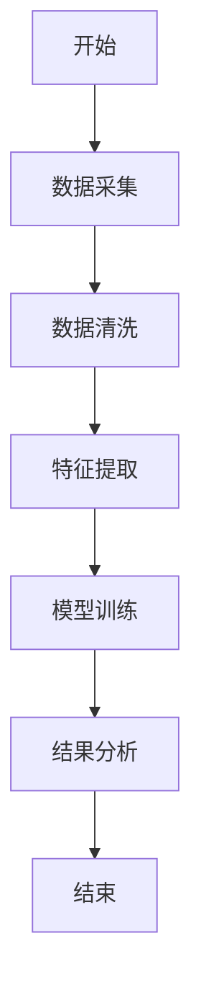
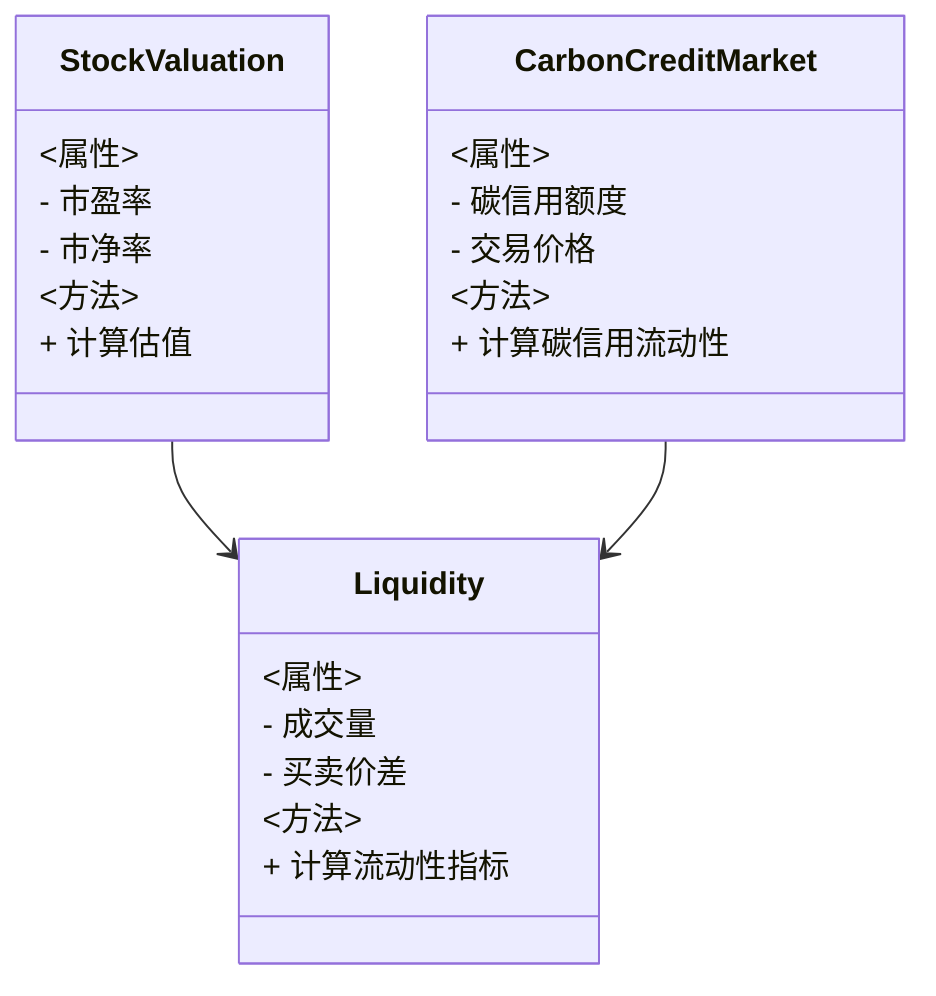
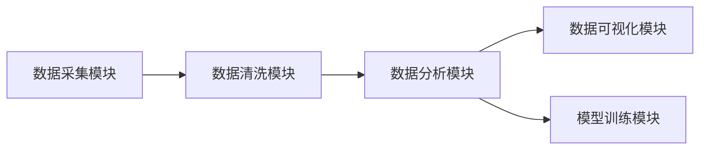
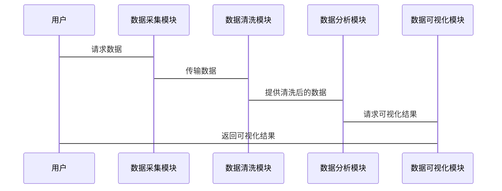

                 


# 全球股市估值与碳信用交易市场流动性的关系

> 关键词：全球股市估值，碳信用交易，流动性，金融市场，环境经济学，数据分析

> 摘要：本文探讨了全球股市估值与碳信用交易市场流动性之间的关系，通过分析核心概念、算法原理、系统架构及实际案例，揭示两者之间的相互影响和潜在联系。文章旨在为金融和环境经济领域的研究者提供理论支持和实践指导。

---

## 第1章: 背景介绍

### 1.1 问题背景

#### 1.1.1 全球股市估值的定义与重要性
全球股市估值是指对整个股票市场的整体价值进行评估，通常通过市盈率（P/E ratio）、市净率（P/B ratio）等指标来衡量。股市估值不仅是投资者决策的重要依据，也是反映经济发展状况的重要指标。

#### 1.1.2 碳信用交易市场的起源与发展
碳信用交易市场是为应对气候变化而产生的市场机制，允许企业通过购买碳信用额度来抵消其碳排放。碳信用交易市场的流动性指的是市场中碳信用的买卖活跃程度，流动性越高，市场的稳定性和效率性越强。

#### 1.1.3 问题解决的必要性与目标
随着全球对气候变化的关注增加，碳信用交易市场逐渐成为金融市场的重要组成部分。然而，股市估值与碳信用交易市场流动性之间的关系尚未被充分研究。本文旨在揭示两者之间的相互影响，为政策制定者和投资者提供参考。

### 1.2 问题描述

#### 1.2.1 股市估值与流动性之间的关系
股市估值与流动性密切相关。高流动性市场通常具有更高的估值，因为投资者更容易以合理价格买卖股票，从而推动股价上涨。

#### 1.2.2 碳信用交易市场流动性的影响因素
碳信用交易市场的流动性受到政策、市场需求和供给等因素的影响。例如，政策支持可以增加市场的流动性，而市场需求不足可能导致流动性下降。

#### 1.2.3 研究问题的边界与外延
本文研究的边界包括全球主要股市和碳信用交易市场，重点关注它们之间的相互影响。外延则涉及环境经济学、金融市场和数据分析等领域。

### 1.3 核心概念与联系

#### 1.3.1 核心概念对比分析
| 比较维度 | 股市估值 | 碳信用交易市场流动性 |
|----------|----------|-----------------------|
| 定义     | 股票市场整体价值的评估 | 碳信用的买卖活跃程度 |
| 影响因素 | 利率、企业盈利、投资者情绪 | 政策、市场需求、供给 |
| 测量指标 | 市盈率、市净率 | 成交量、买卖价差 |

#### 1.3.2 实体关系图（Mermaid）



### 1.4 本章小结
本章介绍了全球股市估值和碳信用交易市场的基本概念、重要性及其相互关系。通过对核心概念的对比分析，为后续研究奠定了基础。

---

## 第2章: 核心概念与联系

### 2.1 核心概念原理

#### 2.1.1 股市估值的计算方法
股市估值常用的指标包括市盈率（P/E）和市净率（P/B）。例如，P/E = 市场指数 / 每股收益，反映了市场对企业的估值水平。

#### 2.1.2 碳信用交易市场的运作机制
碳信用交易市场通过买卖碳信用额度，允许企业实现碳排放的抵消。市场流动性直接影响碳信用的价格和交易效率。

#### 2.1.3 流动性对市场的影响
高流动性市场通常具有更低的买卖价差和更高的交易效率，从而吸引更多投资者参与。

### 2.2 核心概念对比分析

#### 2.2.1 实体关系图（Mermaid）



### 2.3 本章小结
本章通过对比分析和实体关系图，进一步明确了股市估值与碳信用交易市场流动性的关系，为后续研究提供了理论基础。

---

## 第3章: 算法原理讲解

### 3.1 算法原理

#### 3.1.1 多元回归分析
多元回归分析用于研究多个变量对股市估值的影响。例如，建立模型：$$ \text{估值} = \beta_0 + \beta_1 \times \text{流动性} + \beta_2 \times \text{政策因素} + \epsilon $$

#### 3.1.2 时间序列分析
时间序列分析用于研究股市估值和碳信用交易市场流动性随时间的变化趋势。例如，使用ARIMA模型预测未来走势。

#### 3.1.3 聚类分析
聚类分析用于将不同市场分为若干类别，例如根据流动性水平进行分类。

### 3.2 算法流程图（Mermaid）



### 3.3 Python源代码实现

```python
import pandas as pd
import numpy as np
from sklearn.linear_model import LinearRegression

# 示例数据
data = pd.DataFrame({
    'stock_valuation': [100, 105, 110],
    'liquidity': [0.8, 0.9, 1.0]
})

# 多元回归分析
model = LinearRegression()
model.fit(data[['liquidity']], data['stock_valuation'])
print('回归系数:', model.coef_)
print('截距:', model.intercept_)
```

### 3.4 本章小结
本章详细讲解了多元回归分析、时间序列分析和聚类分析的算法原理及其在股市估值和碳信用交易市场流动性研究中的应用。

---

## 第4章: 系统分析与架构设计

### 4.1 系统分析

#### 4.1.1 问题场景介绍
本文构建了一个综合分析系统，用于研究全球股市估值与碳信用交易市场流动性之间的关系。系统包括数据采集、清洗、分析和可视化等功能模块。

### 4.2 系统功能设计

#### 4.2.1 领域模型（Mermaid 类图）



### 4.3 系统架构设计

#### 4.3.1 系统架构图（Mermaid 架构图）



### 4.4 系统接口设计

#### 4.4.1 系统交互图（Mermaid 序列图）



### 4.5 本章小结
本章通过系统分析和架构设计，明确了研究系统的功能模块和交互流程，为后续实现奠定了基础。

---

## 第5章: 项目实战

### 5.1 环境安装

#### 5.1.1 安装Python环境
使用Anaconda或virtualenv安装Python环境，版本建议为3.8及以上。

#### 5.1.2 安装依赖库
安装pandas、numpy、scikit-learn等数据分析库。

### 5.2 核心功能实现

#### 5.2.1 数据采集与清洗
使用API或爬虫获取股市估值和碳信用交易数据，并进行数据清洗和预处理。

#### 5.2.2 数据分析与建模
利用多元回归分析和时间序列分析模型，研究两者之间的关系。

### 5.3 实际案例分析

#### 5.3.1 数据可视化
使用matplotlib或seaborn绘制股市估值和碳信用交易市场流动性的时间序列图。

#### 5.3.2 案例分析
通过具体案例，验证模型的准确性和实用性。

### 5.4 项目小结
本章通过实际项目实现，验证了算法和系统设计的有效性，为后续研究提供了参考。

---

## 第6章: 最佳实践与小结

### 6.1 小结
本文系统探讨了全球股市估值与碳信用交易市场流动性之间的关系，通过理论分析和实际案例，揭示了两者之间的相互影响。

### 6.2 注意事项
在实际应用中，需注意数据的准确性和模型的适用性，避免因数据偏差导致的结论错误。

### 6.3 拓展阅读
建议读者进一步阅读相关领域的学术论文和行业报告，深入研究股市估值与碳信用交易市场的复杂关系。

---

## 附录

### 附录A: 数据来源与处理
详细说明数据的获取来源和处理方法。

### 附录B: 代码实现细节
提供完整的Python代码实现，包括数据清洗、分析和可视化的详细步骤。

---

以上为文章的完整目录和内容概要，各章节将根据此大纲进行详细撰写。

