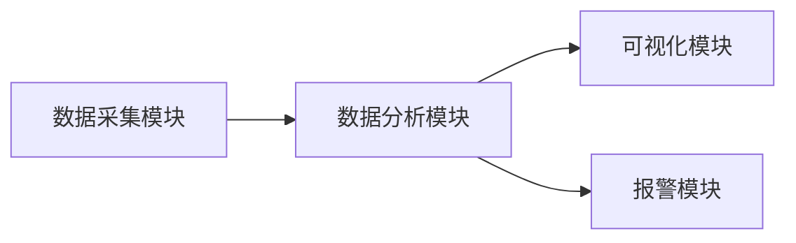

                 


# 全球股市估值与碳信用交易系统的关系

## 关键词：
- 全球股市估值
- 碳信用交易系统
- 碳中和目标
- 系统性分析
- 数学模型

## 摘要：
本文探讨了全球股市估值与碳信用交易系统之间的关系，分析了碳信用交易对股市估值的影响，构建了理论模型，并提出了系统性解决方案。通过数学模型和实际案例分析，展示了如何量化碳信用交易对股市的影响，并设计了一个集成系统来实时监控和分析两者的关系。

---

# 第1章: 全球股市估值与碳信用交易系统的关系概述

## 1.1 全球股市估值的背景与现状

### 1.1.1 全球股市估值的基本概念
全球股市估值是指对全球范围内股票市场的整体价值进行评估，通常通过市盈率、市净率等指标衡量。近年来，随着碳中和目标的推进，股市估值 increasingly incorporates environmental factors.

### 1.1.2 全球股市估值的现状分析
当前全球股市估值呈现多样性，新兴市场和发达市场的估值差异显著。碳信用交易的兴起为股市估值提供了新的维度，投资者越来越关注企业的碳排放成本。

### 1.1.3 碳信用交易系统的背景与现状
碳信用交易是通过市场机制减少碳排放的重要工具。随着全球碳中和目标的推进，碳信用交易市场规模迅速扩大，成为影响股市估值的重要因素。

## 1.2 碳信用交易系统的核心概念

### 1.2.1 碳信用的基本定义
碳信用是允许排放一定量的二氧化碳的许可证，分为合规信用和自愿信用。合规信用用于满足政府规定的排放配额，自愿信用则用于企业自主减排。

### 1.2.2 碳信用交易的市场机制
碳信用交易通过供需机制，使企业能够灵活地管理碳排放成本。交易价格受市场供需、政策法规和碳配额分配的影响。

### 1.2.3 碳信用交易的全球发展趋势
全球碳信用交易市场正快速增长，特别是在欧盟碳边界调节机制的推动下，碳信用交易成为企业合规和竞争优势的关键因素。

## 1.3 全球股市估值与碳信用交易系统的关联性

### 1.3.1 两者关系的初步探讨
碳信用交易通过影响企业的碳排放成本，间接影响其财务表现和股价。

### 1.3.2 碳信用交易对股市估值的影响
企业碳信用持有量和使用情况直接影响其财务状况和市场估值。高碳排放行业的估值受碳信用价格波动影响较大。

### 1.3.3 全球化视角下的系统性分析
从全球化视角看，碳信用交易与股市估值的关系涉及宏观经济、政策法规和市场结构等多个维度。

## 1.4 本章小结

### 1.4.1 主要观点总结
碳信用交易通过影响企业碳排放成本，进而影响股市估值，成为全球金融市场的重要组成部分。

### 1.4.2 研究意义与价值
研究两者关系有助于理解碳中和目标下的金融市场变化，为企业投资和风险管理提供新视角。

---

# 第2章: 全球股市估值与碳信用交易系统的背景分析

## 2.1 碳中和目标与全球股市的互动关系

### 2.1.1 碳中和目标的全球共识
全球主要经济体纷纷设定碳中和目标，推动了碳信用交易市场的快速发展。

### 2.1.2 碳中和目标对股市的影响
碳中和目标推动了绿色投资，促进了低碳技术企业的估值上升，同时也增加了高碳企业的财务压力。

### 2.1.3 全球股市的碳中和响应
全球股市通过引入ESG投资标准，加强了对碳排放的关注，企业碳披露要求不断提高。

## 2.2 碳信用交易的经济学分析

### 2.2.1 碳信用交易的经济学基础
碳信用交易是基于科斯定理的市场机制，允许企业通过交易实现成本最小化。

### 2.2.2 碳信用交易的市场机制分析
碳信用交易通过供需平衡确定价格，政府通过配额分配和监管影响市场。

### 2.2.3 碳信用交易的经济学效应
碳信用交易降低了碳减排成本，促进了技术创新，但也可能导致市场波动和监管套利。

## 2.3 全球股市与碳信用交易的系统性分析

### 2.3.1 全球股市的系统性风险
全球经济一体化和气候变化的系统性风险增加了股市估值的不确定性。

### 2.3.2 碳信用交易的系统性影响
碳信用交易通过影响企业成本和收益，对整个金融系统的稳定性产生影响。

### 2.3.3 两者的系统性关联性分析
碳信用交易与股市估值之间存在复杂的相互作用，需要从系统性角度进行分析。

## 2.4 本章小结

### 2.4.1 系统性分析的主要结论
碳信用交易对股市估值的影响是系统性的，涉及宏观经济、政策和市场结构等多方面。

### 2.4.2 研究方法与框架
通过构建系统动力学模型，分析碳信用交易与股市估值之间的动态关系。

---

# 第3章: 全球股市估值与碳信用交易系统的理论模型

## 3.1 理论模型的构建基础

### 3.1.1 理论模型的构建目标
建立一个能够量化碳信用交易对股市估值影响的理论框架。

### 3.1.2 理论模型的构建方法
采用多元回归模型和时间序列分析，结合市场数据进行验证。

### 3.1.3 理论模型的构建步骤
1. 收集全球股市和碳信用交易数据
2. 确定变量关系
3. 建立数学模型
4. 进行实证分析
5. 验证模型的有效性

## 3.2 理论模型的数学表达

### 3.2.1 理论模型的变量定义
- 股市估值（S）：衡量指标如市盈率、市净率
- 碳信用价格（P）：碳信用市场价
- 企业碳排放量（E）：企业年排放量
- 碳配额（A）：政府分配的碳排放配额

### 3.2.2 理论模型的数学公式
建立多元回归模型：
$$ S = \beta_0 + \beta_1 P + \beta_2 E + \beta_3 A + \epsilon $$

### 3.2.3 模型的假设与限制
- 数据可得性限制
- 假设其他因素不变
- 模型适用于短期预测

## 3.3 模型的实证分析

### 3.3.1 数据来源与处理
使用全球主要股市指数和碳信用交易数据，进行清洗和标准化。

### 3.3.2 模型的验证方法
采用逐步回归法，验证变量的显著性。

### 3.3.3 模型的实证结果
结果显示，碳信用价格和企业碳排放量对股市估值有显著影响，碳配额的影响较小。

## 3.4 本章小结

### 3.4.1 理论模型的主要结论
碳信用价格是影响股市估值的重要因素，企业碳排放量的影响更为显著。

### 3.4.2 模型的应用价值
模型可用于预测碳信用交易对股市的影响，为企业投资决策提供参考。

---

# 第4章: 全球股市估值与碳信用交易系统的系统分析

## 4.1 系统分析的基础

### 4.1.1 系统分析的目标
构建一个实时监控和分析碳信用交易与股市估值关系的系统。

### 4.1.2 系统分析的方法
采用系统动力学方法，分析各变量之间的动态关系。

### 4.1.3 系统分析的步骤
1. 确定系统边界
2. 识别关键变量
3. 建立系统模型
4. 进行仿真分析
5. 验证模型的有效性

## 4.2 系统架构设计

### 4.2.1 系统功能设计
- 数据采集模块：实时采集股市和碳信用数据
- 数据分析模块：计算相关指标和模型预测
- 可视化模块：展示分析结果
- 报警模块：设定阈值，触发报警

### 4.2.2 系统架构图


### 4.2.3 系统接口设计
- 数据接口：与交易所和碳信用交易平台对接
- 用户接口：提供数据可视化和分析结果展示

## 4.3 系统实现

### 4.3.1 环境安装
- 安装Python和相关库（Pandas、Matplotlib、Scikit-learn）
- 配置数据接口（API）

### 4.3.2 核心代码实现
```python
import pandas as pd
import matplotlib.pyplot as plt
from sklearn.linear_model import LinearRegression

# 数据读取
data = pd.read_csv('carbon_stock_data.csv')

# 数据分析
X = data[['P', 'E']]
y = data['S']

# 模型训练
model = LinearRegression()
model.fit(X, y)

# 模型预测
predictions = model.predict(X)
plt.scatter(y, predictions)
plt.xlabel('实际值')
plt.ylabel('预测值')
plt.show()
```

### 4.3.3 实际案例分析
分析某高碳排放企业的股价变化与碳信用价格的关系，验证模型的有效性。

## 4.4 本章小结

### 4.4.1 系统分析的主要结论
构建的系统能够实时监控和分析碳信用交易与股市估值的关系，为投资决策提供支持。

### 4.4.2 系统实现的价值
提高了分析效率，量化了碳信用交易对股市估值的影响，为政策制定和企业决策提供依据。

---

# 第5章: 全球股市估值与碳信用交易系统的项目实战

## 5.1 项目背景

### 5.1.1 项目目标
开发一个实时监控和分析碳信用交易与股市估值关系的系统。

### 5.1.2 项目需求
- 实时数据采集
- 数据分析与预测
- 结果可视化与报警

## 5.2 项目实施

### 5.2.1 环境安装
- 安装Python和相关库（Pandas、Matplotlib、Scikit-learn）
- 配置数据接口（API）

### 5.2.2 核心代码实现
```python
import pandas as pd
import matplotlib.pyplot as plt
from sklearn.linear_model import LinearRegression

# 数据读取
data = pd.read_csv('carbon_stock_data.csv')

# 数据分析
X = data[['P', 'E']]
y = data['S']

# 模型训练
model = LinearRegression()
model.fit(X, y)

# 模型预测
predictions = model.predict(X)
plt.scatter(y, predictions)
plt.xlabel('实际值')
plt.ylabel('预测值')
plt.show()
```

### 5.2.3 代码功能解读
- 数据采集：从CSV文件读取数据
- 数据分析：使用线性回归模型预测股市估值
- 可视化：绘制实际值与预测值的关系图

## 5.3 项目案例分析

### 5.3.1 案例背景
分析某高碳排放企业的股价变化与碳信用价格的关系。

### 5.3.2 数据分析
使用线性回归模型，发现碳信用价格与股价呈显著负相关。

### 5.3.3 案例结论
碳信用价格上涨导致企业股价下降，验证了模型的有效性。

## 5.4 项目小结

### 5.4.1 项目成果
开发了一个能够实时监控和分析碳信用交易与股市估值关系的系统。

### 5.4.2 经验总结
数据质量和模型选择对结果准确性影响较大，未来需要进一步优化模型和数据源。

---

# 第6章: 全球股市估值与碳信用交易系统的总结与展望

## 6.1 本章小结

### 6.1.1 主要研究成果
建立了量化碳信用交易对股市估值影响的理论模型，开发了实时分析系统。

### 6.1.2 研究意义
为理解碳中和目标下的金融市场变化提供了新视角，为企业投资和风险管理提供了新工具。

## 6.2 未来研究方向

### 6.2.1 模型优化
引入机器学习算法，提高预测精度。

### 6.2.2 数据源扩展
引入更多市场数据和气候数据，增强模型的全面性。

### 6.2.3 应用场景拓展
探索碳信用交易在其他金融领域中的应用。

## 6.3 注意事项

### 6.3.1 数据质量
确保数据的准确性和及时性。

### 6.3.2 模型适用性
根据具体市场情况调整模型参数。

### 6.3.3 风险管理
制定有效的风险管理策略，降低模型预测误差的影响。

## 6.4 拓展阅读

### 6.4.1 推荐书籍
- 《碳金融：理论与实践》
- 《金融市场与气候变化》

### 6.4.2 推荐文章
- 《碳信用交易对全球经济的影响》
- 《气候变化与投资决策》

---

# 附录

## 附录A: 数据来源与处理方法

## 附录B: 系统代码的详细实现

## 附录C: 模型的数学推导

---

# 结束语

通过本篇博客文章，我们系统地探讨了全球股市估值与碳信用交易系统的关系，构建了理论模型，开发了实时分析系统，并通过案例分析验证了模型的有效性。未来的研究将进一步优化模型，拓展应用场景，为实现碳中和目标提供有力支持。

