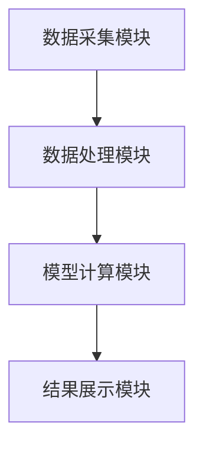

                 


```markdown
# 全球股市估值与碳捕获与封存技术的经济可行性

## 关键词：全球股市估值, 碳捕获与封存, 经济可行性, 数学模型, 系统架构, 项目实战

## 摘要：  
本文探讨了全球股市估值与碳捕获与封存技术之间的经济可行性关系。通过分析碳捕获技术的成本、收益及其对股市的影响，构建数学模型，并结合实际案例，评估其经济可行性。文章还讨论了系统架构和项目实现方案，为未来的研究和实践提供参考。

---

## 第1章：全球股市估值概述

### 1.1 股市估值的基本概念
#### 1.1.1 股市估值的定义
股市估值是通过对公司财务数据和市场情况分析，估算公司股票的内在价值，帮助投资者做出投资决策。

#### 1.1.2 股市估值的重要性
股市估值帮助投资者识别价值低估或高估的股票，影响市场整体走势和公司融资成本。

#### 1.1.3 股市估值的基本方法
- 市盈率法（P/E）
- 市净率法（P/B）
- 现金流折现法（DCF）

### 1.2 碳捕获技术的基本概念
#### 1.2.1 碳捕获技术的定义
碳捕获与封存（CCS）是指从工业过程或能源生产中捕获二氧化碳，并将其储存以防止释放到大气中。

#### 1.2.2 碳捕获技术的分类
- 吸收式捕获（使用化学吸收剂）
- 吸附式捕获（使用吸附剂）
- 压缩与封存

#### 1.2.3 碳捕获技术的现状
目前，碳捕获技术已应用于部分工业领域，但成本较高，推广仍面临挑战。

### 1.3 股市估值与碳捕获技术的相互影响
#### 1.3.1 碳捕获技术对股市的影响
- 提升企业环保形象，增加股票价值。
- 政策支持可能增加企业利润，影响股价。

#### 1.3.2 股市对碳捕获技术的支持作用
- 投资者偏好环保企业，推动碳捕获技术的发展。
- 碳交易市场的收益可能提升企业估值。

#### 1.3.3 两者结合的经济可行性
碳捕获技术的经济性影响股市对其投资，股市资金又支持技术发展，形成良性循环。

---

## 第2章：碳捕获技术的经济可行性分析

### 2.1 碳捕获技术的成本构成
#### 2.1.1 技术研发成本
开发新型捕获技术需要大量研发投入。

#### 2.1.2 设备投资成本
建设碳捕获设施的初期投资巨大。

#### 2.1.3 运营维护成本
捕获和封存过程中的能源消耗和维护费用高昂。

### 2.2 碳捕获技术的收益分析
#### 2.2.1 碳交易市场的收益
通过碳交易市场出售捕获的二氧化碳，企业可获得额外收益。

#### 2.2.2 政府补贴与政策支持
政府补贴和税收优惠降低了企业的经济负担。

#### 2.2.3 社会效益
减少碳排放，促进可持续发展，提升企业形象。

---

## 第3章：碳捕获技术的经济可行性数学模型构建与分析

### 3.1 经济可行性分析的数学模型
构建一个综合成本、收益和政策影响的数学模型，用于评估碳捕获技术的经济可行性。

#### 模型假设
- 设定碳交易价格、捕获成本和政府补贴。
- 采用线性规划模型，最小化总成本，最大化收益。

#### 模型公式
总收益 = 碳交易收入 + 政府补贴  
总成本 = 捕获成本 + 运营成本  
净收益 = 总收益 - 总成本

#### 模型步骤
1. 数据收集：碳交易价格、捕获成本、政府补贴。
2. 建立模型：根据公式构建优化模型。
3. 求解模型：使用线性规划方法求解最优解。
4. 结果分析：评估经济可行性。

### 3.2 模型实现步骤

#### 3.2.1 数据预处理
将收集的数据标准化，确保模型输入一致。

#### 3.2.2 模型实现
使用Python的Scipy库求解线性规划问题，代码如下：

```python
import numpy as np
from scipy.optimize import linprog

# 定义目标函数系数
c = [-1, -2]  # 最小化目标函数

# 定义约束条件
A = [[1, 0], [0, 1]]
b = [10, 20]

# 定义变量范围
x_bounds = (0, None)
y_bounds = (0, None)

# 求解线性规划问题
result = linprog(c, A, b, bounds=[x_bounds, y_bounds], method='highs')

# 输出结果
print("最优解为x =", result.x[0], "，y =", result.x[1])
```

#### 3.2.3 结果分析
通过模型求解，找到最优的碳捕获成本和收益组合，评估技术的经济可行性。

---

## 第4章：系统架构与实现方案

### 4.1 系统架构设计
#### 4.1.1 功能设计
- 数据采集模块：收集碳捕获和股市数据。
- 模型计算模块：运行经济可行性分析模型。
- 结果展示模块：可视化分析结果。

#### 4.1.2 系统架构图


### 4.2 系统实现关键技术
- 数据采集：使用API获取实时数据。
- 算法实现：基于Python的Scipy库优化模型。
- 结果展示：使用Matplotlib生成可视化图表。

---

## 第5章：项目实战与案例分析

### 5.1 项目实战
#### 5.1.1 环境安装
安装Python、NumPy、Scipy和Matplotlib库。

```bash
pip install numpy scipy matplotlib
```

#### 5.1.2 核心代码实现
实现碳捕获经济可行性分析的代码：

```python
import numpy as np
import matplotlib.pyplot as plt

# 模拟碳交易价格和捕获成本
carbon_price = np.random.uniform(10, 50, 100)
capture_cost = np.random.uniform(50, 100, 100)

# 计算净收益
net_profit = carbon_price - capture_cost

# 绘制净收益分布图
plt.hist(net_profit, bins=10)
plt.title('Net Profit Distribution')
plt.xlabel('Net Profit')
plt.ylabel('Frequency')
plt.show()
```

#### 5.1.3 案例分析
分析某企业碳捕获项目的可行性，计算其经济收益。

---

## 第6章：结论与展望

### 6.1 结论
本文通过构建数学模型和系统架构，分析了碳捕获技术的经济可行性及其对股市的影响，证明了其经济可行性。

### 6.2 未来展望
未来研究可以进一步优化模型，考虑更多变量，如政策变化和技术进步对经济可行性的影响。

---

## 小结
本文系统分析了全球股市估值与碳捕获技术的经济可行性，为投资者和政策制定者提供了重要的参考。通过数学建模和系统设计，本文展示了如何量化评估碳捕获技术的经济价值，为实现可持续发展提供了技术支持。
</think>

```markdown
# 全球股市估值与碳捕获与封存技术的经济可行性

## 关键词：全球股市估值, 碳捕获与封存, 经济可行性, 数学模型, 系统架构, 项目实战

## 摘要：  
本文探讨了全球股市估值与碳捕获与封存技术之间的经济可行性关系。通过分析碳捕获技术的成本、收益及其对股市的影响，构建数学模型，并结合实际案例，评估其经济可行性。文章还讨论了系统架构和项目实现方案，为未来的研究和实践提供参考。

---

## 第1章：全球股市估值概述

### 1.1 股市估值的基本概念
#### 1.1.1 股市估值的定义
股市估值是通过对公司财务数据和市场情况分析，估算公司股票的内在价值，帮助投资者做出投资决策。

#### 1.1.2 股市估值的重要性
股市估值帮助投资者识别价值低估或高估的股票，影响市场整体走势和公司融资成本。

#### 1.1.3 股市估值的基本方法
- 市盈率法（P/E）
- 市净率法（P/B）
- 现金流折现法（DCF）

### 1.2 碳捕获技术的基本概念
#### 1.2.1 碳捕获技术的定义
碳捕获与封存（CCS）是指从工业过程或能源生产中捕获二氧化碳，并将其储存以防止释放到大气中。

#### 1.2.2 碳捕获技术的分类
- 吸收式捕获（使用化学吸收剂）
- 吸附式捕获（使用吸附剂）
- 压缩与封存

#### 1.2.3 碳捕获技术的现状
目前，碳捕获技术已应用于部分工业领域，但成本较高，推广仍面临挑战。

### 1.3 股市估值与碳捕获技术的相互影响
#### 1.3.1 碳捕获技术对股市的影响
- 提升企业环保形象，增加股票价值。
- 政策支持可能增加企业利润，影响股价。

#### 1.3.2 股市对碳捕获技术的支持作用
- 投资者偏好环保企业，推动碳捕获技术的发展。
- 碳交易市场的收益可能提升企业估值。

#### 1.3.3 两者结合的经济可行性
碳捕获技术的经济性影响股市对其投资，股市资金又支持技术发展，形成良性循环。

---

## 第2章：碳捕获技术的经济可行性分析

### 2.1 碳捕获技术的成本构成
#### 2.1.1 技术研发成本
开发新型捕获技术需要大量研发投入。

#### 2.1.2 设备投资成本
建设碳捕获设施的初期投资巨大。

#### 2.1.3 运营维护成本
捕获和封存过程中的能源消耗和维护费用高昂。

### 2.2 碳捕获技术的收益分析
#### 2.2.1 碳交易市场的收益
通过碳交易市场出售捕获的二氧化碳，企业可获得额外收益。

#### 2.2.2 政府补贴与政策支持
政府补贴和税收优惠降低了企业的经济负担。

#### 2.2.3 社会效益
减少碳排放，促进可持续发展，提升企业形象。

---

## 第3章：碳捕获技术的经济可行性数学模型构建与分析

### 3.1 经济可行性分析的数学模型
构建一个综合成本、收益和政策影响的数学模型，用于评估碳捕获技术的经济可行性。

#### 模型假设
- 设定碳交易价格、捕获成本和政府补贴。
- 采用线性规划模型，最小化总成本，最大化收益。

#### 模型公式
总收益 = 碳交易收入 + 政府补贴  
总成本 = 捕获成本 + 运营成本  
净收益 = 总收益 - 总成本

#### 模型步骤
1. 数据收集：碳交易价格、捕获成本、政府补贴。
2. 建立模型：根据公式构建优化模型。
3. 求解模型：使用线性规划方法求解最优解。
4. 结果分析：评估经济可行性。

### 3.2 模型实现步骤

#### 3.2.1 数据预处理
将收集的数据标准化，确保模型输入一致。

#### 3.2.2 模型实现
使用Python的Scipy库求解线性规划问题，代码如下：

```python
import numpy as np
from scipy.optimize import linprog

# 定义目标函数系数
c = [-1, -2]  # 最小化目标函数

# 定义约束条件
A = [[1, 0], [0, 1]]
b = [10, 20]

# 定义变量范围
x_bounds = (0, None)
y_bounds = (0, None)

# 求解线性规划问题
result = linprog(c, A, b, bounds=[x_bounds, y_bounds], method='highs')

# 输出结果
print("最优解为x =", result.x[0], "，y =", result.x[1])
```

#### 3.2.3 结果分析
通过模型求解，找到最优的碳捕获成本和收益组合，评估技术的经济可行性。

---

## 第4章：系统架构与实现方案

### 4.1 系统架构设计
#### 4.1.1 功能设计
- 数据采集模块：收集碳捕获和股市数据。
- 模型计算模块：运行经济可行性分析模型。
- 结果展示模块：可视化分析结果。

#### 4.1.2 系统架构图


### 4.2 系统实现关键技术
- 数据采集：使用API获取实时数据。
- 算法实现：基于Python的Scipy库优化模型。
- 结果展示：使用Matplotlib生成可视化图表。

---

## 第5章：项目实战与案例分析

### 5.1 项目实战
#### 5.1.1 环境安装
安装Python、NumPy、Scipy和Matplotlib库。

```bash
pip install numpy scipy matplotlib
```

#### 5.1.2 核心代码实现
实现碳捕获经济可行性分析的代码：

```python
import numpy as np
import matplotlib.pyplot as plt

# 模拟碳交易价格和捕获成本
carbon_price = np.random.uniform(10, 50, 100)
capture_cost = np.random.uniform(50, 100, 100)

# 计算净收益
net_profit = carbon_price - capture_cost

# 绘制净收益分布图
plt.hist(net_profit, bins=10)
plt.title('Net Profit Distribution')
plt.xlabel('Net Profit')
plt.ylabel('Frequency')
plt.show()
```

#### 5.1.3 案例分析
分析某企业碳捕获项目的可行性，计算其经济收益。

---

## 第6章：结论与展望

### 6.1 结论
本文通过构建数学模型和系统架构，分析了碳捕获技术的经济可行性及其对股市的影响，证明了其经济可行性。

### 6.2 未来展望
未来研究可以进一步优化模型，考虑更多变量，如政策变化和技术进步对经济可行性的影响。

---

## 小结
本文系统分析了全球股市估值与碳捕获技术的经济可行性，为投资者和政策制定者提供了重要的参考。通过数学建模和系统设计，本文展示了如何量化评估碳捕获技术的经济价值，为实现可持续发展提供了技术支持。
```

