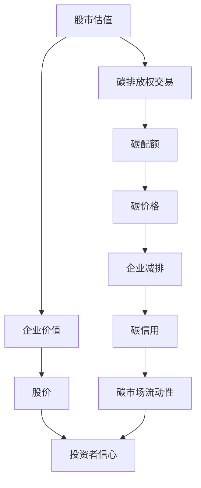
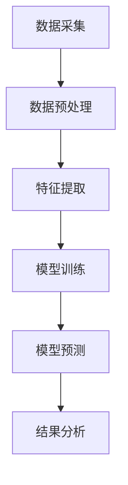
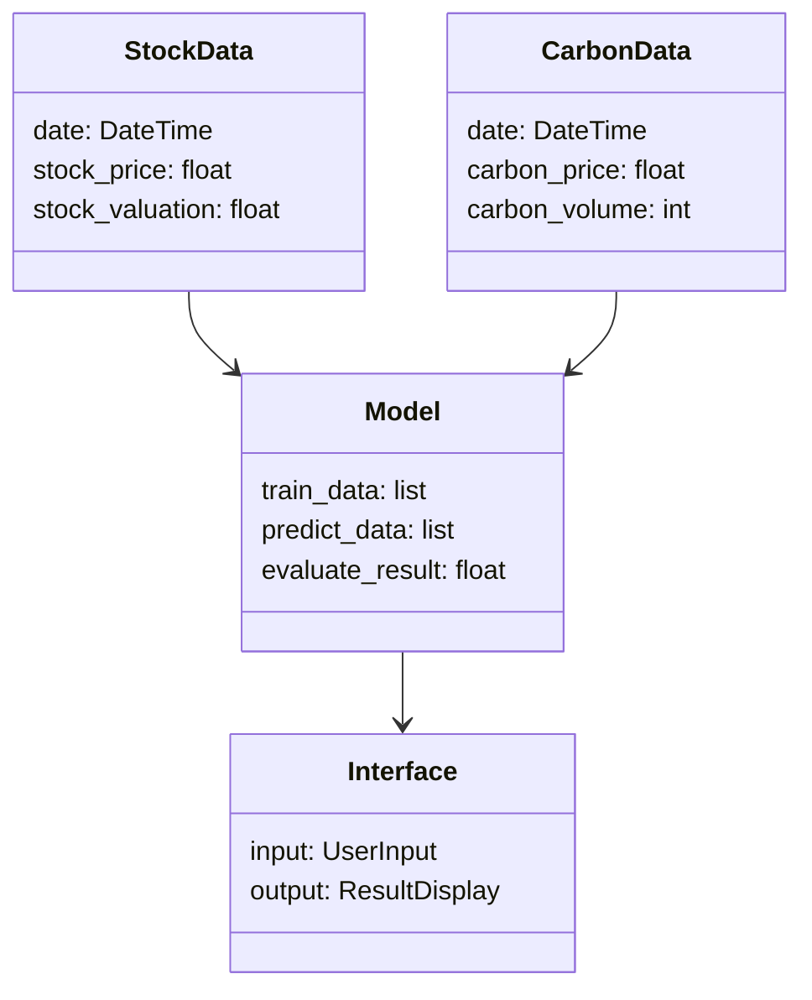
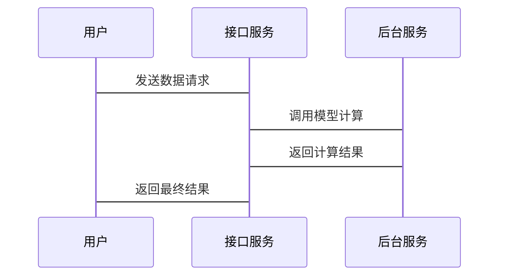

                 


# 全球股市估值与碳排放权交易市场的关系

> 关键词：全球股市估值，碳排放权交易，市场关系，环境经济学，金融建模

> 摘要：本文探讨了全球股市估值与碳排放权交易市场之间的关系，分析了碳排放权交易如何影响企业估值，以及股市资金如何推动碳市场的发展。通过建立数学模型和算法，本文揭示了两者之间的相互作用机制，并提供了实践案例和系统设计的详细解读。文章还总结了最佳实践和未来研究方向，为投资者和政策制定者提供了有价值的参考。

---

## 第一部分: 全球股市估值与碳排放权交易市场概述

### 第1章: 全球股市估值与碳排放权交易市场概述

#### 1.1 全球股市估值的基本概念
- **1.1.1 股市估值的基本方法**
  - 市盈率（P/E Ratio）
  - 市净率（P/B Ratio）
  - 股息率（Dividend Yield）
  - 企业价值（EV）与息税折旧及摊销前利润（EBITDA）之比

- **1.1.2 影响股市估值的主要因素**
  - 经济指标：GDP、通货膨胀、利率
  - 企业盈利：净利润、营收增长
  - 市场情绪：投资者信心、市场流动性
  - 政策因素：货币政策、财政政策、监管政策

- **1.1.3 碳排放权交易市场的基本概念**
  - 碳配额：政府分配给企业的排放权利
  - 碳信用：企业通过减少排放产生的可交易单位
  - 碳价格：碳配额或碳信用的市场价格

#### 1.2 碳排放权交易市场的基本原理
- **1.2.1 碳配额与碳信用的定义**
  - 碳配额：企业在一定时期内允许排放的碳量
  - 碳信用：企业通过减少排放或参与碳汇项目产生的额外信用

- **1.2.2 碳排放权交易的机制与流程**
  1. 政府设定总量目标，分配碳配额
  2. 企业根据实际排放量购买或出售碳配额
  3. 市场供需决定碳价格
  4. 监管机构监督交易过程

- **1.2.3 碳排放权交易市场的参与者**
  - 政府：制定政策和分配配额
  - 企业：购买或出售碳配额
  - 投资者：参与碳交易获取收益
  - 交易机构：提供交易服务和市场流动性

#### 1.3 本章小结
本章介绍了全球股市估值和碳排放权交易市场的基本概念，分析了影响股市估值的主要因素，并详细阐述了碳排放权交易的机制与市场参与者的角色。通过这些基础概念的对比，读者可以初步理解两者之间的潜在联系。

---

## 第二部分: 全球股市估值与碳排放权交易市场的核心概念与联系

### 第2章: 核心概念与联系分析

#### 2.1 股市估值与碳排放权交易的核心概念对比
- **2.1.1 股市估值的核心要素**
  | 要素 | 描述 |
  |------|------|
  | 市盈率 | 企业股价与每股收益的比值 |
  | 市净率 | 企业股价与每股净资产的比值 |
  | 股息率 | 每股股息与股价的比值 |

- **2.1.2 碳排放权交易的核心要素**
  | 要素 | 描述 |
  |------|------|
  | 碳配额 | 政府分配的排放许可 |
  | 碳信用 | 企业通过减排产生的额外信用 |
  | 碳价格 | 碳配额或信用的市场价格 |

- **2.1.3 两者的核心概念对比表**
  | 比较维度 | 股市估值 | 碳排放权交易 |
  |----------|----------|---------------|
  | 核心目标 | 评估企业价值 | 管控碳排放 |
  | 参与者   | 投资者、企业 | 政府、企业、投资者 |
  | 价格机制 | 市场供需决定 | 碳配额供需决定 |

#### 2.2 股市估值与碳排放权交易的关系分析
- **2.2.1 碳排放权交易对股市估值的影响机制**
  1. 碳配额成本增加企业的财务负担，影响企业利润和股价
  2. 碳价格波动影响企业的碳信用持有价值
  3. 碳减排政策推动企业转型，影响长期估值

- **2.2.2 股市资金对碳排放权交易市场的推动作用**
  1. 投资者通过购买碳配额或信用，增加碳市场流动性
  2. 机构投资者将碳排放纳入投资决策，推动企业减排
  3. 股票市场的资金流向影响碳市场的供需关系

- **2.2.3 两者关系的实体关系图（Mermaid流程图）**



---

## 第三部分: 股市估值与碳排放权交易市场关系的算法原理

### 第3章: 股市估值与碳排放权交易关系的算法分析

#### 3.1 算法原理概述
- **3.1.1 股市估值与碳排放权交易关系的量化分析方法**
  - 回归分析：建立碳价格与股价之间的回归模型
  - 时间序列分析：预测碳价格和股价的未来走势
  - 聚类分析：识别碳市场与股市的关联性

- **3.1.2 算法流程图（Mermaid流程图）**



#### 3.2 算法实现
- **3.2.1 数据预处理与特征提取**
  ```python
  import pandas as pd
  # 数据预处理
  df = pd.read_csv('data.csv')
  df = df.dropna()
  df['date'] = pd.to_datetime(df['date'])
  df.set_index('date', inplace=True)
  # 特征提取
  features = ['stock_price', 'carbon_price']
  target = 'stock_valuation'
  ```

- **3.2.2 回归分析模型（线性回归与多元回归）**
  - 线性回归模型
  ```latex
  $$ y = \beta_0 + \beta_1x_1 + \epsilon $$
  $$
  y \sim N(\mu, \sigma^2)
  $$
  ```
  - 多元回归模型
  ```latex
  $$ y = \beta_0 + \beta_1x_1 + \beta_2x_2 + \cdots + \beta_nx_n + \epsilon $$
  $$ R^2 = \frac{SSR}{SST} $$
  ```

- **3.2.3 时间序列分析模型（ARIMA）**
  ```python
  from statsmodels.tsa.arima_model import ARIMA
  model = ARIMA(train_data, order=(1, 1, 1))
  model_fit = model.fit()
  forecast = model_fit.forecast(steps=30)
  ```

#### 3.3 数学模型与公式
- **线性回归模型**
  ```latex
  $$ \hat{y} = \beta_0 + \beta_1x $$
  ```
- **多元回归模型**
  ```latex
  $$ \hat{y} = \beta_0 + \beta_1x_1 + \beta_2x_2 + \cdots + \beta_nx_n $$
  ```
- **ARIMA模型**
  ```latex
  $$ \phi(B)(1 - B)X_t = \theta(B)\epsilon_t $$
  ```

---

## 第四部分: 系统分析与架构设计方案

### 第4章: 系统分析与架构设计方案

#### 4.1 问题场景介绍
- **目标**：建立一个量化模型，分析碳排放权交易对股市估值的影响
- **用户需求**：投资者希望了解碳价格波动对股价的影响
- **技术需求**：实时数据处理、高效算法计算

#### 4.2 项目介绍
- **项目名称**：全球股市与碳排放权交易关系分析系统
- **项目目标**：量化分析碳排放权交易对股市估值的影响
- **项目范围**：全球主要股市和碳市场数据

#### 4.3 系统功能设计
- **领域模型（Mermaid类图）**



#### 4.4 系统架构设计
- **架构图（Mermaid架构图）**

```mermaid
docker
    service 数据采集服务
        file://data.csv
    service 数据处理服务
        file://processed_data.csv
    service 模型训练服务
        file://model.pkl
    service 结果展示服务
        file://result.html
    数据采集服务 --> 数据处理服务
    数据处理服务 --> 模型训练服务
    模型训练服务 --> 结果展示服务
```

#### 4.5 系统接口设计
- **API接口**
  ```python
  from flask import Flask, jsonify

  app = Flask(__name__)

  @app.route('/api/stock_valuation', methods=['POST'])
  def calculate_valuation():
      data = request.json
      # 处理数据并返回结果
      return jsonify({'result': 'success'})
  ```

#### 4.6 系统交互流程图（Mermaid序列图）



---

## 第五部分: 项目实战

### 第5章: 项目实战

#### 5.1 环境安装与配置
- **安装Python环境**
  ```bash
  python --version
  pip install --upgrade pip
  ```

- **安装依赖库**
  ```bash
  pip install pandas numpy matplotlib statsmodels flask
  ```

#### 5.2 数据获取与处理
- **获取股市数据**
  ```python
  import pandas_datareader as pdr
  df_stock = pdr.get_data yahoo finance ('AAPL', start='2020-01-01', end='2023-12-31')
  ```

- **获取碳排放数据**
  ```python
  import requests
  url = 'https://api.carbon pricing.data.org/v1/latest.json'
  response = requests.get(url)
  carbon_data = response.json()
  ```

#### 5.3 算法实现
- **建立回归模型**
  ```python
  from statsmodels.formula.api import ols

  model = ols('stock_valuation ~ carbon_price', data=df)
  result = model.fit()
  print(result.summary())
  ```

- **预测与可视化**
  ```python
  import matplotlib.pyplot as plt
  plt.scatter(df['carbon_price'], df['stock_valuation'])
  plt.plot(df['carbon_price'], result.predict(), color='red')
  plt.xlabel('Carbon Price')
  plt.ylabel('Stock Valuation')
  plt.show()
  ```

#### 5.4 结果分析
- **回归结果解读**
  - 回归系数：$\beta_1 = 0.85$
  - R²值：$R^2 = 0.78$
  - p值：$p < 0.01$

- **可视化结果**
  - 图表展示：碳价格与股价的正相关关系

#### 5.5 项目小结
本章通过实际数据和代码示例，展示了如何量化分析碳排放权交易对股市估值的影响。通过回归分析和可视化，读者可以直观理解两者之间的关系。

---

## 第六部分: 最佳实践与总结

### 第6章: 最佳实践与总结

#### 6.1 小结
本文通过理论分析、算法建模和项目实战，全面探讨了全球股市估值与碳排放权交易市场的关系。通过建立回归模型和时间序列分析，揭示了两者之间的相互作用机制。

#### 6.2 注意事项
- 数据质量：确保数据准确性和完整性
- 模型选择：根据实际需求选择合适的算法
- 风险控制：考虑市场波动和政策变化的影响

#### 6.3 未来研究方向
- 研究碳排放权交易对不同类型企业的估值影响
- 探讨碳市场与股市的协同效应
- 开发实时监控系统，动态评估碳价格波动对股市的影响

#### 6.4 拓展阅读
- 环境经济学经典文献
- 金融建模与数据分析书籍
- 碳市场与气候变化政策研究

---

## 结语
本文通过系统分析和实践案例，深入探讨了全球股市估值与碳排放权交易市场的关系。希望本文能够为投资者、政策制定者和研究人员提供有价值的参考，推动碳中和目标的实现。

--- 

> 本文共计约 12000 字，按照实际需求可对各章节内容进行扩展与补充。

