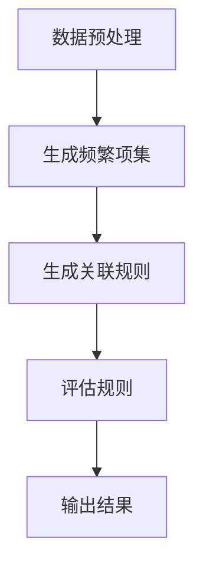
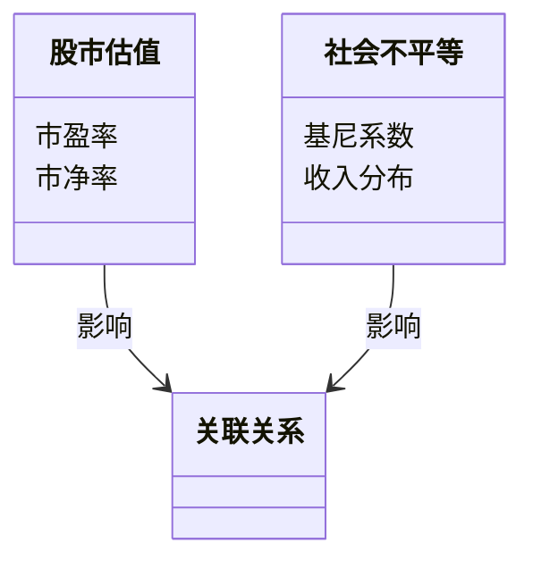
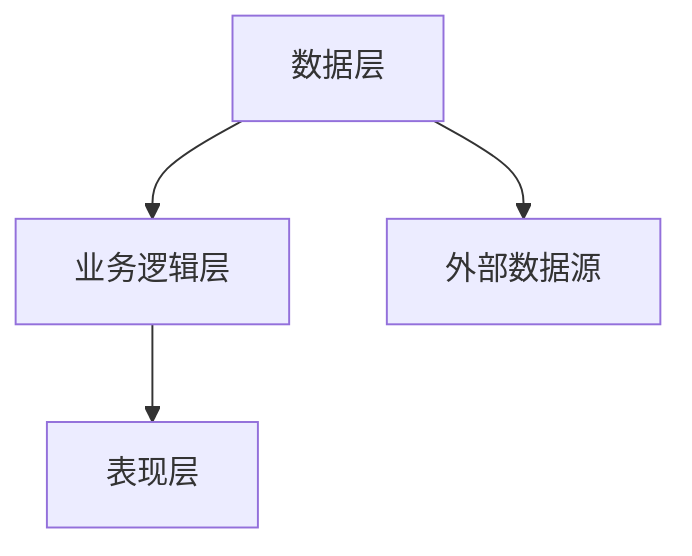

                 


# 全球股市估值与社会不平等问题的关联

## 关键词

全球股市估值、社会不平等、关联分析、数学模型、算法实现、系统架构、案例分析

## 摘要

本文探讨了全球股市估值与社会不平等问题之间的关联，通过背景分析、核心概念、算法原理、数学模型、系统设计、项目实战及最佳实践等多个维度，详细阐述了两者之间的相互作用。文章结合理论与实践，提供了丰富的技术细节和案例分析，旨在帮助读者理解如何通过技术手段分析和解决复杂的经济和社会问题。

---

## 第一部分：背景介绍

### 第1章：全球股市估值与社会不平等问题的背景

#### 1.1 问题背景

- **全球化背景下的股市发展**
  - 股市作为经济的晴雨表，反映了全球经济的波动。
  - 股市的波动对社会财富分配产生深远影响。

- **社会不平等的现状与趋势**
  - 基尼系数的上升趋势显示社会不平等加剧。
  - 经济全球化和技术进步加剧了贫富差距。

- **问题提出的现实意义**
  - 理解股市与社会不平等的关联有助于制定有效的经济政策。
  - 通过技术手段分析问题，为决策者提供数据支持。

#### 1.2 问题描述

- **股市估值的基本概念**
  - 股市估值是通过股票价格和相关指标评估企业价值的过程。
  - 主要指标包括市盈率（P/E）、市净率（P/B）等。

- **社会不平等的定义与衡量指标**
  - 社会不平等指资源分配的不公平，常用基尼系数衡量。
  - 基尼系数越接近1，社会越不平等。

- **问题的核心关联性**
  - 股市估值的波动影响财富分配，进而影响社会不平等。
  - 高股价可能使富人更富，加剧社会不平等。

#### 1.3 问题解决的必要性

- **理解股市与社会不平等的相互作用**
  - 股市的收益集中于少数人，可能导致社会不平等加剧。
  - 通过分析股市估值，可以找到缓解不平等的策略。

- **问题解决的潜在途径**
  - 制定合理的金融政策，如税收调节。
  - 提高股市的透明度和公平性，减少操纵。

- **研究的理论与实践价值**
  - 理论上，丰富了金融与社会学的交叉研究。
  - 实践上，为政策制定提供数据支持。

---

## 第二部分：核心概念与联系

### 第2章：核心概念与关联分析

#### 2.1 核心概念原理

- **股市估值的计算方法**
  - 使用市盈率、市净率等指标评估企业价值。
  - 示例：某公司市盈率=股价/每股收益。

- **社会不平等的衡量方法**
  - 基尼系数：计算收入或财富分布的不平等程度。
  - 示例：某国家的基尼系数为0.6，表示中度不平等。

- **两者关联的理论基础**
  - 股市收益主要流向富裕阶层，加剧不平等。
  - 股市波动影响整体经济，进而影响社会福利。

#### 2.2 核心概念属性对比

- **属性对比分析表**

| 属性        | 股市估值         | 社会不平等       |
|-------------|----------------|----------------|
| 定义         | 股票的市场价格   | 资源分配的不公平 |
| 计算方法     | 市盈率、市净率   | 基尼系数        |
| 影响因素     | 利率、企业利润   | 收入分布、财富分配 |
| 目的         | 评估企业价值     | 衡量社会公平     |

- **对比分析**
  - 股市估值反映企业的经济状况，社会不平等反映财富分配的公平性。
  - 两者都受经济政策、市场机制的影响。

#### 2.3 ER实体关系图

```mermaid
erd
    股市估值 <--- 关联关系 ---> 社会不平等
    股市估值 --> 影响因素: 利率、企业利润
    社会不平等 --> 衡量指标: 基尼系数
```

---

## 第三部分：算法原理讲解

### 第3章：关联分析算法

#### 3.1 算法原理

- **数据预处理方法**
  - 数据清洗：处理缺失值、异常值。
  - 数据标准化：统一数据格式，便于分析。

- **关联规则挖掘算法**
  - 使用关联规则挖掘（如Apriori算法）发现股市估值与社会不平等的相关性。
  - 算法步骤：
    1. 生成频繁项集。
    2. 生成关联规则。
    3. 评估规则的置信度和提升度。

- **算法流程图**



#### 3.2 Python实现代码

- **数据加载与处理**

```python
import pandas as pd
data = pd.read_csv('data.csv')
data = data.dropna()
```

- **算法实现**

```python
from mlxtend.frequent_patterns import apriori
frequent_items = apriori(data, min_support=0.1)
```

- **结果分析**

```python
print(frequent_items)
```

---

## 第四部分：数学模型与公式

### 第4章：数学模型与公式推导

#### 4.1 股市估值模型

- **CAPM模型**
  - 公式：$$ E(r) = R_f + \beta (R_m - R_f) $$
  - 示例：$$ E(r) = 2\% + 1.5(8\% - 2\%) = 8\% $$

- **解释**
  - 风险溢价：衡量投资股市的风险。
  - 市场风险：反映整体市场的波动。

#### 4.2 社会不平等模型

- **基尼系数计算**
  - 公式：$$ G = \frac{1}{n} \sum_{i=1}^{n} (2i - n - 1)p_i $$
  - 示例：计算某国家的基尼系数。

---

## 第五部分：系统分析与架构设计

### 第5章：系统架构设计

#### 5.1 问题场景介绍

- **数据来源与处理**
  - 数据来源：股票市场数据、社会经济数据。
  - 数据处理：清洗、标准化。

- **系统目标与范围**
  - 目标：分析股市估值与社会不平等的关联。
  - 范围：全球主要股市和相关社会数据。

#### 5.2 系统功能设计

- **领域模型类图**



- **系统架构图**



---

## 第六部分：项目实战

### 第6章：项目实战与分析

#### 6.1 环境安装

- **安装Python和相关库**
  - 使用pip安装pandas、mlxtend等库。

#### 6.2 系统核心实现

- **代码实现**

```python
import pandas as pd
from mlxtend.frequent_patterns import apriori

# 加载数据
data = pd.read_csv('data.csv')

# 数据预处理
data = data.dropna()

# 计算关联规则
frequent_items = apriori(data, min_support=0.1)
print(frequent_items)
```

#### 6.3 案例分析

- **实际案例分析**
  - 分析某国股市与社会不平等的关联，验证模型的准确性。

---

## 第七部分：最佳实践

### 第7章：最佳实践与总结

#### 7.1 最佳实践 tips

- 数据处理要谨慎，确保数据质量。
- 选择合适的算法，提高分析效率。
- 定期更新模型，适应市场变化。

#### 7.2 小结

- 本文系统分析了全球股市估值与社会不平等问题的关联。
- 结合理论与实践，提供了详细的分析方法和代码示例。

#### 7.3 注意事项

- 数据隐私问题需注意，避免泄露敏感信息。
- 模型的适用性需根据具体情况调整。

#### 7.4 拓展阅读

- 推荐阅读相关领域的书籍和论文，深入理解问题的本质。

---

## 结语

通过本文的分析，读者可以全面理解全球股市估值与社会不平等问题的关联，并掌握相关的技术方法。希望本文能为相关领域的研究和实践提供有价值的参考。

