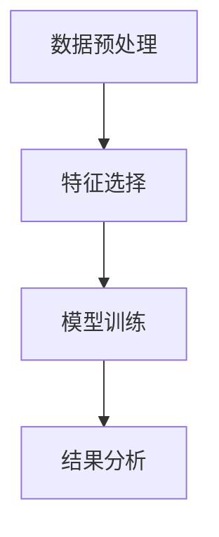

                 


# 全球股市估值与科技创新指数的关系

## 关键词：全球股市估值、科技创新指数、投资分析、金融模型、数据驱动决策

## 摘要：本文探讨全球股市估值与科技创新指数之间的关系，分析科技创新如何影响股市估值，构建量化分析模型，并结合实际案例进行分析。通过理论与实证相结合，揭示科技创新指数对投资决策的重要性。

---

# 第1章 全球股市估值与科技创新指数的概述

## 1.1 问题背景

### 1.1.1 全球股市估值的定义与重要性
全球股市估值是衡量市场整体价值的关键指标，反映投资者对市场的信心和经济前景的预期。主要的估值指标包括市盈率（P/E）、市净率（P/B）和市值等。

### 1.1.2 科技创新指数的定义与意义
科技创新指数是衡量一个地区或国家科技创新能力的指标，涵盖研发投入、专利数量、科技企业数量等多个维度。

### 1.1.3 研究意义
科技创新是推动经济发展的核心动力，而股市估值是反映企业价值的重要指标。研究两者的关联性，有助于投资者做出更明智的决策。

## 1.2 核心概念与联系

### 1.2.1 核心概念的原理与属性
- **股市估值**：反映市场整体或单个股票的价值。
- **科技创新指数**：衡量科技创新能力的综合指标。

### 1.2.2 对比分析
| 指标 | 股市估值 | 科技创新指数 |
|------|----------|--------------|
| 数据来源 | 股价、财务数据 | 专利、研发投入 |
| 用途 | 投资决策 | 政策制定、产业升级 |

### 1.2.3 ER实体关系图
```mermaid
er
actor(投资者) -->> 股市估值: 影响
actor(科技企业) -->> 科技创新指数: 驱动
```

## 1.3 研究方法与框架

### 1.3.1 数据收集
- 数据来源：全球主要股市数据（如纳斯达克、标普500）、科技创新指数数据（如OECD科技创新指数）。
- 数据处理：清洗、标准化。

### 1.3.2 分析模型
- 多元回归模型：分析科技创新指数对股市估值的影响。

### 1.3.3 研究假设
- H1: 科技创新指数与股市估值呈正相关。

## 1.4 本章小结
本章介绍了全球股市估值和科技创新指数的基本概念，分析了两者的关系，并提出了研究框架。

---

# 第2章 科技创新对股市估值的影响机制

## 2.1 科技创新与企业价值的关系

### 2.1.1 科技创新对企业盈利的影响
- 提高生产效率，降低成本。

### 2.1.2 对市场风险的化解
- 科技创新能力强的企业，抗风险能力更强。

### 2.1.3 企业成长性
- 科技创新是企业持续增长的核心动力。

## 2.2 科技创新指数与股市估值的传导路径

### 2.2.1 科技创新指数的衡量
- 专利数量、研发投入占比、科技企业数量。

### 2.2.2 正向影响
- 技术进步推动企业盈利增长，提升估值。

### 2.2.3 反向影响
- 技术瓶颈或竞争加剧可能抑制估值。

## 2.3 动态关系

### 2.3.1 科技创新周期
- 技术成熟期：估值稳定增长。
- 技术衰退期：估值可能下降。

### 2.3.2 行业差异
- 高科技行业（如IT）受创新驱动明显。
- 传统行业受创新驱动较小。

### 2.3.3 长期与短期效应
- 短期：市场情绪影响估值波动。
- 长期：技术创新推动长期增长。

## 2.4 本章小结
本章分析了科技创新对企业价值的影响机制，探讨了科技创新指数与股市估值的动态关系。

---

# 第3章 全球主要股市与科技创新指数分析

## 3.1 全球主要股市概述

### 3.1.1 美国股市
- 纳斯达克：科技企业集中地。
- 纽交所：传统行业与科技企业并存。

### 3.1.2 欧洲主要股市
- 伦敦证交所：金融与科技并重。
- 法兰克福证交所：工业与科技结合。

### 3.1.3 亚洲主要股市
- 东京证交所：制造业与科技结合。
- 香港股市：金融与科技并重。

## 3.2 科技创新指数分析

### 3.2.1 美国科技创新指数
- 领先全球，研发投入高，专利数量多。

### 3.2.2 欧洲科技创新指数
- 强调可持续技术，创新能力较强。

### 3.2.3 亚洲科技创新指数
- 以中国和韩国为代表，增长迅速。

## 3.3 股市与科技创新指数的关联性分析

### 3.3.1 美国股市与科技创新指数的关联
- 高相关性，科技创新推动股市增长。

### 3.3.2 欧洲股市与科技创新指数的关联
- 中等相关性，政策驱动明显。

### 3.3.3 亚洲股市与科技创新指数的关联
- 高相关性，新兴科技企业推动增长。

## 3.4 本章小结
本章分析了全球主要股市和科技创新指数的表现，探讨了它们之间的关联性。

---

# 第4章 科技创新指数与股市估值的量化分析模型

## 4.1 数据驱动的分析框架

### 4.1.1 数据来源
- 股市数据：市盈率、市净率。
- 科技创新指数：专利数量、研发投入。

### 4.1.2 数据处理
- 清洗、标准化、缺失值处理。

## 4.2 模型构建

### 4.2.1 线性回归模型
$$ y = \beta_0 + \beta_1 x_1 + \beta_2 x_2 + \epsilon $$
其中，$y$ 为股市估值，$x_1$ 为科技创新指数，$x_2$ 为其他变量。

### 4.2.2 算法实现


### 4.2.3 模型验证
- R²值：衡量模型拟合度。
- 显著性检验：判断变量影响。

## 4.3 本章小结
本章构建了量化分析模型，验证了科技创新指数对股市估值的影响。

---

# 第5章 理论与实证分析

## 5.1 理论分析

### 5.1.1 科技创新指数对股市估值的影响路径
- 技术进步 → 企业盈利 → 股价上涨。

### 5.1.2 市场预期的作用
- 投资者预期未来收益，影响当前估值。

## 5.2 实证分析

### 5.2.1 数据来源与处理
- 数据来源：纳斯达克、标普500、OECD科技创新指数。
- 数据处理：标准化、滑动窗口法。

### 5.2.2 分析结果
- 多元回归结果：科技创新指数显著正向影响股市估值。

### 5.2.3 结果讨论
- 技术进步是推动股市增长的重要因素。

## 5.3 本章小结
本章通过理论与实证分析，验证了科技创新指数对股市估值的正向影响。

---

# 第6章 科技创新指数与股市估值的关系影响因素

## 6.1 政策与监管因素

### 6.1.1 政府政策
- 技术补贴、税收优惠。

### 6.1.2 监管环境
- 创新友好型监管推动股市增长。

## 6.2 市场情绪与投资者行为

### 6.2.1 投资者情绪
- 市场乐观时，估值偏高。

### 6.2.2 媒体舆论
- 正面报道可能推高估值。

## 6.3 宏观经济因素

### 6.3.1 经济周期
- 上升期，科技创新推动股市增长。

### 6.3.2 利率水平
- 低利率环境有利于股市估值上升。

## 6.4 本章小结
本章分析了影响科技创新指数与股市估值关系的因素。

---

# 第7章 总结与展望

## 7.1 全文总结

### 7.1.1 核心发现
- 科技创新是推动股市估值增长的核心因素。

### 7.1.2 研究局限
- 数据范围有限，未来可扩展到更多市场。

## 7.2 未来展望

### 7.2.1 研究方向
- 结合更多市场和时间维度进行研究。

### 7.2.2 实际应用
- 投资者可利用科技创新指数进行投资决策。

## 7.3 本章小结
本章总结了全文，并展望了未来的研究方向。

---

# 结语

通过本文的分析，我们得出科技创新是推动股市估值增长的核心因素。投资者应关注科技创新指数的变化，以做出更明智的投资决策。未来的研究可以进一步拓展到更多市场和时间维度，为投资决策提供更有力的支持。

--- 

> **最佳实践 tips**:
> - 在进行股市分析时，结合科技创新指数可以更全面地评估市场风险和收益。
> - 投资者应关注政策、市场情绪等多方面因素，以做出更明智的投资决策。

