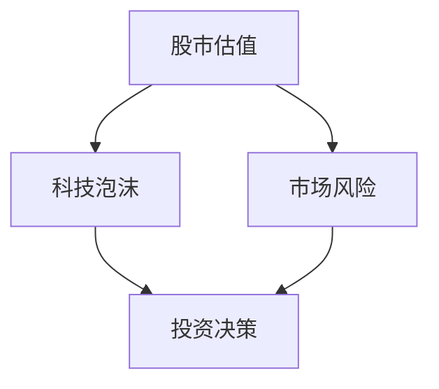
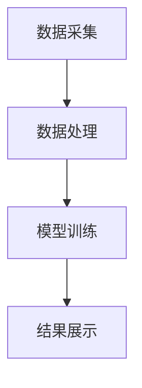
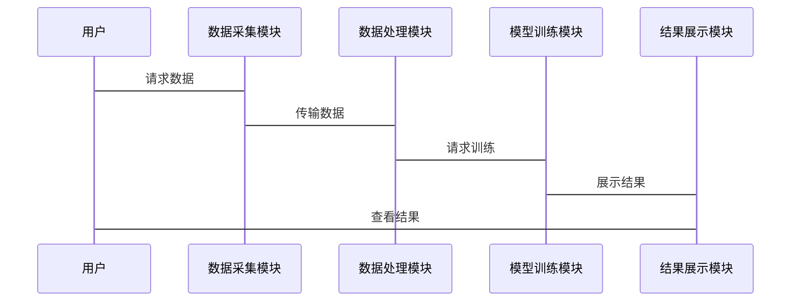

                 


# 全球股市估值与科技泡沫风险的关系

## 关键词：全球股市估值、科技泡沫、风险评估、算法分析、投资策略

## 摘要：本文深入探讨了全球股市估值与科技泡沫风险之间的关系，分析了科技泡沫对股市估值的影响，以及如何通过算法和模型预测和评估科技泡沫风险。文章结合背景介绍、核心概念、算法原理、数学模型、系统架构、项目实战等多方面内容，为读者提供全面的视角和实用的分析工具，帮助投资者更好地理解市场风险并制定有效的投资策略。

---

## 第一部分：全球股市估值与科技泡沫风险的背景介绍

### 第1章：全球股市估值的基本概念

#### 1.1 股市估值的定义与重要性
- 股市估值是衡量公司股票价值的重要方法，通常通过市盈率（P/E比率）、市净率（P/B比率）等指标进行评估。
- 股市估值对企业投资决策、市场趋势预测具有重要意义。

#### 1.2 科技泡沫的定义与特征
- 科技泡沫是指科技行业股票价格远超其实际价值的现象，通常伴随着过度投机和市场情绪的波动。
- 科技泡沫的特征包括高市盈率、高市净率、股价波动剧烈等。

#### 1.3 股市估值与科技泡沫的关系
- 科技泡沫会影响股市估值，导致股票价格虚高，进而引发市场崩盘风险。
- 股市估值是识别科技泡沫的重要指标，可以帮助投资者及时发现市场风险。

---

## 第二部分：全球股市估值与科技泡沫风险的核心概念与联系

### 第2章：核心概念的详细解析

#### 2.1 股市估值的核心要素
- **市盈率（P/E比率）**：公式为 P/E = 市场价格 / 每股收益。高市盈率可能表明市场对公司的未来增长预期较高，但也可能存在泡沫风险。
- **市净率（P/B比率）**：公式为 P/B = 市场价格 / 每股净资产。低市净率可能表明股票被低估，而高市净率可能暗示泡沫。

#### 2.2 科技泡沫的特征对比
| 特征         | 股市估值正常情况 | 科技泡沫情况 |
|--------------|------------------|--------------|
| 市盈率（P/E） | 合理，低于行业平均水平 | 高，远高于行业平均水平 |
| 市净率（P/B） | 合理，接近行业平均水平 | 高，远高于行业平均水平 |
| 股价波动     | 适度波动         | 极度波动，频繁大幅波动 |

#### 2.3 实体关系图


---

## 第三部分：全球股市估值与科技泡沫风险的算法原理

### 第3章：算法原理讲解

#### 3.1 回归分析算法
- **用途**：用于分析科技泡沫对股市估值的影响，预测未来股价走势。
- **步骤**：
  1. 收集历史数据，包括市盈率、市净率、股价等。
  2. 建立回归模型，分析变量之间的关系。
  3. 通过模型预测未来股价。
- **数学模型**：线性回归公式为 Y = aX + b，其中Y为因变量（股价），X为自变量（市盈率）。

#### 3.2 时间序列分析算法
- **用途**：分析股价波动，识别科技泡沫的早期信号。
- **步骤**：
  1. 收集时间序列数据。
  2. 进行数据清洗和平滑处理。
  3. 建立ARIMA模型进行预测。
- **数学模型**：ARIMA(p, d, q)模型，用于捕捉数据的自相关性。

#### 3.3 机器学习模型（示例代码）
```python
# 示例代码：使用回归分析预测股价
import pandas as pd
import numpy as np
from sklearn.linear_model import LinearRegression

# 数据加载
data = pd.read_csv('stock_data.csv')

# 特征和目标变量
X = data[['P/E', 'P/B']]
y = data['Price']

# 模型训练
model = LinearRegression()
model.fit(X, y)

# 预测
predicted_price = model.predict(X)
print('预测股价:', predicted_price)
```

---

## 第四部分：全球股市估值与科技泡沫风险的系统分析

### 第4章：系统架构设计

#### 4.1 问题场景介绍
- 分析科技泡沫风险，帮助投资者制定投资策略。

#### 4.2 系统功能设计
- 数据采集模块：收集股票数据。
- 数据处理模块：清洗和平滑数据。
- 模型训练模块：训练回归和时间序列模型。
- 结果展示模块：可视化分析结果。

#### 4.3 系统架构图


#### 4.4 系统交互图


---

## 第五部分：全球股市估值与科技泡沫风险的项目实战

### 第5章：项目实战

#### 5.1 环境安装
- 安装Python、Pandas、NumPy、Scikit-learn等库。

#### 5.2 核心代码实现
```python
import pandas as pd
from sklearn.linear_model import LinearRegression
import matplotlib.pyplot as plt

# 数据加载
data = pd.read_csv('tech_stock.csv')

# 数据预处理
data = data.dropna()

# 训练模型
model = LinearRegression()
model.fit(data[['P/E', 'P/B']], data['Price'])

# 可视化
plt.scatter(data['P/E'], data['Price'], color='b')
plt.plot(data['P/E'], model.predict(data[['P/E', 'P/B']]), color='r')
plt.xlabel('P/E Ratio')
plt.ylabel('Price')
plt.title('Stock Price vs P/E Ratio')
plt.show()
```

#### 5.3 案例分析
- 分析某科技公司股票数据，发现其市盈率和市净率均远高于行业平均水平，可能存在泡沫风险。

#### 5.4 项目小结
- 通过算法分析，识别科技泡沫的早期信号，帮助投资者制定有效的投资策略。

---

## 第六部分：最佳实践与总结

### 第6章：最佳实践

#### 6.1 小结
- 本文通过算法和系统设计，深入分析了全球股市估值与科技泡沫风险的关系，为投资者提供了实用的分析工具。

#### 6.2 注意事项
- 数据质量直接影响分析结果，需确保数据准确性和完整性。
- 科技泡沫风险具有不确定性，需结合多因素进行综合判断。

#### 6.3 拓展阅读
- 建议进一步研究其他算法，如支持向量机（SVM）和随机森林（Random Forest）在股市分析中的应用。

---

## 结语
本文通过系统化的分析，为读者提供了全面了解全球股市估值与科技泡沫风险的方法，结合实际案例和代码实现，帮助投资者更好地应对市场风险。

