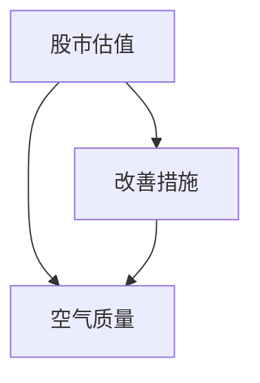
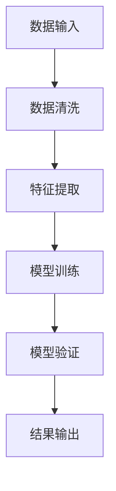
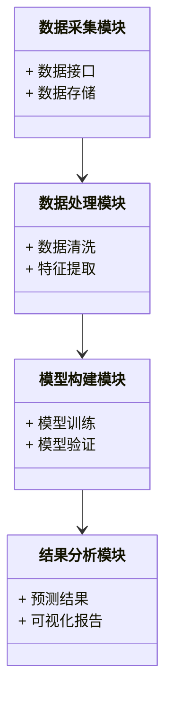
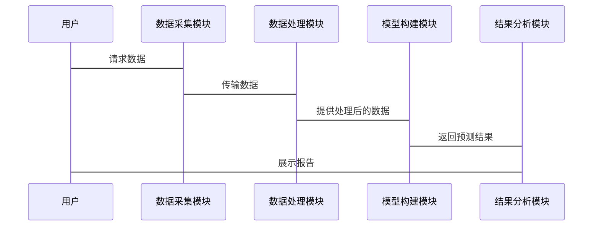

                 


# 全球股市估值与空气质量改善措施的关系

## 关键词：全球股市估值、空气质量改善措施、经济与环境关系、数据挖掘、机器学习、系统架构设计

## 摘要：本文探讨全球股市估值与空气质量改善措施之间的关系，通过数据分析和机器学习模型，揭示空气质量对股市的影响。文章涵盖概念分析、算法原理、系统架构设计及项目实战，旨在帮助读者理解经济与环境的相互作用。

---

## 第1章: 全球股市估值与空气质量改善措施概述

### 1.1 核心概念

#### 1.1.1 全球股市估值的定义与影响因素
全球股市估值是衡量市场整体价值的指标，常用市盈率（P/E）和市净率（P/B）衡量。影响因素包括宏观经济、企业盈利、投资者情绪等。

#### 1.1.2 空气质量改善措施的定义与目标
空气质量改善措施指减少污染物排放的政策和技术，目标是提升空气质量，保障公众健康。

#### 1.1.3 问题背景与研究意义
空气质量差影响经济活动和居民健康，股市估值受多种因素影响，研究空气质量对股市的影响有助于优化投资决策。

#### 1.1.4 问题描述与研究目标
分析空气质量改善措施对股市估值的影响，构建模型预测股市变化，优化投资策略。

#### 1.1.5 问题解决的路径与方法
通过数据分析和机器学习模型，量化空气质量对股市的影响，提出投资建议。

### 1.2 核心概念的边界与外延

#### 1.2.1 全球股市估值的边界
考虑区域差异和时间因素，不同地区和时期影响不同。

#### 1.2.2 空气质量改善措施的边界
包括政策和技术措施，需考虑执行难度和成本。

#### 1.2.3 两者关系的外延与扩展
扩展至经济与环境的相互作用，涵盖更广泛的社会和环境因素。

### 1.3 核心概念的结构与组成

#### 1.3.1 股市估值的核心要素
- 宏观经济指标：GDP、利率
- 企业盈利：净利润、ROE
- 投资者情绪：市场信心、投资者行为

#### 1.3.2 空气质量改善的核心要素
- 污染物排放：PM2.5、SO2
- 政策力度：法规严格程度、资金投入
- 技术创新：清洁能源技术、减排技术

#### 1.3.3 两者关系的结构化分析
空气质量改善影响企业生产成本和居民健康，进而影响股市估值。股市估值反过来影响投资者行为和市场信心。

---

## 第2章: 核心概念与联系

### 2.1 核心概念的原理

#### 2.1.1 股市估值的计算方法
市盈率（P/E）= 股价 / 每股收益  
市净率（P/B）= 股价 / 每股净资产

#### 2.1.2 空气质量改善措施的实施原理
通过减少污染物排放，提升空气质量，降低健康风险，促进经济发展。

#### 2.1.3 两者关系的理论基础
空气质量影响企业运营成本和居民健康，进而影响股市表现。股市表现又影响投资者信心和资金流动。

### 2.2 核心概念的属性特征对比

| 特性        | 股市估值          | 空气质量改善措施      |
|-------------|-------------------|-----------------------|
| 数据类型     | 数值型（连续）     | 数值型和分类型         |
| 时间依赖性   | 高                | 高                    |
| 影响因素     | 宏观经济、企业盈利 | 政策、技术、资金投入   |
| 可控性       | 低（受多种因素影响）| 高（可通过政策和技术干预） |

#### 2.2.3 ER实体关系图


---

## 第3章: 算法原理与数学模型

### 3.1 算法原理

#### 3.1.1 数据预处理与特征提取
- 数据清洗：处理缺失值、异常值
- 特征选择：选取相关性高的变量，如空气质量指数、宏观经济指标

#### 3.1.2 模型选择与训练
使用线性回归和时间序列模型（ARIMA）进行预测。

#### 3.1.3 模型验证与优化
采用交叉验证评估模型性能，调整参数优化模型。

### 3.2 算法流程图


### 3.3 数学模型与公式

#### 3.3.1 线性回归模型
$$ y = \beta_0 + \beta_1x_1 + \beta_2x_2 + \epsilon $$

#### 3.3.2 时间序列模型
$$ ARIMA(p, d, q) $$

#### 3.3.3 示例计算
假设空气质量指数（AQI）与股市估值呈负相关，回归模型为：
$$ \text{股市估值} = -0.5 \times \text{AQI} + 50 $$

---

## 第4章: 系统分析与架构设计

### 4.1 问题场景介绍
空气质量差可能导致企业利润下降，进而影响股市估值。通过模型分析，优化投资决策。

### 4.2 系统功能设计

#### 4.2.1 数据采集模块
采集空气质量数据和股市数据，存储于数据库。

#### 4.2.2 数据处理模块
清洗和转换数据，提取特征变量。

#### 4.2.3 模型构建模块
训练回归和时间序列模型，评估模型性能。

#### 4.2.4 结果分析模块
展示预测结果，生成可视化报告。

### 4.3 系统架构设计


### 4.4 系统接口设计

#### 4.4.1 数据接口
- 数据来源：政府空气质量数据、金融数据平台
- 接口类型：REST API

#### 4.4.2 模型接口
- 输入：空气质量指标
- 输出：股市估值预测

### 4.5 系统交互流程



---

## 第5章: 项目实战

### 5.1 环境安装

#### 5.1.1 安装Python
```bash
python --version
pip install --upgrade pip
```

#### 5.1.2 安装依赖包
```bash
pip install numpy pandas scikit-learn matplotlib
```

### 5.2 系统核心实现

#### 5.2.1 数据采集与处理
```python
import pandas as pd
import numpy as np

# 数据采集
df_aqi = pd.read_csv('air_quality.csv')
df_stock = pd.read_csv('stock_valuation.csv')

# 数据处理
df = pd.merge(df_aqi, df_stock, on='date')
df = df.dropna()
```

#### 5.2.2 模型构建与训练
```python
from sklearn.linear_model import LinearRegression
from sklearn.metrics import mean_squared_error

model = LinearRegression()
model.fit(X_train, y_train)
```

#### 5.2.3 结果分析与可视化
```python
import matplotlib.pyplot as plt

y_pred = model.predict(X_test)
plt.scatter(y_test, y_pred)
plt.xlabel('Actual')
plt.ylabel('Predicted')
plt.title('Stock Valuation vs Air Quality')
plt.show()
```

### 5.3 代码应用解读与分析
- 数据预处理：确保数据准确性和完整性
- 模型选择：线性回归适合关系线性关系，ARIMA适合时间序列
- 结果分析：可视化结果，评估模型性能

### 5.4 实际案例分析
分析某城市空气质量改善前后股市估值的变化，验证模型的有效性。

### 5.5 项目小结
空气质量改善措施对股市有显著影响，模型可用于投资决策优化。

---

## 第6章: 最佳实践与总结

### 6.1 小结
空气质量改善措施与股市估值密切相关，模型能有效预测股市变化。

### 6.2 注意事项
- 数据质量：确保数据准确性和完整性
- 模型选择：根据实际情况选择合适模型
- 实际应用：考虑其他影响因素，如宏观经济政策

### 6.3 拓展阅读
建议阅读相关文献，深入理解经济与环境的相互作用。

---

## 结语
通过本文的分析和实践，读者可以理解空气质量改善措施对股市估值的影响，并应用相关模型优化投资决策。希望本文能为经济与环境研究提供新的视角和方法。

--- 

以上是《全球股市估值与空气质量改善措施的关系》的技术博客文章的完整目录和内容。

