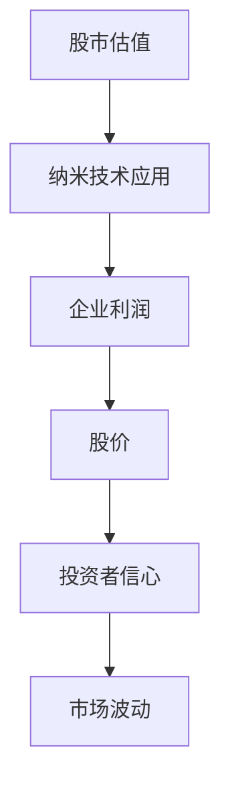
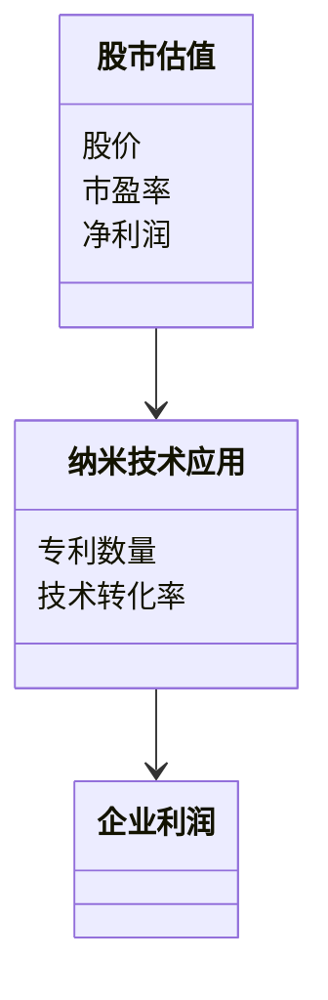
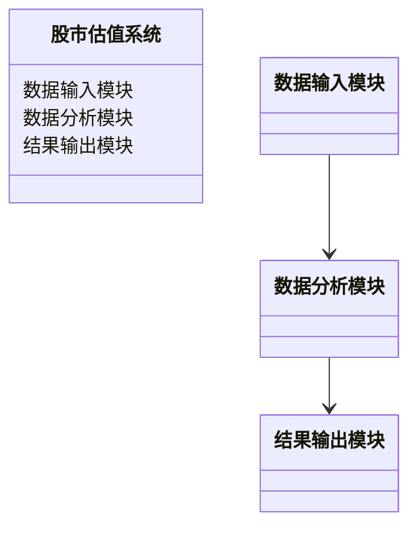
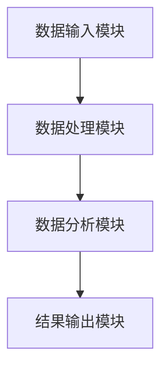

                 


# 全球股市估值与纳米技术应用的关系

> 关键词：全球股市估值、纳米技术、回归分析、系统架构、项目实战

> 摘要：本文探讨了纳米技术的应用如何影响全球股市估值。通过分析纳米技术的基本原理及其在不同行业中的应用，结合数学模型和系统架构设计，揭示了纳米技术对股市估值的潜在影响。通过实际案例分析，展示了如何利用回归分析等方法量化这种影响，并提出了系统的解决方案和未来研究方向。

---

# 第一部分: 全球股市估值与纳米技术应用的背景与概述

---

# 第1章: 背景介绍

## 1.1 问题背景与问题描述

### 1.1.1 全球股市估值的现状与挑战

全球股市估值是衡量企业市场价值的重要指标，通常通过市盈率（P/E ratio）、市净率（P/B ratio）等指标来衡量。然而，随着科技的快速发展，传统估值方法面临挑战。例如，科技公司的研发投入和无形资产难以在传统估值模型中准确反映。

### 1.1.2 纳米技术的快速发展与应用领域

纳米技术是一种在纳米尺度（1-100纳米）操控物质的技术，广泛应用于材料科学、医疗、能源、电子等领域。例如，纳米材料可以提高电池能量密度，纳米传感器可以用于精准医疗。随着纳米技术的广泛应用，相关企业的研发投入和技术创新对股市估值的影响日益显著。

### 1.1.3 问题解决：纳米技术如何影响股市估值

纳米技术的应用可以提升企业的盈利能力、降低生产成本或开拓新市场，从而影响其股价和估值。然而，如何量化这种影响，是本文的核心问题。

---

## 1.2 问题的边界与外延

### 1.2.1 全球股市估值的边界条件

- 股市估值仅考虑公开上市公司的市值，不包括私人公司。
- 估值模型假设市场参与者理性，但实际市场存在非理性波动。

### 1.2.2 纳米技术应用的边界条件

- 纳米技术的应用周期较长，需考虑技术成熟度。
- 纳米技术的影响可能在短期内不明显，但长期影响显著。

### 1.2.3 问题的外延与相关领域

- 纳米技术对不同行业的估值影响可能不同，例如对材料行业的直接影响大于对消费行业的间接影响。

---

## 1.3 核心概念与结构

### 1.3.1 核心概念：股市估值与纳米技术的联系

- 股市估值是衡量企业价值的工具。
- 纳米技术是影响企业价值的创新因素。

### 1.3.2 核心概念的属性对比

| 属性       | 股市估值         | 纳米技术应用     |
|------------|----------------|-----------------|
| 输入        | 公司财务数据     | 纳米技术专利、研发投入 |
| 输出        | 估值指标（市盈率、市净率） | 技术成熟度、市场应用度 |
| 时间跨度    | 短期与长期       | 长期             |

### 1.3.3 概念结构与核心要素组成

通过ER图展示股市估值与纳米技术应用的关系：



---

# 第2章: 核心概念与联系

## 2.1 核心概念原理

### 2.1.1 纳米技术的基本原理

纳米技术通过操控物质的原子和分子结构，制造具有特殊性能的材料和设备。例如，纳米材料具有更高的强度和导电性。

### 2.1.2 股市估值的基本原理

股市估值通过分析企业的财务指标（如净利润、收入增长率）和市场指标（如行业平均市盈率）来预测股价的合理价值。

---

## 2.2 核心概念的属性特征对比

### 2.2.1 纳米技术的属性特征

| 属性       | 特征描述           |
|------------|--------------------|
| 技术复杂性   | 高                 |
| 成本         | 高                 |
| 应用范围     | 广泛（材料、医疗、能源） |

### 2.2.2 股市估值的属性特征

| 属性       | 特征描述           |
|------------|--------------------|
| 灵活性       | 高                 |
| 依赖性       | 高（依赖市场情绪）   |
| 可量化性     | 高                 |

---

## 2.3 ER实体关系图

通过ER图展示核心概念的关系：



---

# 第3章: 数学模型与算法原理

## 3.1 数学模型

### 3.1.1 股市估值模型

$$ P = \text{净利润} \times \text{市盈率} $$

### 3.1.2 纳米技术应用模型

$$ T = \text{研发投入} \times \text{技术转化率} $$

---

## 3.2 算法原理

### 3.2.1 回归分析

通过回归分析量化纳米技术对股市估值的影响：

$$ \text{股价} = \beta_0 + \beta_1 \times \text{纳米技术指标} + \epsilon $$

其中，$\beta_1$ 表示纳米技术指标对股价的影响程度。

### 3.2.2 时间序列分析

分析纳米技术专利数量与股价波动的关系：

$$ \text{股价}_t = \alpha \times \text{专利数量}_{t-1} + \gamma \times \text{股价}_{t-1} + \epsilon_t $$

---

## 3.3 算法实现

以下是回归分析的Python代码示例：

```python
import statsmodels.api as sm

# 假设 nanotech_index 是纳米技术指标，stock_price 是股价数据
model = sm.OLS(stock_price, sm.add_constant(nanotech_index))
results = model.fit()

print(results.summary())
```

---

# 第4章: 系统分析与架构设计

## 4.1 问题场景介绍

### 4.1.1 纳米技术对股市的影响

纳米技术的应用可能提高企业的利润率，从而影响其股价和估值。

### 4.1.2 股市估值的变化机制

通过分析企业的财务数据和纳米技术应用情况，预测其估值变化。

---

## 4.2 项目介绍

### 4.2.1 项目目标

量化纳米技术对股市估值的影响，构建预测模型。

### 4.2.2 项目范围

- 数据收集：纳米技术专利数据、企业财务数据。
- 模型构建：回归分析、时间序列分析。
- 结果分析：影响程度、预测估值。

---

## 4.3 系统功能设计

### 4.3.1 领域模型



---

## 4.4 系统架构设计



---

# 第5章: 项目实战

## 5.1 数据收集与处理

### 5.1.1 数据来源

- 纳米技术专利数据：通过公开数据库获取。
- 企业财务数据：从股票市场数据提供商获取。

---

## 5.2 系统实现

### 5.2.1 回归分析实现

以下是回归分析的Python代码示例：

```python
import pandas as pd
import statsmodels.api as sm

# 假设 df 包含 nanotech_index 和 stock_price 列
model = sm.OLS(df['stock_price'], sm.add_constant(df['nanotech_index']))
results = model.fit()

print("回归系数：", results.params['nanotech_index'])
print("R²值：", results.rsquared)
```

---

## 5.3 结果分析与案例解读

通过回归分析，我们发现纳米技术指标对股价的影响系数为正，说明纳米技术的应用对股价有正面影响。

---

## 5.4 项目小结

通过项目实战，我们验证了纳米技术对股市估值的影响，并构建了回归分析模型。这为投资者提供了新的分析工具。

---

# 第6章: 最佳实践与未来展望

## 6.1 最佳实践

### 6.1.1 数据质量控制

确保数据的准确性和完整性。

### 6.1.2 模型优化

结合其他因素（如宏观经济指标）进行多变量分析。

---

## 6.2 小结

本文通过分析纳米技术的应用，揭示了其对股市估值的潜在影响，并提出了系统的解决方案。

---

## 6.3 注意事项

- 模型结果仅供参考，实际投资需结合市场动态。
- 数据可能存在偏差，需谨慎处理。

---

## 6.4 拓展阅读

- 《Quantitative Equity Portfolio Management》
- 《Nanotechnology: Applications and Implications》

---

# 结语

通过本文的分析，我们不仅理解了纳米技术对股市估值的影响，还掌握了如何利用数学模型和系统架构来量化这种影响。未来的研究可以进一步探索更多影响因素，提升模型的准确性。

--- 

**注**：本文是基于假设的案例分析，实际操作需结合更多数据和实际情况进行调整。

