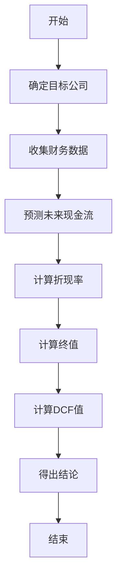

                 

# 全球股市估值与纳米材料在水处理中的应用

> **关键词**：全球股市估值、纳米材料、水处理、环境技术、可持续发展  
> **摘要**：本文从全球股市估值和纳米材料在水处理中的应用两个方面进行深入分析。首先，探讨股市估值的核心概念、方法和模型，结合实际案例分析其应用；其次，介绍纳米材料的基本性质、制备技术及其在水处理中的应用原理，并通过具体案例展示其优势与挑战。文章旨在为投资者和科研人员提供有价值的参考，助力全球经济发展与环境保护。

---

## 第一部分: 全球股市估值

### 第1章: 全球股市估值概述

#### 1.1 股市估值的基本概念
- **定义**：股市估值是指通过分析公司财务数据、市场环境和行业趋势，对股票的内在价值进行评估的过程。
- **核心要素**：公司财务状况、行业竞争格局、宏观经济环境、市场情绪等。
- **分类与特点**：
  - **绝对估值**：基于公司基本面数据计算内在价值。
  - **相对估值**：通过比较同类公司或行业平均水平进行估值。

#### 1.2 股市估值的重要性
- **在投资决策中的作用**：帮助投资者判断股票价格是否被高估或低估。
- **对经济发展的意义**：合理的估值能够引导资金流向优质企业，促进经济健康发展。
- **与风险管理的关系**：通过估值分析，投资者可以更好地控制风险，避免盲目投资。

#### 1.3 股市估值的主要方法
- **市盈率（PE）法**：通过比较股票价格与每股收益的比率，判断股票是否被高估或低估。
- **市净率（PB）法**：通过比较股票价格与每股净资产的比率，适用于评估资产密集型行业的公司。
- **股息率法**：通过比较股票的股息与股票价格的比率，评估股票的投资回报率。
- **DCF模型简介**：通过预测公司未来现金流，折现计算其内在价值。

---

### 第2章: 股市估值的核心指标与模型

#### 2.1 常用估值指标解析
- **市盈率（PE）**：
  - **计算公式**：$PE = \frac{股票价格}{每股收益}$。
  - **应用场景**：适用于盈利稳定的公司，尤其适合科技和消费类企业。
- **市净率（PB）**：
  - **计算公式**：$PB = \frac{股票价格}{每股净资产}$。
  - **应用场景**：适用于资产密集型行业，如银行和制造业。
- **股息率**：
  - **计算公式**：$股息率 = \frac{每股股息}{股票价格} \times 100\%$。
  - **应用场景**：适用于成熟行业和红利股投资者。
- **EV/EBITDA**：
  - **计算公式**：$EV = \text{企业价值} = \text{市值} + \text{债务} - \text{现金}$。
  - **应用场景**：适用于跨行业比较，尤其是亏损企业。

#### 2.2 DCF模型的详细讲解
- **基本原理**：
  - DCF模型通过预测公司未来现金流，使用适当的折现率（如WACC）将其折现，计算公司内在价值。
- **数学公式**：
  $$DCF = \sum_{t=1}^{n} \frac{CF_t}{(1+r)^t} + \frac{TV}{(1+r)^n}$$
  - $CF_t$：第t年的自由现金流。
  - $r$：折现率（WACC）。
  - $TV$：终值，即第n年后的终值。
- **流程图**（使用mermaid）：

#### 2.3 估值模型的优缺点对比
- **对比分析**：
  | 方法 | 优点 | 缺点 |
  |------|------|------|
  | PE | 简单易用，适用于盈利稳定公司 | 不适用于亏损或周期性行业 |
  | PB | 考虑资产价值，适用于资产密集型行业 | 不考虑盈利能力 |
  | 股息率 | 适合红利股投资者 | 不适用于高增长行业 |
  | DCF | 精确反映公司价值 | 需要大量假设，计算复杂 |
- **适用场景**：
  - DCF模型适用于高增长或亏损企业。
  - PE和PB适用于成熟行业。
  - 股息率适用于红利股。

---

## 第二部分: 纳米材料在水处理中的应用

### 第3章: 纳米材料的基本概念与制备技术

#### 3.1 纳米材料的定义与分类
- **定义**：纳米材料是指尺度在1-100纳米范围内的材料，具有独特的物理和化学性质。
- **分类**：
  - **纳米颗粒**：直径在1-100纳米的颗粒。
  - **纳米管**：直径为几纳米的管状结构。
  - **纳米膜**：厚度为纳米级的薄膜。
- **物理化学性质**：
  - 高比表面积：增加反应活性。
  - 小尺寸效应：增强机械强度和导电性。

#### 3.2 纳米材料的制备技术
- **溶胶-凝胶法**：
  - **步骤**：
    1. 高分子前驱体溶液。
    2. 溶胶阶段：加入交联剂形成网状结构。
    3. 凝胶阶段：加热固化。
    4. 热处理：获得纳米材料。
  - **优点**：制备过程简单，成本低。
- **热解法**：
  - **步骤**：
    1. 高分子前驱体溶液。
    2. 涂覆在基底上。
    3. 加热至高温，分解生成纳米颗粒。
  - **优点**：适用于制备金属纳米颗粒。
- **化学气相沉积法**：
  - **步骤**：
    1. 气态前驱体进入反应室。
    2. 在高温下分解，沉积在基底上。
    3. 冷却后获得纳米材料。
  - **优点**：制备均匀性高，适用于大规模生产。

#### 3.3 纳米材料在水处理中的潜力
- **优势**：
  - 高比表面积：增强吸附能力。
  - 小尺寸效应：提高反应效率。
- **挑战**：
  - 纳米材料的稳定性：易团聚，影响性能。
  - 废弃纳米材料的处理：可能对环境造成二次污染。

---

### 第4章: 纳米材料在水处理中的应用原理

#### 4.1 纳米材料在水处理中的基本原理
- **吸附作用**：
  - 纳米材料表面具有高活性，能够吸附水中的重金属离子、有机污染物等。
- **催化作用**：
  - 纳米材料作为催化剂，能够加速水的净化反应，如氧化还原反应。
- **过滤与分离**：
  - 纳米滤膜能够过滤掉水中的微小颗粒和污染物。

#### 4.2 纳米材料在水处理中的具体应用
- **案例1：纳米氧化锌在饮用水处理中的应用**
  - **应用原理**：纳米氧化锌能够吸附水中的重金属离子（如铅、汞）。
  - **优势**：吸附效率高，易于回收。
- **案例2：纳米二氧化钛在污水处理中的应用**
  - **应用原理**：纳米二氧化钛在紫外光下具有光催化作用，能够分解水中的有机污染物。
  - **优势**：反应条件温和，处理效率高。

#### 4.3 纳米材料在水处理中的优势与挑战
- **优势**：
  - 处理效率高：纳米材料能够快速吸附和分解污染物。
  - 环保性好：减少化学药剂的使用，降低二次污染风险。
- **挑战**：
  - 纳米材料的稳定性：易团聚，影响处理效果。
  - 成本问题：纳米材料的制备成本较高。

---

## 第5章: 纳米材料在水处理中的未来展望

#### 5.1 未来发展趋势
- **多功能化**：开发具有吸附、催化等多种功能的纳米材料。
- **智能化**：结合传感器和智能控制系统，实现水处理过程的自动化。
- **绿色制备**：探索环境友好的纳米材料制备方法，减少能源消耗和污染。

#### 5.2 纳米材料在水处理中的潜力
- **技术创新**：随着纳米技术的进步，水处理效率和效果将不断提高。
- **市场需求**：随着环保意识的增强，纳米材料在水处理中的应用需求将快速增长。

---

## 第6章: 结论与展望

#### 6.1 结论
- 全球股市估值是投资者和企业决策的重要工具，掌握估值方法和模型有助于做出明智的投资决策。
- 纳米材料在水处理中的应用潜力巨大，能够有效解决传统水处理技术的局限性，推动环保技术的发展。

#### 6.2 展望
- 随着科技的进步，股市估值方法将更加多样化和精准化。
- 纳米材料在水处理中的应用将更加广泛，推动全球环保事业的发展。

---

通过本文的分析，读者可以全面了解全球股市估值和纳米材料在水处理中的应用，为投资和科研提供有价值的参考。未来，随着技术的进步，这两个领域将更加紧密地结合，为全球经济发展和环境保护做出更大的贡献。

