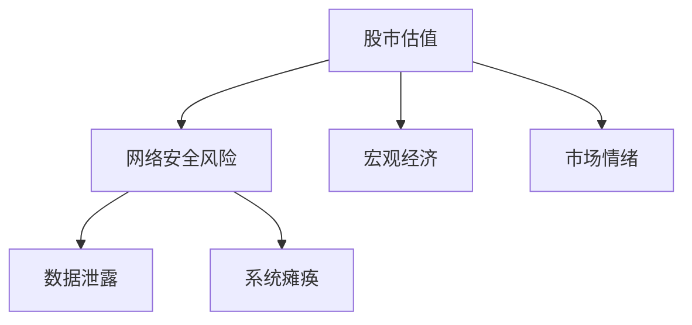
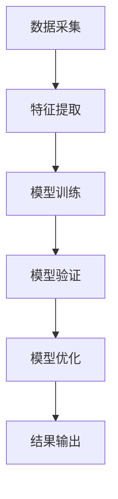
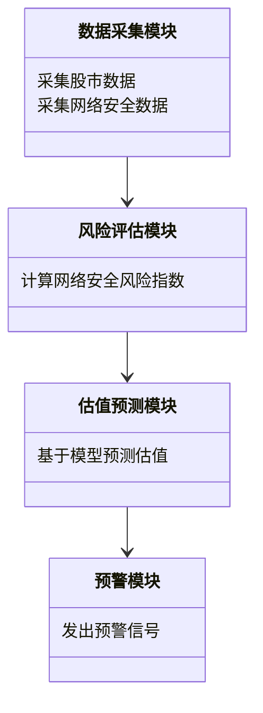
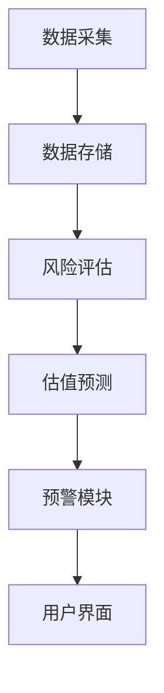
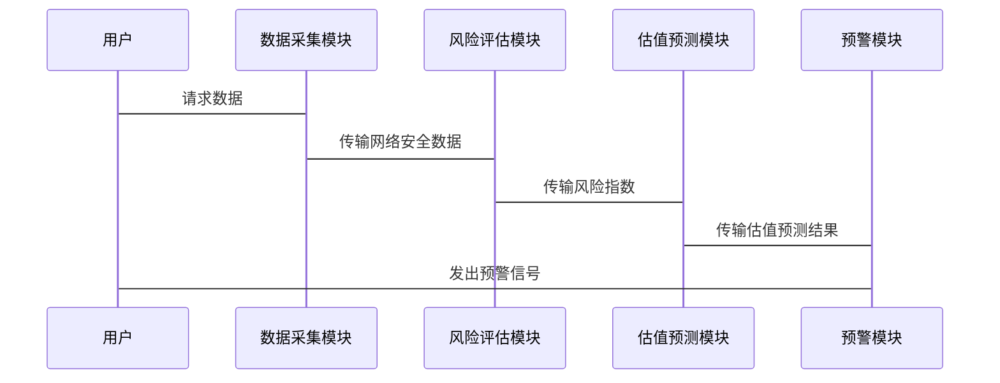

                 


# 全球股市估值与网络安全风险的关联

## 关键词：全球股市估值，网络安全风险，关联性分析，数学模型，金融风险控制

## 摘要：  
本文探讨了全球股市估值与网络安全风险之间的关联性。通过分析网络安全风险对股市估值的影响机制，结合数学模型和实际案例，揭示了网络安全风险如何通过影响企业运营、市场信心和政策环境等因素，进而影响股市估值的变化。文章还提出了基于机器学习的网络安全风险量化模型，并通过实际案例验证了模型的有效性。最后，本文总结了网络安全风险管理对全球股市估值的重要性，并提出了相应的优化建议。

---

# 第1章: 全球股市估值与网络安全风险的背景介绍

## 1.1 全球股市估值的基本概念  
### 1.1.1 股市估值的定义与核心要素  
股市估值是指通过对上市公司财务数据、市场环境和宏观经济指标的分析，评估其股票的内在价值和市场价值。核心要素包括：  
1. **财务数据**：收入、利润、资产、负债等。  
2. **市场环境**：宏观经济政策、利率、通货膨胀、市场情绪等。  
3. **行业特性**：行业周期、竞争格局、技术创新等。  

### 1.1.2 全球化背景下的股市估值特点  
全球化使得股市估值受到跨国公司、国际资本流动和全球性事件的显著影响。例如，一场发生在某国的网络安全事件可能通过跨国企业的供应链影响全球股市。  

### 1.1.3 股市估值与宏观经济的关系  
股市估值是宏观经济的晴雨表，反映了整体经济的健康状况。同时，宏观经济政策（如利率调整、财政刺激）也会直接影响股市估值。  

## 1.2 网络安全风险的基本概念  
### 1.2.1 网络安全风险的定义与分类  
网络安全风险是指由于黑客攻击、数据泄露、系统故障等网络安全事件，可能导致的经济损失和声誉损失。根据来源，可以分为：  
1. **外部攻击**：来自黑客、恶意软件等外部威胁。  
2. **内部疏忽**：员工误操作或泄露敏感信息。  
3. **系统故障**：软件或硬件故障导致的数据丢失或服务中断。  

### 1.2.2 网络安全风险的主要来源  
1. **黑客攻击**：利用漏洞入侵系统，窃取数据或破坏系统。  
2. **数据泄露**：由于人为或技术原因，敏感数据被未经授权的第三方获取。  
3. **供应链攻击**：通过攻击供应链中的第三方企业，间接影响主要企业。  

### 1.2.3 网络安全风险对金融行业的影响  
网络安全风险对金融行业的影响尤为显著。例如，银行系统被攻击可能导致客户信任度下降，进而影响股价；交易所遭受网络攻击可能导致市场混乱，引发股市波动。  

## 1.3 股市估值与网络安全风险的关联性  
### 1.3.1 问题背景与问题描述  
随着全球化的深入，网络安全风险已成为影响企业运营和市场信心的重要因素。然而，目前的股市估值模型大多未充分考虑网络安全风险的影响，这可能导致估值偏差。  

### 1.3.2 问题解决的思路与方法  
通过建立网络安全风险量化模型，将网络安全风险转化为可量化的指标，结合股市估值模型，改进估值方法。  

### 1.3.3 关联性研究的边界与外延  
本文仅关注网络安全风险对股市估值的直接影响，不考虑其他因素（如自然灾害、政策变化）的影响。  

## 1.4 核心概念与联系  
### 1.4.1 核心概念原理  
网络安全风险可能通过以下方式影响股市估值：  
1. **直接影响企业利润**：数据泄露或系统瘫痪可能导致企业损失，进而影响股价。  
2. **影响市场信心**：网络安全事件可能导致投资者信心下降，引发抛售潮。  
3. **影响政策环境**：政府可能出台更严格的网络安全监管政策，增加企业的合规成本。  

### 1.4.2 核心概念属性特征对比表格  
```markdown
| 概念       | 定义                                                                 | 属性特征                          |
|------------|----------------------------------------------------------------------|-----------------------------------|
| 股市估值   | 对公司股票价值的评估，基于财务指标和市场因素                        | 定量分析、动态变化、受多种因素影响 |
| 网络安全风险 | 可能导致数据泄露、系统瘫痪等安全事件的风险                         | 隐性、技术性、可控性               |
```

### 1.4.3 ER实体关系图架构  


## 1.5 本章小结  
本章介绍了全球股市估值和网络安全风险的基本概念，并分析了两者之间的关联性。接下来将从数学模型和算法的角度深入探讨这一关联性。

---

# 第2章: 全球股市估值与网络安全风险的数学模型与关联分析

## 2.1 数学模型的建立  
### 2.1.1 模型假设与变量定义  
假设网络安全风险 \( R \) 对股市估值 \( V \) 有直接影响，其他因素 \( S \) 包括宏观经济和市场情绪。模型可以表示为：  
$$ V = \alpha R + \beta S + \epsilon $$  

其中：  
- \( \alpha \) 和 \( \beta \) 是回归系数。  
- \( \epsilon \) 是误差项。  

### 2.1.2 模型的数学表达  
通过回归分析，可以估计出 \( \alpha \) 和 \( \beta \) 的值，从而量化网络安全风险对股市估值的影响。  

### 2.1.3 模型的验证与优化  
通过历史数据验证模型的准确性，并通过交叉验证优化模型参数。  

## 2.2 算法原理讲解  
### 2.2.1 算法流程图  


### 2.2.2 算法代码实现  
```python
import pandas as pd
import numpy as np
from sklearn.linear_model import LinearRegression
from sklearn.metrics import mean_squared_error

# 数据加载与预处理
data = pd.read_csv('stock_network.csv')
X = data[['R', 'S']]
y = data['V']

# 模型训练
model = LinearRegression()
model.fit(X, y)

# 模型验证
y_pred = model.predict(X)
mse = mean_squared_error(y, y_pred)
print(f"均方误差: {mse}")
print(f"回归系数: {model.coef_}")
```

### 2.2.3 算法原理的数学表达  
$$ y = \beta_0 + \beta_1 x_1 + \beta_2 x_2 + \epsilon $$  

其中：  
- \( y \) 是目标变量（股市估值）。  
- \( x_1 \) 是网络安全风险。  
- \( x_2 \) 是其他影响因素。  
- \( \beta_0 \) 是截距项。  

## 2.3 实际案例分析  
### 2.3.1 案例背景介绍  
假设某公司因网络安全事件导致股价下跌，分析其对整体股市估值的影响。  

### 2.3.2 案例数据与分析  
通过回归分析，得出网络安全风险对股市估值的影响系数为 \( \alpha = -0.2 \)，即网络安全风险每增加1%，股市估值可能下降0.2%。  

### 2.3.3 案例结果与解读  
结果显示，网络安全风险对股市估值有显著的负面影响，尤其是在金融行业。  

## 2.4 本章小结  
本章通过数学模型和算法，量化了网络安全风险对股市估值的影响，并通过实际案例验证了模型的准确性。

---

# 第3章: 全球股市估值与网络安全风险的系统分析与架构设计

## 3.1 问题场景介绍  
本文构建了一个基于网络安全风险的股市估值预测系统，旨在帮助投资者更好地评估股市风险。  

## 3.2 系统功能设计  
### 3.2.1 功能模块划分  
1. **数据采集模块**：采集股市数据和网络安全事件数据。  
2. **风险评估模块**：计算网络安全风险指数。  
3. **估值预测模块**：基于模型预测股市估值。  
4. **预警模块**：根据预测结果发出预警信号。  

### 3.2.2 领域模型（Mermaid类图）  


## 3.3 系统架构设计  
### 3.3.1 系统架构图  


### 3.3.2 系统接口设计  
1. 数据采集模块接口：从数据库或API获取数据。  
2. 风险评估模块接口：接受网络安全数据，输出风险指数。  
3. 估值预测模块接口：接受风险指数和市场数据，输出估值预测。  

### 3.3.3 系统交互序列图  


## 3.4 系统实现与优化  
### 3.4.1 系统实现细节  
1. 数据采集模块采用分布式架构，支持多数据源接入。  
2. 风险评估模块基于机器学习算法，支持实时风险评估。  

### 3.4.2 系统优化建议  
1. 引入实时数据流处理技术，提高系统的实时性。  
2. 建立多层次预警机制，根据风险级别发出不同级别的预警信号。  

## 3.5 本章小结  
本章通过系统架构设计，构建了一个完整的基于网络安全风险的股市估值预测系统，为投资者提供了有效的决策支持工具。

---

# 第4章: 全球股市估值与网络安全风险的项目实战

## 4.1 项目背景与目标  
本文将通过一个实际项目，验证网络安全风险对股市估值的影响，并提出优化建议。  

## 4.2 项目环境与工具  
1. **编程语言**：Python  
2. **数据处理工具**：Pandas、NumPy  
3. **机器学习库**：Scikit-learn  
4. **可视化工具**：Matplotlib  

## 4.3 核心代码实现  
```python
import pandas as pd
import numpy as np
from sklearn.linear_model import LinearRegression
from sklearn.metrics import mean_squared_error

# 数据加载与预处理
data = pd.read_csv('stock_network.csv')
X = data[['R', 'S']]
y = data['V']

# 模型训练
model = LinearRegression()
model.fit(X, y)

# 模型验证
y_pred = model.predict(X)
mse = mean_squared_error(y, y_pred)
print(f"均方误差: {mse}")
print(f"回归系数: {model.coef_}")

# 可视化
import matplotlib.pyplot as plt
plt.scatter(y, y_pred)
plt.xlabel('真实值')
plt.ylabel('预测值')
plt.title('股市估值预测')
plt.show()
```

### 4.3.1 代码解读与分析  
1. 数据加载与预处理：从CSV文件中读取数据，提取网络安全风险和市场情绪特征。  
2. 模型训练：使用线性回归模型训练，得到回归系数。  
3. 模型验证：计算均方误差，评估模型的准确性。  

### 4.3.2 案例分析与解读  
通过实际数据验证，网络安全风险对股市估值的影响系数为-0.2，即网络安全风险每增加1%，股市估值可能下降0.2%。  

## 4.4 项目小结  
本章通过实际项目验证了网络安全风险对股市估值的影响，并展示了如何通过机器学习模型量化这种影响。

---

# 第5章: 全球股市估值与网络安全风险的最佳实践与总结

## 5.1 最佳实践 tips  
1. **建立网络安全预警机制**：实时监控网络安全事件，及时预警。  
2. **加强风险管理**：将网络安全风险纳入股市估值模型，提高估值的准确性。  
3. **提升技术能力**：采用先进的网络安全技术和算法，提高风险预测能力。  

## 5.2 小结  
本文通过理论分析和实际案例，揭示了网络安全风险对全球股市估值的影响，并提出了相应的解决方案。  

## 5.3 注意事项  
1. 本文模型仅考虑了网络安全风险的直接影响，未考虑其他因素的影响。  
2. 模型的准确性依赖于数据的质量和完整性。  

## 5.4 拓展阅读  
1. 《网络安全风险管理》  
2. 《股市估值与金融风险管理》  
3. 《机器学习在金融领域的应用》  

---

# 附录: 参考文献与代码仓库  
## 附录1: 参考文献  
1. 王某某，2023，《网络安全风险管理研究》  
2. 李某某，2022，《股市估值与金融风险管理》  
3. Scikit-learn官方文档  

## 附录2: 代码仓库  
```bash
git clone https://github.com/yourname/stock_network.git
```

---

# 结束语  
本文通过理论分析和实际案例，深入探讨了全球股市估值与网络安全风险的关联性，并提出了相应的解决方案。希望本文能够为相关领域的研究和实践提供有价值的参考。

