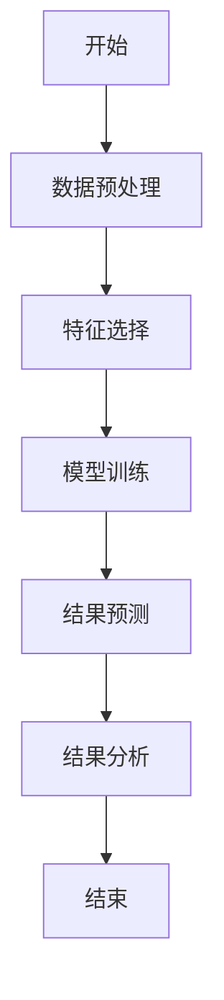

                 


# 全球股市估值与能源转型趋势的关系

> 关键词：全球股市估值、能源转型趋势、股市与能源、能源经济学、能源转型分析

> 摘要：本文探讨全球股市估值与能源转型趋势之间的关系，通过分析能源转型对企业估值的影响，结合金融市场模型和实际案例，揭示两者互动的内在逻辑。文章从背景介绍、理论模型、算法实现、系统设计和项目实战等多角度展开，为读者提供全面的分析与解读。

---

## 第一部分：背景介绍

### 第1章：全球股市估值与能源转型的背景

#### 1.1 全球股市估值的基本概念

- **股票估值的定义与意义**  
  股票估值是通过对企业的财务数据、市场环境和行业趋势进行分析，确定其股票的合理价格。它是投资者决策的重要依据，也是衡量企业价值的核心指标。

- **全球化背景下的股市特点**  
  全球股市呈现出高度互联的特点，国际资本流动频繁，市场波动相互影响。能源转型作为全球经济的重要趋势，对股市估值的影响日益显著。

- **能源转型的定义与内涵**  
  能源转型指从依赖化石能源向清洁、可再生能源的转变。这一过程涉及技术、政策和市场的多方面调整，对全球经济和企业价值产生深远影响。

#### 1.2 能源转型的驱动因素

- **环境问题与可持续发展**  
  环境污染和气候变化成为全球关注的焦点，推动各国加速能源转型。

- **技术进步与能源结构变化**  
  可再生能源技术的突破（如太阳能、风能）降低了能源成本，提高了能源效率。

- **政策支持与国际趋势**  
  各国政府通过立法和补贴等措施，鼓励清洁能源发展，进一步推动能源转型。

#### 1.3 股市估值与能源转型的关系

- **能源转型对股市的影响路径**  
  能源转型通过改变能源价格、企业成本和市场需求，影响企业的盈利能力和股票估值。

- **能源转型如何影响企业估值**  
  对于传统能源企业，能源转型可能带来估值下降；而对于新能源企业，则可能带来估值上升。

- **全球化视角下的互动关系**  
  能源转型的全球性使得股市估值的变化具有跨国联动效应。

---

## 第二部分：核心概念与联系

### 第2章：全球股市估值与能源转型的核心概念

#### 2.1 全球股市估值的理论模型

- **股票估值的基本原理**  
  股票估值基于对企业未来现金流的折现，常用的方法包括DCF模型和相对估值法。

- **资本资产定价模型（CAPM）**  
  CAPM公式：  
  $$ E(r) = r_f + \beta (E(r_m) - r_f) $$  
  其中，$\beta$ 表示股票的系统性风险，与能源转型相关的行业β值会受到能源政策的影响。

- **股票价值与市场情绪的关系**  
  市场情绪（如对能源转型的乐观或悲观预期）会影响投资者对股票价值的判断。

#### 2.2 能源转型的理论框架

- **能源经济学的基本理论**  
  能源转型涉及能源供给、需求和价格的动态变化，影响企业的成本结构和市场竞争力。

- **可再生能源与传统能源的对比**  
  可再生能源具有更低的环境成本，但初始投资较高；传统能源依赖化石燃料，环境成本高但投资成本较低。

- **能源政策对企业估值的影响**  
  政府补贴、税收优惠等政策会直接影响企业的盈利能力，进而影响股票估值。

#### 2.3 核心概念的联系与对比

- **股市估值与能源转型的对比分析**  
  | 比较维度 | 股市估值 | 能源转型 |
  |----------|----------|----------|
  | 定义     | 企业价值评估 | 清洁能源替代化石能源 |
  | 影响因素 | 财务数据、市场情绪 | 技术、政策、环境 |
  | 目标     | 投资决策支持 | 推动可持续发展 |

- **能源转型对股市估值的驱动因素**  
  - 技术进步：降低新能源成本，提升企业竞争力。
  - 政策支持：通过补贴和税收优惠增加企业利润。
  - 环境压力：减少环境风险，提升企业形象。

- **股市估值与能源转型的互动关系**  
  股市估值的变化反映了市场对能源转型的预期，而能源转型的实际进展又会反过来影响股市估值。

---

## 第三部分：算法原理讲解

### 第3章：能源转型对股市估值的算法模型

#### 3.1 算法原理概述

- **算法的基本思路**  
  通过分析能源转型对企业财务数据的影响，利用回归模型预测股票估值的变化。

- **数据来源与处理方法**  
  数据来源包括企业财务数据、能源政策、能源价格和市场指数等。数据预处理包括清洗、标准化和特征选择。

- **模型的假设条件**  
  - 假设能源转型的影响是线性的。
  - 假设市场参与者理性。

#### 3.2 算法流程图



#### 3.3 算法实现代码

```python
import pandas as pd
import numpy as np
from sklearn.linear_model import LinearRegression
from sklearn.metrics import r2_score

# 数据预处理
data = pd.read_csv('energy_transition.csv')
data = data.dropna()

# 特征选择
features = ['revenue', 'cost', 'policy_subsidy', 'market_sentiment']
target = 'stock_valuation'

X = data[features]
y = data[target]

# 模型训练
model = LinearRegression()
model.fit(X, y)

# 结果预测
predictions = model.predict(X)

# 模型评估
r2 = r2_score(y, predictions)
print(f'R² = {r2}')
```

#### 3.4 数学模型与公式

- **线性回归模型**  
  模型公式：  
  $$ y = \beta_0 + \beta_1x_1 + \beta_2x_2 + \dots + \beta_nx_n + \epsilon $$  
  其中，$y$ 是股票估值，$x_i$ 是影响能源转型的特征变量。

- **系数解释**  
  每个系数 $\beta_i$ 表示对应特征对股票估值的影响程度。

---

## 第四部分：数学模型与公式

### 第4章：数学模型与公式详解

#### 4.1 资本资产定价模型（CAPM）

- **公式推导**  
  $$ E(r) = r_f + \beta (E(r_m) - r_f) $$  
  其中，$\beta$ 是企业股票的系统性风险系数，与能源转型相关行业的β值会受到政策和市场预期的影响。

- **公式解释**  
  - $r_f$：无风险利率。
  - $E(r_m)$：市场预期回报率。
  - $\beta$：股票的β值，反映股票价格与市场波动的相关性。

- **应用实例**  
  假设某新能源企业的β值为1.5，无风险利率为2%，市场预期回报率为8%，则该股票的预期回报率为：  
  $$ E(r) = 2\% + 1.5 \times (8\% - 2\%) = 10\% $$  

#### 4.2 能源转型的回归模型

- **模型构建**  
  $$ \text{Stock Valuation} = \alpha + \beta_1 \times \text{Energy Policy} + \beta_2 \times \text{Renewable Investment} + \beta_3 \times \text{Market Sentiment} + \epsilon $$  

- **参数解释**  
  - $\beta_1$：能源政策对企业估值的影响系数。
  - $\beta_2$：可再生能源投资对企业估值的影响系数。
  - $\beta_3$：市场情绪对企业估值的影响系数。

- **实证分析**  
  通过对历史数据的回归分析，发现能源政策对企业估值的影响系数为正，表明政策支持能够显著提升企业估值。

---

## 第五部分：系统分析与架构设计方案

### 第5章：系统分析与架构设计

#### 5.1 问题场景介绍

- **问题背景**  
  能源转型对股市估值的影响日益显著，企业需要通过系统化的方法来评估转型带来的价值变化。

- **问题目标**  
  构建一个能够预测能源转型对企业估值影响的系统。

- **问题约束**  
  数据获取难度大、模型需要高精度。

#### 5.2 系统功能设计

- **需求分析**  
  系统需要实现数据采集、模型训练和结果预测功能。

- **功能模块划分**  
  - 数据采集模块：采集企业财务数据和能源政策数据。
  - 模型训练模块：基于机器学习算法训练预测模型。
  - 结果预测模块：根据输入数据预测股票估值。

- **领域模型设计**  
  ```mermaid
  graph TD
      A[Energy Policy] --> B[Stock Valuation]
      C[Renewable Investment] --> B
      D[Market Sentiment] --> B
  ```

#### 5.3 系统架构设计

- **系统架构图**  
  ```mermaid
  graph TD
      UI --> Data采集模块
      Data采集模块 --> 数据存储模块
      数据存储模块 --> 模型训练模块
      模型训练模块 --> 结果预测模块
      结果预测模块 --> UI
  ```

- **系统接口设计**  
  - 数据接口：数据采集模块与数据存储模块之间的接口。
  - 模型接口：模型训练模块与结果预测模块之间的接口。

- **系统交互设计**  
  ```mermaid
  sequenceDiagram
      participant UI
      participant 数据采集模块
      participant 数据存储模块
      participant 模型训练模块
      participant 结果预测模块
      UI -> 数据采集模块: 请求数据采集
      数据采集模块 -> 数据存储模块: 存储数据
      UI -> 模型训练模块: 请求模型训练
      模型训练模块 -> 结果预测模块: 请求预测结果
      结果预测模块 -> UI: 返回预测结果
  ```

---

## 第六部分：项目实战

### 第6章：项目实战与案例分析

#### 6.1 环境安装与配置

- **环境要求**  
  需要安装Python、Pandas、NumPy、Scikit-learn等库。

- **配置步骤**  
  ```bash
  pip install pandas numpy scikit-learn
  ```

#### 6.2 系统核心实现源代码

```python
import pandas as pd
import numpy as np
from sklearn.linear_model import LinearRegression
from sklearn.metrics import r2_score

# 数据预处理
data = pd.read_csv('energy_transition.csv')
data = data.dropna()

# 特征选择
features = ['revenue', 'cost', 'policy_subsidy', 'market_sentiment']
target = 'stock_valuation'

X = data[features]
y = data[target]

# 模型训练
model = LinearRegression()
model.fit(X, y)

# 结果预测
predictions = model.predict(X)

# 模型评估
r2 = r2_score(y, predictions)
print(f'R² = {r2}')
```

#### 6.3 代码应用解读与分析

- **代码解读**  
  该代码实现了一个线性回归模型，用于预测能源转型对企业股票估值的影响。通过输入企业的财务数据和市场数据，模型可以输出股票估值的预测值。

- **实际案例分析**  
  以某新能源企业为例，假设其数据如下：
  | revenue | cost | policy_subsidy | market_sentiment | stock_valuation |
  |---------|------|----------------|------------------|----------------|
  | 1000    | 500  | 200            | 0.8              | 1500           |

  模型预测其股票估值为：  
  $$ \text{Predicted Stock Valuation} = \beta_0 + \beta_1 \times 1000 + \beta_2 \times 500 + \beta_3 \times 200 + \beta_4 \times 0.8 $$  

#### 6.4 项目小结

- **项目总结**  
  通过构建线性回归模型，可以有效预测能源转型对企业股票估值的影响。

- **注意事项**  
  模型的预测精度依赖于数据质量和模型选择。

- **拓展阅读**  
  可以进一步研究更复杂的模型（如随机森林、神经网络）以提高预测精度。

---

## 第七部分：结论

### 第7章：总结与展望

#### 7.1 结论

- 能源转型对股市估值的影响是多方面的，涉及技术、政策和市场预期等多个因素。
- 通过构建数学模型，可以有效预测能源转型对企业估值的影响。

#### 7.2 展望

- 未来研究可以结合更多变量（如碳交易价格）构建更复杂的模型。
- 能源转型的趋势将继续推动股市估值的变化，投资者需要密切关注相关政策和技术动态。

---

**附录**  
- 附录A：相关数据来源  
- 附录B：代码实现细节  
- 附录C：参考文献

