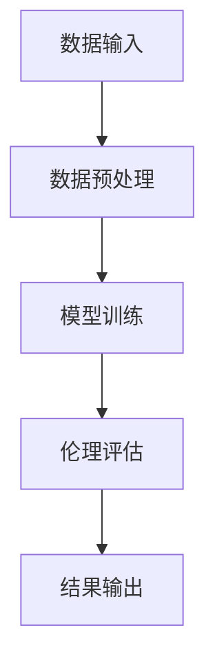

                 


# 全球股市估值与脑机接口伦理标准的制定

> 关键词：全球股市估值，脑机接口，伦理标准，数学模型，系统架构

> 摘要：本文探讨了全球股市估值与脑机接口技术之间的潜在联系，并详细分析了脑机接口技术在金融领域的伦理挑战。文章通过构建数学模型和算法，提出了制定脑机接口伦理标准的具体方法，并展示了如何将这些标准应用于全球股市估值中。最后，本文通过实际案例分析和系统架构设计，总结了最佳实践和未来发展方向。

---

## 第一章: 全球股市估值与脑机接口伦理标准的核心概念

### 1.1 背景介绍

#### 1.1.1 全球股市估值的背景与意义
全球股市估值是衡量金融市场健康状况的重要指标。通过对股票价格、市盈率、市净率等关键指标的分析，投资者和分析师可以评估市场的整体表现和未来趋势。股市估值不仅是经济研究的核心内容，也是金融决策的重要依据。

#### 1.1.2 脑机接口技术的发展与应用
脑机接口（Brain-Computer Interface, BCI）是一种通过采集和分析大脑电信号，将人类意图转化为计算机指令的技术。近年来，脑机接口技术在医疗、教育、娱乐和金融等领域得到了广泛应用，尤其是在神经康复和辅助决策方面展现了巨大潜力。

#### 1.1.3 两者的结合与研究价值
尽管全球股市估值和脑机接口技术看似无关，但两者在数据处理、决策支持和伦理规范方面存在潜在的协同效应。通过结合脑机接口技术，可以为股市估值提供更精准的决策支持，同时在技术应用中也需要制定严格的伦理标准，以确保技术的合理使用和人类权益的保护。

### 1.2 核心概念与联系

#### 1.2.1 全球股市估值的定义与关键指标
全球股市估值是指对某一特定时间段内股票市场的整体价值进行评估。常用的估值指标包括市盈率（P/E）、市净率（P/B）、股息率（Dividend Yield）等。

- **市盈率（P/E）**：市盈率 = 股票价格 / 每股净利润。  
- **市净率（P/B）**：市净率 = 股票价格 / 每股净资产。  
- **股息率（Dividend Yield）**：股息率 = 每股股息 / 股票价格。

#### 1.2.2 脑机接口的定义与技术特征
脑机接口是一种将大脑活动转化为可读信号的技术，其核心特征包括高精度、实时性和非侵入性。脑机接口系统通常由数据采集、信号处理和决策支持三个模块组成。

#### 1.2.3 两者之间的关联与协同效应
脑机接口技术可以为股市估值提供实时、精准的决策支持，尤其是在情绪分析和市场预测方面。通过分析投资者的脑电信号，可以更准确地判断市场的潜在趋势。同时，股市估值的伦理标准也为脑机接口技术的应用提供了规范和指导。

---

## 第二章: 全球股市估值的数学模型与算法原理

### 2.1 股市估值的数学模型

#### 2.1.1 市盈率模型
市盈率模型通过比较股票的市场价格与每股收益，评估股票的估值是否合理。公式如下：

$$ P/E = \frac{\text{股票价格}}{\text{每股净利润}} $$

#### 2.1.2 市净率模型
市净率模型通过比较股票的市场价格与每股净资产，评估股票的估值是否合理。公式如下：

$$ P/B = \frac{\text{股票价格}}{\text{每股净资产}} $$

#### 2.1.3 股息率模型
股息率模型通过比较股票的股息与股票价格，评估股票的分红能力。公式如下：

$$ \text{股息率} = \frac{\text{每股股息}}{\text{股票价格}} $$

#### 2.1.4 综合估值模型
综合估值模型结合了市盈率、市净率和股息率等多种指标，以更全面地评估股票的估值。公式如下：

$$ \text{综合估值} = \alpha \cdot \frac{\text{股票价格}}{\text{每股净利润}} + \beta \cdot \frac{\text{股票价格}}{\text{每股净资产}} + \gamma \cdot \frac{\text{每股股息}}{\text{股票价格}} $$

### 2.2 股市估值算法的实现

#### 2.2.1 数据采集与预处理
股票数据通常包括开盘价、收盘价、最高价、最低价、成交量等指标。数据预处理包括数据清洗、归一化和特征提取。

#### 2.2.2 模型训练与优化
通过机器学习算法（如线性回归、支持向量机、随机森林等）对股票数据进行建模，并通过交叉验证优化模型参数。

#### 2.2.3 结果分析与验证
通过回测和风险分析评估模型的预测能力，并根据实际市场表现进行调整和优化。

---

## 第三章: 脑机接口伦理标准的制定

### 3.1 脑机接口技术的伦理挑战

#### 3.1.1 人类意识的尊重与保护
脑机接口技术可能对人类意识产生重大影响，尤其是在神经调控和意识增强方面，需要确保技术不会侵犯人类的基本权利。

#### 3.1.2 技术滥用的风险
脑机接口技术可能被用于不当用途，例如操控人类行为或侵犯个人隐私，需要制定严格的技术使用规范。

#### 3.1.3 数据隐私与安全问题
脑机接口技术涉及大量个人数据的采集和处理，数据隐私和安全问题需要得到高度重视。

### 3.2 伦理标准的制定框架

#### 3.2.1 标准制定的原则与目标
伦理标准的制定应遵循尊重、自主、公正和 beneficence 原则，旨在保护人类权益、促进技术的健康发展。

#### 3.2.2 标准的适用范围与实施步骤
伦理标准应涵盖脑机接口技术的研发、应用和推广全过程，并通过政策法规、行业规范和技术指南等形式进行实施。

#### 3.2.3 标准的动态更新与调整
随着技术的发展和伦理观念的变化，伦理标准需要定期更新和调整，以确保其适应性和有效性。

---

## 第四章: 脑机接口伦理标准的数学模型与算法

### 4.1 伦理评估模型

#### 4.1.1 伦理风险评估指标
伦理风险评估指标包括技术滥用的可能性、数据隐私保护的力度、人类权益的保障程度等。

#### 4.1.2 伦理影响分析模型
伦理影响分析模型通过综合评估技术的伦理风险和收益，制定相应的伦理标准。公式如下：

$$ \text{伦理影响} = \alpha \cdot \text{技术收益} + \beta \cdot \text{伦理风险} $$

#### 4.1.3 伦理决策优化算法
伦理决策优化算法通过遗传算法、模拟退火等方法，优化伦理标准的制定过程，确保决策的合理性和最优性。

### 4.2 算法实现与验证

#### 4.2.1 数据输入与特征提取
伦理评估模型需要输入技术特性、应用场景和用户需求等特征。

#### 4.2.2 模型训练与参数调优
通过机器学习算法对伦理评估模型进行训练，并通过交叉验证优化模型参数。

#### 4.2.3 结果输出与验证
通过实际案例验证模型的预测能力和伦理标准的适用性，并根据反馈进行调整和优化。

---

## 第五章: 全球股市估值与脑机接口伦理标准的结合

### 5.1 结合的背景与意义

#### 5.1.1 股市估值的伦理视角
股市估值不仅是技术问题，也是伦理问题。合理的估值有助于维护市场的公平性和投资者的权益。

#### 5.1.2 脑机接口技术在金融领域的应用
脑机接口技术可以通过分析投资者的心理活动，提供更精准的市场预测和投资决策支持。

#### 5.1.3 两者的协同创新价值
通过结合全球股市估值和脑机接口技术，可以实现更高效、更精准的金融决策支持，同时确保技术应用的伦理合规性。

### 5.2 结合的具体实现

#### 5.2.1 股市估值中的伦理因素
在股市估值中，伦理因素包括市场操纵、内幕交易、虚假信息披露等，需要通过伦理标准进行规范。

#### 5.2.2 脑机接口技术在伦理评估中的应用
通过脑机接口技术，可以实时监测投资者的心理活动，评估市场的潜在风险和伦理问题。

#### 5.2.3 综合模型的设计与实现
通过结合全球股市估值模型和脑机接口技术，设计一个综合模型，以实现更精准的市场预测和伦理合规的金融决策。

---

## 第六章: 系统架构与项目实战

### 6.1 系统架构设计

#### 6.1.1 系统功能模块划分
系统功能模块包括数据采集、模型训练、伦理评估、结果输出等模块。

#### 6.1.2 数据流与模块交互
数据从输入模块进入系统，经过特征提取、模型训练和伦理评估后，输出结果。

#### 6.1.3 系统架构图（Mermaid）


### 6.2 项目实战

#### 6.2.1 环境搭建与数据准备
需要安装Python、NumPy、Scikit-learn等工具，并准备股票数据和脑电信号数据。

#### 6.2.2 核心算法实现（Python代码）
```python
import numpy as np
from sklearn.linear_model import LinearRegression

# 数据准备
X = np.array([[1, 2], [3, 4], [5, 6]])
y = np.array([7, 8, 9])

# 模型训练
model = LinearRegression()
model.fit(X, y)

# 预测结果
print(model.predict([[7, 8]]))
```

#### 6.2.3 案例分析与结果解读
通过实际案例分析，验证模型的预测能力和伦理标准的适用性，并根据反馈进行调整和优化。

---

## 第七章: 最佳实践与小结

### 7.1 最佳实践
- 在技术实现中，注重数据安全和隐私保护，确保技术应用的合规性。
- 在模型训练中，使用高质量的数据和合理的算法，提高模型的准确性和可靠性。
- 在伦理标准制定中，注重多方利益的平衡，确保技术的健康发展。

### 7.2 小结
本文通过分析全球股市估值和脑机接口伦理标准的制定，展示了两者的潜在联系和协同效应。通过构建数学模型和算法，提出了制定脑机接口伦理标准的具体方法，并通过实际案例分析和系统架构设计，总结了最佳实践和未来发展方向。

---

### 注意事项
- 在技术实现中，确保代码的正确性和可读性。
- 在伦理标准制定中，注重多方利益的平衡。
- 在实际应用中，结合具体场景和需求，灵活调整模型和算法。

### 拓展阅读
- 推荐阅读《机器学习实战》和《伦理与技术》等相关书籍，以深入了解相关领域的知识和最新进展。

