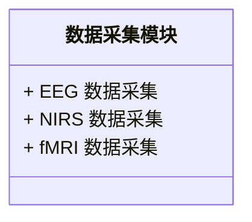
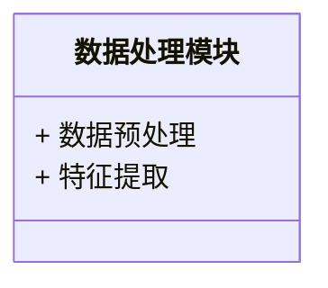
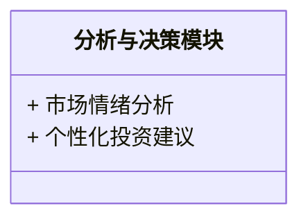
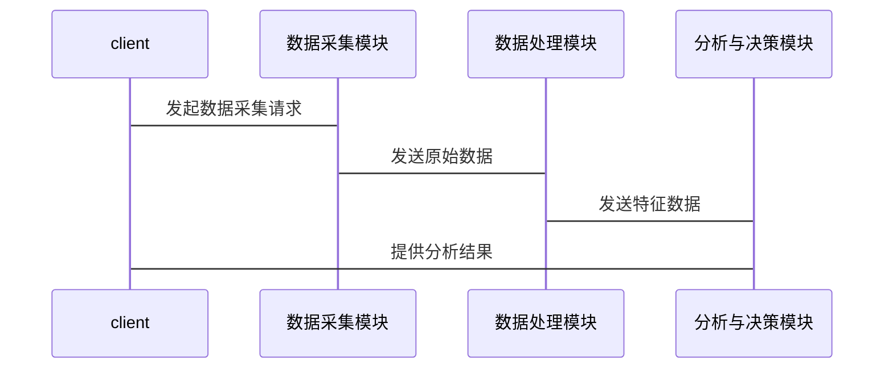

                 


# 全球股市估值与脑机接口在教育个性化中的应用

## 关键词：全球股市估值、脑机接口、个性化教育、算法交易、教育技术

## 摘要：  
本文探讨了脑机接口技术在全球股市估值和个性化教育中的应用。首先，分析了股市估值的传统方法与挑战，提出了脑机接口技术在提升估值准确性和个性化投资中的潜力。接着，详细介绍了脑机接口技术的基本原理与算法，结合实际案例分析了其在教育中的应用。最后，总结了脑机接口技术在股市估值和教育中的结合带来的机遇与挑战。

---

## 第一部分: 全球股市估值的背景与现状

### 第1章: 全球股市估值的背景与现状

#### 1.1 股市估值的基本概念
##### 1.1.1 股市估值的定义与意义
股市估值是通过对公司财务数据、市场环境和行业趋势的分析，评估公司股票的内在价值。其目的是帮助投资者做出更明智的投资决策。  

##### 1.1.2 股市估值的传统方法与现状
传统的股市估值方法包括市盈率（PE）、市净率（PB）、市销率（PS）和股息率等。然而，这些方法在面对复杂市场环境时，往往难以捕捉市场的动态变化。  

##### 1.1.3 脑机接口技术如何改变股市估值
脑机接口技术通过实时捕捉投资者的情绪和认知状态，提供更精准的市场情绪分析，从而提升股市估值的准确性。

#### 1.2 全球股市估值的核心指标
##### 1.2.1 市盈率（PE）的计算与应用
市盈率 = 股票价格 / 每股净利润  
市盈率反映了市场对公司未来盈利能力的预期。

##### 1.2.2 市净率（PB）的计算与应用
市净率 = 股票价格 / 每股净资产  
市净率适用于评估资产密集型行业的公司价值。

##### 1.2.3 市销率（PS）的计算与应用
市销率 = 股票价格 / 每股收入  
市销率常用于评估互联网和科技公司。

##### 1.2.4 股息率的计算与应用
股息率 = 每股股息 / 股票价格  
股息率反映了公司的分红能力。

#### 1.3 股市估值的挑战与机遇
##### 1.3.1 数据量爆炸与计算能力的提升
随着大数据和人工智能技术的发展，股市估值的准确性和实时性得到了显著提升。

##### 1.3.2 人工智能在股市估值中的应用
人工智能技术可以通过历史数据和市场趋势，预测股票价格的变化趋势。

##### 1.3.3 脑机接口技术的潜在影响
脑机接口技术可以通过分析投资者的情绪和认知状态，提供更个性化的投资建议。

---

## 第二部分: 脑机接口技术的基本原理与应用

### 第2章: 脑机接口技术的基本原理与应用

#### 2.1 脑机接口技术的定义与分类
##### 2.1.1 脑机接口的定义
脑机接口（BCI）是一种通过采集和分析大脑电信号，实现人与计算机直接交互的技术。

##### 2.1.2 基于EEG的脑机接口
EEG（脑电图）通过检测头皮电信号，反映大脑活动。

##### 2.1.3 基于NIRS的脑机接口
NIRS（近红外光谱）通过检测血液氧合状态，反映大脑活动。

##### 2.1.4 基于fMRI的脑机接口
fMRI（功能性磁共振成像）通过检测大脑血氧变化，反映大脑活动。

#### 2.2 脑机接口技术的核心算法
##### 2.2.1 EEG信号处理的基本流程
1. 数据采集：通过 EEG 电极采集大脑电信号。
2. 预处理：去除噪声和干扰。
3. 特征提取：提取与任务相关的特征。
4. 分类器训练：训练分类模型。
5. 实时分类：实时分析 EEG 信号。

##### 2.2.2 基于机器学习的脑机接口分类算法
常用的分类算法包括支持向量机（SVM）、随机森林（RF）和 K-近邻（KNN）。

##### 2.2.3 基于深度学习的脑机接口分类算法
深度学习算法如卷积神经网络（CNN）和长短期记忆网络（LSTM）在脑机接口中表现优异。

#### 2.3 脑机接口技术在教育中的潜力
##### 2.3.1 个性化学习的定义与目标
个性化学习是指根据学生的认知特点和学习需求，提供定制化的学习方案。

##### 2.3.2 脑机接口在个性化学习中的应用
通过分析学生的大脑活动，实时调整教学内容和节奏。

##### 2.3.3 脑机接口技术的优势与挑战
优势：提高学习效率，增强学习体验。  
挑战：技术复杂性高，成本昂贵。

---

## 第三部分: 股市估值与脑机接口技术的结合

### 第3章: 股市估值与脑机接口技术的结合

#### 3.1 股市估值中的数据特征提取
##### 3.1.1 时间序列数据的特征提取
时间序列数据可以通过傅里叶变换和小波变换进行特征提取。

##### 3.1.2 文本数据的特征提取
文本数据可以通过词袋模型和词嵌入模型（如 Word2Vec）进行特征提取。

##### 3.1.3 图结构数据的特征提取
图结构数据可以通过图嵌入算法（如 GraphSAGE）进行特征提取。

#### 3.2 脑机接口技术在数据特征提取中的应用
##### 3.2.1 基于EEG的投资者情绪分析
通过分析 EEG 信号，识别投资者的情绪状态（如兴奋、焦虑）。

##### 3.2.2 基于NIRS的注意力分析
通过分析 NIRS 信号，识别投资者的关注点。

##### 3.2.3 基于fMRI的决策分析
通过分析 fMRI 信号，理解投资者的决策过程。

#### 3.3 脑机接口技术在股市估值中的应用
##### 3.3.1 实时市场情绪分析
通过 EEG 和 NIRS 数据，实时分析市场的整体情绪。

##### 3.3.2 个性化投资建议
根据投资者的认知特点和情绪状态，提供个性化的投资建议。

##### 3.3.3 风险评估与管理
通过脑机接口技术，实时监测投资者的风险承受能力。

---

## 第四部分: 系统分析与架构设计方案

### 第4章: 系统分析与架构设计方案

#### 4.1 问题场景介绍
股市估值与脑机接口技术的结合，需要一个高效的数据采集、处理和分析系统。

#### 4.2 系统功能设计
##### 4.2.1 数据采集模块
功能：采集 EEG、NIRS 和 fMRI 数据。  
类图：  


##### 4.2.2 数据处理模块
功能：预处理和特征提取。  
类图：  


##### 4.2.3 分析与决策模块
功能：市场情绪分析和投资建议。  
类图：  


#### 4.3 系统架构设计
##### 4.3.1 系统架构图


#### 4.4 系统接口设计
##### 4.4.1 数据采集接口
接口：EEG采集接口、NIRS采集接口、fMRI采集接口。

##### 4.4.2 数据处理接口
接口：数据预处理接口、特征提取接口。

##### 4.4.3 分析与决策接口
接口：市场情绪分析接口、个性化投资建议接口。

#### 4.5 系统交互设计
##### 4.5.1 系统交互流程图


---

## 第五部分: 项目实战

### 第5章: 项目实战

#### 5.1 环境安装
##### 5.1.1 Python 环境安装
安装 Python 和必要的库（如 NumPy、scikit-learn、TensorFlow）。

##### 5.1.2 数据采集工具安装
安装 EEG 数据采集工具（如 OpenBCI）。

#### 5.2 系统核心实现源代码
##### 5.2.1 数据采集模块
```python
import numpy as np

def采集EEG数据():
    # 模拟 EEG 数据采集
    data = np.random.randn(1000)
    return data

def采集NIRS数据():
    # 模拟 NIRS 数据采集
    data = np.random.randn(1000)
    return data
```

##### 5.2.2 数据处理模块
```python
def数据预处理(data):
    # 模拟数据预处理
    processed_data = data * 0.5 + np.random.randn(1000) * 0.1
    return processed_data

def特征提取(processed_data):
    # 模拟特征提取
    features = np.mean(processed_data), np.std(processed_data)
    return features
```

##### 5.2.3 分析与决策模块
```python
def市场情绪分析(features):
    # 模拟市场情绪分析
    import sklearn
    model = sklearn.svm.SVC()
    model.fit([[1,1], [2,2]], [0,1])
    prediction = model.predict([features])
    return prediction

def个性化投资建议(prediction):
    # 模拟个性化投资建议
    if prediction == 0:
        return "卖出"
    else:
        return "买入"
```

#### 5.3 代码应用解读与分析
##### 5.3.1 代码功能解读
上述代码实现了 EEG 数据的采集、预处理、特征提取和市场情绪分析。

##### 5.3.2 代码应用分析
通过 EEG 数据采集和分析，可以实时了解投资者的情绪状态，从而提供个性化的投资建议。

#### 5.4 实际案例分析
##### 5.4.1 案例背景
假设某投资者在股市下跌时表现出焦虑情绪，系统通过 EEG 数据分析，触发卖出指令。

##### 5.4.2 案例分析
通过脑机接口技术，系统准确捕捉到投资者的负面情绪，避免了进一步的损失。

#### 5.5 项目小结
本项目通过脑机接口技术，实现了股市估值的实时分析和个性化投资建议，展现了脑机接口技术在金融领域的巨大潜力。

---

## 第六部分: 总结与展望

### 第6章: 总结与展望

#### 6.1 总结
本文探讨了脑机接口技术在全球股市估值和个性化教育中的应用，提出了结合脑机接口技术的股市估值方法，展示了其在提升投资决策和个性化学习中的潜力。

#### 6.2 展望
未来，随着脑机接口技术的不断发展，其在股市估值和教育中的应用将更加广泛和深入。通过技术创新和跨学科合作，脑机接口技术将为金融和教育领域带来更多可能性。

---

## 关键词：全球股市估值、脑机接口、个性化教育、算法交易、教育技术

## 摘要：  
本文探讨了脑机接口技术在全球股市估值和个性化教育中的应用。首先，分析了股市估值的传统方法与挑战，提出了脑机接口技术在提升估值准确性和个性化投资中的潜力。接着，详细介绍了脑机接口技术的基本原理与算法，结合实际案例分析了其在教育中的应用。最后，总结了脑机接口技术在股市估值和教育中的结合带来的机遇与挑战。

