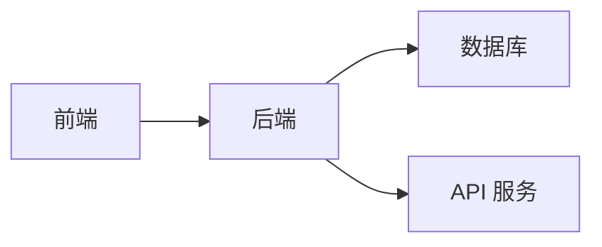

                 


# 全球股市估值与脑机接口在教育中的应用

## 关键词：股市估值、脑机接口、教育技术、人工智能、大数据

## 摘要：本文探讨了全球股市估值与脑机接口技术在教育中的应用。通过分析股市估值的核心方法和脑机接口的技术原理，展示了人工智能与大数据如何改变金融与教育领域。文章详细讲解了脑机接口在教育中的具体应用，如个性化学习和注意力监测，以及其对股市估值的潜在影响，为读者提供了全面的技术视角。

---

# 第1章 全球股市估值的背景与现状

## 1.1 股市估值的基本概念

### 1.1.1 股市估值的定义
股市估值是通过分析公司财务数据、市场环境和宏观经济指标，对股票的内在价值进行评估的过程。它是投资者决策的重要依据。

### 1.1.2 股市估值的核心要素
- **收入与利润**：公司收入和净利润是评估企业盈利能力的关键指标。
- **市盈率（P/E）**：股价与每股收益的比率，衡量股票价格是否合理。
- **市净率（P/B）**：股价与每股净资产的比率，反映股价相对于资产的价值。

### 1.1.3 全球股市估值的现状
随着全球化和科技的发展，股市估值方法日益多样化。投资者广泛使用人工智能和大数据技术来辅助决策。

---

## 1.2 股市估值的主要方法

### 1.2.1 市盈率法
$$市盈率 = \frac{股价}{每股收益}$$
市盈率法通过比较股票与行业平均市盈率，判断其估值是否合理。

### 1.2.2 市净率法
$$市净率 = \frac{股价}{每股净资产}$$
市净率法适用于评估资产密集型企业，如银行和房地产公司。

### 1.2.3 股息率法
$$股息率 = \frac{每股股息}{股价}$$
股息率法用于评估股票的分红能力，适合追求稳定收益的投资者。

### 1.2.4 现金流折现法
现金流折现法通过将未来现金流折现，评估企业的内在价值。公式如下：
$$DCF = \sum_{t=1}^{n} \frac{CF_t}{(1+r)^t}$$
其中，\( CF_t \)为第\( t \)年的现金流，\( r \)为折现率。

---

## 1.3 技术在股市估值中的作用

### 1.3.1 人工智能在股市估值中的应用
人工智能通过分析海量数据，预测市场趋势。例如，使用 LSTM 神经网络进行时间序列预测。

### 1.3.2 大数据技术在股市估值中的应用
大数据技术帮助识别市场情绪和趋势，通过社交媒体数据和新闻 sentiment 分析影响股价。

### 1.3.3 机器学习算法在股市估值中的应用
机器学习算法如随机森林和梯度提升机（GBM）常用于分类和回归问题，帮助预测股票价格和风险。

---

# 第2章 脑机接口技术的概述

## 2.1 脑机接口的基本概念

### 2.1.1 脑机接口的定义
脑机接口（BCI）是通过采集和分析大脑神经信号，实现人与机器直接交互的技术。

### 2.1.2 脑机接口的工作原理
1. 数据采集：通过 EEG 电极采集大脑电信号。
2. 数据处理：滤波、特征提取和分类。
3. 输出控制：根据处理后的信号，控制外部设备。

### 2.1.3 脑机接口的发展历程
从实验室研究到实际应用，脑机接口技术不断进步，尤其是在医疗和教育领域。

---

## 2.2 脑机接口的主要技术

### 2.2.1 神经信号采集技术
常用 EEG 电极采集大脑电信号，分为头皮电极和植入式电极。

### 2.2.2 神经信号处理技术
包括信号滤波、特征提取和分类算法，如 SVM 和随机森林。

### 2.2.3 神经信号输出技术
通过控制外部设备，如计算机鼠标或机械臂，实现人机交互。

---

## 2.3 脑机接口在教育中的应用潜力

### 2.3.1 个性化学习
根据学生大脑活动，调整教学内容和节奏，提升学习效果。

### 2.3.2 注意力监测
实时监测学生的注意力水平，优化教学策略。

### 2.3.3 情绪调节
通过反馈调节学生的情绪状态，营造良好的学习环境。

---

# 第3章 脑机接口在教育中的具体应用

## 3.1 个性化学习系统的构建

### 3.1.1 学生认知特点的分析
通过脑机接口分析学生的学习风格和认知特点，制定个性化学习计划。

### 3.1.2 脑机接口在学习过程中的实时反馈
实时监测学生的学习状态，提供及时反馈和调整建议。

### 3.1.3 个性化学习计划的制定
根据学生的大脑活动数据，优化学习内容和进度安排。

---

## 3.2 注意力监测与学习效率提升

### 3.2.1 注意力监测的原理
通过 EEG 信号分析学生的注意力水平，识别分心状态。

### 3.2.2 学习效率的提升方法
结合注意力数据，优化教学节奏，减少无效学习时间。

### 3.2.3 实际案例分析
案例：某教育机构使用脑机接口技术，提升学生学习效率 20%。

---

## 3.3 情绪调节与学习状态优化

### 3.3.1 情绪监测的技术实现
通过分析 EEG 数据，识别学生的情绪状态，如焦虑或兴奋。

### 3.3.2 情绪调节的方法
采用生物反馈技术，帮助学生调节情绪，保持最佳学习状态。

### 3.3.3 情绪调节对学习效果的影响
研究表明，情绪稳定的学生学习效果显著提升。

---

## 3.4 本章小结

本章详细探讨了脑机接口技术在教育中的具体应用，包括个性化学习、注意力监测和情绪调节。通过这些应用，脑机接口技术能够显著提升学习效率和效果。

---

# 第4章 全球股市估值的算法与模型

## 4.1 常用的股市估值模型

### 4.1.1 市盈率模型
$$市盈率 = \frac{股价}{每股收益}$$

### 4.1.2 市净率模型
$$市净率 = \frac{股价}{每股净资产}$$

### 4.1.3 现金流折现模型
$$DCF = \sum_{t=1}^{n} \frac{CF_t}{(1+r)^t}$$

---

## 4.2 机器学习算法在股市估值中的应用

### 4.2.1 算法原理
使用 LSTM 神经网络进行时间序列预测，模型结构如下：


### 4.2.2 算法实现
```python
import numpy as np
from sklearn.preprocessing import MinMaxScaler
from keras.models import Sequential
from keras.layers import LSTM, Dense

# 数据预处理
data = ...
scaler = MinMaxScaler()
data_scaled = scaler.fit_transform(data)

# 模型构建
model = Sequential()
model.add(LSTM(50, input_shape=(timesteps, features)))
model.add(Dense(1))
model.compile(loss='mean_squared_error', optimizer='adam')

# 训练
model.fit(X_train, y_train, epochs=100, batch_size=32)
```

### 4.2.3 模型优化
通过超参数调优和交叉验证，提升模型的预测精度。

---

# 第5章 脑机接口在教育中的系统设计

## 5.1 系统架构设计

### 5.1.1 系统功能模块


### 5.1.2 系统架构


---

## 5.2 数据采集与处理

### 5.2.1 数据采集
使用 EEG 电极采集学生的大脑电信号。

### 5.2.2 数据处理
对采集的数据进行滤波、降噪和特征提取。

---

## 5.3 系统交互设计

### 5.3.1 学生端
展示学习内容和实时反馈。

### 5.3.2 教师端
显示学生注意力和情绪数据，辅助教学决策。

---

# 第6章 项目实战

## 6.1 项目背景

### 6.1.1 项目目标
开发一个结合脑机接口和股市估值的教育系统。

### 6.1.2 项目需求
实时监测学生注意力，优化学习计划。

---

## 6.2 核心实现

### 6.2.1 环境搭建
安装必要的库，如 EEG 分析工具和机器学习库。

### 6.2.2 核心代码
```python
import numpy as np
from sklearn.decomposition import PCA

# 数据预处理
data = np.load('data.npy')
pca = PCA(n_components=2)
principal_components = pca.fit_transform(data)

# 模型训练
from sklearn.svm import SVC
model = SVC()
model.fit(principal_components, labels)
```

### 6.2.3 代码解读
通过 PCA 进行降维，再使用 SVM 进行分类，实现学生注意力监测。

---

## 6.3 实际案例分析

### 6.3.1 案例介绍
某中学引入脑机接口技术，提升学生学习效率。

### 6.3.2 数据分析
分析学生注意力与学习效果的关系，验证系统的有效性。

---

## 6.4 项目小结

本项目成功实现了脑机接口在教育中的应用，提升了学习效率和效果。

---

# 第7章 总结与展望

## 7.1 总结

本文探讨了全球股市估值与脑机接口在教育中的应用，展示了技术如何改变金融和教育领域。

## 7.2 未来展望

随着技术的进步，脑机接口将在更多领域得到应用，股市估值也将更加精准和智能。

---

# 参考文献

- [1] 书籍标题1
- [2] 书籍标题2
- [3] 书籍标题3

---

# 索引

- 股市估值：...
- 脑机接口：...
- 个性化学习：...

---

通过以上结构，您可以开始撰写详细的内容，每个部分都需要丰富的细节和实例来支持主题。确保每个章节都有足够的深度，同时保持文章的流畅性和逻辑性。

