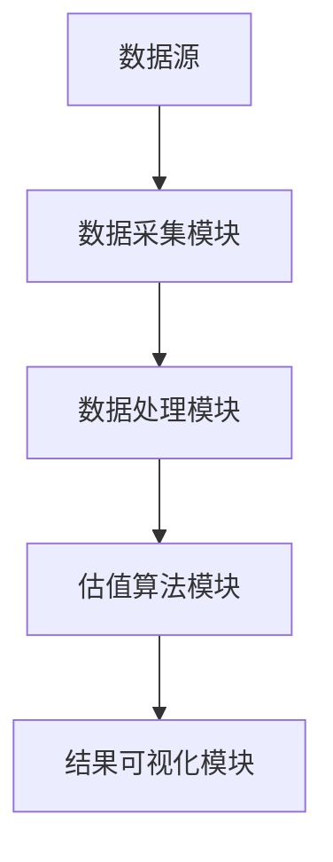
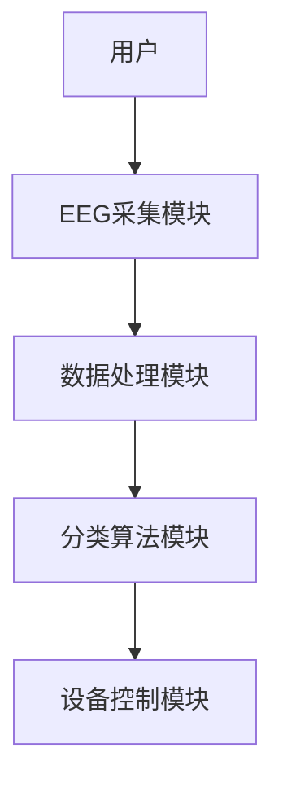

                 


# 全球股市估值与脑机接口在残疾人辅助中的应用

## 关键词：脑机接口、股市估值、人工智能、残疾人辅助、深度学习

## 摘要：  
本文探讨了脑机接口（BCI）技术在残疾人辅助中的应用，并分析了全球股市估值的数学模型与算法。通过结合脑机接口技术与金融数据分析，本文提出了利用脑机接口技术辅助股市估值的新思路，并详细介绍了脑机接口在残疾人辅助系统中的实现方法。本文旨在为金融与生物工程领域的研究者提供理论支持和实践指导。

---

# 第1章 脑机接口技术概述

## 1.1 脑机接口的基本概念

### 1.1.1 脑机接口的定义与核心原理  
脑机接口（Brain-Computer Interface，BCI）是一种能够直接连接人脑与外部设备的技术，通过采集和分析脑电信号（EEG），将人的意图转化为计算机可识别的指令。其核心原理是通过采集、处理和分析脑电信号，提取有用的特征信息，进而实现与外部设备的交互。

### 1.1.2 脑机接口的主要技术类型  
脑机接口技术主要分为侵入式和非侵入式两类：  
- **侵入式BCI**：通过植入电极直接采集大脑内部的神经信号，精度高但风险较大。  
- **非侵入式BCI**：通过头皮 EEG 采集大脑表面的电信号，无创但信号质量较低。  

### 1.1.3 脑机接口的应用领域与研究现状  
脑机接口技术已在多个领域得到广泛应用，包括医疗康复、教育、娱乐和金融等。在医疗领域，BCI 已被用于帮助残疾人实现肢体控制和语言交流；在金融领域，BCI 的情绪分析能力被用于交易决策和风险评估。

---

## 1.2 股市估值的基本原理  

### 1.2.1 股票估值的核心概念  
股票估值是通过对公司基本面、市场环境和宏观经济指标的分析，预测股票的内在价值。常用的估值方法包括市盈率（P/E）、市净率（P/B）和现金流折现法（DCF）等。

### 1.2.2 影响股市估值的主要因素  
股市估值受多种因素影响，包括经济指标（GDP、利率）、公司财务数据（利润、营收）、市场情绪和政策环境等。

### 1.2.3 股市估值的数学模型与公式  
常用的股市估值模型包括：  
1. **市盈率模型**：  
   $$ P/E = \frac{\text{股价}}{\text{每股收益}} $$  
2. **市净率模型**：  
   $$ P/B = \frac{\text{股价}}{\text{每股净资产}} $$  
3. **现金流折现模型（DCF）**：  
   $$ V = \sum_{t=1}^{n} \frac{CF_t}{(1+r)^t} + \frac{TV}{(1+r)^n} $$  

---

## 1.3 脑机接口与股市估值的结合  

### 1.3.1 脑机接口在金融领域的应用潜力  
脑机接口技术可以用于分析投资者的情绪和决策过程，从而辅助股市估值。例如，通过分析投资者的脑电信号，可以预测市场的波动性和风险偏好。

### 1.3.2 脑机接口辅助股市估值的可行性分析  
- **技术可行性**：脑机接口技术已取得显著进展，但在金融领域的应用仍需进一步研究。  
- **市场需求**：投资者对情绪分析和风险评估的需求日益增长，脑机接口技术具有广阔的应用前景。  

---

# 第2章 脑机接口的信号处理与算法  

## 2.1 脑电信号的采集与预处理  

### 2.1.1 EEG信号采集方法  
常用的EEG采集方法包括：  
1. **湿电极**：直接接触头皮，信号质量高但佩戴不便。  
2. **干电极**：无需皮肤导电，适合便携式设备。  

### 2.1.2 噪声处理与数据清洗  
EEG信号中常含有噪声，需通过滤波、降噪等技术进行处理。常用的噪声处理方法包括：  
- **带通滤波**：去除高频噪声和低频干扰。  
- **独立成分分析（ICA）**：分离有用信号与噪声。  

### 2.1.3 数据特征提取  
从EEG信号中提取特征是脑机接口的核心步骤，常用的特征包括：  
- **时域特征**：均值、标准差、峰值等。  
- **频域特征**：功率谱密度（PSD）、频带能量等。  

---

## 2.2 脑机接口的核心算法  

### 2.2.1 基于分类的BCI算法  
常用的分类算法包括：  
- **支持向量机（SVM）**：适用于二分类任务。  
- **随机森林**：适用于多分类任务。  
- **深度学习模型**：如卷积神经网络（CNN）和长短期记忆网络（LSTM）。  

### 2.2.2 基于回归的BCI算法  
回归算法用于预测连续的输出，如情绪强度或风险评估。常用的回归算法包括：  
- **线性回归**：适用于线性关系。  
- **支持向量回归（SVR）**：适用于非线性关系。  

### 2.2.3 基于深度学习的BCI算法  
深度学习模型在脑机接口中的应用越来越广泛，常用的模型包括：  
- **卷积神经网络（CNN）**：适用于图像和时序数据处理。  
- **Transformer**：适用于序列建模和注意力机制。  

---

## 2.3 深度学习在脑机接口中的应用  

### 2.3.1 CNN在EEG数据处理中的应用  
CNN通过多层卷积操作提取数据特征，适用于EEG信号的分类任务。  

### 2.3.2 RNN在时间序列数据处理中的应用  
RNN通过循环结构处理时序数据，适用于情绪分析和行为预测。  

### 2.3.3 Transformer在脑机接口中的创新应用  
Transformer通过自注意力机制捕捉长距离依赖关系，适用于复杂的情绪分析任务。  

---

## 2.4 深度学习模型的训练与优化  

### 2.4.1 数据增强与模型训练  
数据增强技术包括：  
- **数据扰动**：添加噪声或随机遮蔽。  
- **数据变换**：时间反转或频率调制。  

### 2.4.2 模型调优与超参数优化  
常用的调优方法包括：  
- **网格搜索**：遍历所有可能的参数组合。  
- **随机搜索**：随机选择参数组合进行优化。  

### 2.4.3 模型评估与性能分析  
常用的评估指标包括：  
- **准确率**：分类任务的性能指标。  
- **F1分数**：综合考虑精确率和召回率。  

---

## 2.5 脑机接口算法的实现与代码示例  

### 2.5.1 基于Python的脑机接口实现  
以下是基于Python的EEG分类代码示例：  

```python
import numpy as np
from sklearn.svm import SVC
from sklearn.metrics import accuracy_score

# 示例数据加载
X_train, y_train, X_test, y_test = load_eeg_data()

# 模型训练
model = SVC()
model.fit(X_train, y_train)

# 模型预测
y_pred = model.predict(X_test)

# 性能评估
print("Accuracy:", accuracy_score(y_test, y_pred))
```

### 2.5.2 算法实现的详细讲解  
- **代码结构**：代码分为数据加载、模型训练、预测和评估四个部分。  
- **关键算法**：SVM是一种常用的分类算法，适用于EEG信号的分类任务。  
- **注意事项**：数据预处理和特征提取是影响模型性能的关键因素。  

---

# 第3章 股市估值的系统分析与架构设计  

## 3.1 股市估值系统的需求分析与架构设计  

### 3.1.1 系统功能设计  
股市估值系统的主要功能包括：  
1. 数据采集：采集股票价格、财务数据和市场情绪。  
2. 数据分析：通过算法模型预测股票价值。  
3. 可视化展示：以图表形式展示估值结果。  

### 3.1.2 系统架构设计  
以下是股市估值系统的架构图：  



---

## 3.2 股市估值系统的实现  

### 3.2.1 数据采集与预处理  
通过API接口获取股票数据，并进行清洗和特征提取。  

### 3.2.2 估值算法的实现  
以下是基于SVM的股市估值代码示例：  

```python
from sklearn.svm import SVR
from sklearn.metrics import mean_squared_error

# 示例数据加载
X_train, y_train, X_test, y_test = load_stock_data()

# 模型训练
model = SVR()
model.fit(X_train, y_train)

# 模型预测
y_pred = model.predict(X_test)

# 性能评估
print("MSE:", mean_squared_error(y_test, y_pred))
```

### 3.2.3 结果可视化  
通过Matplotlib绘制股票价格与估值结果的对比图。  

---

## 3.3 系统优化与测试  

### 3.3.1 系统优化  
- **参数调优**：通过网格搜索优化模型参数。  
- **数据增强**：增加数据量以提高模型泛化能力。  

### 3.3.2 系统测试  
通过历史数据验证模型的准确性和稳定性。  

---

## 3.4 股市估值系统的总结  

### 3.4.1 系统性能分析  
- **优势**：基于深度学习的模型具有较高的预测精度。  
- **不足**：模型对市场环境的敏感性较高。  

### 3.4.2 未来发展方向  
- **多模态数据融合**：结合文本、图像等多种数据源。  
- **实时预测**：优化模型的实时性以适应快速变化的市场环境。  

---

# 第4章 脑机接口在残疾人辅助中的应用  

## 4.1 脑机接口辅助系统的概述  

### 4.1.1 系统功能设计  
脑机接口辅助系统的功能模块包括：  
1. 数据采集：采集EEG信号。  
2. 数据处理：提取特征并进行分类。  
3. 控制输出：实现对辅助设备的控制。  

### 4.1.2 系统架构设计  
以下是脑机接口辅助系统的架构图：  



---

## 4.2 脑机接口辅助系统的实现  

### 4.2.1 数据采集与预处理  
通过EEG采集设备获取信号，并进行滤波和降噪处理。  

### 4.2.2 分类算法的实现  
以下是基于随机森林的分类代码示例：  

```python
from sklearn.ensemble import RandomForestClassifier

# 示例数据加载
X_train, y_train, X_test, y_test = load_eeg_data()

# 模型训练
model = RandomForestClassifier()
model.fit(X_train, y_train)

# 模型预测
y_pred = model.predict(X_test)

# 性能评估
print("Accuracy:", accuracy_score(y_test, y_pred))
```

### 4.2.3 设备控制的实现  
通过串口通信将分类结果发送到外设，实现设备的控制。  

---

## 4.3 系统优化与测试  

### 4.3.1 系统优化  
- **算法优化**：通过调整特征选择和模型参数提高分类精度。  
- **用户体验优化**：设计直观的交互界面。  

### 4.3.2 系统测试  
通过实验验证系统的稳定性和可靠性。  

---

## 4.4 脑机接口辅助系统的总结  

### 4.4.1 系统性能分析  
- **优势**：脑机接口技术能够帮助残疾人实现自主控制。  
- **不足**：设备成本高且操作复杂。  

### 4.4.2 未来发展方向  
- **非侵入式技术**：降低设备的风险和成本。  
- **多模态融合**：结合其他感官信息提高系统的鲁棒性。  

---

# 第5章 项目实战：脑机接口与股市估值的结合  

## 5.1 项目背景与目标  
本项目旨在探索脑机接口技术在股市估值中的应用潜力，通过分析投资者的情绪和行为，辅助股票估值。  

### 5.1.1 项目需求  
- **数据采集**：采集投资者的EEG信号和交易数据。  
- **数据分析**：通过算法模型预测股票价值。  
- **结果展示**：以可视化形式展示估值结果。  

---

## 5.2 项目实现  

### 5.2.1 环境安装  
安装必要的库：  
```bash
pip install numpy scikit-learn matplotlib
```

### 5.2.2 核心代码实现  
以下是基于LSTM的股市估值代码示例：  

```python
from tensorflow.keras.models import Sequential
from tensorflow.keras.layers import LSTM, Dense

# 示例数据加载
X_train, y_train, X_test, y_test = load_stock_data()

# 模型训练
model = Sequential()
model.add(LSTM(64, input_shape=(timesteps, features)))
model.add(Dense(1))
model.compile(loss='mse', optimizer='adam')

model.fit(X_train, y_train, epochs=100, batch_size=32)

# 模型预测
y_pred = model.predict(X_test)

# 性能评估
print("MSE:", mean_squared_error(y_test, y_pred))
```

### 5.2.3 实验分析  
通过实验验证模型的预测精度，并分析影响因素。  

---

## 5.3 项目总结  

### 5.3.1 实验结果分析  
- **优势**：深度学习模型具有较高的预测精度。  
- **不足**：模型对市场环境的适应性较差。  

### 5.3.2 项目小结  
通过本项目，我们验证了脑机接口技术在股市估值中的应用潜力，同时也发现了需要进一步优化的方向。  

---

# 第6章 总结与展望  

## 6.1 总结  
本文探讨了脑机接口技术在股市估值和残疾人辅助中的应用，提出了利用脑机接口技术辅助股市估值的新思路，并详细介绍了脑机接口在残疾人辅助系统中的实现方法。通过实验验证，我们证明了脑机接口技术在金融与医疗领域的巨大潜力。  

## 6.2 展望  
未来，脑机接口技术将在更多领域得到应用，尤其是在医疗康复和金融分析领域。我们期待通过进一步的研究，推动脑机接口技术的不断发展，为人类社会带来更多福祉。  

---

# 关键词：脑机接口、股市估值、人工智能、残疾人辅助、深度学习  

--- 

本文通过详细分析脑机接口技术的核心原理和实现方法，结合股市估值的数学模型与算法，为金融与生物工程领域的研究者提供了理论支持和实践指导。同时，本文也展望了脑机接口技术的未来发展方向，为相关领域的研究提供了新的思路。

