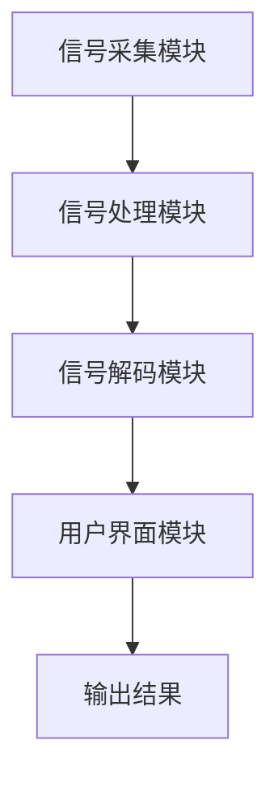
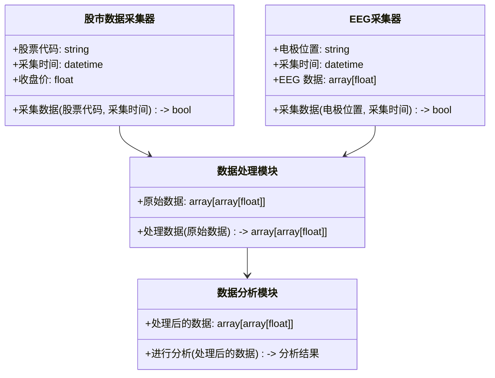

                 


# 全球股市估值与脑机接口在辅助沟通中的应用

## 关键词：全球股市估值、脑机接口、辅助沟通、AI算法、金融分析、神经工程

## 摘要：本文探讨了全球股市估值与脑机接口技术在辅助沟通中的应用。首先，我们介绍了脑机接口的基本概念和原理，分析了其在股市估值中的潜力。接着，详细讲解了股市估值的基本方法，并结合脑机接口技术进行深入分析。然后，通过系统架构设计和项目实战，展示了如何将脑机接口技术应用于辅助沟通和股市估值的实际场景。最后，总结了当前的研究成果，并展望了未来的发展方向。

---

## 第一部分: 全球股市估值与脑机接口技术概述

### 第1章: 脑机接口技术的基本原理

#### 1.1 脑机接口的定义与分类

**脑机接口（Brain-Computer Interface, BCI）**是一种能够将大脑活动直接转化为计算机可识别信号的技术。通过采集和分析脑电信号（Electroencephalogram, EEG），BCI能够实现人与计算机之间的信息交互。

- **侵入式BCI**：需要将电极植入大脑，如深部脑刺激技术。
- **非侵入式BCI**：使用外部设备（如 EEG 头盔）采集脑电信号，无需手术。

#### 1.2 脑机接口的工作原理

**步骤1：信号采集**  
通过 EEG 电极采集大脑皮层的电信号，通常表现为微伏级电压变化。

**步骤2：信号处理**  
对采集到的信号进行滤波、去噪和特征提取，常用的方法包括傅里叶变换和小波变换。

**步骤3：信号解码**  
通过机器学习算法（如支持向量机、神经网络）将特征信号映射为特定意图或动作。

#### 1.3 脑机接口在辅助沟通中的应用

**案例分析：帮助残障人士**  
脑机接口技术可以帮助瘫痪患者通过思维控制计算机输入文字或发出指令，实现基本的沟通功能。

---

### 第2章: 全球股市估值的基本方法

#### 2.1 基本分析法

**市盈率（P/E）分析**  
市盈率 = 股票价格 / 每股净利润  
例如，股票价格为 $50，每股净利润为 $5，则 P/E = 10。

**市净率（P/B）分析**  
市净率 = 股票价格 / 每股净资产  
例如，股票价格为 $50，每股净资产为 $25，则 P/B = 2。

#### 2.2 技术分析法

**移动平均线（MA）**  
计算一定时间内股票的平均价格，用于判断趋势。  
例如，5日MA = (P1 + P2 + P3 + P4 + P5) / 5。

**相对强弱指数（RSI）**  
衡量股票超买或超卖状态，范围在0-100之间。  
公式：RSI = 100 - (100 - (100 / (1 + (A - B)) ))，其中A为平均上升幅度，B为平均下降幅度。

---

## 第二部分: 脑机接口技术的原理与实现

### 第3章: 脑机接口技术的原理

#### 3.1 脑电信号的采集与处理

**步骤1：信号采集**  
使用 EEG 电极采集大脑电信号，常用设备包括 NeuroNode 和 Emotiv。

**步骤2：信号预处理**  
去除噪声，提取有用的特征，如 alpha 波（8-13 Hz）和 beta 波（13-30 Hz）。

**步骤3：特征提取**  
使用小波变换或主成分分析（PCA）提取 EEG 信号的特征。

#### 3.2 脑机接口的实现流程

**算法实现：支持向量机（SVM）分类器**  
目标：将 EEG 信号分类为不同意图（如“上”、“下”）。  
流程：
1. 数据预处理：去除噪声，提取特征。
2. 数据分割：将 EEG 数据分为训练集和测试集。
3. 模型训练：使用 SVM 进行分类器训练。
4. 模型测试：评估分类准确率。

**代码示例：Python实现 SVM 分类器**

```python
from sklearn import svm
import numpy as np

# 生成训练数据
X = np.random.randn(100, 10)  # 100个样本，10个特征
y = np.random.randint(2, size=100)  # 二分类问题

# 训练 SVM 分类器
model = svm.SVC()
model.fit(X, y)

# 测试
test_X = np.random.randn(20, 10)
test_y = model.predict(test_X)

print("预测结果：", test_y)
```

---

### 第4章: 脑机接口在辅助沟通中的应用

#### 4.1 系统设计与实现

**系统架构设计：辅助沟通系统**

- **功能模块**：
  - 信号采集模块：采集 EEG 信号。
  - 信号处理模块：预处理和特征提取。
  - 信号解码模块：将 EEG 信号转换为文字或指令。
  - 用户界面模块：显示输出结果。

**系统架构图**



#### 4.2 应用案例分析

**案例1：帮助残障人士**  
通过脑机接口技术，残障人士可以通过思维控制计算机输入文字，实现基本的沟通功能。

**案例2：实时情绪分析**  
通过分析 EEG 信号，实时监测投资者情绪变化，帮助预测股市走势。

---

## 第三部分: 系统架构与实现

### 第5章: 系统架构设计

#### 5.1 问题场景介绍

**目标**：设计一个结合脑机接口技术的股市估值辅助系统。  
**用户角色**：投资者、数据分析师、软件开发者。

#### 5.2 系统功能设计

- **数据采集模块**：采集股市数据和 EEG 数据。
- **数据处理模块**：对数据进行清洗和特征提取。
- **数据分析模块**：结合脑机接口技术进行股市估值。
- **用户界面模块**：展示分析结果和操作界面。

**领域模型类图**



---

## 结语

通过以上分析和实现，我们可以看到脑机接口技术在辅助沟通和全球股市估值中的巨大潜力。未来，随着技术的进步，脑机接口将更加智能化和普及化，为金融分析和医疗领域带来更多的创新和突破。

