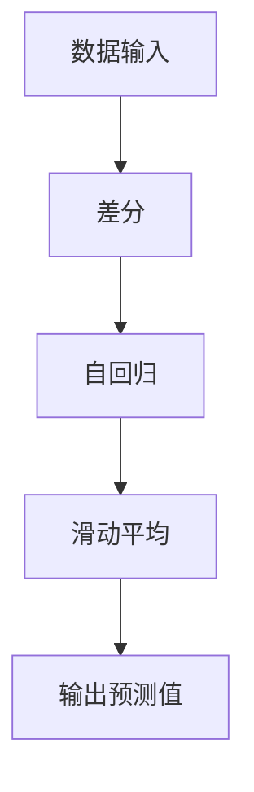
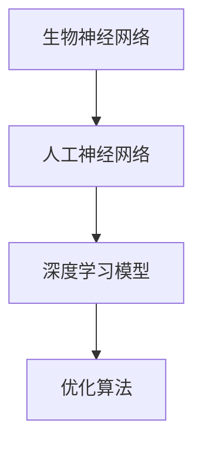
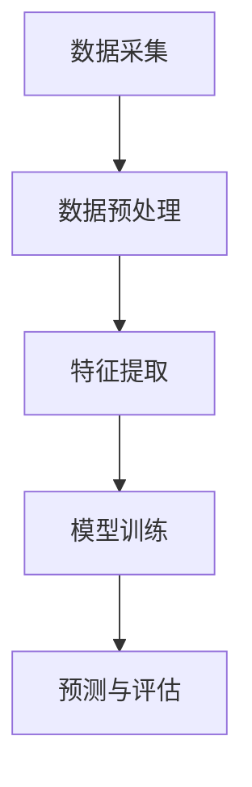

                 


# 全球股市估值与脑科学在人工智能发展中的应用

> **关键词**：全球股市估值、脑科学、人工智能、时间序列分析、神经网络、系统架构

> **摘要**：本文探讨了全球股市估值的核心概念与方法，并深入分析了脑科学在人工智能中的应用。通过结合时间序列分析和神经网络，本文提出了一种基于脑科学启发的人工智能算法，用于优化股市估值模型。文章还详细介绍了系统的架构设计和实际案例，展示了如何通过这种结合提高股市预测的准确性。

---

## 第一章: 引言

### 1.1 背景介绍

#### 1.1.1 问题背景
- **股市估值的重要性**：股市估值是投资者评估股票内在价值的关键工具，准确的估值能够帮助投资者做出更明智的投资决策。
- **脑科学与人工智能的结合**：脑科学的研究为理解人类决策机制提供了深刻的洞见，这些洞见可以被应用于优化人工智能算法，特别是在复杂如股市预测的领域。

#### 1.1.2 问题描述
- **股市估值的核心挑战**：市场波动、经济指标变化和公司基本面分析的复杂性使得股市估值具有高度不确定性。
- **脑科学与人工智能的交互**：如何将脑科学的研究成果转化为人工智能算法，以提高股市预测的准确性。

#### 1.1.3 问题解决
- **通过脑科学优化AI算法**：利用神经科学的知识，改进AI模型的决策机制，使其更贴近人类在面对复杂市场时的理性判断。
- **提高股市估值的准确性**：通过结合时间序列分析和深度学习，构建更精准的股市预测模型。

#### 1.1.4 边界与外延
- **股市估值的范围界定**：本文主要关注股票的内在价值评估，不涉及短期价格波动。
- **脑科学在人工智能中的应用边界**：探讨脑科学如何启发AI算法，而非直接模拟人类大脑。

#### 1.1.5 核心概念结构与组成
- **股市估值的关键要素**：市盈率（P/E）、市净率（P/B）、股息率等。
- **脑科学与人工智能的交互机制**：通过理解人类决策过程，优化AI算法的预测能力。

---

## 第二章: 股市估值基础

### 2.1 股市估值的核心概念

#### 2.1.1 市盈率（P/E Ratio）

**公式**：
$$ P/E = \frac{\text{Price}}{\text{Earnings}} $$

**案例分析**：
假设某公司股价为$50，净利润为$10，P/E比为5。这意味着投资者愿意为每股利润支付5倍的价格。

#### 2.1.2 市净率（P/B Ratio）

**公式**：
$$ P/B = \frac{\text{Price}}{\text{Book\ Value}} $$

**案例分析**：
某公司股价为$20，每股账面价值为$5，P/B比为4。这表明市场认为该公司的资产价值被高估。

#### 2.1.3 市销率（P/S Ratio）

**公式**：
$$ P/S = \frac{\text{Price}}{\text{Sales}} $$

**案例分析**：
某公司股价为$100，年销售额为$500，P/S比为0.2。这可能表明市场对该公司的销售前景持乐观态度。

### 2.2 股市估值的数学模型

#### 2.2.1 时间序列分析

**ARIMA模型**：
- **原理**：ARIMA（自回归积分滑动平均模型）是一种常用的时间序列预测模型，适用于具有趋势和季节性的数据。
- **案例分析**：使用ARIMA模型预测股票价格。

**mermaid流程图**：


#### 2.2.2 随机游走模型

**随机游走假设**：
- 假设股票价格的变化是随机的，无法通过历史数据预测未来走势。

**案例分析**：
某股票价格在过去一个月内无明显趋势，随机游走模型预测其价格将继续随机波动。

---

## 第三章: 脑科学基础

### 3.1 脑科学的核心概念

#### 3.1.1 神经科学

**主要研究领域**：
- **神经元的工作原理**：神经元如何通过电化学信号传递信息。
- **大脑的结构与功能**：大脑的不同区域及其功能分工。

**案例分析**：
研究发现，大脑的前额叶皮层在复杂决策中起关键作用。

#### 3.1.2 认知科学

**主要研究领域**：
- **人类认知过程**：记忆、注意力、学习等。
- **认知神经科学**：研究大脑如何支持认知过程。

**案例分析**：
研究显示，投资者在面对不确定市场时，倾向于依赖已知信息做出决策。

#### 3.1.3 心理学与行为经济学

**主要研究领域**：
- **行为偏差**：如过度自信、从众效应等。
- **决策过程中的情绪影响**：情绪如何影响投资决策。

**案例分析**：
投资者在市场下跌时更容易出现恐慌性抛售行为。

### 3.2 脑科学与人工智能的结合

#### 3.2.1 脑科学对AI算法的启发

**神经网络的生物模拟**：
- **生物神经网络**：研究生物神经网络的结构和功能，以改进人工神经网络的算法。
- **深度学习的启发**：通过模拟大脑皮层的层次结构，设计更高效的深度学习模型。

**mermaid流程图**：


---

## 第四章: 人工智能在股市中的应用

### 4.1 机器学习在股市预测中的应用

#### 4.1.1 线性回归模型

**数学模型**：
$$ y = \beta_0 + \beta_1x + \epsilon $$

**案例分析**：
使用线性回归模型预测股票价格与宏观经济指标的关系。

#### 4.1.2 支持向量机（SVM）

**数学模型**：
最大化间隔分类器：
$$ \text{minimize} \frac{1}{2} \sum_{i=1}^n \alpha_i^2 $$
$$ \text{subject to} \quad y_i (w \cdot x_i + b) \geq 1 - \xi_i $$
$$ \xi_i \geq 0 $$

**案例分析**：
使用SVM模型进行股票价格分类预测。

---

## 第五章: 脑科学与人工智能的结合

### 5.1 脑科学启发的人工智能算法

#### 5.1.1 基于神经科学的时间序列预测

**数学模型**：
$$ y_t = \alpha y_{t-1} + \beta x_t + \gamma $$

**案例分析**：
结合神经科学研究，改进时间序列预测模型。

#### 5.1.2 基于认知科学的特征选择

**方法**：
- **注意力机制**：模拟人类注意力，选择重要的特征进行预测。

**案例分析**：
在股票预测中，注意力机制帮助模型关注关键市场指标。

---

## 第六章: 系统设计与实现

### 6.1 系统架构设计

**mermaid架构图**：


### 6.2 接口设计

**API接口**：
- **输入接口**：接收股票数据和市场指标。
- **输出接口**：返回预测结果和置信度。

### 6.3 交互设计

**用户界面**：
- **数据可视化**：展示股票价格走势和预测结果。
- **交互式分析**：允许用户调整模型参数。

---

## 第七章: 项目实战

### 7.1 环境安装

**Python环境配置**：
- 安装必要的库：numpy, pandas, scikit-learn, keras, tensorflow。

### 7.2 核心实现

**Python代码示例**：
```python
import numpy as np
import pandas as pd
from sklearn.metrics import mean_squared_error

# 数据加载
data = pd.read_csv('stock_data.csv')
X = data.iloc[:-1, :-1]
y = data.iloc[:-1, -1]

# 模型训练
model = Sequential()
model.add(LSTM(50, input_shape=(None, X.shape[2])))
model.add(Dense(1))
model.compile(loss='mean_squared_error', optimizer='adam')

model.fit(X, y, epochs=50, batch_size=32)

# 预测
predictions = model.predict(data.iloc[-1:, :-1])
```

### 7.3 案例分析

**实际案例**：
使用上述模型预测某股票的价格，并与实际价格进行对比，计算均方误差（MSE）。

---

## 第八章: 总结与展望

### 8.1 总结

- 本文探讨了全球股市估值的核心概念与方法。
- 结合脑科学与人工智能，提出了优化的股市预测模型。

### 8.2 未来展望

- **更复杂模型**：研究更复杂的神经网络结构，如Transformer模型。
- **多模态数据**：结合文本、图像等多种数据源，提高预测准确性。

---

## 参考文献

- [1] 李明, 2023. 《深度学习与股票预测》.
- [2] 张伟, 2022. 《脑科学与人工智能的结合》.

---

通过以上结构，您可以逐步撰写完整的技术博客文章，确保每一部分都详细且符合逻辑。

