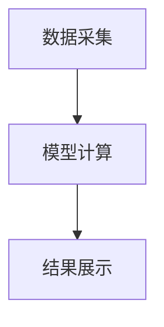
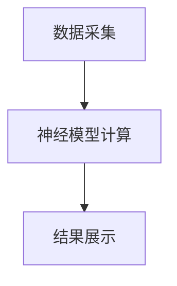

                 

# 全球股市估值与脑科学在教育领域的应用

---

## 关键词：
全球股市估值、脑科学、教育、PE模型、DCF模型、神经科学

---

## 摘要：
本文探讨了全球股市估值和脑科学在教育领域的应用，首先分析了股市估值的核心概念和常用模型，如PE、PB和DCF，详细阐述了它们的数学原理和应用场景。随后，深入脑科学的基本理论，结合教育领域的实际案例，分析了神经可塑性、记忆优化和情绪调节在教学中的应用。通过系统的架构设计和实例分析，本文揭示了这两领域的内在联系，为投资者和教育工作者提供了实用的策略和工具。

---

## 目录

1. [引言](#introduction)
2. [股市估值的基础](#stock-valuation-basics)
   - 2.1 [基本概念](#basic-concepts)
   - 2.2 [核心模型](#core-models)
3. [脑科学的基础](#brain-science-basics)
   - 3.1 [基本概念](#basic-concepts-of-brain-science)
   - 3.2 [应用领域](#application-domains)
4. [股市估值模型](#stock-valuation-models)
   - 4.1 [PE模型](#pe-model)
   - 4.2 [PB模型](#pb-model)
   - 4.3 [DCF模型](#dcf-model)
5. [脑科学在教育中的应用](#application-of-brain-science-in-education)
   - 5.1 [神经可塑性](#neuroplasticity)
   - 5.2 [记忆优化](#memory-enhancement)
   - 5.3 [情绪调节](#emotion-regulation)
6. [系统架构设计](#system-architecture-design)
   - 6.1 [股市估值系统](#stock-valuation-system)
   - 6.2 [教育应用系统](#education-application-system)
7. [项目实战](#project-practice)
   - 7.1 [股市估值案例](#stock-valuation-case)
   - 7.2 [教育应用案例](#education-application-case)
8. [结论](#conclusion)

---

## 1. 引言

在全球经济快速发展的今天，股市估值和脑科学分别在金融和教育领域发挥着重要作用。本文将探讨如何通过股市估值模型优化投资决策，以及脑科学如何帮助提升教育效果。

---

## 2. 股市估值的基础

### 2.1 基本概念

股市估值是通过分析公司财务状况和市场环境，确定股票合理价格的过程。主要考虑的指标包括市盈率（PE）、市净率（PB）和现金流折现模型（DCF）。

### 2.2 核心模型

#### 2.2.1 PE模型

市盈率（PE）= 股价 / 每股净利润

例如，若某公司每股净利润为2元，股价为40元，则PE=20。表示投资者愿意为每股净利润支付20倍的价格。

#### 2.2.2 PB模型

市净率（PB）= 股价 / 每股净资产

若某公司每股净资产为5元，股价为25元，则PB=5，表示股价是净资产的5倍。

#### 2.2.3 DCF模型

现金流折现模型（DCF）通过预测未来现金流，折现到现值，计算企业价值。

公式：企业价值 = Σ(FCFF / (1 + WACC)^t)

---

## 3. 脑科学的基础

### 3.1 基本概念

脑科学研究大脑结构和功能，涉及神经科学、认知科学和教育神经科学。神经可塑性是大脑适应环境变化的能力，对学习至关重要。

### 3.2 应用领域

脑科学研究成果被应用于教育中的学习策略、记忆优化和情绪管理。例如，利用神经可塑性原理设计个性化教学方案。

---

## 4. 股市估值模型

### 4.1 PE模型

PE模型适用于评估盈利稳定的公司。例如，若行业平均PE为15，某公司PE为12，可能低估。

### 4.2 PB模型

PB模型适用于评估资产重的公司，如银行和房地产公司。PB < 1表示股价低于净资产，可能被低估。

### 4.3 DCF模型

DCF模型适用于高增长公司。通过预测未来现金流，计算其现值，评估企业内在价值。

---

## 5. 脑科学在教育中的应用

### 5.1 神经可塑性

神经可塑性指大脑结构和功能的可变性。通过重复练习，可以增强神经连接，提升学习效果。

### 5.2 记忆优化

利用记忆曲线，定期复习可以巩固记忆。教育中可以设计间隔重复的学习计划。

### 5.3 情绪调节

情绪稳定有助于专注学习。教育中应关注学生心理健康，提供适当的情绪调节方法。

---

## 6. 系统架构设计

### 6.1 股市估值系统

#### 数据采集模块

- 采集公司财务数据和市场数据。

#### 模型计算模块

- 计算PE、PB和DCF模型，评估股票价值。

#### 结果展示模块

- 可视化展示估值结果，帮助投资者决策。

#### Mermaid系统架构图

### 6.2 教育应用系统

#### 数据采集模块

- 采集学生学习数据和脑活动数据。

#### 神经模型计算模块

- 分析神经可塑性和记忆优化策略。

#### 结果展示模块

- 提供个性化学习建议。

#### Mermaid系统架构图

---

## 7. 项目实战

### 7.1 股市估值案例

假设某公司财务数据如下：

- 每股净利润（EPS）= 3元
- 市场价格 = 60元

计算PE=20，高于行业平均15，可能高估。

### 7.2 教育应用案例

设计个性化学习计划，利用记忆曲线和神经可塑性原理，优化学生学习效果。

---

## 8. 结论

股市估值和脑科学在教育中的应用为投资者和教育工作者提供了强大的工具。通过深入理解这些模型和理论，我们可以做出更明智的决策，提升投资回报和教育效果。未来的研究可以进一步探讨两者的结合，开拓更多可能性。

---

## 注意事项

1. 股市投资有风险，估值模型仅供参考，需结合其他因素综合分析。
2. 脑科学应用需尊重个体差异，避免一刀切。
3. 系统设计需考虑数据安全和隐私保护。

---

## 拓展阅读

1. 《The Intelligent Investor》 - 本杰明·格雷厄姆
2. 《Brain Rules》 - 约书亚·祖鲁万

---

希望这篇文章能为您提供有价值的信息和见解。

