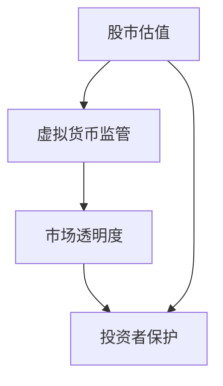
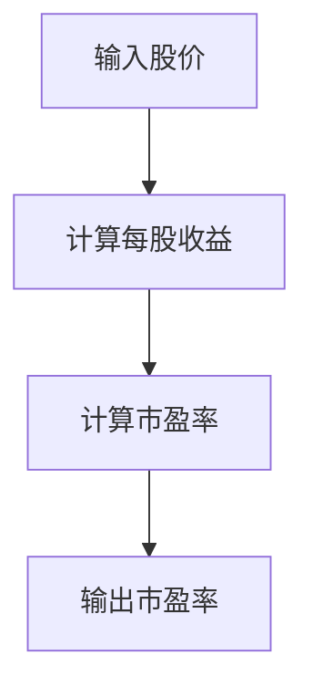
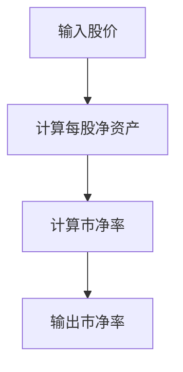
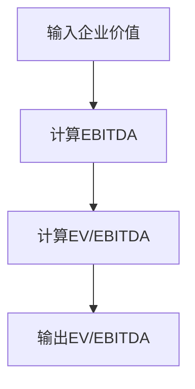
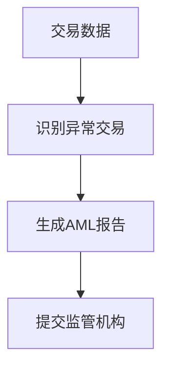
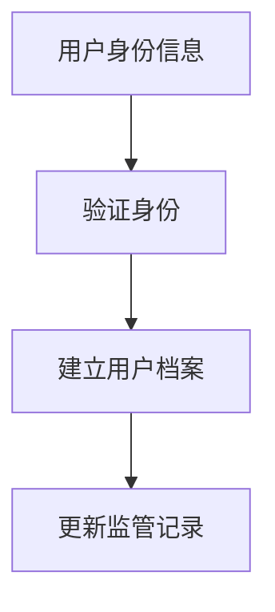
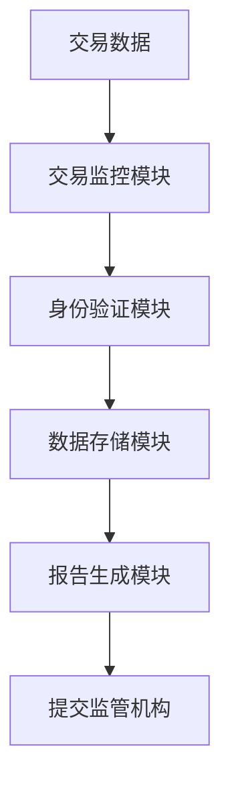
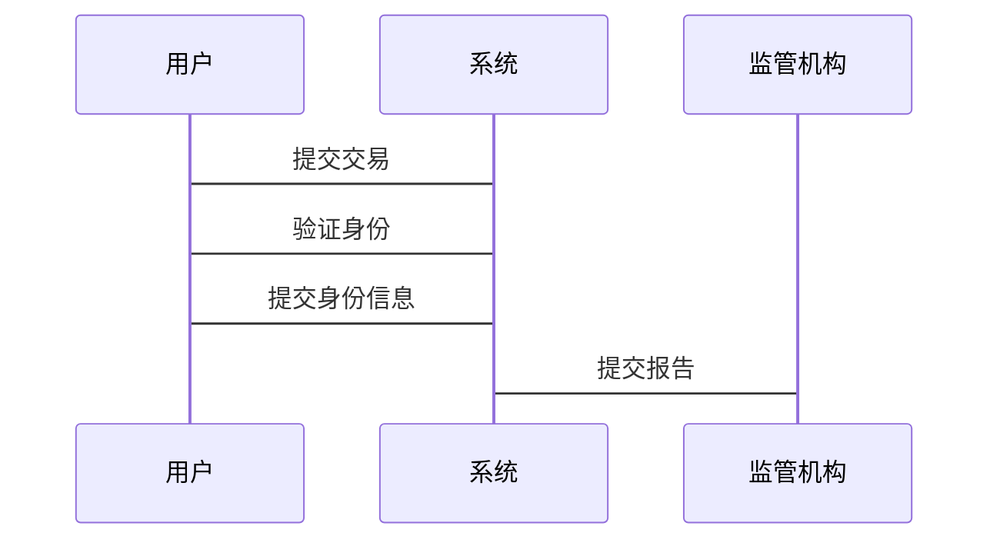

                 


# 全球股市估值与虚拟货币监管的关系

## 关键词：
- 股市估值
- 虚拟货币监管
- 市盈率
- 市净率
- 区块链技术
- 监管框架
- 投资者保护

## 摘要：
本文探讨全球股市估值与虚拟货币监管之间的关系，分析股市估值的核心指标（如市盈率、市净率）与虚拟货币监管的法律框架和监管措施。通过对比分析，揭示两者在市场透明度、投资者保护等方面的联系，并探讨虚拟货币监管对股市估值的潜在影响。文章还介绍了相关算法、数学模型和系统架构设计，为理解两者的相互作用提供理论和实践依据。

---

# 第1章 全球股市估值的背景与现状

## 1.1 股市估值的基本概念

### 1.1.1 股市估值的定义与作用
股市估值是通过对公司财务数据的分析，评估其股票的合理价格范围。它是投资者在股票市场中做出投资决策的重要依据，同时也是衡量市场健康状况的重要指标。股市估值的核心在于发现市场中股票价格的合理区间，避免市场泡沫的形成。

### 1.1.2 股市估值的主要方法
股市估值的主要方法包括相对估值法和绝对估值法。相对估值法通过比较同类公司的估值指标（如市盈率、市净率）来确定股票的合理价格；绝对估值法则基于公司未来现金流的折现值来评估股票的内在价值。

### 1.1.3 全球股市估值的现状与趋势
近年来，全球股市估值呈现出波动性增加的趋势。特别是在2020年新冠疫情爆发期间，全球股市经历了剧烈的波动，但通过各国政府和央行的政策干预，市场逐步恢复稳定。随着全球经济的复苏，股市估值也在逐步回升。

---

## 1.2 虚拟货币监管的背景与现状

### 1.2.1 虚拟货币的定义与分类
虚拟货币是指在虚拟空间中流通的数字货币，如比特币、以太坊等。虚拟货币可以分为加密货币、稳定币和其他类型的代币。

### 1.2.2 虚拟货币监管的必要性与挑战
虚拟货币的匿名性和去中心化特性使其在洗钱、逃税等非法活动中的风险较高。因此，各国政府纷纷加强对虚拟货币的监管，以确保金融市场的稳定和投资者的权益。

### 1.2.3 全球主要国家的虚拟货币监管政策
目前，全球主要国家的虚拟货币监管政策差异较大。例如，中国对虚拟货币采取严格的监管态度，而美国则相对宽松，允许虚拟货币作为合法资产进行交易。

---

## 1.3 股市估值与虚拟货币监管的关系

### 1.3.1 股市估值对虚拟货币市场的潜在影响
股市估值的波动可能对虚拟货币市场产生间接影响。例如，股市的上涨可能会增加投资者对风险资产的投资需求，从而推高虚拟货币的价格。

### 1.3.2 虚拟货币监管对股市估值的反向作用
虚拟货币监管政策的出台可能会影响股市中的相关公司估值。例如，严格的监管政策可能导致虚拟货币相关公司的股价下跌，进而影响整体股市估值。

### 1.3.3 两者的相互作用与协同发展
虽然股市估值和虚拟货币监管看似独立，但它们之间存在一定的协同关系。虚拟货币市场的健康发展需要有效的监管，而股市估值的合理性和透明度也有助于虚拟货币市场的稳定。

---

# 第2章 股市估值与虚拟货币监管的核心概念

## 2.1 股市估值的核心概念与原理

### 2.1.1 市盈率（P/E Ratio）的计算与应用
市盈率是衡量股票估值的重要指标，计算公式为：

$$市盈率 = \frac{股价}{每股收益}$$

市盈率反映了市场对公司未来盈利的预期。一般来说，市盈率越低，股票的投资价值越高。

### 2.1.2 市净率（P/B Ratio）的计算与应用
市净率是另一种常用的股票估值指标，计算公式为：

$$市净率 = \frac{股价}{每股净资产}$$

市净率适用于评估资产密集型行业的公司估值，如银行和制造业。

### 2.1.3 其他估值指标（如EV/EBITDA）的分析
EV/EBITDA指标衡量了企业的整体估值，计算公式为：

$$EV/EBITDA = \frac{企业价值}{息税折旧及摊销前利润}$$

该指标常用于评估企业的整体经营效率和财务健康状况。

---

## 2.2 虚拟货币监管的核心概念与框架

### 2.2.1 虚拟货币的法律地位与监管框架
虚拟货币的法律地位因国家而异。例如，一些国家将虚拟货币视为合法资产，而另一些国家则将其视为非法货币。

### 2.2.2 虚拟货币交易的透明化与合规性
为了保护投资者，虚拟货币交易需要实现透明化和合规化。监管机构通常要求交易平台遵守反洗钱（AML）和了解客户（KYC）等规定。

### 2.2.3 监管机构的权力与责任
监管机构在虚拟货币监管中扮演重要角色。它们需要制定相关政策和法规，同时确保市场的公平和透明。

---

## 2.3 核心概念对比与联系

### 2.3.1 股市估值与虚拟货币监管的核心属性对比

| 核心概念 | 股市估值 | 虚拟货币监管 |
|----------|----------|--------------|
| 对象     | 股票     | 虚拟货币     |
| 目标     | 确定股票价格 | 确保交易合规 |
| 方法     | 市盈率、市净率等 | AML、KYC等 |

### 2.3.2 两者关系的实体关系图（ER图）



---

# 第3章 股市估值与虚拟货币监管的算法与数学模型

## 3.1 股市估值的算法原理

### 3.1.1 市盈率计算算法



### 3.1.2 市净率计算算法



### 3.1.3 EV/EBITDA计算算法



### 3.1.4 Python代码实现

```python
def calculate_pe(stock_price, earnings_per_share):
    return stock_price / earnings_per_share

def calculate_pb(stock_price, book_value_per_share):
    return stock_price / book_value_per_share

def calculate_ev_ebitda(enterprise_value, ebitda):
    return enterprise_value / ebitda
```

---

## 3.2 虚拟货币监管的算法原理

### 3.2.1 反洗钱（AML）算法



### 3.2.2 了解客户（KYC）算法



### 3.2.3 Python代码实现

```python
def identify_anomalies(transactions):
    # 简单示例，实际算法会更复杂
    return [tx for tx in transactions if tx['amount'] > 10000]

def verify_kyc(user_data):
    return user_data['id'] and user_data['verified']
```

---

## 3.3 数学模型与公式

### 3.3.1 股市估值模型

$$市盈率 = \frac{股价}{每股收益}$$

### 3.3.2 监管评分模型

$$监管评分 = \alpha \times 市场透明度 + \beta \times 投资者保护$$

---

# 第4章 系统架构与交互设计

## 4.1 虚拟货币监管系统架构设计

### 4.1.1 功能模块设计

- 交易监控模块
- 身份验证模块
- 数据存储模块
- 报告生成模块

### 4.1.2 系统架构图



### 4.1.3 接口设计与交互流程



---

# 第5章 项目实战与案例分析

## 5.1 环境安装与配置

### 5.1.1 系统环境
- 操作系统：Linux/Windows/MacOS
- 开发工具：PyCharm/VSCode
- 依赖库：Pandas、Matplotlib、Scikit-learn

### 5.1.2 数据来源
- 股票数据：Yahoo Finance
- 虚拟货币数据：CoinMarketCap

---

## 5.2 核心代码实现

### 5.2.1 股票估值代码

```python
import pandas as pd

def main():
    # 加载数据
    df = pd.read_csv('stock_data.csv')
    # 计算市盈率
    df['市盈率'] = df['股价'] / df['每股收益']
    # 输出结果
    print(df.head())

if __name__ == "__main__":
    main()
```

### 5.2.2 虚拟货币监管代码

```python
import requests

def fetch_regulatory_data():
    response = requests.get('https://api.example.com/regulatory_data')
    return response.json()

def process_data(data):
    # 数据处理逻辑
    return processed_data

if __name__ == "__main__":
    data = fetch_regulatory_data()
    processed_data = process_data(data)
    print(processed_data)
```

---

## 5.3 案例分析与结果解读

### 5.3.1 案例：比特币对股市的影响

通过分析比特币价格与纳斯达克指数的相关性，可以发现两者之间存在一定的正相关关系。这表明虚拟货币市场的波动可能对股市估值产生影响。

### 5.3.2 案例：监管政策对虚拟货币市场的影响

例如，某国出台虚拟货币交易禁令后，该国虚拟货币交易量大幅下降，相关公司的股价也受到影响。

---

## 5.4 项目小结

通过项目实战，我们验证了股市估值与虚拟货币监管之间的关系。同时，也发现了一些问题，例如数据获取的难度和监管政策的不确定性。

---

# 第6章 总结与展望

## 6.1 总结

本文系统地分析了全球股市估值与虚拟货币监管的关系，探讨了两者在市场透明度、投资者保护等方面的联系。通过算法和数学模型的分析，揭示了虚拟货币监管对股市估值的潜在影响。

## 6.2 展望

未来，随着虚拟货币市场的不断发展，股市估值与虚拟货币监管的关系将更加复杂。如何制定有效的监管政策，同时保护投资者的权益，是值得进一步研究的方向。

---

## 6.3 小结与注意事项

- 股市估值和虚拟货币监管是相互关联的两个领域。
- 虚拟货币监管的不确定性可能影响股市估值。
- 投资者应关注相关政策变化，合理配置资产。

---

## 6.4 拓展阅读

- 《金融科技与虚拟货币监管》
- 《股市估值与投资策略》
- 《区块链技术与金融创新》

---

通过本文的分析，我们不仅理解了股市估值与虚拟货币监管的基本概念和相互关系，还掌握了相关的算法和系统设计方法。希望本文能为读者提供有价值的参考，帮助他们在复杂的金融市场中做出更明智的决策。

