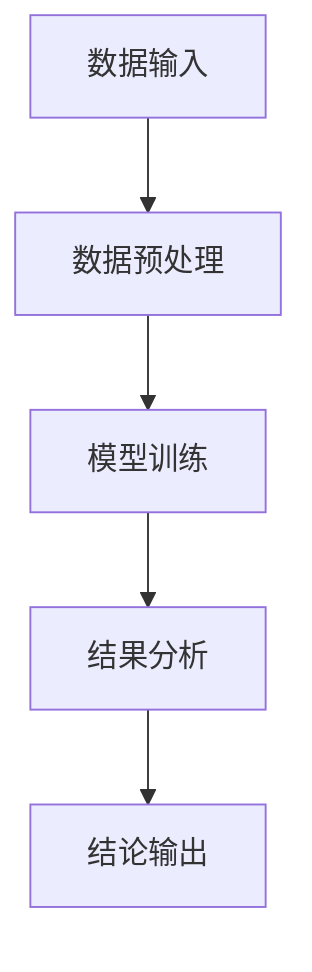
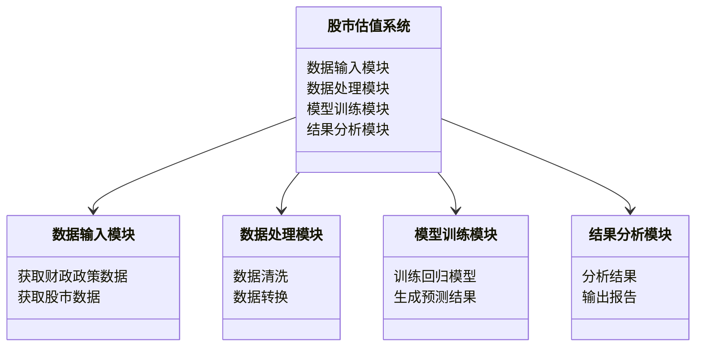

                 


# 《全球股市估值与财政政策变化的关系》

## 关键词：
- 全球股市估值
- 财政政策
- 经济影响
- 数据分析
- 投资策略

## 摘要：
本文探讨全球股市估值与财政政策变化之间的关系，分析财政政策如何影响股市估值，并通过数学模型和实际案例提供深入见解。文章从理论到实践，结合数据分析和系统架构设计，帮助读者理解两者互动机制，优化投资策略。

---

## 目录大纲：

### 第一部分：背景介绍

#### 第1章：全球股市估值与财政政策概述

- 1.1 股市估值的基本概念
  - 股市估值的定义与意义
  - 全球股市的多样性与特点
  - 股市估值的重要性与作用

- 1.2 财政政策的基本概念与作用
  - 财政政策的定义与目标
  - 主要财政工具及其影响
  - 财政政策在经济中的角色

- 1.3 财政政策与股市估值的关系
  - 财政政策如何影响股市
  - 股市估值变化的驱动因素
  - 全球化背景下的互动关系

### 第二部分：核心概念与联系

#### 第2章：股市估值与财政政策的核心概念

- 2.1 股市估值的关键指标
  - 市盈率（P/E Ratio）
  - 市净率（P/B Ratio）
  - 股息率（Dividend Yield）

- 2.2 财政政策的主要工具
  - 政府支出
  - 税收政策
  - 货币政策的作用

- 2.3 股市估值与财政政策的互动机制
  - 财政政策如何影响企业盈利
  - 利率变化对股市估值的影响
  - 政府支出对企业投资的刺激作用

#### 第3章：股市估值与财政政策的ER实体关系图

```mermaid
er
    actor 股市估值
    actor 财政政策
    actor 经济环境
    actor 投资者行为
    actor 政府机构
    grouping 组 1 [财政政策]
    grouping 组 2 [股市估值]
    grouping 组 3 [经济环境]
    grouping 组 4 [投资者行为]
    grouping 组 5 [政府机构]
    股市估值 --> 组 1: 受财政政策影响
    股市估值 --> 组 3: 受经济环境影响
    股市估值 --> 组 4: �受投资者行为影响
    组 1 --> 组 5: 政府制定政策
    组 3 --> 组 5: 经济政策影响
    组 4 --> 组 5: 投资者反馈
```

### 第三部分：算法原理讲解

#### 第4章：财政政策变化对股市估值的算法分析



#### 第5章：数学模型与公式

- 5.1 财政政策变化与股市估值的数学模型
  - 公式：$$ \text{股市估值变化} = \beta_1 \times \text{财政政策变量} + \epsilon $$
  - 回归分析的应用
  - 多元回归模型：$$ Y = \beta_0 + \beta_1 X_1 + \beta_2 X_2 + \dots + \beta_n X_n + \epsilon $$

- 5.2 实证分析与案例
  - 数据来源与处理
  - 模型验证与结果解读

### 第四部分：系统分析与架构设计

#### 第6章：系统功能设计

- 6.1 领域模型设计
  - 使用Mermaid类图展示系统模块



#### 第7章：系统架构设计


### 第五部分：项目实战

#### 第8章：环境安装与代码实现

- 8.1 环境安装
  - 安装Python
  - 安装Pandas、NumPy、Scikit-learn

- 8.2 核心代码实现
  ```python
  import pandas as pd
  import numpy as np
  from sklearn.linear_model import LinearRegression
  from sklearn.metrics import mean_squared_error

  # 数据加载
  df = pd.read_csv('data.csv')

  # 数据预处理
  X = df[['政府支出', '税率变化', '利率']]
  y = df['股市估值']

  # 模型训练
  model = LinearRegression()
  model.fit(X, y)

  # 预测与评估
  y_pred = model.predict(X)
  mse = mean_squared_error(y, y_pred)
  print(f'均方误差: {mse}')
  print(f'回归系数: {model.coef_}')
  ```

#### 第9章：案例分析与结果解读

- 9.1 案例分析
  - 数据来源与背景
  - 模型应用与结果展示

- 9.2 结果解读
  - 财政政策变量对股市估值的影响分析

### 第六部分：最佳实践

#### 第10章：最佳实践与小结

- 10.1 最佳实践
  - 数据选择与处理的建议
  - 模型验证与优化的方法
  - 实际应用中的注意事项

- 10.2 小结
  - 全文总结
  - 未来研究方向

---

通过以上目录大纲，您可以逐步深入理解全球股市估值与财政政策变化之间的关系，从理论分析到实际应用，掌握如何通过数据分析和模型构建来优化投资策略。

