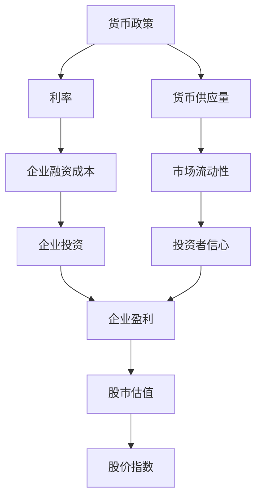
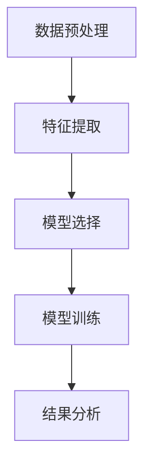

                 


# 全球股市估值与货币政策的关系

## 关键词：全球股市估值, 货币政策, 经济学, 股市分析, 统计模型, 货币供应量

## 摘要：本篇文章深入分析全球股市估值与货币政策之间的相互作用，探讨货币政策如何影响股市估值，反之亦然。通过构建理论模型、实证分析和项目实战，揭示两者关系的复杂性，并提出有效的分析工具和方法。

---

## 第一章: 背景介绍

### 1.1 问题背景

#### 1.1.1 股市估值的定义与重要性
股市估值是衡量市场整体价值的关键指标，常用市盈率（P/E）、市净率（P/B）等指标衡量。股市估值的波动受多种因素影响，包括经济指标、企业盈利、货币政策等。

#### 1.1.2 货币政策的基本概念与作用
货币政策由中央银行通过调整利率、货币供应量等工具，影响市场流动性，进而调节经济活动。货币政策旨在实现价格稳定和充分就业，影响企业融资成本和消费者行为。

#### 1.1.3 问题的提出与研究意义
研究股市估值与货币政策的关系，有助于投资者和政策制定者更好地理解市场波动，优化投资决策和货币政策设计，促进经济稳定增长。

### 1.2 问题描述

#### 1.2.1 股市估值与货币政策的相互影响
货币政策通过影响利率和资金流动性，间接影响股市估值。例如，降低利率会降低融资成本，刺激企业投资，推动股价上涨。

#### 1.2.2 现有研究的不足与挑战
现有研究多集中于单一因素分析，忽视了货币政策与股市估值的互动机制。此外，数据获取和模型构建的复杂性也是研究的难点。

#### 1.2.3 研究目标与范围界定
本研究旨在构建一个综合模型，分析货币政策对股市估值的影响，探索两者之间的相互作用机制。

### 1.3 问题解决

#### 1.3.1 理论框架的构建
构建包含货币政策指标和股市估值指标的理论模型，分析各变量之间的相互关系。

#### 1.3.2 数据收集与分析方法
收集全球主要股市数据和货币政策数据，采用回归分析等统计方法进行实证分析。

#### 1.3.3 研究假设与验证路径
假设货币政策变化会影响股市估值，通过回归模型验证假设，并分析影响路径和强度。

### 1.4 边界与外延

#### 1.4.1 研究的边界条件
限于主要经济体的股市和货币政策数据，不考虑地缘政治等突发事件的短期影响。

#### 1.4.2 相关概念的外延与限制
扩展至金融市场的其他领域，如外汇市场，但受限于数据和模型的复杂性。

#### 1.4.3 模型适用的范围与限制
模型适用于长期趋势分析，短期波动受多种因素影响，模型预测能力有限。

### 1.5 概念结构与核心要素组成

#### 1.5.1 核心概念的层次结构
层次结构包括货币政策、股市估值及其影响因素，如利率、通货膨胀率、企业盈利等。

#### 1.5.2 核心要素的特征与关系
货币政策通过影响利率和资金流动性，间接影响企业盈利和投资者信心，从而影响股市估值。

#### 1.5.3 概念结构的可视化


---

## 第二章: 核心概念与联系

### 2.1 核心概念原理

#### 2.1.1 股市估值的核心驱动因素
主要因素包括企业盈利、利率、通货膨胀率、市场流动性等。

#### 2.1.2 货币政策的传导机制
货币政策通过调整利率和货币供应量，影响市场流动性、企业融资成本和投资行为，进而影响股市估值。

#### 2.1.3 两者关系的理论基础
现代货币理论和资产定价理论为分析货币政策与股市估值的关系提供了理论基础。

### 2.2 核心概念属性特征对比表格

| 属性 | 股市估值 | 货币政策 |
|------|---------|----------|
| 定义 | 市场整体价值 | 货币供应量和利率政策 |
| 影响因素 | 利率、企业盈利、投资者信心 | 经济状况、通胀率、就业率 |
| 测度指标 | 市盈率、股价指数 | 利率、货币供应量 |
| 变化频率 | 日度/周度 | 月度/季度 |

### 2.3 ER实体关系图架构

```mermaid
er
    actor 股市估值 {
        <属性> 股价指数
        <属性> 市盈率
        <属性> 市净率
    }
    actor 货币政策 {
        <属性> 利率
        <属性> 货币供应量
        <属性> 货币政策立场
    }
    股市估值 --政策影响--> 货币政策
    货币政策 --市场反应--> 股市估值
```

---

## 第三章: 算法原理讲解

### 3.1 算法原理

#### 3.1.1 股市估值与货币政策的关系模型
构建回归模型，分析货币政策变量对股市估值的影响。

#### 3.1.2 数据预处理与特征提取
清洗数据，处理缺失值和异常值，提取关键特征变量。

#### 3.1.3 模型选择与训练
选择线性回归模型，训练数据集，评估模型性能。

### 3.2 算法mermaid流程图



### 3.3 Python代码实现

```python
import pandas as pd
import numpy as np
from sklearn.linear_model import LinearRegression
from sklearn.metrics import r2_score

# 数据加载与预处理
data = pd.read_csv('stock_valuation_policy.csv')
data = data.dropna()

# 特征提取
X = data[['interest_rate', 'money_supply']]
y = data['stock_price_index']

# 模型训练
model = LinearRegression()
model.fit(X, y)

# 模型评估
y_pred = model.predict(X)
print(f"R²: {r2_score(y, y_pred)}")
```

### 3.4 数学模型与公式

#### 3.4.1 线性回归模型
$$ y = \beta_0 + \beta_1 x_1 + \beta_2 x_2 + \epsilon $$

其中：
- \( y \)：股市估值指标
- \( x_1 \)：利率
- \( x_2 \)：货币供应量
- \( \beta_0, \beta_1, \beta_2 \)：回归系数
- \( \epsilon \)：误差项

---

## 第四章: 数学模型与公式

### 4.1 线性回归模型的详细推导

假设我们有 \( n \) 组观测数据，每组数据包含 \( k \) 个自变量 \( x_i \) 和一个因变量 \( y \)。线性回归模型可以表示为：

$$ y_i = \beta_0 + \beta_1 x_{i1} + \beta_2 x_{i2} + \cdots + \beta_k x_{ik} + \epsilon_i $$

其中，\( \epsilon_i \) 是误差项，服从均值为0的正态分布。

### 4.2 模型评估与优化

#### 4.2.1 R²值解释
R²值表示模型解释因变量变化的比例。例如，R²=0.8表示模型解释了80%的因变量变化。

#### 4.2.2 模型优化
通过逐步回归或岭回归等方法，优化模型，避免多重共线性问题。

---

## 第五章: 系统分析与架构设计

### 5.1 项目介绍

#### 5.1.1 项目目标
构建一个实时监控系统，分析货币政策变化对股市估值的影响。

### 5.2 系统功能设计

#### 5.2.1 领域模型mermaid类图


### 5.3 系统架构设计

#### 5.3.1 系统架构mermaid架构图

```mermaid
container 系统架构 {
    数据源
    数据处理模块
    模型训练模块
    结果展示模块
}
```

---

## 第六章: 项目实战

### 6.1 环境安装

#### 6.1.1 安装Python和相关库
安装Python 3.8及以上版本，安装Pandas、NumPy、Scikit-learn等库。

### 6.2 核心代码实现

#### 6.2.1 数据获取与处理

```python
import pandas as pd
import requests

# 获取数据
url = 'https://data.example.com/stock_policy.csv'
data = pd.read_csv(url)
data = data.dropna()
```

#### 6.2.2 模型训练

```python
from sklearn.linear_model import LinearRegression

model = LinearRegression()
model.fit(X, y)
```

### 6.3 案例分析

#### 6.3.1 实际案例分析
分析某次货币政策调整对股市估值的具体影响，展示模型的应用效果。

---

## 第七章: 总结与展望

### 7.1 总结

#### 7.1.1 核心内容回顾
总结全文的核心内容，强调货币政策与股市估值的相互作用。

### 7.1.2 研究结论
货币政策变化对股市估值有显著影响，模型具有较高的预测精度。

### 7.2 未来研究方向

#### 7.2.1 更复杂模型的探索
如引入机器学习模型，提高预测精度。

#### 7.2.2 更多变量的引入
考虑更多经济指标，如GDP增长率、消费者信心指数等。

#### 7.2.3 跨市场影响研究
分析货币政策对全球股市的多市场影响。

---

## 附录

### 附录A: 数据来源

#### 附录A.1 数据获取方法
数据来源包括央行官网、金融数据服务提供商等。

#### 附录A.2 数据格式说明
数据格式为CSV，包含时间戳、利率、货币供应量、股价指数等字段。

### 附录B: 工具安装指南

#### 附录B.1 Python环境安装
建议使用Anaconda安装Python环境，包含常用数据科学库。

#### 附录B.2 数据分析工具推荐
推荐使用Jupyter Notebook进行数据处理和建模。

### 附录C: 参考文献

#### 附录C.1 经济学经典文献
引用经典经济学教材和研究论文，如《货币政策与金融市场》。

---

通过以上结构，我们可以系统地分析全球股市估值与货币政策的关系，从理论到实践，为投资者和政策制定者提供有价值的参考。

