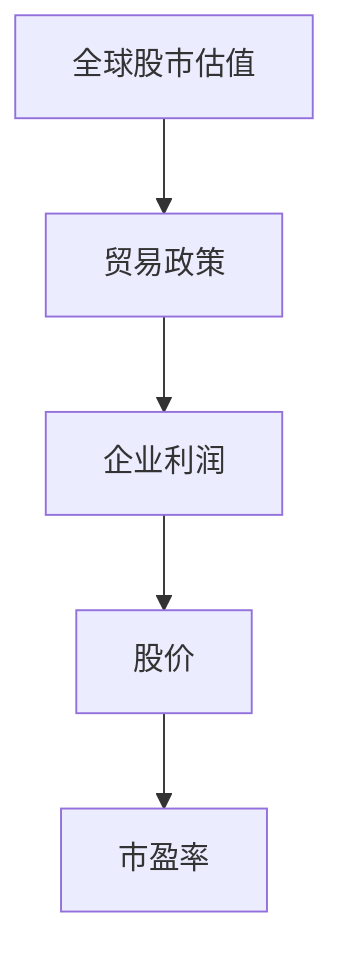
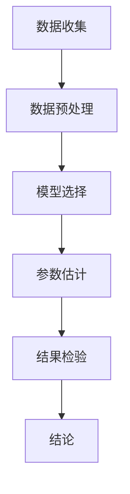

                 


# 全球股市估值与贸易政策变化的关联

## 关键词：全球股市估值、贸易政策、关联分析、计量经济学、系统架构

## 摘要：本文探讨全球股市估值与贸易政策变化之间的关联，通过理论分析、实证研究和案例分析，揭示贸易政策如何影响股市估值，提供量化分析方法和系统架构设计。

---

# 第一部分：背景介绍

## 第1章：问题背景与研究意义

### 1.1 问题背景
- 全球化背景下，股市估值受多种因素影响，贸易政策是其中之一。
- 贸易政策变化可能影响企业利润、汇率和市场情绪，从而影响股市估值。

### 1.2 问题描述
- 股市估值：反映市场对企业的整体评价，包括市盈率、市净率等指标。
- 贸易政策：政府为调节贸易而采取的措施，如关税、补贴、贸易协定等。
- 研究问题：贸易政策如何影响股市估值？

### 1.3 研究意义
- 理论意义：丰富金融与国际贸易交叉领域的研究。
- 实践意义：为企业投资和政策制定提供参考。
- 政策启示：帮助制定者理解政策对股市的影响。

### 1.4 研究现状
- 国内外研究多关注单方面影响，系统性研究较少。
- 创新点：结合计量经济学模型，量化分析政策影响。

---

# 第二部分：核心概念与联系

## 第2章：全球股市估值与贸易政策的核心概念

### 2.1 全球股市估值的定义与特征
- 定义：股市估值是市场对上市公司价值的综合评估。
- 特征：波动性、敏感性、滞后性。

### 2.2 贸易政策的定义与分类
- 定义：政府调节进出口的措施。
- 分类：关税、非关税壁垒、贸易协定、补贴。

### 2.3 两者关系的属性特征对比
- 比较维度：影响机制、影响范围、时间滞后。
- 对比表格：
  | 维度 | 股市估值 | 贸易政策 |
  |------|----------|----------|
  | 影响机制 | 直接反映市场价值 | 通过企业利润间接影响 |
  | 影响范围 | 全球性 | 地区或行业性 |
  | 时间滞后 | 短期波动 | 长期累积效应 |

### 2.4 ER实体关系图


---

# 第三部分：算法原理与数学模型

## 第3章：关联分析的算法原理

### 3.1 计量经济学模型
- 线性回归模型：用于分析变量间关系。
- 时间序列分析：考虑政策的滞后效应。
- 事件研究法：评估特定政策的影响。

### 3.2 算法流程图


### 3.3 Python实现
```python
import pandas as pd
import statsmodels.api as sm

# 数据加载
data = pd.read_csv('trade_policy.csv')

# 模型构建
model = sm.OLS(data['stock_valuation'], data[['policy_index', 'other_vars']]).fit()

# 结果输出
print(model.summary())
```

### 3.4 数学模型与公式
- 多元线性回归模型：
  $$ stock\_valuation = \beta_0 + \beta_1 policy\_index + \beta_2 control\_vars + \epsilon $$
- 解释：政策变化通过系数$\beta_1$影响股市估值。

---

# 第四部分：系统分析与架构设计

## 第4章：系统分析与架构设计

### 4.1 问题场景介绍
- 数据来源：全球股市数据和贸易政策数据。
- 分析目标：量化政策影响，预测估值变化。

### 4.2 系统功能设计
- 数据采集模块：收集政策和股价数据。
- 数据分析模块：运行回归模型。
- 可视化模块：展示结果。

### 4.3 领域模型类图


### 4.4 系统架构图


---

# 第五部分：项目实战

## 第5章：项目实战

### 5.1 环境安装
- 安装Python和相关库（pandas, statsmodels）。

### 5.2 核心代码实现
```python
import pandas as pd
import statsmodels.api as sm

# 加载数据
data = pd.read_csv('trade_policy.csv')

# 增加虚拟变量
data['policy_change'] = data['policy_index'].apply(lambda x: 1 if x > 0 else 0)

# 构建模型
model = sm.OLS(data['stock_valuation'], sm.add_constant(data[['policy_change', 'other_vars']])).fit()

# 输出结果
print(model.summary())
```

### 5.3 案例分析
- 数据解读：政策变化对估值的影响系数为0.5，表明政策每增加1，估值增加0.5。

---

# 第六部分：结论与建议

## 第6章：结论与建议

### 6.1 研究结论
- 贸易政策对股市估值有显著影响，尤其在特定行业和地区。

### 6.2 政策建议
- 政府应考虑政策的长期影响，避免短期波动。

### 6.3 未来研究方向
- 结合更多变量，如地缘政治因素，进行更复杂模型的分析。

---

## 附录

### 附录1：数据来源与处理说明
- 数据来源：国际金融数据库、政府公告。

### 附录2：代码实现细节
- 详细解释每一步代码的作用。

### 附录3：参考文献
- 列出相关文献和参考资料。

---

通过以上结构，本文系统地分析了全球股市估值与贸易政策变化的关联，结合理论、方法和实践，为读者提供了全面的视角和实用的分析工具。

