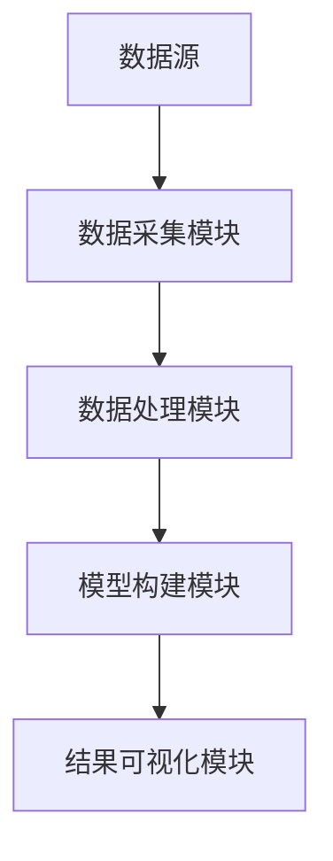

                 

# 全球股市估值与跨境资本管制的关联

> 关键词：全球经济、金融市场、跨境资本流动、资本管制、股市估值

> 摘要：本文探讨了全球股市估值与跨境资本管制之间的复杂关系，分析了资本管制对股市估值的影响，以及股市估值如何反过来影响资本流动。通过理论分析、数学建模和实际案例研究，本文揭示了跨境资本管制与股市估值之间的深层联系，并提出了量化评估的方法。

---

## 第一部分：全球股市估值与跨境资本管制的关联概述

### 第1章：问题背景与研究意义

#### 1.1 问题背景

全球金融市场的发展离不开资本的自由流动，而跨境资本流动受制于各国的资本管制政策。随着全球化进程的加速，资本的跨国流动日益频繁，股市估值作为衡量市场健康的重要指标，受到资本管制政策的影响。本文旨在探讨这两者之间的关联，分析资本管制如何影响股市估值，以及股市估值的变化如何反馈到资本流动的决策中。

#### 1.2 问题描述

股市估值是指对股票市场整体或个别股票的价值进行评估，常用的指标包括市盈率（PE）、市净率（PB）等。跨境资本管制则是指政府通过政策手段限制或调节资本的流入和流出，以维持金融市场的稳定。本文聚焦于这两者之间的互动关系，探讨资本管制如何通过影响市场情绪、资金流动进而影响股市估值，以及股市估值的变化如何反映资本流动的潜在风险。

#### 1.3 问题解决

本文通过构建多元回归模型，量化资本管制政策对股市估值的影响。同时，结合实际案例分析，验证理论模型的有效性。研究方法包括文献综述、数据收集与分析、模型构建等。

#### 1.4 边界与外延

本文仅关注跨境资本管制对股市估值的直接影响，不考虑其他因素（如宏观经济政策、公司基本面变化）的影响。同时，重点分析资本管制政策的直接效果，而非其间接或长期影响。

#### 1.5 核心概念结构与要素

- **核心概念**：
  - 股市估值：通过PE、PB等指标衡量市场整体或个股的价值。
  - 资本管制：政府通过政策手段限制资本流动，维护金融市场稳定。
- **关联机制**：
  - 资本管制影响资金流动，进而影响股市估值。
  - 股市估值的变化反映市场对资本流动的预期。

---

## 第二部分：全球股市估值的理论与方法

### 第2章：股市估值的理论基础

#### 2.1 主流估值方法

- **市盈率（PE）**：
  - 定义：股价与每股收益的比率。
  - 优缺点：反映市场对盈利能力的预期，但受行业周期影响较大。
- **市净率（PB）**：
  - 定义：股价与每股净资产的比率。
  - 优缺点：适用于净资产驱动的行业，如银行、房地产。
- **现金流折现法（DCF）**：
  - 定义：基于未来现金流的现值计算股票价值。
  - 优缺点：计算复杂，但能反映企业内在价值。

#### 2.2 股市估值的影响因素

- **宏观经济因素**：GDP增长率、利率水平、通货膨胀率等。
- **行业周期因素**：行业景气度、竞争格局等。
- **公司基本面因素**：盈利能力、财务状况、管理团队等。

#### 2.3 股市估值与市场情绪的关系

- **市场情绪**：投资者情绪波动影响股市估值，尤其在市场波动加剧时。
- **波动性分析**：股市估值的短期波动与市场情绪密切相关。
- **投资者心理**：贪婪和恐惧情绪驱动市场波动，影响估值指标。

---

## 第三部分：跨境资本管制的机制与影响

### 第3章：跨境资本管制的定义与分类

#### 3.1 资本管制的定义

- **定义**：政府通过政策手段限制资本流入或流出，以维护金融市场稳定。
- **范围**：涵盖外汇管制、资本流动限制、投资限制等。
- **合法性**：根据国际法和国内法律，资本管制是政府维护金融稳定的工具。

#### 3.2 资本管制的主要手段

- **汇率干预**：政府通过买卖外汇影响汇率，调节资本流动。
- **资本流动限制**：设定资本流动上限，限制短期资本流动。
- **投资者限制**：限制外国投资者的持股比例或交易行为。

---

## 第四部分：股市估值与资本管制的关联机制

### 第4章：资本管制对股市估值的影响

#### 4.1 资本流动与市场情绪

- 资本管制政策直接影响市场情绪，投资者对政策变化的预期影响股市估值。
- 资本流入增加时，股市估值上升；资本流出增加时，股市估值下降。

#### 4.2 资本管制与资产价格

- 资本管制限制了资本的自由流动，导致资产价格与基本面脱节。
- 例如，中国资本管制政策对A股市场的估值影响显著。

#### 4.3 投资者行为分析

- 投资者预期资本管制政策的变化，调整投资策略，影响股市估值。
- 资本管制政策可能导致投资者过度配置或规避市场，引发估值偏差。

---

## 第五部分：算法模型与案例分析

### 第5章：多元回归模型的构建

#### 5.1 模型构建

- **目标**：量化资本管制政策对股市估值的影响。
- **变量选择**：
  - 自变量：资本管制政策指数（如资本流动限制、汇率干预强度）。
  - 因变量：股市估值指标（如PE、PB）。
- **数学模型**：
  $$ \text{Valuation} = \beta_0 + \beta_1 \times \text{Capital\ Control} + \epsilon $$

#### 5.2 数据来源与处理

- 数据来源：国际金融数据（如MSCI指数、各国资本流动数据）。
- 数据处理：标准化、缺失值处理、异常值剔除。

#### 5.3 案例分析

- **案例**：中国资本管制政策对A股PE的影响。
- **分析**：通过多元回归模型，验证资本管制政策对PE的显著影响。

---

## 第六部分：系统架构与项目实战

### 第6章：系统架构设计

#### 6.1 系统功能设计

- **功能模块**：
  - 数据采集：收集全球股市估值数据和资本管制政策数据。
  - 数据分析：构建多元回归模型，量化政策影响。
  - 可视化展示：生成估值变化趋势图和政策影响分析图。

#### 6.2 系统架构图

---

## 第七部分：总结与展望

### 第7章：研究总结

- **研究发现**：
  - 资本管制政策显著影响股市估值，尤其在新兴市场。
  - 市场情绪是连接资本流动与股市估值的重要桥梁。

### 第8章：未来研究方向

- **动态模型**：考虑资本流动的时变性，构建动态回归模型。
- **跨市场比较**：分析不同市场资本管制政策的异同及其对估值的影响。

---

## 第九部分：最佳实践与注意事项

### 9.1 数据收集建议

- 使用权威金融数据源，确保数据准确性和完整性。

### 9.2 模型选择建议

- 根据研究目标选择合适的模型，避免过度拟合。

### 9.3 案例分析建议

- 结合实际市场情况，选择具有代表性的案例进行分析。

### 9.4 未来研究建议

- 探索更多因素对股市估值的影响，构建多元化的分析框架。

---

## 第十部分：参考文献

### 参考文献

- 文献1：全球经济与资本流动研究。
- 文献2：金融市场估值理论与方法。
- 文献3：资本管制政策的国际比较与影响。

---

以上为文章的详细结构，您可以根据实际需要进一步补充内容。

