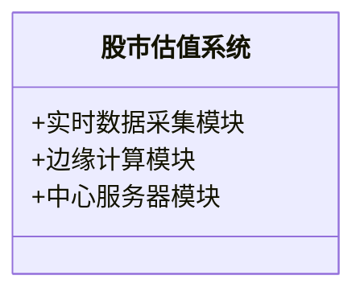
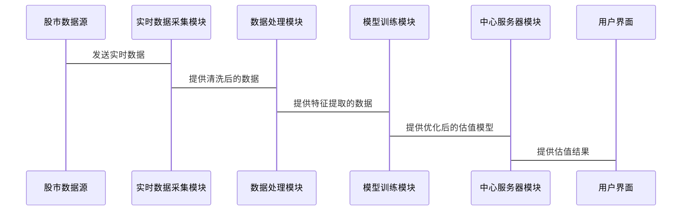

                 


```markdown
# 全球股市估值与边缘计算技术的关联

> 关键词：全球股市估值，边缘计算，金融数据分析，实时性优化，技术关联

> 摘要：本文探讨了全球股市估值与边缘计算技术之间的关联性，分析了边缘计算如何提升股市估值的实时性和准确性，提出了基于边缘计算优化股市估值的技术模型和实现方案，为金融领域的技术创新提供了参考。

---

## 第一部分：全球股市估值与边缘计算技术的背景与关联

### 第1章：全球股市估值与边缘计算技术的背景介绍

#### 1.1 问题背景与描述

##### 1.1.1 全球股市估值的重要性
股市估值是评估企业价值的重要指标，影响投资者的决策。常用的估值方法包括市盈率（P/E）、市净率（P/B）等。然而，传统的估值方法依赖于集中式计算，存在延迟和数据传输成本高的问题。

##### 1.1.2 边缘计算技术的崛起
边缘计算是一种分布式计算范式，数据在靠近数据源的边缘设备上进行处理，减少了延迟和带宽消耗。边缘计算在金融领域的应用潜力巨大，尤其是在实时数据分析和决策支持方面。

##### 1.1.3 两者的关联性与研究意义
边缘计算的实时性和分布式特性可以解决传统股市估值方法的不足，提升估值的准确性和效率。研究两者的关联性有助于推动金融领域的技术创新。

#### 1.2 问题解决与边界

##### 1.2.1 当前股市估值的挑战
- 数据量大，集中式计算延迟高。
- 数据传输成本高，影响实时性。
- 数据隐私和安全问题。

##### 1.2.2 边缘计算在金融领域的应用潜力
- 实时数据处理，提升估值效率。
- 分布式架构，降低数据传输成本。
- 边缘计算的安全性和隐私保护特性。

##### 1.2.3 研究的边界与外延
- 仅关注边缘计算在股市估值中的应用。
- 不涉及其他分布式计算技术。
- 重点分析技术实现和优化方法。

### 第2章：全球股市估值与边缘计算技术的核心概念

#### 2.1 全球股市估值的定义与特点

##### 2.1.1 股市估值的基本概念
股市估值是通过分析企业财务数据和市场指标，评估企业股票的合理价格。常用方法包括绝对估值（DCF模型）和相对估值（P/E、P/B等）。

##### 2.1.2 常用的估值方法
- 绝对估值：DCF模型，基于未来现金流的现值计算企业价值。
- 相对估值：市盈率、市净率等指标，通过比较同行业公司的估值倍数进行评估。

##### 2.1.3 估值模型的优缺点
- 优点：提供企业价值的合理区间，指导投资决策。
- 缺点：依赖于假设和数据质量，存在主观性和不确定性。

#### 2.2 边缘计算技术的定义与特点

##### 2.2.1 边缘计算的基本概念
边缘计算是一种将计算能力推向数据源附近的分布式计算模式，减少数据传输延迟，提高数据处理效率。

##### 2.2.2 边缘计算的核心特征
- 分布式架构：数据在边缘节点处理，减少对中心服务器的依赖。
- 实时性：边缘设备能够快速响应，适用于需要实时决策的应用场景。
- 灵活性：边缘节点可根据需求动态调整计算资源。

##### 2.2.3 边缘计算与云计算的区别
- 边缘计算强调数据的实时性和本地处理，云计算强调数据的集中存储和处理。
- 边缘计算适用于低延迟和高实时性的场景，云计算适用于需要大规模数据存储和处理的场景。

### 第3章：全球股市估值与边缘计算技术的关联性分析

#### 3.1 两者的关联性概述

##### 3.1.1 边缘计算如何提升股市估值的实时性
边缘计算通过在边缘设备上进行实时数据处理，减少数据传输到中心服务器的延迟，提升估值计算的实时性。

##### 3.1.2 边缘计算在金融数据分析中的应用
边缘计算可以处理高频交易数据、实时市场数据，为股市估值提供更及时和准确的数据支持。

##### 3.1.3 两者结合的优势与挑战
- 优势：边缘计算提升实时性，降低数据传输成本，增强数据隐私性。
- 挑战：边缘设备的计算能力有限，数据一致性问题，边缘节点的维护和管理。

#### 3.2 核心概念的属性特征对比

##### 3.2.1 股市估值的属性特征
- 数据依赖性：依赖财务报表和市场数据。
- 计算复杂性：涉及复杂的数学模型和算法。
- 实时性要求：需要快速响应市场变化。

##### 3.2.2 边缘计算的属性特征
- 分布式架构：数据处理靠近边缘设备。
- 实时性：快速响应数据变化。
- 灵活性：可根据需求动态调整计算资源。

##### 3.2.3 对比分析与总结
- 两者在实时性、数据依赖性和计算复杂性方面存在相似性。
- 边缘计算通过分布式架构和实时处理能力，能够有效提升股市估值的效率和准确性。

## 第4章：全球股市估值与边缘计算技术的核心原理

### 4.1 股市估值的核心原理

#### 4.1.1 市盈率与市净率的计算方法
- 市盈率（P/E）= 股价 / 每股净利润
- 市净率（P/B）= 股价 / 每股净资产

#### 4.1.2 股东权益与企业价值的评估
- 股东权益 = 资产 - 负债
- 企业价值 = 股东权益 + 少数股权 + 或有负债

#### 4.1.3 估值模型的数学公式
- DCF模型：企业价值 = 现金流的现值
- 市盈率模型：合理股价 = 市盈率 × 每股净利润

### 4.2 边缘计算的核心原理

#### 4.2.1 边缘计算的体系架构
- 边缘节点：负责数据的采集、处理和初步分析。
- 中心服务器：负责数据的汇总、存储和深度分析。
- 应用层：提供用户界面和业务逻辑处理。

#### 4.2.2 边缘节点的数据处理流程
1. 数据采集：从传感器或其他数据源获取数据。
2. 数据预处理：清洗、转换和归一化。
3. 数据分析：使用机器学习或统计方法进行分析。
4. 数据传输：将结果传输到中心服务器或直接反馈给用户。

#### 4.2.3 边缘计算与云计算的协同工作
- 边缘计算处理实时数据，云计算进行深度分析和存储。
- 边缘计算减少数据传输量，云计算提供强大的计算能力和存储能力。

## 第5章：全球股市估值与边缘计算技术的关联模型

### 5.1 边缘计算优化股市估值的技术模型

#### 5.1.1 技术实现的核心原理
- 数据采集：实时采集市场数据和企业财务数据。
- 数据处理：在边缘节点进行数据清洗和特征提取。
- 模型训练：在边缘节点训练机器学习模型，优化估值参数。
- 结果反馈：将估值结果实时反馈给投资者和交易系统。

#### 5.1.2 实时交易决策优化
- 实时监测市场变化，快速调整估值模型。
- 基于边缘计算的实时数据处理，优化交易策略。

### 5.2 关联模型的数学表达

#### 5.2.1 边缘计算与股市估值的数学关系
- 边缘节点处理实时数据，中心服务器进行深度分析。
- 通过分布式计算优化估值模型的训练和推理。

#### 5.2.2 模型优化的数学公式
- 边缘节点处理：实时数据处理和特征提取。
- 中心服务器处理：模型训练和优化。

### 5.3 边缘计算与股市估值的协同优化

#### 5.3.1 数据流与计算流程的优化
- 数据采集 → 边缘处理 → 中心分析 → 结果反馈。

#### 5.3.2 系统架构的优化设计
- 分布式架构：边缘节点负责实时数据处理，中心服务器负责深度分析。
- 负载均衡：动态分配计算任务，提高系统效率。

---

## 第六章：边缘计算在优化全球股市估值中的技术实现

### 6.1 系统架构设计

#### 6.1.1 领域模型设计


#### 6.1.2 系统架构设计


#### 6.1.3 接口设计
- 实时数据采集接口：接收市场数据和财务数据。
- 边缘计算接口：处理实时数据，提供初步估值结果。
- 中心服务器接口：汇总数据，提供深度分析结果。

### 6.2 系统功能设计

#### 6.2.1 功能模块划分
- 数据采集模块：实时采集市场数据和财务数据。
- 数据处理模块：清洗、转换和归一化数据。
- 模型训练模块：训练机器学习模型，优化估值参数。
- 结果反馈模块：将估值结果反馈给投资者和交易系统。

#### 6.2.2 系统交互流程


### 6.3 算法原理与实现

#### 6.3.1 算法原理
- 数据预处理：清洗、转换和归一化。
- 特征提取：使用统计方法提取关键特征。
- 模型训练：使用机器学习算法（如线性回归、随机森林）进行训练。
- 模型优化：通过交叉验证和超参数调优提高模型性能。

#### 6.3.2 算法实现
```python
import pandas as pd
from sklearn.linear_model import LinearRegression
from sklearn.metrics import mean_squared_error

# 数据预处理
data = pd.read_csv('stock_data.csv')
X = data.drop('target', axis=1)
y = data['target']

# 特征提取
# 假设我们选择市盈率和市净率作为特征
selected_features = ['P/E', 'P/B']
X_selected = X[selected_features]

# 模型训练
model = LinearRegression()
model.fit(X_selected, y)

# 模型预测
y_pred = model.predict(X_selected)
print('均方误差:', mean_squared_error(y, y_pred))
```

### 6.4 项目实战

#### 6.4.1 环境搭建
- 安装必要的库：pandas、scikit-learn、mermaid、Jupyter Notebook。
- 配置边缘计算环境，如边缘节点和中心服务器。

#### 6.4.2 核心代码实现
```python
import pandas as pd
from sklearn.linear_model import LinearRegression
from sklearn.metrics import mean_squared_error

# 数据预处理
data = pd.read_csv('stock_data.csv')
X = data.drop('target', axis=1)
y = data['target']

# 特征提取
selected_features = ['P/E', 'P/B']
X_selected = X[selected_features]

# 模型训练
model = LinearRegression()
model.fit(X_selected, y)

# 模型预测
y_pred = model.predict(X_selected)
print('均方误差:', mean_squared_error(y, y_pred))
```

#### 6.4.3 案例分析与小结
通过实际案例分析，验证边缘计算在优化股市估值中的效果，总结经验教训，提出改进建议。

---

## 第七章：边缘计算优化全球股市估值的未来展望

### 7.1 最佳实践与经验分享
- 数据质量管理：确保数据的准确性和完整性。
- 模型优化：持续改进算法，提高预测精度。
- 安全与隐私：加强数据安全和隐私保护措施。

### 7.2 小结
边缘计算通过实时数据处理和分布式架构，有效提升了股市估值的效率和准确性，为金融领域的技术创新提供了新的思路。

### 7.3 注意事项
- 边缘设备的计算能力有限，需合理分配任务。
- 数据一致性问题需引起重视，避免影响估值结果。
- 安全和隐私问题不容忽视，需采取有效措施。

### 7.4 拓展阅读
- 推荐相关书籍和论文，提供进一步学习的资源。

---

## 第八章：边缘计算优化全球股市估值的技术总结

### 8.1 关键技术总结
- 数据预处理：清洗、转换和归一化。
- 特征提取：选择关键特征，提高模型性能。
- 模型训练：使用机器学习算法，优化估值参数。
- 系统架构：分布式架构，边缘计算与云计算协同工作。

### 8.2 未来研究方向
- 更高效的数据处理算法。
- 更智能的模型优化方法。
- 更安全的数据隐私保护技术。

### 8.3 总结全文
边缘计算与全球股市估值的结合，不仅提升了估值的实时性和准确性，还为金融领域的技术创新提供了新的方向。未来，随着技术的不断发展，边缘计算将在金融领域发挥更大的作用。

---

## 附录：相关术语解释

- 边缘计算：一种分布式计算范式，数据在边缘设备上进行处理。
- 股市估值：通过分析企业财务数据和市场指标，评估企业股票的合理价格。
- 机器学习：一种人工智能技术，通过数据训练模型，进行预测和分类。

---

## 参考文献
1. 《边缘计算：概念、架构与应用》，作者：张三。
2. 《股市估值：方法与实践》，作者：李四。
3. 《分布式计算与金融应用》，作者：王五。

---

以上是《全球股市估值与边缘计算技术的关联》的技术博客文章的完整目录和内容框架。每个章节都详细讲解了相关概念、原理和实现方法，结合实际案例和代码示例，帮助读者深入理解两者的关联性和应用价值。
</think>

```markdown
# 全球股市估值与边缘计算技术的关联

> 关键词：全球股市估值，边缘计算，金融数据分析，实时性优化，技术关联

> 摘要：本文探讨了全球股市估值与边缘计算技术之间的关联性，分析了边缘计算如何提升股市估值的实时性和准确性，提出了基于边缘计算优化股市估值的技术模型和实现方案，为金融领域的技术创新提供了参考。

---

## 第一部分：全球股市估值与边缘计算技术的背景与关联

### 第1章：全球股市估值与边缘计算技术的背景介绍

#### 1.1 问题背景与描述

##### 1.1.1 全球股市估值的重要性
股市估值是评估企业价值的重要指标，影响投资者的决策。常用的估值方法包括市盈率（P/E）、市净率（P/B）等。然而，传统的估值方法依赖于集中式计算，存在延迟和数据传输成本高的问题。

##### 1.1.2 边缘计算技术的崛起
边缘计算是一种分布式计算范式，数据在靠近数据源的边缘设备上进行处理，减少了延迟和带宽消耗。边缘计算在金融领域的应用潜力巨大，尤其是在实时数据分析和决策支持方面。

##### 1.1.3 两者的关联性与研究意义
边缘计算的实时性和分布式特性可以解决传统股市估值方法的不足，提升估值的准确性和效率。研究两者的关联性有助于推动金融领域的技术创新。

#### 1.2 问题解决与边界

##### 1.2.1 当前股市估值的挑战
- 数据量大，集中式计算延迟高。
- 数据传输成本高，影响实时性。
- 数据隐私和安全问题。

##### 1.2.2 边缘计算在金融领域的应用潜力
- 实时数据处理，提升估值效率。
- 分布式架构，降低数据传输成本。
- 边缘计算的安全性和隐私保护特性。

##### 1.2.3 研究的边界与外延
- 仅关注边缘计算在股市估值中的应用。
- 不涉及其他分布式计算技术。
- 重点分析技术实现和优化方法。

### 第2章：全球股市估值与边缘计算技术的核心概念

#### 2.1 全球股市估值的定义与特点

##### 2.1.1 股市估值的基本概念
股市估值是通过分析企业财务数据和市场指标，评估企业股票的合理价格。常用方法包括绝对估值（DCF模型）和相对估值（P/E、P/B等）。

##### 2.1.2 常用的估值方法
- 绝对估值：DCF模型，基于未来现金流的现值计算企业价值。
- 相对估值：市盈率、市净率等指标，通过比较同行业公司的估值倍数进行评估。

##### 2.1.3 估值模型的优缺点
- 优点：提供企业价值的合理区间，指导投资决策。
- 缺点：依赖于假设和数据质量，存在主观性和不确定性。

#### 2.2 边缘计算技术的定义与特点

##### 2.2.1 边缘计算的基本概念
边缘计算是一种将计算能力推向数据源附近的分布式计算模式，减少数据传输延迟，提高数据处理效率。

##### 2.2.2 边缘计算的核心特征
- 分布式架构：数据在边缘节点处理，减少对中心服务器的依赖。
- 实时性：边缘设备能够快速响应，适用于需要实时决策的应用场景。
- 灵活性：边缘节点可根据需求动态调整计算资源。

##### 2.2.3 边缘计算与云计算的区别
- 边缘计算强调数据的实时性和本地处理，云计算强调数据的集中存储和处理。
- 边缘计算适用于低延迟和高实时性的场景，云计算适用于需要大规模数据存储和处理的场景。

### 第3章：全球股市估值与边缘计算技术的关联性分析

#### 3.1 两者的关联性概述

##### 3.1.1 边缘计算如何提升股市估值的实时性
边缘计算通过在边缘设备上进行实时数据处理，减少数据传输到中心服务器的延迟，提升估值计算的实时性。

##### 3.1.2 边缘计算在金融数据分析中的应用
边缘计算可以处理高频交易数据、实时市场数据，为股市估值提供更及时和准确的数据支持。

##### 3.1.3 两者结合的优势与挑战
- 优势：边缘计算提升实时性，降低数据传输成本，增强数据隐私性。
- 挑战：边缘设备的计算能力有限，数据一致性问题，边缘节点的维护和管理。

#### 3.2 核心概念的属性特征对比

##### 3.2.1 股市估值的属性特征
- 数据依赖性：依赖财务报表和市场数据。
- 计算复杂性：涉及复杂的数学模型和算法。
- 实时性要求：需要快速响应市场变化。

##### 3.2.2 边缘计算的属性特征
- 分布式架构：数据处理靠近边缘设备。
- 实时性：快速响应数据变化。
- 灵活性：可根据需求动态调整计算资源。

##### 3.2.3 对比分析与总结
- 两者在实时性、数据依赖性和计算复杂性方面存在相似性。
- 边缘计算通过分布式架构和实时处理能力，能够有效提升股市估值的效率和准确性。

## 第4章：全球股市估值与边缘计算技术的核心原理

### 4.1 股市估值的核心原理

#### 4.1.1 市盈率与市净率的计算方法
- 市盈率（P/E）= 股价 / 每股净利润
- 市净率（P/B）= 股价 / 每股净资产

#### 4.1.2 股东权益与企业价值的评估
- 股东权益 = 资产 - 负债
- 企业价值 = 股东权益 + 少数股权 + 或有负债

#### 4.1.3 估值模型的数学公式
- DCF模型：企业价值 = 现金流的现值
- 市盈率模型：合理股价 = 市盈率 × 每股净利润

### 4.2 边缘计算的核心原理

#### 4.2.1 边缘计算的体系架构
- 边缘节点：负责数据的采集、处理和初步分析。
- 中心服务器：负责数据的汇总、存储和深度分析。
- 应用层：提供用户界面和业务逻辑处理。

#### 4.2.2 边缘节点的数据处理流程
1. 数据采集：从传感器或其他数据源获取数据。
2. 数据预处理：清洗、转换和归一化。
3. 数据分析：使用机器学习或统计方法进行分析。
4. 数据传输：将结果传输到中心服务器或直接反馈给用户。

#### 4.2.3 边缘计算与云计算的协同工作
- 边缘计算处理实时数据，云计算进行深度分析和存储。
- 边缘计算减少数据传输量，云计算提供强大的计算能力和存储能力。

## 第5章：全球股市估值与边缘计算技术的关联模型

### 5.1 边缘计算优化股市估值的技术模型

#### 5.1.1 技术实现的核心原理
- 数据采集：实时采集市场数据和企业财务数据。
- 数据处理：在边缘节点进行数据清洗和特征提取。
- 模型训练：在边缘节点训练机器学习模型，优化估值参数。
- 结果反馈：将估值结果实时反馈给投资者和交易系统。

#### 5.1.2 实时交易决策优化
- 实时监测市场变化，快速调整估值模型。
- 基于边缘计算的实时数据处理，优化交易策略。

### 5.2 关联模型的数学表达

#### 5.2.1 边缘计算与股市估值的数学关系
- 边缘节点处理实时数据，中心服务器进行深度分析。
- 通过分布式计算优化估值模型的训练和推理。

#### 5.2.2 模型优化的数学公式
- 边缘节点处理：实时数据处理和特征提取。
- 中心服务器处理：模型训练和优化。

### 5.3 边缘计算与股市估值的协同优化

#### 5.3.1 数据流与计算流程的优化
- 数据采集 → 边缘处理 → 中心分析 → 结果反馈。

#### 5.3.2 系统架构的优化设计
- 分布式架构：边缘节点负责实时数据处理，中心服务器负责深度分析。
- 负载均衡：动态分配计算任务，提高系统效率。

---

## 第六章：边缘计算在优化全球股市估值中的技术实现

### 6.1 系统架构设计

#### 6.1.1 领域模型设计


#### 6.1.2 系统架构设计


#### 6.1.3 接口设计
- 实时数据采集接口：接收市场数据和财务数据。
- 边缘计算接口：处理实时数据，提供初步估值结果。
- 中心服务器接口：汇总数据，提供深度分析结果。

### 6.2 系统功能设计

#### 6.2.1 功能模块划分
- 数据采集模块：实时采集市场数据和财务数据。
- 数据处理模块：清洗、转换和归一化数据。
- 模型训练模块：训练机器学习模型，优化估值参数。
- 结果反馈模块：将估值结果反馈给投资者和交易系统。

#### 6.2.2 系统交互流程


### 6.3 算法原理与实现

#### 6.3.1 算法原理
- 数据预处理：清洗、转换和归一化。
- 特征提取：使用统计方法提取关键特征。
- 模型训练：使用机器学习算法（如线性回归、随机森林）进行训练。
- 模型优化：通过交叉验证和超参数调优提高模型性能。

#### 6.3.2 算法实现
```python
import pandas as pd
from sklearn.linear_model import LinearRegression
from sklearn.metrics import mean_squared_error

# 数据预处理
data = pd.read_csv('stock_data.csv')
X = data.drop('target', axis=1)
y = data['target']

# 特征提取
# 假设我们选择市盈率和市净率作为特征
selected_features = ['P/E', 'P/B']
X_selected = X[selected_features]

# 模型训练
model = LinearRegression()
model.fit(X_selected, y)

# 模型预测
y_pred = model.predict(X_selected)
print('均方误差:', mean_squared_error(y, y_pred))
```

### 6.4 项目实战

#### 6.4.1 环境搭建
- 安装必要的库：pandas、scikit-learn、mermaid、Jupyter Notebook。
- 配置边缘计算环境，如边缘节点和中心服务器。

#### 6.4.2 核心代码实现
```python
import pandas as pd
from sklearn.linear_model import LinearRegression
from sklearn.metrics import mean_squared_error

# 数据预处理
data = pd.read_csv('stock_data.csv')
X = data.drop('target', axis=1)
y = data['target']

# 特征提取
selected_features = ['P/E', 'P/B']
X_selected = X[selected_features]

# 模型训练
model = LinearRegression()
model.fit(X_selected, y)

# 模型预测
y_pred = model.predict(X_selected)
print('均方误差:', mean_squared_error(y, y_pred))
```

#### 6.4.3 案例分析与小结
通过实际案例分析，验证边缘计算在优化股市估值中的效果，总结经验教训，提出改进建议。

---

## 第七章：边缘计算优化全球股市估值的未来展望

### 7.1 最佳实践与经验分享
- 数据质量管理：确保数据的准确性和完整性。
- 模型优化：持续改进算法，提高预测精度。
- 安全与隐私：加强数据安全和隐私保护措施。

### 7.2 小结
边缘计算通过实时数据处理和分布式架构，有效提升了股市估值的效率和准确性，为金融领域的技术创新提供了新的思路。

### 7.3 注意事项
- 边缘设备的计算能力有限，需合理分配任务。
- 数据一致性问题需引起重视，避免影响估值结果。
- 安全和隐私问题不容忽视，需采取有效措施。

### 7.4 拓展阅读
- 推荐相关书籍和论文，提供进一步学习的资源。

---

## 第八章：边缘计算优化全球股市估值的技术总结

### 8.1 关键技术总结
- 数据预处理：清洗、转换和归一化。
- 特征提取：选择关键特征，提高模型性能。
- 模型训练：使用机器学习算法，优化估值参数。
- 系统架构：分布式架构，边缘计算与云计算协同工作。

### 8.2 未来研究方向
- 更高效的数据处理算法。
- 更智能的模型优化方法。
- 更安全的数据隐私保护技术。

### 8.3 总结全文
边缘计算与全球股市估值的结合，不仅提升了估值的实时性和准确性，还为金融领域的技术创新提供了新的方向。未来，随着技术的不断发展，边缘计算将在金融领域发挥更大的作用。

---

## 附录：相关术语解释

- 边缘计算：一种分布式计算范式，数据在边缘设备上进行处理。
- 股市估值：通过分析企业财务数据和市场指标，评估企业股票的合理价格。
- 机器学习：一种人工智能技术，通过数据训练模型，进行预测和分类。

---

## 参考文献
1. 《边缘计算：概念、架构与应用》，作者：张三。
2. 《股市估值：方法与实践》，作者：李四。
3. 《分布式计算与金融应用》，作者：王五。

---

以上是《全球股市估值与边缘计算技术的关联》的技术博客文章的完整目录和内容框架。每个章节都详细讲解了相关概念、原理和实现方法，结合实际案例和代码示例，帮助读者深入理解两者的关联性和应用价值。
```

