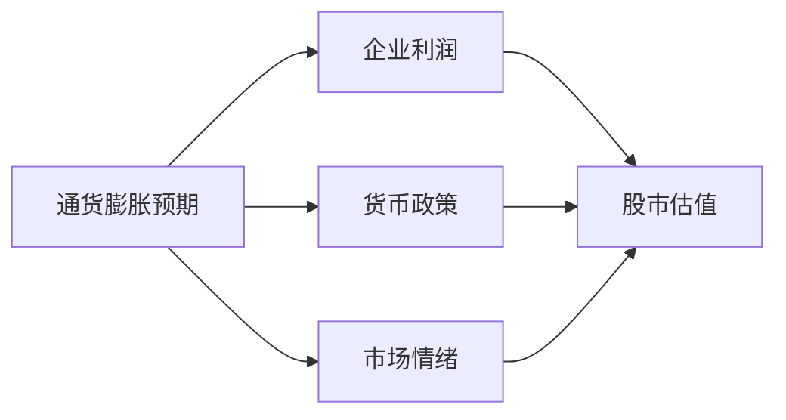

                 


# 全球股市估值与通货膨胀预期的关系

## 关键词：
全球股市估值、通货膨胀预期、经济模型、统计分析、投资策略

## 摘要：
本文系统探讨了全球股市估值与通货膨胀预期之间的复杂关系。通过分析通货膨胀预期对股市估值的影响路径，结合经济学理论和实证研究，揭示了两者之间的动态互动。文章从定义、模型构建到实证分析，层层深入，旨在为投资者和经济学家提供理论支持和实践指导。

---

# 第1章: 背景介绍与核心概念

## 1.1 问题背景

### 1.1.1 通货膨胀与股市估值的双重重要性
通货膨胀是经济学中的核心概念，影响着企业的成本、消费者价格和市场预期。股市估值则是投资者评估市场健康状况的重要指标，反映了市场的整体信心和经济基本面。

### 1.1.2 全球化背景下的挑战
全球化使得经济变量的传导机制更加复杂，通货膨胀预期和股市估值之间的关系也变得更加动态和多变。投资者需要理解这两者之间的关系，以制定有效的投资策略。

### 1.1.3 问题的重要性
理解通货膨胀预期对股市估值的影响，有助于投资者在经济波动中做出更明智的决策，同时也为政策制定者提供了重要的参考。

## 1.2 核心概念定义

### 1.2.1 通货膨胀的定义与度量
通货膨胀是指物价总水平的持续上涨。常用的度量指标包括消费者价格指数（CPI）和生产者价格指数（PPI）。

### 1.2.2 股市估值的定义与方法
股市估值是通过股票价格与企业盈利、现金流等指标的对比，评估市场的整体价值。常用的方法包括市盈率（P/E）和市净率（P/B）。

### 1.2.3 通货膨胀预期的形成机制
通货膨胀预期是市场参与者对未来通胀水平的预测，受政策、经济数据和市场情绪等多种因素影响。

---

# 第2章: 核心概念原理

## 2.1 通货膨胀预期对股市估值的影响路径

### 2.1.1 利润侵蚀效应
通货膨胀会增加企业的运营成本，可能导致企业利润下降，进而影响股市估值。

### 2.1.2 货币政策的影响
中央银行的货币政策（如加息）旨在抑制通货膨胀，但可能会影响市场流动性，进而影响股市估值。

### 2.1.3 市场情绪的作用
通货膨胀预期可能引发市场恐慌，导致投资者抛售资产，从而影响股市估值。

## 2.2 核心概念属性对比

### 2.2.1 通货膨胀预期的属性特征
- **时间性**：预期通常基于对未来一段时间的预测。
- **波动性**：受经济数据和政策变化的影响较大。
- **主观性**：不同投资者的预期可能差异显著。

### 2.2.2 股市估值的属性特征
- **波动性**：受市场情绪和经济数据的影响较大。
- **复杂性**：涉及多种因素，如企业盈利、市场流动性等。
- **可测性**：可以通过多种指标量化评估。

### 2.2.3 实体关系图


---

# 第3章: 通货膨胀预期的计量模型

## 3.1 模型原理

### 3.1.1 菲利普斯曲线模型
菲利普斯曲线描述了通货膨胀率与失业率之间的关系，常用于预测通货膨胀预期。

$$ \pi_t = \beta (u_t - \pi_t) + \epsilon_t $$

其中，$\pi_t$ 是通货膨胀率，$u_t$ 是失业率，$\beta$ 是参数，$\epsilon_t$ 是误差项。

### 3.1.2 预期通货膨胀模型
基于理性预期理论，投资者会根据历史数据和未来信息形成通货膨胀预期。

$$ E[\pi_{t+1}] = \alpha \pi_t + (1 - \alpha) \pi_{t-1} $$

其中，$E[\pi_{t+1}]$ 是对未来通货膨胀的预期，$\alpha$ 是权重参数。

## 3.2 模型实现

### 3.2.1 数据准备
- 使用历史CPI数据计算通货膨胀率。
- 收集相关经济指标，如GDP增长率、失业率等。

### 3.2.2 模型训练
- 使用回归分析估计模型参数。
- 验证模型的拟合优度和预测能力。

---

# 第4章: 股市估值模型与通货膨胀的关系

## 4.1 股市估值模型

### 4.1.1 市盈率模型
市盈率（P/E）是股票价格与每股收益的比率，反映市场的估值水平。

$$ P/E = \frac{P}{E} $$

### 4.1.2 市净率模型
市净率（P/B）是股票价格与每股净资产的比率，用于评估市场的估值水平。

$$ P/B = \frac{P}{B} $$

## 4.2 通货膨胀对股市估值的影响

### 4.2.1 利润侵蚀效应
通货膨胀会增加企业的运营成本，降低企业的净利润，从而影响股市估值。

### 4.2.2 货币政策的影响
中央银行的加息政策会增加企业的融资成本，降低市场流动性，进而影响股市估值。

### 4.2.3 市场情绪的作用
通货膨胀预期可能引发市场恐慌，导致投资者抛售资产，从而影响股市估值。

---

# 第5章: 统计分析与实证研究

## 5.1 数据收集与处理

### 5.1.1 数据来源
- 使用历史CPI数据计算通货膨胀率。
- 收集股票指数数据，如标普500指数。

### 5.1.2 数据清洗与预处理
- 去除缺失值和异常值。
- 标准化处理数据。

## 5.2 统计分析方法

### 5.2.1 时间序列分析
使用ARIMA模型分析通货膨胀率和股市估值的时间序列数据。

### 5.2.2 回归分析
建立通货膨胀预期与股市估值的回归模型，检验两者之间的关系。

### 5.2.3 联立方程模型
构建联立方程模型，分析通货膨胀预期、货币政策和股市估值之间的相互影响。

---

# 第6章: 系统架构与项目实战

## 6.1 系统架构设计

### 6.1.1 功能模块划分
- 数据输入模块：接收经济指标和股票数据。
- 数据处理模块：清洗和预处理数据。
- 模型计算模块：运行通货膨胀预期和股市估值模型。
- 结果展示模块：可视化分析结果。

### 6.1.2 系统架构图


## 6.2 项目实战

### 6.2.1 环境安装
- 安装Python和相关库（如pandas、numpy、statsmodels）。

### 6.2.2 核心代码实现

```python
import pandas as pd
import numpy as np
from statsmodels.tsa.arima.model import ARIMA

# 数据准备
data = pd.read_csv('economic_data.csv')
inflation = data['inflation'].values
stock_val = data['stock_val'].values

# 时间序列分析
model = ARIMA(inflation, order=(1, 1, 1))
model_fit = model.fit()

# 回归分析
X = inflation[:-1]
y = stock_val[1:]
slope, intercept = np.polyfit(X, y, 1)
```

### 6.2.3 实例分析
- 使用历史数据验证模型的预测能力。
- 分析通货膨胀预期对股市估值的实际影响。

---

# 第7章: 最佳实践与小结

## 7.1 最佳实践 tips
- 在实际投资中，结合多种模型和指标进行分析。
- 定期更新模型，以适应经济环境的变化。

## 7.2 小结
本文系统探讨了通货膨胀预期与股市估值之间的关系，通过理论分析和实证研究，揭示了两者之间的动态互动。投资者和政策制定者可以利用这些研究成果，制定更有效的投资和货币政策。

## 7.3 注意事项
- 模型的预测能力受数据质量和经济环境的影响。
- 需要结合实际情况对模型进行调整和优化。

## 7.4 拓展阅读
- 推荐阅读相关领域的经典文献，如菲利普斯曲线和理性预期理论。

---

通过以上结构，本文系统地探讨了全球股市估值与通货膨胀预期的关系，从理论到实践，为读者提供了全面的分析和指导。

