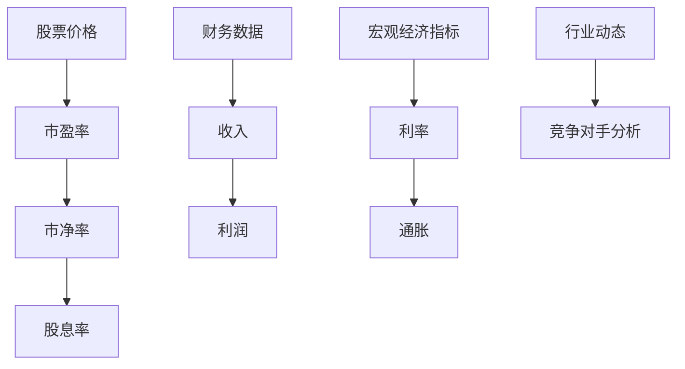
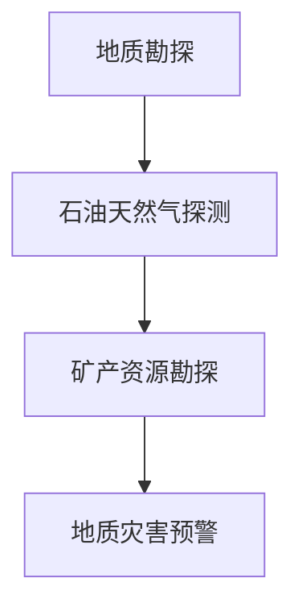
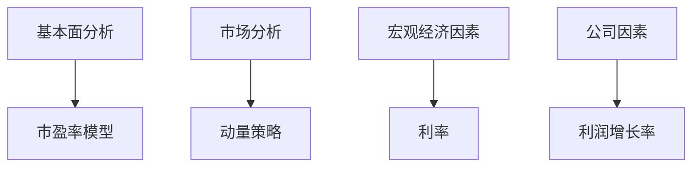

                 


# 全球股市估值与量子传感器在地质勘探中的应用

## 关键词：
全球股市估值，量子传感器，地质勘探，金融建模，传感器技术

## 摘要：
本文探讨了全球股市估值与量子传感器技术在地质勘探中的应用。通过分析股市估值的核心概念与量子传感器的技术原理，揭示了两者之间的潜在联系。文章详细介绍了量子传感器如何应用于地质勘探，以及这些数据如何用于改进股市估值模型。结合实际案例和系统设计，展示了量子传感器在金融建模中的创新应用，为未来的研究提供了新的视角。

---

# 全球股市估值与量子传感器在地质勘探中的应用

## 第1章: 全球股市估值与量子传感器的背景与概述

### 1.1 全球股市估值的背景与意义

#### 1.1.1 股市估值的核心概念与问题背景
股市估值是通过对公司基本面分析和市场趋势预测，确定股票合理价格的过程。核心概念包括市盈率（P/E）、市净率（P/B）和股息率等指标。股市波动性、宏观经济因素和公司财务状况是影响估值的主要因素。传统估值方法依赖历史数据和统计模型，但存在预测精度不足的问题。

#### 1.1.2 股市估值的边界与外延
股市估值的边界在于市场的不确定性和数据的局限性。外延包括宏观经济分析、行业趋势研究和公司特定因素分析。新兴技术如人工智能和大数据分析为股市估值提供了新的工具和方法。

#### 1.1.3 股市估值的核心要素与组成结构
核心要素包括公司财务数据（收入、利润）、市场环境（利率、通胀）和行业动态。组成结构包括数据采集、模型构建、预测分析和结果解读四个阶段。

#### 1.1.4 图1-1: 股市估值的核心要素结构图


### 1.2 量子传感器在地质勘探中的应用背景

#### 1.2.1 量子传感器的基本概念与原理
量子传感器利用量子纠缠和叠加原理测量物理参数，如磁场和重力场。其原理基于量子干涉和量子测量技术，具有高灵敏度和高精度的特点。

#### 1.2.2 量子传感器在地质勘探中的优势
量子传感器可以检测地下资源分布、构造断裂和地震风险。其优势包括高灵敏度、非侵入性和实时监测能力。

#### 1.2.3 量子传感器的应用场景与边界
应用场景包括石油天然气勘探、矿产资源探测和地质灾害预警。边界在于技术成本高、数据处理复杂和应用场景有限。

#### 1.2.4 图1-2: 量子传感器在地质勘探中的应用场景


### 1.3 全球股市估值与量子传感器的结合点

#### 1.3.1 股市估值与地质勘探的潜在联系
股市估值与地质资源分布可能存在间接联系。例如，能源股价格受石油勘探成果影响。

#### 1.3.2 量子传感器技术在股市估值中的应用前景
量子传感器的数据可用于分析公司资源储量，进而影响股票估值。例如，油气公司通过量子传感器提高储量预测精度，从而提升股价。

#### 1.3.3 两者的协同效应与创新点
量子传感器技术提高了地质勘探的准确性，为能源公司提供了更可靠的资源数据，进而优化股市估值模型。这种协同效应为金融建模提供了新工具。

## 第2章: 全球股市估值的核心概念与原理

### 2.1 股市估值的基本原理

#### 2.1.1 股市估值的定义与核心要素
股市估值是对股票内在价值的估计，核心要素包括公司财务状况、行业地位和宏观经济环境。

#### 2.1.2 股市估值的主要方法与模型
常用方法包括基本面分析（如市盈率模型）和市场分析（如动量策略）。模型如CAPM（资本资产定价模型）用于评估股票的预期收益。

#### 2.1.3 股市估值的关键影响因素
宏观经济因素（如GDP增长率、利率）和公司特定因素（如利润增长率）是主要影响因素。

#### 2.1.4 图2-1: 股市估值的主要方法对比


### 2.2 量子传感器的技术原理与特征

#### 2.2.1 量子传感器的基本工作原理
量子传感器通过测量量子态的变化来检测物理参数。例如，量子干涉仪用于测量微小的重力变化。

#### 2.2.2 量子传感器的核心技术特征
高灵敏度、高精度和非侵入性是其主要特点。量子传感器能够检测传统传感器无法察觉的微小变化。

#### 2.2.3 量子传感器的性能指标与优劣势对比
性能指标包括灵敏度、分辨率和测量速度。优势是高精度，劣势是技术复杂性和高成本。

#### 2.2.4 表2-1: 量子传感器与传统传感器对比
| 参数         | 量子传感器 | 传统传感器 |
|--------------|------------|------------|
| 灵敏度       | 高         | 中         |
| 成本         | 高         | 低         |
| 复杂度       | 高         | 低         |

### 2.3 股市估值与量子传感器的关联性分析

#### 2.3.1 股市估值与量子传感器的技术结合点
量子传感器提供高精度的地质数据，可用于评估能源公司的资源储量，进而影响股票估值。

#### 2.3.2 量子传感器数据在股市估值中的应用潜力
通过量子传感器提高勘探精度，能源公司的储量预测更准确，投资者可以做出更明智的投资决策。

#### 2.3.3 两者的协同效应与创新点
量子传感器技术为股市估值提供了新的数据源，提高了估值的准确性和可靠性。这种协同效应推动了金融建模的创新。

## 第3章: 股市估值与量子传感器的核心概念对比

### 3.1 股市估值与量子传感器的技术对比

#### 3.1.1 股市估值的核心技术与实现方法
包括基本面分析和统计模型的应用。例如，CAPM模型用于评估股票的预期收益。

#### 3.1.2 量子传感器的核心技术与实现方法
量子传感器依赖于量子干涉和量子测量技术，例如利用光子的干涉效应检测微小的重力变化。

#### 3.1.3 股市估值与量子传感器的技术对比分析
股市估值依赖于金融模型和市场数据，而量子传感器依赖于物理测量技术。两者结合可以提供更全面的分析工具。

### 3.2 股市估值与量子传感器的协同效应分析

#### 3.2.1 股市估值与量子传感器的协同优势
量子传感器提供高精度的地质数据，帮助投资者更准确地评估能源公司的资源储量，进而优化股市估值模型。

#### 3.2.2 股市估值与量子传感器的协同劣势
技术成本高、数据处理复杂和应用场景有限是主要劣势。

#### 3.2.3 协同效应的创新点
通过量子传感器技术提高地质勘探的准确性，为股市估值提供更可靠的数据支持，推动金融建模的创新。

## 第4章: 股市估值与量子传感器的协同应用

### 4.1 股市估值与量子传感器的协同应用背景

#### 4.1.1 股市估值与量子传感器的协同应用背景
随着量子技术的发展，其在地质勘探中的应用日益广泛，为股市估值提供了新的数据来源。

#### 4.1.2 股市估值与量子传感器协同应用的意义
通过结合量子传感器数据，股市估值模型可以更准确地评估能源公司的资源储量，提高估值的可靠性。

### 4.2 股市估值与量子传感器协同应用的实现方法

#### 4.2.1 股市估值与量子传感器协同应用的技术实现
量子传感器数据通过接口集成到股市估值系统中，利用机器学习算法进行数据融合和预测分析。

#### 4.2.2 股市估值与量子传感器协同应用的系统架构
系统架构包括数据采集、数据处理、模型构建和结果展示四个模块。

#### 4.2.3 股市估值与量子传感器协同应用的实现步骤
1. 数据采集：通过量子传感器获取地质数据。
2. 数据处理：清洗和预处理数据。
3. 模型构建：建立股市估值模型，集成量子传感器数据。
4. 结果展示：可视化分析结果，辅助投资决策。

### 4.3 股市估值与量子传感器协同应用的案例分析

#### 4.3.1 案例背景
某能源公司利用量子传感器技术提高石油勘探的准确性，进而优化股票估值。

#### 4.3.2 数据采集与处理
量子传感器测量地质数据，数据通过接口传输到估值系统。

#### 4.3.3 模型构建与分析
利用机器学习算法，结合量子传感器数据和公司财务数据，构建更准确的估值模型。

#### 4.3.4 结果展示与解读
通过可视化工具展示分析结果，投资者可以根据更准确的数据做出投资决策。

### 4.4 协同应用的总结与展望

#### 4.4.1 协同应用的总结
量子传感器技术为股市估值提供了新的数据源，提高了估值的准确性和可靠性。

#### 4.4.2 协同应用的展望
未来，随着量子技术的发展，其在股市估值中的应用将更加广泛，推动金融建模的创新。

## 第5章: 项目实战与系统实现

### 5.1 环境安装与配置

#### 5.1.1 软件环境
安装Python、NumPy、Pandas和Matplotlib等库。

#### 5.1.2 硬件环境
配置量子传感器和相关数据接口。

### 5.2 核心代码实现

#### 5.2.1 数据采集与处理
```python
import numpy as np
import pandas as pd

# 读取量子传感器数据
data = pd.read_csv('quantum_sensor_data.csv')

# 数据清洗
data.dropna(inplace=True)
data = data[~data['value'].isnull()]
```

#### 5.2.2 股市估值模型构建
```python
from sklearn.linear_model import LinearRegression

# 建立线性回归模型
model = LinearRegression()
model.fit(X, y)

# 预测股票价格
predicted_price = model.predict(new_X)
```

#### 5.2.3 数据可视化与分析
```python
import matplotlib.pyplot as plt

# 绘制散点图
plt.scatter(data['quantum_value'], data['stock_price'])
plt.xlabel('Quantum Sensor Value')
plt.ylabel('Stock Price')
plt.show()
```

### 5.3 项目小结

#### 5.3.1 项目实现的关键点
量子传感器数据的采集与处理、模型构建和可视化分析是项目的关键步骤。

#### 5.3.2 项目实现的注意事项
确保数据接口的兼容性，选择合适的模型和算法，优化数据处理流程。

## 第6章: 最佳实践与总结

### 6.1 小结

#### 6.1.1 核心概念总结
本文探讨了全球股市估值与量子传感器技术的应用，揭示了两者的协同效应。

#### 6.1.2 技术实现总结
通过量子传感器技术提高股市估值的准确性，为投资者提供更可靠的数据支持。

### 6.2 注意事项

#### 6.2.1 技术实施的注意事项
确保技术的可行性和经济性，合理配置资源。

#### 6.2.2 应用中的注意事项
关注数据隐私和安全，遵守相关法律法规。

### 6.3 拓展阅读

#### 6.3.1 推荐书籍
1. 《量子计算入门》
2. 《金融数据分析与建模》

#### 6.3.2 推荐文章
1. "量子传感器在能源勘探中的应用"
2. "股市估值的新技术与方法"

## 第7章: 结论与展望

### 7.1 研究结论

#### 7.1.1 核心研究成果
量子传感器技术为股市估值提供了新的数据源，提高了估值的准确性和可靠性。

#### 7.1.2 技术创新点
将量子传感器应用于股市估值，推动金融建模的创新。

### 7.2 未来展望

#### 7.2.1 技术发展趋势
量子传感器技术的进步将进一步推动其在金融领域的应用。

#### 7.2.2 应用前景展望
随着技术的发展，量子传感器在股市估值中的应用将更加广泛，为投资者提供更精准的数据支持。

---

## 致谢

感谢读者的耐心阅读，希望本文能为全球股市估值与量子传感器技术的研究提供新的思路和方向。

