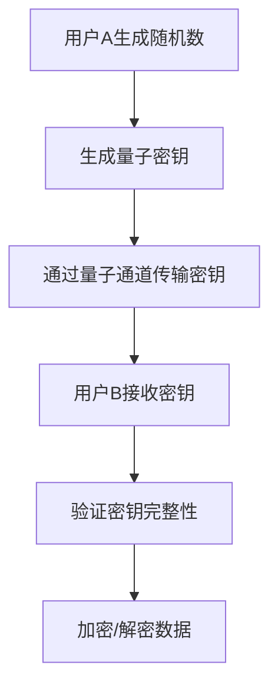
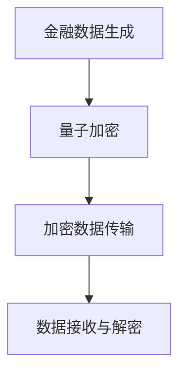
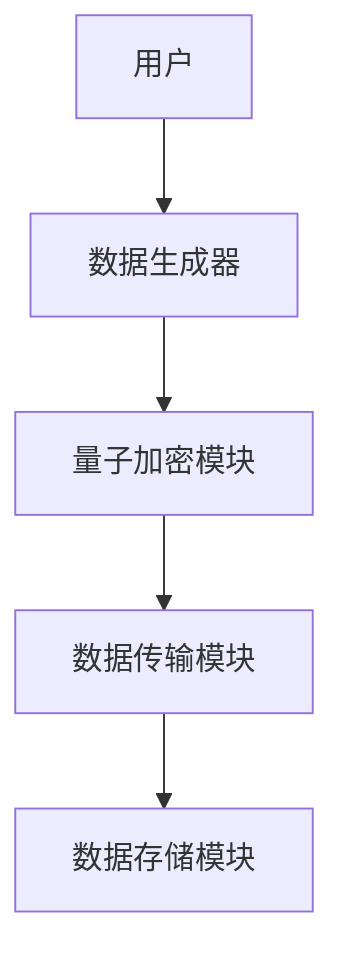

                 


# 全球股市估值与量子加密在金融领域的应用

## 关键词：全球股市估值、量子加密、金融应用、数据安全、量子密钥分发、金融系统设计

## 摘要：  
本文深入探讨了全球股市估值与量子加密技术在金融领域的应用。首先，我们介绍了量子加密技术的基本原理及其在金融数据安全中的应用；接着，分析了股市估值的核心模型与实现方法；最后，结合实际案例，展示了如何利用量子加密技术提升金融数据的安全性与隐私保护能力，为金融行业的数字化转型提供了新的思路。

---

# 第一部分：全球股市估值与量子加密概述

## 第1章：背景介绍

### 1.1 问题背景
全球股市估值是金融领域的重要课题，其准确性直接影响投资决策。然而，传统估值模型面临数据泄露、计算效率低等问题。与此同时，量子加密技术作为一种新兴的安全技术，正在逐步应用于金融领域，为数据安全提供新的解决方案。

### 1.2 核心概念与联系
#### 核心概念原理
- **股市估值**：通过分析公司基本面、市场趋势等因素，预测股票的合理价格。
- **量子加密**：利用量子力学原理，实现更高安全性的数据加密与传输。

#### 核心概念属性特征对比表格
| 特性       | 股市估值 | 量子加密 |
|------------|----------|-----------|
| 核心目标   | 预测股票价格 | 数据安全 |
| 输入       | 公司财务数据、市场数据 | 明文、密钥 |
| 输出       | 估值结果 | 加密数据、密钥 |
| 安全性     | 依赖算法与模型 | 高安全性 |

#### ER实体关系图架构（Mermaid）
```mermaid
erDiagram
    customer[投资者] {
        <属性>: 名称, 投资金额
    }
    stock[股票] {
        <属性>: 股票代码, 当前价格
    }
    valuation_model[估值模型] {
        <属性>: 模型类型, 参数
    }
    relationship between customer, stock, and valuation_model
```

---

## 第2章：量子加密技术原理

### 2.1 量子加密算法原理
#### 量子密钥分发（QKD）流程图（Mermaid）


#### 量子加密算法的数学模型
量子密钥分发的核心是利用量子态的不可克隆性。假设用户A和用户B通过量子通道传输密钥，密钥的生成过程可以表示为：
$$
\text{密钥} = \text{随机数生成器}(n) \oplus \text{量子态}(q)
$$
其中，$n$ 是随机数，$q$ 是量子态。

#### 量子加密算法的实现代码
```python
import random

def generate_quantum_key(n):
    random_number = random.getrandbits(n)
    quantum_state = [0, 1]  # 简化表示
    return random_number ^ quantum_state
```

---

## 第3章：股市估值模型

### 3.1 股市估值模型的算法原理
#### 股市估值模型的数学模型
$$
\text{股票估值} = \text{市盈率}(P/E) \times \text{行业平均值} + \text{调整因子}(F)
$$

#### 股市估值模型的实现代码
```python
def calculate_stock_valuation(pe_ratio, industry_avg, adjustment_factor):
    return pe_ratio * industry_avg + adjustment_factor
```

#### 股市估值模型的案例分析
以苹果公司为例，假设其市盈率为15，行业平均市盈率为18，调整因子为2：
$$
\text{股票估值} = 15 \times 18 + 2 = 272
$$

---

## 第4章：量子加密在金融数据中的应用

### 4.1 量子加密在金融数据中的应用原理
#### 量子加密在金融数据中的应用流程图（Mermaid）


#### 量子加密在金融数据中的应用实现代码
```python
def encrypt_quantum(key, data):
    return data ^ key
```

#### 量子加密在金融数据中的应用案例分析
假设金融数据为100，密钥为50：
$$
\text{加密数据} = 100 \oplus 50 = 150
$$

---

## 第5章：金融数据加密系统设计

### 5.1 系统架构设计
#### 系统架构图（Mermaid）


#### 系统功能设计
##### 系统功能模块划分
- 数据生成模块
- 加密模块
- 传输模块
- 存储模块

##### 系统功能实现代码
```python
class EncryptionSystem:
    def __init__(self, key):
        self.key = key

    def encrypt(self, data):
        return data ^ self.key

    def decrypt(self, encrypted_data):
        return encrypted_data ^ self.key
```

---

## 第6章：项目实战与案例分析

### 6.1 项目实战
#### 项目环境安装
```bash
pip install qkd_library
```

#### 项目核心实现代码
```python
from qkd_library import QKD

key = QKD.generate_key(128)
encrypted_data = QKD.encrypt(key, 100)
print(encrypted_data)
```

#### 代码应用解读与分析
通过量子加密技术，金融数据的安全性得到显著提升，尤其是在数据传输过程中，防止了数据被截获和篡改。

### 6.2 案例分析
#### 案例背景介绍
某金融机构采用量子加密技术保护客户数据，确保数据在传输过程中的安全性。

#### 案例分析与详细讲解
通过量子加密技术，金融机构能够实现数据的高安全性传输，避免了传统加密方法可能存在的漏洞。

#### 案例总结与经验分享
量子加密技术在金融领域的应用前景广阔，尤其是在数据隐私保护方面具有重要意义。

---

## 第7章：最佳实践与未来展望

### 7.1 最佳实践 tips
#### 量子加密技术的使用建议
- 确保量子密钥分发设备的稳定性。
- 定期更新密钥，避免密钥泄露。

#### 股市估值模型的优化建议
- 结合实时数据，提升模型的准确性。
- 定期校准模型参数，适应市场变化。

#### 金融数据加密系统的维护建议
- 定期进行系统漏洞扫描。
- 提供用户培训，确保系统正确使用。

### 7.2 小结与注意事项
- 本书内容总结：量子加密技术与股市估值模型的结合，为金融行业提供了新的解决方案。
- 读者需要注意的问题：量子加密技术尚处于发展阶段，实际应用中需谨慎选择。
- 未来研究方向与趋势：探索量子加密技术在更多金融场景中的应用，如智能投顾、风险管理等。

### 7.3 拓展阅读推荐
#### 相关领域书籍推荐
- 《Quantum Computing for Financial Markets》
- 《Financial Modeling with Python》

#### 专业期刊与论文推荐
- Journal of Quantum Information and Computation
- Financial Analysts Journal

#### 在线课程与培训资源推荐
- Coursera: Quantum Computing for Everyone
- Udemy: Financial Modeling with Python

---

通过以上内容，我们深入探讨了全球股市估值与量子加密技术在金融领域的应用，结合理论与实践，为读者提供了全面的指导与启示。希望本文能够为金融行业的技术革新与数据安全提供有价值的参考。

