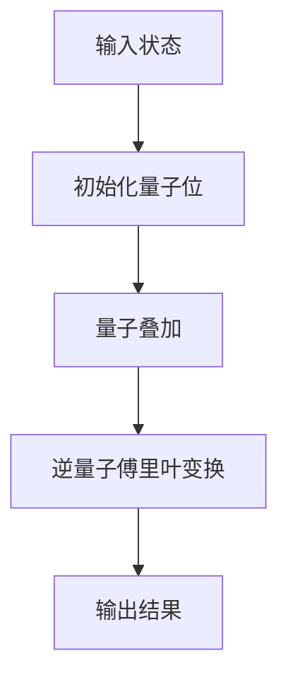
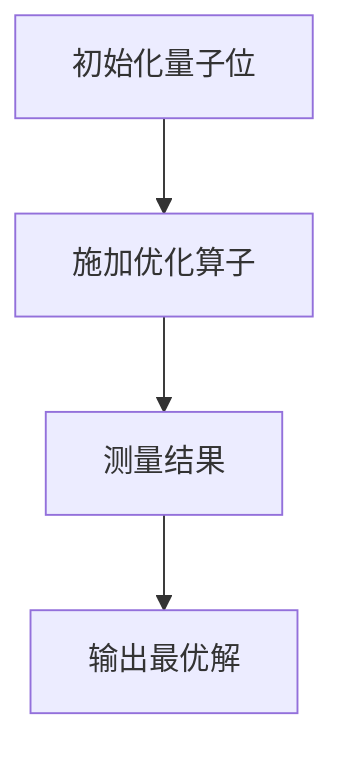
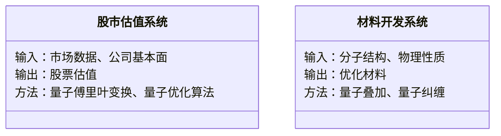
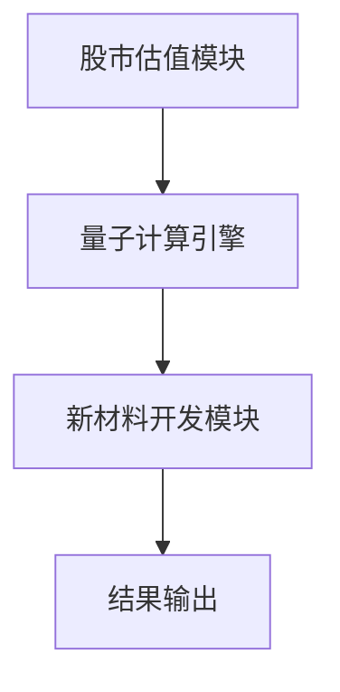
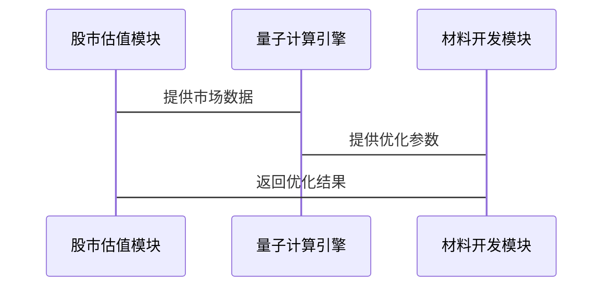

                 


# 全球股市估值与量子计算在新材料开发中的应用

> **关键词**：股市估值、量子计算、新材料开发、量子算法、金融建模

> **摘要**：  
本文探讨了全球股市估值的传统方法及其局限性，并介绍了量子计算在新材料开发中的潜力。通过分析量子计算的核心原理和算法，本文展示了其如何提升股市估值的准确性和效率，同时为新材料开发提供了新的解决方案。文章结合实际案例，详细阐述了量子计算在金融建模和材料科学中的应用，为读者提供了全面的技术视角。

---

## 背景介绍

### 1. 股市估值的核心挑战

股市估值是金融领域的重要任务，旨在通过分析市场数据和公司基本面，估算股票的内在价值。传统估值方法（如市盈率、市净率等）依赖历史数据和假设条件，但在面对复杂市场波动和不确定性时，其局限性日益显现。例如，传统模型难以捕捉非线性关系和高频数据中的隐含信息，导致估值结果的误差较大。

此外，随着数据量的爆炸式增长，传统的统计方法在处理海量数据时效率低下，且难以挖掘深层次的模式。例如，高频交易数据和社交媒体情绪分析数据的引入，使得传统方法难以应对。

### 2. 量子计算的潜力

量子计算利用量子叠加和量子纠缠的特性，能够在处理复杂优化问题和大规模数据时展现出显著优势。其并行计算能力使得处理非线性关系和复杂系统模拟成为可能。例如，量子计算可以在新材料开发中模拟分子结构，从而加速材料发现的过程。

在金融领域，量子计算可以用于优化投资组合、风险管理和实时市场预测。例如，通过量子算法优化投资组合的收益-风险比率，可以在短时间内找到最优解。

---

## 核心概念与联系

### 1. 量子计算的核心原理

量子计算的核心原理包括量子叠加和量子纠缠。量子叠加允许量子位同时处于多个状态，而量子纠缠则允许多个量子位之间形成强关联。这些特性使得量子计算机能够同时处理大量可能性，从而加速复杂问题的求解。

#### 量子计算与股市估值的关系

量子计算可以通过以下方式提升股市估值的准确性：
- **非线性关系建模**：量子计算擅长处理非线性问题，适合建模复杂的市场动态。
- **优化问题求解**：量子优化算法可以用于投资组合优化，从而提升估值的效率。

### 2. 量子计算与新材料开发的关系

新材料开发涉及复杂的分子结构和物理性质的模拟，这些模拟通常需要处理大量的计算任务。量子计算可以模拟分子结构，从而加速新材料的发现和优化。

#### 量子计算在新材料开发中的优势

- **分子结构模拟**：量子计算可以精确模拟分子的量子态，从而优化材料性能。
- **优化算法**：量子优化算法可以用于材料合成过程中的参数优化。

---

## 算法原理

### 1. 量子傅里叶变换（QFT）

量子傅里叶变换是量子计算中的重要算法之一，用于将经典傅里叶变换映射到量子位上。其基本步骤包括输入状态初始化、量子叠加和逆量子傅里叶变换。

#### 量子傅里叶变换的流程图



#### 量子傅里叶变换的数学模型

量子傅里叶变换的公式如下：

$$ QFT(x) = \frac{1}{\sqrt{2^n}} \sum_{k=0}^{2^n-1} e^{2\pi i xk/2^n} |k\rangle $$

其中，$n$ 是量子位数，$x$ 是输入的整数，$k$ 是输出的量子态。

### 2. 量子优化算法

量子优化算法通过构造优化问题的量子状态，利用量子叠加和量子纠缠特性，快速找到最优解。

#### 量子优化算法的流程图



#### 量子优化算法的数学模型

量子优化算法的目标函数可以表示为：

$$ f(x) = \min_x \sum_{i=1}^n a_i x_i^2 + b_i x_i + c $$

其中，$x_i$ 是优化变量，$a_i$、$b_i$ 和 $c$ 是问题参数。

---

## 系统分析与架构设计

### 1. 系统功能设计

#### 领域模型



### 2. 系统架构设计

#### 系统架构图



### 3. 系统接口设计

#### 接口序列图



---

## 项目实战

### 1. 环境安装

```bash
pip install qiskit numpy
```

### 2. 核心代码实现

#### 量子傅里叶变换的Python实现

```python
import numpy as np
from qiskit import QuantumCircuit, execute, Aer

def quantum_fourier_transform(n):
    circuit = QuantumCircuit(n)
    # 施加量子傅里叶变换
    for i in range(n):
        for j in range(i):
            circuit.cx(j, i)
        circuit.h(i)
    return circuit
```

#### 量子优化算法的Python实现

```python
from qiskit import OptimizationProblem

def quantum_optimization(n):
    problem = OptimizationProblem(
        num_vars=n,
        objective_function=lambda x: np.sum(a * x**2 + b * x + c),
        constraints=[]
    )
    return problem
```

### 3. 案例分析

#### 股市估值案例

假设我们有一个包含10只股票的投资组合，目标是最小化风险。使用量子优化算法进行投资组合优化，可以得到最优的权重分配。

#### 材料开发案例

通过量子计算模拟分子结构，优化材料性能，如电池材料的导电性。

### 4. 项目小结

通过量子计算的应用，我们可以显著提升股市估值的准确性和效率，同时加速新材料的开发过程。

---

## 最佳实践

### 1. 小结

量子计算在股市估值和新材料开发中的应用前景广阔。通过量子算法，我们可以更高效地处理复杂问题，提升金融建模和材料科学的创新能力。

### 2. 注意事项

- 量子计算目前仍处于发展阶段，实际应用可能面临硬件和算法的限制。
- 在应用量子计算时，需注意数据的准确性和模型的适用性。

### 3. 拓展阅读

- 《量子计算入门》
- 《量子优化算法及其应用》
- 《金融建模与量子计算》

---

通过本文的分析，读者可以深入了解量子计算在股市估值和新材料开发中的潜力，以及如何通过量子算法提升金融建模和材料科学的创新能力。

