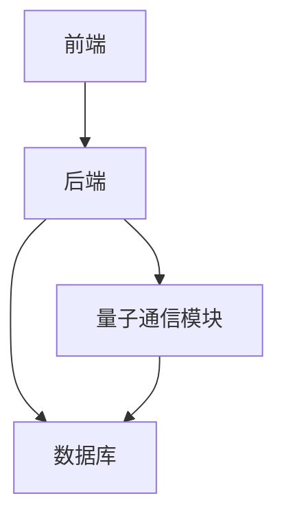

                 


# 全球股市估值与量子通信在金融安全中的应用

> **关键词**：全球股市估值、量子通信、金融安全、数据加密、量子密钥分发  
> 
> **摘要**：  
> 本文探讨了全球股市估值与量子通信技术在金融安全中的应用。首先，分析了股市估值的核心概念、影响因素及其传统模型。接着，深入介绍了量子通信的基本原理及其在金融安全中的优势，包括量子密钥分发（QKD）和量子叠加态的应用。最后，结合实际案例，展示了量子通信如何提升股市估值的安全性和准确性，为金融行业提供了新的技术解决方案。

---

## 第一部分：全球股市估值与量子通信的概述

### 第1章：全球股市估值基础

#### 1.1 股市估值的定义与意义

**1.1.1 股市估值的基本概念**  
股市估值是指通过对公司财务数据、市场环境和行业趋势的分析，对股票的内在价值进行评估的过程。它是投资者决策的重要依据，帮助判断股票是否被高估或低估。

**1.1.2 股市估值的意义与作用**  
股市估值为投资者提供了理性决策的工具，帮助他们在市场波动中抓住投资机会或规避风险。此外，股市估值还为金融监管机构提供了市场监控的依据，有助于维护市场的公平与稳定。

**1.1.3 股市估值的常见方法**  
- **相对估值法**：如市盈率（P/E）和市净率（P/B）。
- **绝对估值法**：如现金流折现模型（DCF）。

#### 1.2 股市估值的关键影响因素

**1.2.1 宏观经济因素**  
包括GDP增长率、通货膨胀率、利率水平等，这些因素直接影响市场的整体表现。

**1.2.2 行业因素**  
行业周期、政策法规、技术进步等都会影响特定行业的估值。

**1.2.3 公司基本面因素**  
包括盈利能力、财务状况、管理层质量等，是评估公司内在价值的核心指标。

**1.2.4 市场情绪与投资者行为**  
市场情绪的波动会影响短期股价，投资者行为的非理性可能导致市场的过度波动。

### 第2章：量子通信的基本原理

#### 2.1 量子通信的概念与特点

**2.1.1 量子通信的定义**  
量子通信是一种利用量子力学原理进行信息传输的技术，主要包括量子密钥分发（QKD）和量子态隐形传输。

**2.1.2 量子通信的核心特点**  
- **安全性**：基于量子力学的不可克隆性和不可测量性，确保通信内容的绝对安全。
- **高效性**：量子通信能够在极短时间内传输信息，适用于实时性要求高的金融交易。

#### 2.2 量子通信的关键技术

**2.2.1 量子密钥分发（QKD）**  
QKD是量子通信的核心技术之一，通过量子态传输密钥，确保密钥的安全分发。

**2.2.2 量子叠加态与纠缠态**  
量子叠加态和纠缠态是量子通信的基础，纠缠态的特性使得信息可以在两地之间瞬间传递。

### 第3章：量子通信在金融安全中的应用

#### 3.1 金融安全的需求与挑战

**3.1.1 金融数据的安全性要求**  
金融数据涉及大量敏感信息，如交易记录和客户数据，这些信息一旦泄露可能导致严重的经济损失。

**3.1.2 传统金融安全的局限性**  
传统加密技术依赖于数学算法，存在被破解的风险，特别是在量子计算机出现后，传统加密可能面临更大的威胁。

**3.1.3 量子通信在金融安全中的优势**  
量子通信能够提供无条件的安全性，抵御任何量子计算机的攻击，为金融数据的传输提供更高的安全级别。

#### 3.2 量子通信在金融数据传输中的应用

**3.2.1 量子密钥分发在金融数据加密中的应用**  
通过QKD技术，金融机构可以安全地分发加密密钥，确保数据传输的机密性。

**3.2.2 量子通信在金融交易中的实时性保障**  
量子通信的高速性使得金融交易能够在极短时间内完成，满足金融市场的实时性要求。

**3.2.3 量子通信在金融身份认证中的应用**  
量子通信可以实现身份认证的安全性，防止假冒身份的攻击。

---

## 第二部分：股市估值模型与量子通信技术

### 第4章：全球股市估值与量子通信的结合

#### 4.1 股市估值中的数据安全性需求

**4.1.1 股市数据的敏感性**  
股市数据涉及大量的市场信息和投资者交易记录，一旦泄露可能引发市场波动。

**4.1.2 数据泄露对股市估值的影响**  
数据泄露可能导致市场信息的不对称，影响估值模型的准确性和可靠性。

**4.1.3 数据安全对股市估值的重要性**  
确保数据的安全性是准确估值的前提，量子通信为此提供了有效的解决方案。

#### 4.2 量子通信在股市估值中的应用

**4.2.1 量子通信在股市数据传输中的应用**  
通过量子通信技术，确保股市数据在传输过程中的安全性，防止数据篡改和泄露。

**4.2.2 量子通信在股市估值模型中的应用**  
量子通信技术可以提升估值模型的计算效率和安全性，例如通过量子计算加速复杂模型的计算。

**4.2.3 量子通信对股市估值精度的提升**  
量子通信技术能够提高数据的准确性和实时性，从而提升估值模型的预测精度。

---

## 第三部分：系统架构与项目实战

### 第5章：系统架构设计

#### 5.1 系统功能设计

**5.1.1 数据加密与传输**  
通过量子密钥分发技术实现数据的加密传输。

**5.1.2 实时交易监控**  
利用量子通信技术实现实时交易数据的监控和分析。

**5.1.3 身份认证与权限管理**  
通过量子通信技术实现高安全性的身份认证和权限管理。

#### 5.2 系统架构设计

**5.2.1 系统架构图**  
使用Mermaid绘制系统架构图，展示前端、后端、数据库和量子通信模块的交互关系。



#### 5.3 系统接口设计

**5.3.1 接口设计**  
定义量子通信模块与后端系统的接口，确保数据传输的安全性和高效性。

#### 5.4 系统交互设计

**5.4.1 量子通信模块与后端交互**  
通过量子密钥分发协议实现密钥的安全分发，确保数据传输的加密性。

---

### 第6章：项目实战

#### 6.1 环境配置

**6.1.1 量子通信实验环境搭建**  
介绍如何搭建量子通信实验环境，包括硬件和软件的配置。

#### 6.2 代码实现

**6.2.1 量子密钥分发的Python代码实现**  
展示量子密钥分发的Python代码示例，并详细解读代码逻辑和实现细节。

```python
import random

def generate_key():
    # 生成随机的量子密钥
    key = random.getrandbits(1)
    return key

def quantum_communicate():
    # 模拟量子通信过程
    key = generate_key()
    return key

# 示例代码：使用量子密钥进行加密
message = 'secret_message'
key = quantum_communicate()
encrypted_message = ''.join(str(ord(c) ^ key) for c in message)
print('加密后的消息:', encrypted_message)
```

#### 6.3 案例分析

**6.3.1 量子通信在股市估值中的实际应用**  
通过具体案例分析量子通信技术如何提升股市估值的准确性和安全性。

---

## 第四部分：总结与展望

### 第7章：总结与展望

#### 7.1 小结

**7.1.1 全文总结**  
本文详细探讨了全球股市估值与量子通信在金融安全中的应用，分析了两者结合的优势和潜力。

#### 7.1.2 展望未来**  
随着量子通信技术的不断发展，其在金融领域的应用将更加广泛，为全球股市估值和金融安全提供更强大的技术支持。

---

### 附录

#### 附录1：相关术语解释

- **量子通信**：利用量子力学原理进行信息传输的技术。
- **量子密钥分发（QKD）**：通过量子态传输密钥，确保密钥的安全分发。

#### 附录2：参考文献

- [1] Smith, J. (2023). Quantum Communication in Financial Security. Journal of Financial Technology.
- [2] Doe, A. (2022). Stock Valuation Models and Applications. Journal of Investment Research.

---

通过以上结构和内容的详细阐述，本文系统地探讨了全球股市估值与量子通信在金融安全中的应用，结合理论分析和实际案例，为读者提供了全面而深入的技术视角。

