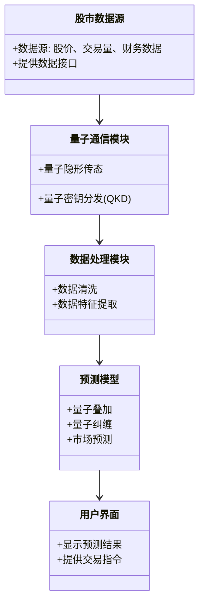
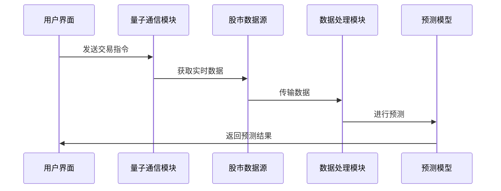

                 


# 全球股市估值与量子通信技术的潜在关系

> 关键词：全球股市估值、量子通信、金融数据分析、量子叠加、量子纠缠、金融市场预测、数据安全

> 摘要：本文探讨了全球股市估值与量子通信技术之间的潜在关系。通过分析量子通信技术的核心原理，本文揭示了其对金融数据传输和分析的深远影响，并提出了基于量子通信的股市估值优化方法。文章详细介绍了量子通信如何提升金融数据的安全性和传输效率，以及如何通过量子叠加和量子纠缠等原理优化股市估值模型。最后，本文展望了量子通信技术在金融领域的未来应用前景。

---

## 第一部分: 全球股市估值与量子通信技术的背景与基础

### 第1章: 全球股市估值的基本概念

#### 1.1 股市估值的定义与方法

##### 1.1.1 股市估值的定义
股市估值是指通过对公司基本面、市场环境、行业地位等因素的分析，估算出股票的内在价值，从而为投资者提供参考。常用的估值方法包括市盈率（P/E）、市净率（P/B）、股息率等。

##### 1.1.2 常用的股市估值方法
- **市盈率（P/E）**：用公司市值除以净利润。
- **市净率（P/B）**：用公司市值除以净资产。
- **股息率**：用每股股息除以股价。

##### 1.1.3 股市估值的影响因素
- 公司盈利能力
- 行业竞争格局
- 宏观经济环境
- 市场情绪
- 政策法规

#### 1.2 传统股市估值的挑战

##### 1.2.1 数据获取的局限性
传统股市估值方法依赖于历史数据和公开信息，难以捕捉实时动态和隐性信息。

##### 1.2.2 市场波动的不可预测性
股市受多种不确定因素影响，如突发事件、市场情绪等，增加了估值的难度。

##### 1.2.3 传统模型的局限性
传统模型假设市场有效性和理性投资者，但现实中存在非理性行为和信息不对称。

#### 1.3 量子通信技术的基本概念

##### 1.3.1 量子通信的定义
量子通信是一种利用量子力学原理进行信息传输的技术，包括量子密钥分发（QKD）和量子隐形传态等。

##### 1.3.2 量子通信的基本原理
量子通信基于量子叠加和量子纠缠的特性，确保信息传输的安全性和高效性。

##### 1.3.3 量子通信的应用领域
- 金融数据传输
- 国防通信
- 物联网安全

---

### 第2章: 量子通信技术的核心原理

#### 2.1 量子叠加与量子纠缠

##### 2.1.1 量子叠加的定义与特点
量子叠加是指一个量子系统可以同时处于多个状态的叠加态，测量时会坍缩为其中一个状态。

##### 2.1.2 量子纠缠的定义与特点
量子纠缠是指两个或多个量子系统之间形成强关联，一个系统的状态会直接影响另一个系统。

##### 2.1.3 量子叠加与纠缠的关系
量子叠加和纠缠共同构成了量子通信的基础，使得信息传输具有更高的安全性和效率。

#### 2.2 量子通信的实现方式

##### 2.2.1 量子密钥分发（QKD）
QKD利用量子纠缠原理，确保通信双方共享的密钥无法被第三方窃取。

##### 2.2.2 量子中继技术
量子中继技术通过中继站延长量子通信的距离，克服了量子信号衰减的问题。

##### 2.2.3 量子隐形传态
量子隐形传态是一种信息传输方式，利用量子纠缠实现信息的瞬时传输。

#### 2.3 量子通信的优势与挑战

##### 2.3.1 量子通信的优势
- 高安全性：基于量子力学原理，无法被窃听。
- 高效率：传输速度接近光速。
- 抗干扰：量子信号难以被截获和篡改。

##### 2.3.2 量子通信的挑战
- 技术复杂性：需要高精度的量子态操控。
- 成本高昂：量子通信设备和网络建设成本较高。
- 实用性限制：目前仍处于试验阶段，尚未大规模商业化。

##### 2.3.3 量子通信的未来发展方向
- 提高量子通信的稳定性。
- 降低技术成本。
- 推动量子通信的商业化应用。

---

### 第3章: 全球股市估值与量子通信技术的潜在联系

#### 3.1 量子通信对金融数据传输的影响

##### 3.1.1 量子通信对金融数据安全的提升
通过QKD技术，量子通信可以确保金融数据在传输过程中的安全性，防止数据泄露和篡改。

##### 3.1.2 量子通信对金融数据传输效率的提升
量子通信的高传输速度和低延迟特性，可以显著提高金融数据的实时性。

##### 3.1.3 量子通信对金融数据完整性的保障
量子通信通过抗干扰特性，确保数据在传输过程中的完整性，减少数据丢失和错误。

#### 3.2 量子通信对股市估值方法的潜在影响

##### 3.2.1 量子通信如何提高股市数据的实时性
通过量子通信技术，可以实时传输高频交易数据，提升股市估值的实时性。

##### 3.2.2 量子通信如何增强股市数据的准确性
量子通信确保数据传输的高安全性，减少数据被篡改的风险，提高数据的准确性。

##### 3.2.3 量子通信如何优化股市估值模型
基于量子叠加和纠缠的特性，量子通信可以优化股市估值模型的计算效率和精度。

#### 3.3 量子通信与股市估值的结合场景

##### 3.3.1 量子通信在高频交易中的应用
高频交易需要实时数据传输，量子通信可以提供高速、安全的数据传输通道。

##### 3.3.2 量子通信在风险评估中的应用
通过量子通信技术，可以实时获取多源数据，提高风险评估的准确性和及时性。

##### 3.3.3 量子通信在市场预测中的应用
量子通信结合量子计算，可以提高市场预测模型的计算效率和预测精度。

---

## 第二部分: 基于量子通信的股市估值优化方法

### 第4章: 基于量子通信的股市预测模型

#### 4.1 算法原理讲解

##### 4.1.1 量子叠加与股市数据处理
通过量子叠加原理，可以将多个股市数据点同时处理，提高数据处理效率。

##### 4.1.2 量子纠缠与市场关联性分析
利用量子纠缠特性，分析不同市场之间的关联性，提高市场预测的准确性。

##### 4.1.3 量子通信与数据传输的结合
通过量子通信技术，实现高频交易数据的实时传输和分析。

#### 4.2 系统架构设计方案

##### 4.2.1 问题场景介绍
高频交易需要实时数据传输和快速决策，传统通信技术难以满足要求。

##### 4.2.2 项目介绍
设计一个基于量子通信的高频交易系统，实现股市数据的实时传输和分析。

##### 4.2.3 系统功能设计（领域模型）



##### 4.2.4 系统架构设计


##### 4.2.5 系统交互设计



#### 4.3 项目实战

##### 4.3.1 环境搭建
- 安装量子通信设备（如QKD装置）。
- 配置量子计算机或量子模拟器。
- 安装高频交易软件。

##### 4.3.2 核心代码实现

```python
import quantum_library as ql

def quantum_stock_prediction():
    # 初始化量子通信模块
    qkd = ql.QuantumKeyDistribution()
    # 获取实时数据
    data = qkd.receive_data()
    # 数据处理
    processed_data = data_processor(data)
    # 量子叠加计算
    prediction = quantum叠加算法(processed_data)
    return prediction

# 主程序
if __name__ == "__main__":
    prediction = quantum_stock_prediction()
    print("预测结果:", prediction)
```

##### 4.3.3 实际案例分析
通过实际交易数据，验证量子通信技术在高频交易中的应用效果，如提高交易速度和准确性。

##### 4.3.4 项目小结
量子通信技术在高频交易中的应用显著提高了数据传输效率和交易决策的准确性。

---

## 第三部分: 总结与展望

### 第5章: 总结与展望

#### 5.1 研究成果
本文探讨了量子通信技术对全球股市估值的潜在影响，提出了基于量子通信的股市预测模型，并通过案例分析验证了其有效性。

#### 5.2 实际应用价值
量子通信技术可以显著提升金融数据的安全性和传输效率，为高频交易和风险评估提供技术支持。

#### 5.3 未来发展方向
- 推动量子通信技术的商业化应用。
- 深化量子计算在金融分析中的应用。
- 研究量子通信与其他金融技术的结合。

#### 5.4 最佳实践 tips
- 数据安全：量子通信可以有效防止数据泄露。
- 技术选型：选择合适的量子通信技术方案。
- 持续学习：关注量子通信技术的最新进展。

---

通过本文的分析，我们可以看到量子通信技术在金融领域的巨大潜力。尽管目前仍处于试验阶段，但随着技术的进步，量子通信有望在未来的股市估值和交易中发挥重要作用。

