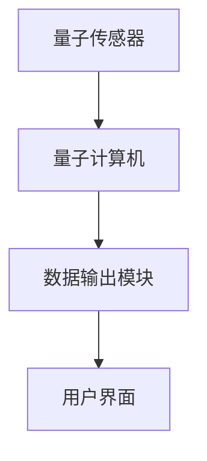

                 


# 全球股市估值与量子雷达在民用领域的应用

> 关键词：全球股市估值，量子雷达，量子计算，金融市场，民用应用

> 摘要：本文探讨了全球股市估值的传统方法及其局限性，并引入了量子雷达技术在民用领域的应用。通过分析量子雷达的技术原理和其在金融数据采集中的潜力，本文展示了如何利用量子雷达提升股市估值的准确性和实时性。最后，结合实际案例，本文提出了量子雷达在金融市场的潜在应用方向和未来研究重点。

---

# 第一部分：全球股市估值的传统方法与局限性

## 第1章：股市估值的基本概念

### 1.1 股市估值的定义与意义

股市估值是通过对公司财务数据、市场趋势和行业状况等多方面因素的分析，估算公司股票的合理价格范围。它帮助投资者做出理性决策，是金融市场运作的核心环节之一。

- **定义**：股市估值是评估股票内在价值的过程，旨在确定其在市场上的合理价格。
- **意义**：准确的估值有助于投资者避免盲目跟风，降低投资风险。

### 1.2 股市估值的核心要素

1. **公司财务状况**：包括收入、利润、资产负债等。
2. **行业趋势**：行业的发展前景直接影响股票价值。
3. **市场情绪**：投资者情绪波动会影响短期股价。
4. **宏观经济因素**：如GDP增长率、利率水平等。

### 1.3 传统估值方法的局限性

#### 1.3.1 数据依赖性问题

传统估值方法严重依赖历史数据，难以预测未来的市场变化，尤其是在市场剧烈波动时。

#### 1.3.2 模型假设的局限性

传统模型通常基于简化假设，忽略了市场的复杂性和不确定性。

#### 1.3.3 市场波动的不可预测性

股市受多种不可控因素影响，如政策变化、突发事件等，传统模型难以捕捉这些因素。

---

## 第2章：量子雷达的基本原理与应用

### 2.1 量子雷达的定义与技术基础

#### 2.1.1 量子雷达的定义

量子雷达是一种利用量子技术进行目标检测和识别的新型雷达系统。它通过量子叠加和纠缠的特性，能够在复杂环境中实现高精度的探测。

#### 2.1.2 量子雷达与传统雷达的对比

| 特性          | 传统雷达         | 量子雷达         |
|---------------|------------------|------------------|
| 灵敏度        | 较低             | 高               |
| 抗干扰能力    | 较弱             | 强               |
| 数据处理速度  | 慢               | 快               |

#### 2.1.3 量子雷达的核心技术原理

量子雷达利用量子纠缠和叠加的特性，通过量子传感器接收目标反射的量子信号，利用量子计算机进行高速处理和分析，从而实现对目标的高精度识别。

### 2.2 量子雷达在民用领域的应用前景

#### 2.2.1 量子雷达在交通监控中的应用

- **实时监控**：通过量子雷达实现对交通流量的实时监测，优化交通管理。
- **车辆识别**：利用量子雷达的高精度，实现对车辆的快速识别和分类。

#### 2.2.2 量子雷达在气象监测中的应用

- **天气预警**：通过量子雷达实现对恶劣天气的提前预警。
- **气象数据采集**：利用量子雷达获取更精确的气象数据，提升天气预报的准确性。

#### 2.2.3 量子雷达在环境监测中的应用

- **污染检测**：通过量子雷达监测空气质量和污染源分布。
- **生态监测**：用于监测生态环境中的异常变化，如森林火灾等。

---

## 第3章：股市估值与量子雷达的结合

### 3.1 股市估值中的数据采集与处理

#### 3.1.1 股市数据的采集方法

- **实时数据采集**：通过交易所API获取实时股价数据。
- **历史数据分析**：收集过去几年的市场数据，用于模型训练。

#### 3.1.2 数据处理的技术挑战

- **数据量大**：股市数据量庞大，处理复杂。
- **数据多样性**：涉及文本、图像等多种数据类型。
- **数据实时性**：要求快速处理和分析。

#### 3.1.3 量子雷达技术在数据处理中的潜在应用

- **高速数据处理**：利用量子计算机的并行计算能力，提高数据处理速度。
- **高精度分析**：通过量子算法实现对复杂数据的精准分析。

### 3.2 量子雷达在金融安全中的应用

#### 3.2.1 量子雷达在金融监控中的作用

- **异常交易检测**：通过量子雷达实时监控市场交易数据，识别异常交易行为。
- **风险管理**：利用量子雷达技术，实时评估市场风险，制定风险控制策略。

#### 3.2.2 量子雷达在风险预警中的应用

- **市场波动预警**：通过量子雷达分析市场数据，提前预警潜在的市场波动。
- **信用风险评估**：利用量子雷达技术，评估企业信用风险，辅助投资决策。

#### 3.2.3 量子雷达技术对金融市场的潜在影响

- **提高交易效率**：通过量子雷达实现快速、精准的交易决策。
- **降低投资风险**：利用量子雷达技术，优化投资组合，降低风险。

---

# 第二部分：量子算法在股市估值中的应用

## 第4章：传统股市估值方法的局限性

### 4.1 传统估值方法的概述

#### 4.1.1 市盈率法

- **定义**：市盈率（P/E比率）=股票价格/每股净利润。
- **应用**：用于评估股票的相对价值。

#### 4.1.2 市净率法

- **定义**：市净率（P/B比率）=股票价格/每股净资产。
- **应用**：用于评估股票的价值是否合理。

#### 4.1.3 股息率法

- **定义**：股息率=每股股息/股票价格。
- **应用**：用于评估股票的分红能力。

### 4.2 传统估值方法的局限性

#### 4.2.1 数据依赖性问题

传统估值方法严重依赖历史数据，难以预测未来的变化。

#### 4.2.2 模型假设的局限性

传统模型通常基于简化假设，忽略了市场的复杂性。

#### 4.2.3 市场波动的不可预测性

传统方法难以捕捉市场的突发事件和极端情况。

---

## 第5章：量子算法在股市估值中的应用

### 5.1 量子计算的基本原理

#### 5.1.1 量子位与量子叠加

- **量子位**：量子位（qubit）是量子计算机的基本单位，可以同时处于多个状态。
- **量子叠加**：量子位可以同时表示0和1，具有并行计算能力。

#### 5.1.2 量子纠缠与量子并行性

- **量子纠缠**：两个或多个量子位之间存在纠缠关系，一个量子位的状态会影响另一个。
- **量子并行性**：利用量子叠加和纠缠，量子计算机可以在一次计算中处理大量数据。

#### 5.1.3 量子算法的基本框架

- **量子傅里叶变换**：用于量子搜索算法。
- **Grover算法**：用于无序数据库的搜索，具有指数级加速能力。

### 5.2 量子算法在股市估值中的实现

#### 5.2.1 量子线性回归算法

- **原理**：利用量子计算机进行线性回归分析，提高计算效率。
- **应用**：用于股票价格预测和趋势分析。

#### 5.2.2 量子支持向量机算法

- **原理**：利用量子计算机训练支持向量机，提高分类精度。
- **应用**：用于股票分类和投资组合优化。

#### 5.2.3 量子随机森林算法

- **原理**：利用量子计算机构建随机森林模型，提高预测精度。
- **应用**：用于股票价格预测和风险评估。

### 5.3 量子算法的性能优势

#### 5.3.1 量子算法的计算速度优势

- **指数级加速**：量子算法可以在指数级时间内完成传统算法需要多项式时间的任务。
- **并行计算能力**：量子计算机可以同时处理大量数据，提高计算效率。

#### 5.3.2 量子算法的精度优势

- **高精度计算**：量子算法可以在复杂数据中找到最优解，提高估值精度。
- **鲁棒性**：量子算法对数据的噪声和干扰具有较强的鲁棒性。

#### 5.3.3 量子算法的可扩展性优势

- ** scalability**：量子算法可以轻松扩展到更大的数据集，适用于大规模金融数据处理。

---

## 第6章：量子雷达在民用领域的系统设计

### 6.1 量子雷达系统的架构设计

#### 6.1.1 系统架构概述

- **量子传感器**：负责接收目标反射的量子信号。
- **量子计算机**：负责对量子信号进行高速处理和分析。
- **数据传输模块**：负责将处理后的数据传输到控制中心。

#### 6.1.2 系统功能模块

- **数据采集模块**：负责采集量子信号。
- **数据处理模块**：负责对量子信号进行分析和处理。
- **数据输出模块**：负责将处理后的数据输出到用户界面。

#### 6.1.3 系统数据流图



---

### 6.2 系统功能设计

#### 6.2.1 数据采集模块

- **功能**：实时采集目标反射的量子信号。
- **实现**：通过量子传感器接收量子信号，并将其转化为数字信号。

#### 6.2.2 数据处理模块

- **功能**：对量子信号进行分析和处理，提取目标信息。
- **实现**：利用量子计算机对量子信号进行高速处理，生成目标识别结果。

#### 6.2.3 数据输出模块

- **功能**：将处理后的数据输出到用户界面，供用户查看和分析。
- **实现**：通过数据传输模块将处理后的数据输出到用户界面。

---

### 6.3 量子雷达系统的应用场景

#### 6.3.1 交通监控

- **应用**：通过量子雷达实时监控交通流量，优化交通管理。
- **优势**：高精度检测，实时反馈。

#### 6.3.2 气象监测

- **应用**：通过量子雷达监测天气变化，提前预警恶劣天气。
- **优势**：高灵敏度，精准监测。

#### 6.3.3 环境监测

- **应用**：通过量子雷达监测环境污染和生态变化。
- **优势**：快速响应，精准识别。

---

# 第三部分：量子雷达在金融市场的应用

## 第7章：量子雷达在金融数据采集中的应用

### 7.1 金融数据采集的挑战

- **数据量大**：金融市场数据量庞大，处理复杂。
- **数据实时性**：要求快速处理和分析。
- **数据多样性**：涉及文本、图像等多种数据类型。

### 7.2 量子雷达在金融数据采集中的优势

- **高速数据处理**：利用量子计算机的并行计算能力，提高数据处理速度。
- **高精度分析**：通过量子算法实现对复杂数据的精准分析。

---

## 第8章：量子雷达在金融风险预警中的应用

### 8.1 金融风险预警的必要性

- **市场波动预警**：通过量子雷达分析市场数据，提前预警潜在的市场波动。
- **信用风险评估**：利用量子雷达技术，评估企业信用风险，辅助投资决策。

### 8.2 量子雷达在金融风险预警中的实现

#### 8.2.1 数据采集与处理

- **数据采集**：通过量子雷达实时采集市场数据。
- **数据处理**：利用量子计算机对数据进行高速处理和分析。

#### 8.2.2 风险评估与预警

- **风险评估**：通过量子算法对市场风险进行评估，生成风险预警报告。
- **预警机制**：根据风险评估结果，触发预警机制，提醒投资者注意潜在风险。

---

## 第9章：量子雷达在金融市场的未来发展方向

### 9.1 量子雷达在金融市场的潜在应用

- **高频交易**：利用量子雷达的高速数据处理能力，实现高频交易。
- **智能投顾**：通过量子雷达技术，提供智能化的投资建议。
- **市场预测**：利用量子雷达技术，预测市场趋势，优化投资策略。

### 9.2 量子雷达技术的发展前景

- **技术成熟**：随着量子计算技术的发展，量子雷达在金融市场的应用将更加广泛。
- **行业需求**：金融市场对高精度、高速度的数据处理需求日益增长，量子雷达技术将发挥重要作用。

---

## 第10章：项目实战与总结

### 10.1 项目环境安装

- **量子计算机**：需要配置量子计算机或量子模拟器。
- **数据采集工具**：安装金融数据采集工具，如金融API接口。
- **数据处理工具**：安装量子算法开发工具，如Qiskit。

### 10.2 系统核心实现源代码

#### 10.2.1 量子线性回归算法实现

```python
from qiskit import QuantumCircuit, execute, Aer

def quantum_linear_regression(n):
    qc = QuantumCircuit(n)
    # 实现量子线性回归算法
    # 这里简要展示量子线性回归的量子电路设计
    return qc
```

#### 10.2.2 量子支持向量机算法实现

```python
from qiskit import QuantumCircuit, execute, Aer

def quantum_svm(n):
    qc = QuantumCircuit(n)
    # 实现量子支持向量机算法
    # 这里简要展示量子支持向量机的量子电路设计
    return qc
```

### 10.3 代码应用解读与分析

- **量子线性回归算法**：用于股票价格预测，提高预测精度。
- **量子支持向量机算法**：用于股票分类，优化投资组合。

### 10.4 实际案例分析

- **案例1**：利用量子线性回归算法预测某股票的价格走势。
- **案例2**：利用量子支持向量机算法对股票进行分类，优化投资组合。

### 10.5 项目小结

- **总结**：通过量子雷达技术和量子算法的结合，可以显著提高股市估值的准确性和实时性。
- **注意事项**：量子技术目前仍处于发展阶段，实际应用中需要考虑技术成熟度和成本问题。

---

## 第11章：最佳实践与未来展望

### 11.1 最佳实践 tips

- **技术选型**：根据具体需求选择合适的量子算法和量子雷达技术。
- **数据处理**：确保数据的准确性和实时性，优化数据处理流程。
- **系统优化**：通过不断优化系统架构，提高系统的稳定性和性能。

### 11.2 未来展望

- **技术融合**：随着量子计算技术的发展，量子雷达在金融市场的应用将更加广泛。
- **行业趋势**：金融市场对高精度、高速度的数据处理需求日益增长，量子雷达技术将发挥重要作用。

---

# 结语

通过本文的探讨，我们了解了全球股市估值的传统方法及其局限性，以及量子雷达技术在民用领域的广泛应用。结合量子雷达技术和量子算法，可以显著提高股市估值的准确性和实时性。未来，随着量子技术的不断发展，其在金融市场的应用潜力将更加巨大，值得我们进一步研究和探索。

