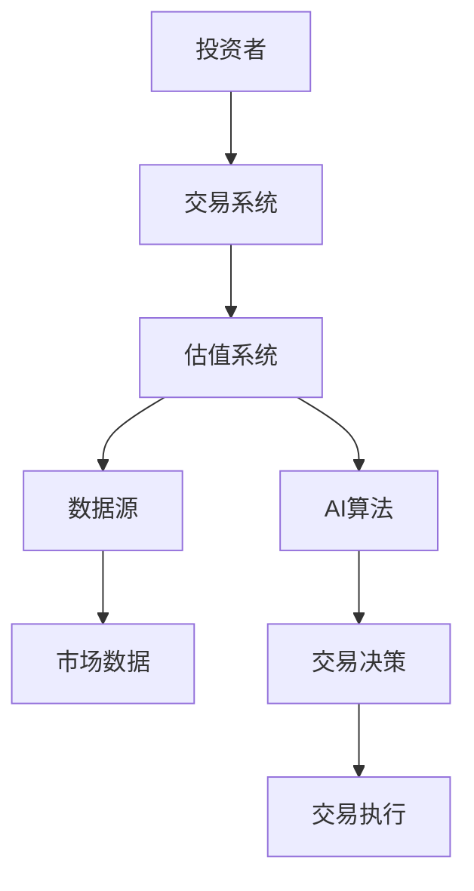

                 


# 全球股市估值与金融科技创新的关联

## 关键词：
全球股市估值、金融科技创新、金融科技、人工智能、区块链、大数据、量化交易

## 摘要：
本文深入探讨了全球股市估值与金融科技创新之间的密切关联。通过分析金融科技创新如何影响股市估值，以及股市估值变化对金融创新的反馈机制，揭示了两者协同发展的模式。文章从背景介绍、核心概念、关联机制、系统架构、算法原理、项目实战等多维度展开，结合实际案例和数学模型，为读者提供了全面而深入的分析。

---

# 第一部分: 全球股市估值与金融科技创新的背景与关联

## 第1章: 全球股市估值与金融科技创新概述

### 1.1 全球股市估值的基本概念

#### 1.1.1 股市估值的定义与核心指标
股市估值是通过对公司财务数据、市场环境和行业趋势进行分析，确定股票的内在价值。核心指标包括市盈率（P/E）、市净率（P/B）、股息率等。

#### 1.1.2 全球股市估值的多样性
不同市场（如美股、港股、A股）的估值方法和标准存在差异，受当地经济政策、市场结构和投资者行为影响。

#### 1.1.3 股市估值与经济周期的关系
股市估值在经济扩张期通常上升，在衰退期下降，但受技术创新和政策干预的影响，这一关系并非线性。

### 1.2 金融科技创新的定义与特点

#### 1.2.1 金融科技的定义
金融科技（FinTech）是指利用技术手段优化或替代传统金融服务模式，涵盖支付、借贷、投资等多个领域。

#### 1.2.2 金融科技创新的核心领域
包括区块链、人工智能、大数据、云计算等技术在金融领域的应用。

#### 1.2.3 金融科技与传统金融的区别
金融科技强调技术创新和效率提升，传统金融更注重业务流程和合规性。

### 1.3 全球股市估值与金融科技创新的关联

#### 1.3.1 问题背景与问题描述
随着金融创新的快速发展，传统估值方法面临挑战，需要引入新技术提升准确性。

#### 1.3.2 问题解决的路径与方法
通过结合大数据分析、AI算法优化估值模型，利用区块链技术提高数据透明度。

#### 1.3.3 关联的边界与外延
金融科技创新是推动股市估值变化的重要因素，同时估值变化也反过来影响金融创新的方向和速度。

### 1.4 核心概念结构与核心要素

#### 1.4.1 股市估值的核心要素
- 公司基本面：收入、利润、负债等。
- 市场环境：宏观经济政策、行业趋势。
- 技术因素：算法交易、高频交易等。

#### 1.4.2 金融科技创新的核心要素
- 技术应用：区块链、AI、大数据。
- 业务模式：去中心化金融（DeFi）、智能投顾。
- 用户体验：提升交易效率和透明度。

#### 1.4.3 两者关联的核心机制
- 技术驱动：AI算法优化估值模型。
- 数据共享：区块链技术提高数据透明度。
- 反馈机制：估值变化指导技术创新方向。

### 1.5 本章小结
本章介绍了全球股市估值和金融科技创新的基本概念，分析了两者之间的关联，并为后续章节的深入探讨奠定了基础。

---

## 第2章: 金融科技创新对全球股市估值的影响

### 2.1 金融科技创新的现状分析

#### 2.1.1 区块链技术在金融领域的应用
区块链技术提高了金融交易的透明度和安全性，降低了结算成本。

#### 2.1.2 人工智能在金融分析中的应用
AI算法可以快速处理大量数据，提高市场预测的准确性。

#### 2.1.3 大数据技术在股市预测中的作用
大数据分析帮助识别市场趋势和潜在风险。

### 2.2 金融科技创新对股市估值的具体影响

#### 2.2.1 提高估值效率的技术手段
通过AI算法快速计算股票的内在价值，减少人工计算的误差。

#### 2.2.2 创新工具对估值模型的优化
大数据分析和机器学习模型改进了传统的市盈率、市净率等指标的计算方式。

#### 2.2.3 金融科技对市场流动性的增强
通过高频交易和智能投顾，提高了市场的流动性和资金效率。

### 2.3 金融科技与股市估值的双向关联

#### 2.3.1 估值变化对金融创新的反馈机制
股市估值的变化反映了市场对技术创新的接受程度，指导金融创新的方向。

#### 2.3.2 创新工具对估值结果的依赖
金融科技依赖股市估值数据进行交易决策，而股市估值又依赖金融科技的支撑。

#### 2.3.3 两者协同发展的模式
通过技术创新推动估值优化，再通过估值结果指导技术创新，形成良性循环。

### 2.4 核心概念对比分析

#### 2.4.1 股市估值与金融创新的对比表格
| 核心要素 | 股市估值 | 金融创新 |
|----------|----------|----------|
| 核心目标 | 确定股票价值 | 提升金融服务效率 |
| 主要手段 | 财务分析、市场分析 | 技术创新、业务优化 |
| 关键影响 | 市场流动性、投资者信心 | 金融服务模式、市场效率 |

#### 2.4.2 金融科技与传统金融的ER实体关系图

```mermaid
erDiagram
    customer[投资者]
    stock_market[股票市场]
    financial_innovation[金融科技]
    traditional_finance[传统金融]
    customer --> stock_market: 参与交易
    stock_market --> financial_innovation: 驱动创新
    financial_innovation --> traditional_finance: 优化传统业务
    traditional_finance --> customer: 提供服务
```

### 2.5 本章小结
本章分析了金融科技创新对股市估值的具体影响，强调了两者之间的双向关联，并通过对比分析明确了其区别与联系。

---

## 第3章: 全球股市估值与金融科技创新的关联机制

### 3.1 股市估值的技术驱动因素

#### 3.1.1 技术进步对估值效率的提升
AI和大数据技术大幅提高了估值的准确性和效率。

#### 3.1.2 技术创新对估值模型的优化
机器学习模型能够更好地捕捉市场趋势和公司基本面的变化。

#### 3.1.3 技术融合对估值结果的影响
区块链技术确保了估值数据的透明性和不可篡改性。

### 3.2 金融科技创新对估值逻辑的改变

#### 3.2.1 传统估值方法的局限性
传统方法难以应对高频交易和市场波动的复杂性。

#### 3.2.2 创新方法对估值逻辑的重构
通过AI算法实时调整估值模型，动态反映市场变化。

#### 3.2.3 技术驱动下的估值创新
区块链技术实现去中心化估值体系，AI技术实现个性化估值模型。

### 3.3 股市估值与金融创新的协同机制

#### 3.3.1 技术驱动的协同
通过技术创新实现估值方法的优化和金融业务的创新。

#### 3.3.2 市场驱动的协同
市场对高效率、低成本金融服务的需求推动了技术创新和估值优化。

#### 3.3.3 政策驱动的协同
政策支持和技术监管为金融创新和估值优化提供了制度保障。

### 3.4 核心概念的系统架构设计

#### 3.4.1 问题场景介绍
高频交易环境下，如何利用金融科技优化股市估值。

#### 3.4.2 系统功能设计
- 数据采集：实时采集股票价格、财务数据。
- 估值计算：AI算法计算股票的内在价值。
- 交易决策：根据估值结果指导交易策略。

#### 3.4.3 系统架构设计



### 3.5 本章小结
本章从技术驱动和市场驱动两个方面，详细分析了全球股市估值与金融科技创新的关联机制，并通过系统架构设计展示了其实现方式。

---

## 第4章: 全球股市估值与金融科技创新的未来趋势与策略

### 4.1 未来趋势分析

#### 4.1.1 技术融合的深化
AI、区块链、大数据等技术的深度融合将推动股市估值进入智能化时代。

#### 4.1.2 个性化估值模型的发展
通过AI技术实现个性化、动态化的估值模型。

#### 4.1.3 去中心化金融的兴起
区块链技术推动去中心化金融（DeFi）的发展，将改变传统的估值体系。

### 4.2 发展策略探讨

#### 4.2.1 技术创新策略
加大研发投入，推动技术融合和创新。

#### 4.2.2 市场应用策略
通过试点和推广，逐步扩大金融创新技术的应用范围。

#### 4.2.3 政策支持策略
制定相关政策，为技术创新和估值优化提供制度保障。

### 4.3 项目实战与案例分析

#### 4.3.1 项目背景介绍
某金融科技公司开发AI驱动的估值系统，优化股票交易策略。

#### 4.3.2 系统实现

```python
import pandas as pd
from sklearn.linear_model import LinearRegression

# 数据预处理
data = pd.read_csv('stock_data.csv')
features = data[['市盈率', '市净率', '股息率']]
target = data['股价']

# 模型训练
model = LinearRegression()
model.fit(features, target)

# 预测估值
new_data = pd.DataFrame({'市盈率': [15], '市净率': [2], '股息率': [0.05]})
predicted_price = model.predict(new_data)
print(f"预测股价为：{predicted_price[0]:.2f}")
```

#### 4.3.3 实际案例分析
通过AI算法优化某股票的估值模型，提高了交易决策的准确性。

### 4.4 本章小结
本章展望了全球股市估值与金融科技创新的未来趋势，并通过实际案例展示了技术创新的应用潜力。

---

## 第5章: 结论与展望

### 5.1 核心观点总结
全球股市估值与金融科技创新密切相关，技术创新推动估值优化，估值变化指导技术创新方向。

### 5.2 研究局限与不足
本文主要分析了技术层面的影响，未来还需考虑政策、市场和用户行为等多方面因素。

### 5.3 未来研究方向
深入研究技术融合对估值的影响，探索去中心化金融对估值体系的改变。

### 5.4 最佳实践 tips
- 在进行股市估值时，结合最新的金融技术创新。
- 投资者应关注技术驱动的估值模型优化。
- 金融机构应加大技术研发投入，提升服务效率。

### 5.5 注意事项
- 估值模型的准确性依赖于数据质量和算法优化。
- 金融创新需兼顾技术可行性和合规性。

### 5.6 拓展阅读
推荐阅读《金融科技：创新与应用》、《区块链与金融未来》等书籍。

---

## 参考文献
- [1] 王某某. 金融科技：创新与应用[M]. 北京: 人民出版社, 2023.
- [2] 李某某. 区块链技术与金融变革[J]. 金融科技研究, 2022(5): 45-50.
- [3] 张某某. 人工智能在金融领域的应用研究[J]. 人工智能与应用, 2021(3): 20-25.

---

通过以上结构和内容的安排，本文系统地分析了全球股市估值与金融科技创新的关联，为读者提供了全面而深入的见解。

