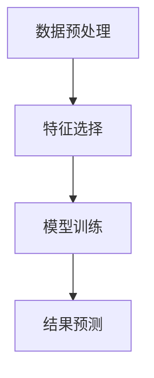

                 


# 全球股市估值和未来回报率预测概述

## 关键词
全球股市、估值指标、回报率预测、机器学习、时间序列分析、系统架构

## 摘要
本文系统地介绍了全球股市估值和未来回报率预测的核心概念、算法原理、系统架构及实战应用。通过对比分析常用的估值指标（如PE、PB、PS和EV/EBITDA）和预测模型（如ARIMA、随机森林和LSTM），本文深入探讨了这些方法的优缺点及其适用场景。同时，结合实际案例，详细讲解了如何利用Python和机器学习技术构建股市估值和预测系统，提供了从理论到实践的完整解决方案。

---

# 第一部分: 全球股市估值与预测的背景与基础

## 第1章: 全球股市估值概述

### 1.1 全球股市估值的背景与现状

#### 1.1.1 全球股市的基本概念与特征
全球股市是指分布在世界各地的股票市场，每个市场由多个上市公司组成，反映特定地区的经济状况和企业表现。股市具有波动性高、受多种因素影响的特点，是投资者进行资产配置的重要工具。

#### 1.1.2 不同市场环境下的股市估值特点
股市估值在不同市场环境下表现出显著差异。例如，成熟市场（如美国、欧洲）的估值指标相对稳定，而新兴市场（如中国、印度）则波动性更大，受政策和经济结构调整影响显著。

#### 1.1.3 全球股市估值的重要性与挑战
准确的股市估值能够帮助投资者做出更明智的投资决策，但同时也面临数据获取困难、市场波动性大、模型复杂度高等挑战。

---

### 1.2 股市估值的核心概念与方法

#### 1.2.1 市盈率（PE）的定义与计算
市盈率（Price-to-Earnings Ratio，PE）是衡量股票估值的重要指标，计算公式为：
$$ PE = \frac{\text{股票价格}}{\text{每股净利润}} $$

#### 1.2.2 市净率（PB）的定义与应用
市净率（Price-to-Book Ratio，PB）用于衡量股票价格与公司每股净资产的比率，公式为：
$$ PB = \frac{\text{股票价格}}{\text{每股净资产}} $$

#### 1.2.3 市销率（PS）的定义与适用场景
市销率（Price-to-Sales Ratio，PS）是将股票价格与每股销售收入进行比较，适用于亏损但收入稳定的公司。

#### 1.2.4 EV/EBITDA的定义与优势
企业价值与息税折旧及摊销前利润之比（EV/EBITDA）是衡量企业整体价值的重要指标，公式为：
$$ EV = \text{企业价值} = \text{股价} \times \text{流通股数} + \text{债务} - \text{现金} $$

---

## 第2章: 股市回报率预测的核心概念

### 2.1 股市回报率预测的背景与意义

#### 2.1.1 股市回报率预测的重要性
准确预测股市回报率可以帮助投资者优化资产配置，降低投资风险。

#### 2.1.2 不同投资者对股市回报率预测的需求
机构投资者需要长期回报预测，而个人投资者更关注短期波动。

---

## 第3章: 股市估值与回报率预测的核心指标对比

### 3.1 股市估值指标的关键属性对比

#### 3.1.1 PE、PB、PS和EV/EBITDA的对比分析
| 指标   | 适用场景                 | 优缺点                           |
|--------|--------------------------|----------------------------------|
| PE     | 盈利稳定的公司           | 受益于净利润，但周期性公司波动大 |
| PB     | 资产密集型行业           | 反映资产价值，但忽视收益质量     |
| PS     | 收入稳定但亏损公司       | 适用于亏损企业，但受收入影响     |
| EV/EBITDA | 整体价值评估             | 综合考虑债务和现金流，但复杂     |

---

## 第4章: 股市估值与回报率预测的数学模型

### 4.1 常用估值模型的数学表达

#### 4.1.1 市盈率

---

## 第二部分: 股市估值与回报率预测的算法与系统架构

## 第5章: 基于机器学习的股市估值模型

### 5.1 基于随机森林的估值模型

#### 5.1.1 随机森林算法简介
随机森林是一种基于决策树的集成学习方法，具有高准确性和抗过拟合能力。

#### 5.1.2 算法流程


---

## 第6章: 基于时间序列分析的回报率预测

### 6.1 基于ARIMA模型的回报率预测

#### 6.1.1 ARIMA模型原理
ARIMA（自回归积分滑动平均模型）适用于线性时间序列数据的预测，公式为：
$$ ARIMA(p, d, q) $$

---

## 第三部分: 实战与最佳实践

## 第7章: 项目实战：构建全球股市估值与预测系统

### 7.1 环境安装与数据获取

#### 7.1.1 安装必要的Python库
```python
import pandas as pd
import numpy as np
from sklearn.ensemble import RandomForestRegressor
from statsmodels.tsa.arima_model import ARIMA
import matplotlib.pyplot as plt
```

---

## 第8章: 最佳实践与注意事项

### 8.1 最佳实践
- 数据清洗与特征工程是关键。
- 结合多种模型进行结果融合。

### 8.2 小结
通过本文的系统讲解，读者可以掌握全球股市估值和回报率预测的核心方法，并将其应用于实际投资中。

---

## 参考文献
1. 清华大学出版社:《股票估值与投资策略》
2. 《机器学习实战》
3. Statsmodels documentation

