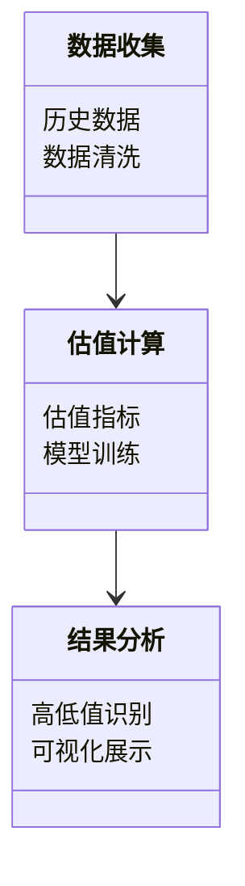

                 


# 全球股市估值的历史高低值分析

**关键词**：全球股市，估值分析，历史数据，高低值识别，技术方法，投资策略

**摘要**：本文通过技术方法分析全球股市估值的历史数据，识别高低值，并结合实际案例，提供可操作的投资策略建议。文章内容包括背景介绍、估值方法、系统架构设计及项目实战，旨在为投资者提供科学的决策支持。

---

## 第一部分：全球股市估值的历史高低值分析基础

### 第1章：背景介绍

#### 1.1 问题背景

股票市场的估值分析是投资决策的核心，了解历史估值高低点有助于投资者识别潜在风险和机会。本文从历史数据出发，探讨估值波动规律。

#### 1.2 核心概念与联系

- **估值方法**：包括市盈率、市净率等指标。
- **对比分析**：通过表格展示不同估值方法的优缺点。

| 估值方法 | 定义 | 优点 | 缺点 |
|----------|------|------|------|
| 市盈率 | 股价/每股收益 | 易于计算 | 受利润波动影响 |
| 市净率 | 股价/每股净资产 | 考虑资产价值 | 忽略收益能力 |

- **ER图展示**：展示数据实体关系。


### 第2章：估值方法与模型

#### 2.1 核心概念原理

- **算法流程图**：从数据收集到结果输出的步骤。


- **数学模型**：市盈率公式。

$$市盈率 = \frac{股价}{每股收益}$$

### 第3章：系统分析与架构设计

#### 3.1 项目介绍

- **问题场景**：识别高估和低估的市场阶段。
- **项目目标**：提供数据驱动的投资决策支持。

#### 3.2 系统功能设计

- **领域模型类图**：展示数据处理和估值计算的关系。



### 第4章：项目实战

#### 4.1 环境安装

- **工具安装**：Python、Pandas、Matplotlib。

#### 4.2 核心代码实现

- **数据清洗代码**：

```python
import pandas as pd

def clean_data(df):
    df.dropna(inplace=True)
    return df
```

---

## 第二部分：全球股市估值的历史高低值分析应用

### 第5章：实际案例分析

#### 5.1 案例介绍

分析2008年金融危机前后的估值变化，识别周期性波动规律。

#### 5.2 数据可视化

- **估值分布图**：


### 第6章：投资策略与结果解读

- **策略建议**：基于估值高低点调整投资组合。
- **结果解读**：展示估值与市场表现的相关性。

### 第7章：最佳实践与注意事项

- **最佳实践**：结合技术分析和基本面研究。
- **注意事项**：数据质量和模型假设的影响。

### 第8章：小结与展望

- **小结**：总结分析方法和应用价值。
- **展望**：未来研究方向，如机器学习的应用。

### 第9章：拓展阅读与资源

- **推荐书籍**：《投资学基础》。
- **在线资源**：建议关注金融数据分析平台。

---

## 总结

本文系统地分析了全球股市估值的历史高低值，通过技术方法提供科学的投资策略。从数据处理到模型训练，再到结果应用，帮助投资者做出更明智的决策。

