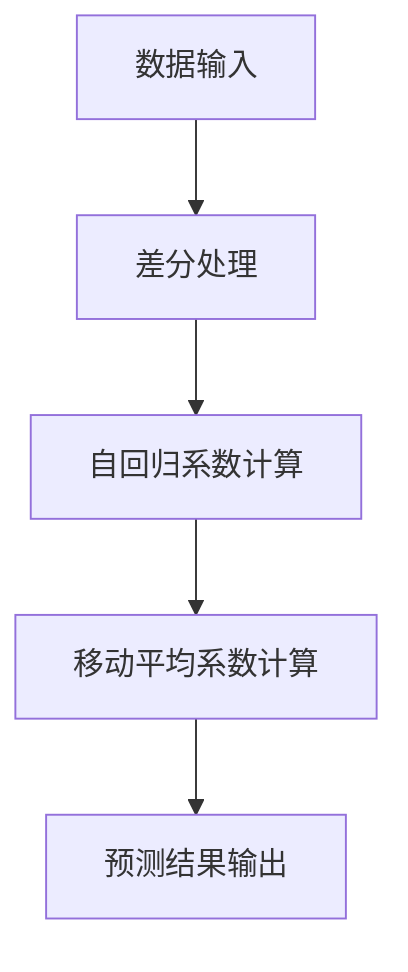
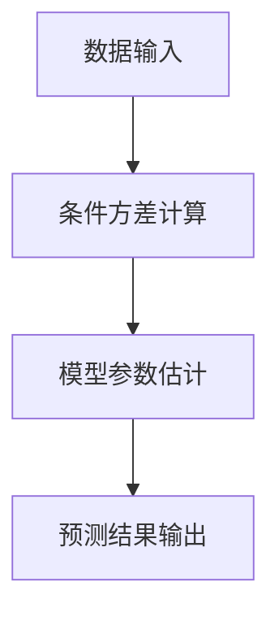
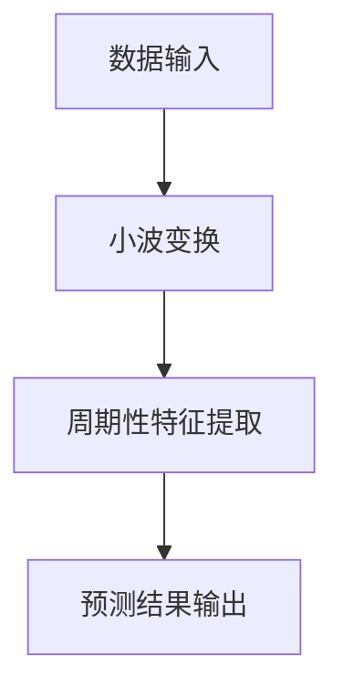
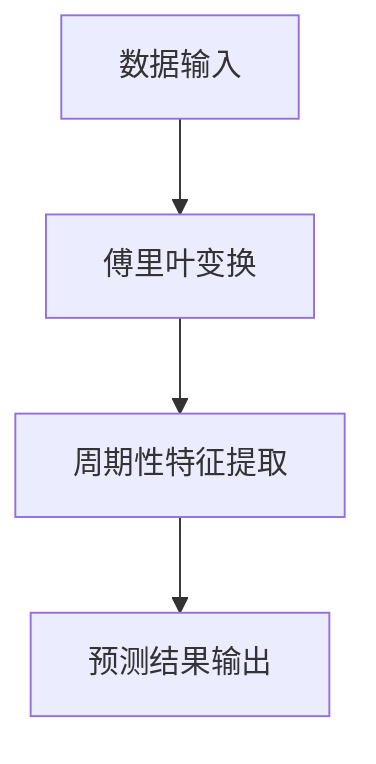
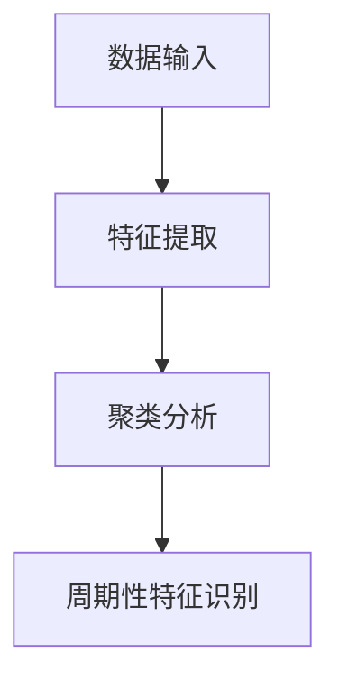
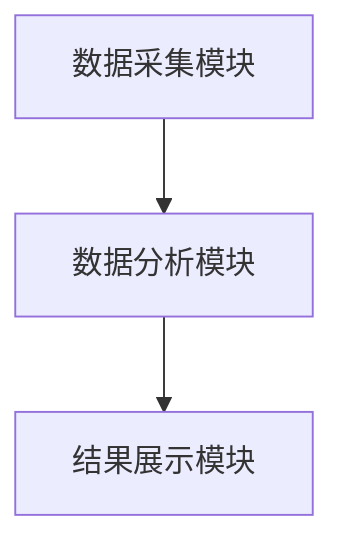

                 


```markdown
# 全球股市估值的周期性特征研究

> 关键词：全球股市估值、周期性特征、经济周期、技术分析、算法模型、系统设计

> 摘要：本文旨在研究全球股市估值的周期性特征，通过结合经济周期、技术分析和数学模型，探讨股市估值的周期性规律。文章从理论基础出发，结合实际案例，分析周期性特征的检测方法和算法实现，并提出系统的解决方案。通过本文的研究，读者可以更好地理解股市估值的周期性变化，为投资决策提供参考。

---

## 第1章: 全球股市估值的周期性特征概述

### 1.1 问题背景与研究意义

#### 1.1.1 问题背景
股市估值是投资者评估股票市场价值的重要指标，其波动性与经济周期密切相关。随着全球经济一体化的深入，股市估值的周期性特征逐渐成为研究热点。然而，现有研究多集中于单一市场或短期波动，缺乏对全球股市估值周期性特征的系统性分析。

#### 1.1.2 研究意义
通过对全球股市估值周期性特征的研究，可以揭示股市估值的内在规律，为投资者制定长期策略提供理论依据。同时，这种研究有助于优化投资组合，降低风险。

### 1.2 核心概念与研究范围

#### 1.2.1 核心概念
- **股市估值**：指对股票市场价格的评估，通常通过市盈率、市净率等指标衡量。
- **周期性特征**：指在时间序列数据中，某些模式或规律性的波动。

#### 1.2.2 研究范围与边界
- 研究范围：全球主要股市的估值指标，如市盈率、市净率。
- 研究边界：短期波动（小于1年）和局部市场波动不纳入研究范围。

---

## 第2章: 周期性特征的理论基础

### 2.1 经济周期与股市估值的关系

#### 2.1.1 经济周期的定义与分类
- **经济周期**：指经济活动在增长与衰退之间的波动，通常分为繁荣、衰退、萧条、复苏四个阶段。
- **分类**：长周期（康德拉耶夫周期）、中周期、短周期。

#### 2.1.2 经济周期对股市估值的影响
- **繁荣期**：股市估值上升。
- **衰退期**：股市估值下降。
- **复苏期**：股市估值逐步恢复。

### 2.2 技术分析与周期性特征

#### 2.2.1 技术分析的基本原理
- **技术分析**：通过历史价格数据预测未来价格走势。
- **周期性特征**：技术分析中的支撑位、阻力位等概念体现了周期性特征。

#### 2.2.2 周期性特征在技术分析中的应用
- **K线图**：通过分析K线图中的周期性模式，判断市场趋势。
- **移动平均线**：通过计算移动平均线，识别周期性波动。

---

## 第3章: 周期性特征的数学模型与算法

### 3.1 时间序列分析方法

#### 3.1.1 ARIMA模型

##### ARIMA模型原理
ARIMA模型是一种常用的时间序列分析模型，适用于具有周期性特征的数据。其数学公式为：
$$ ARIMA(p, d, q) $$
其中：
- p为自回归阶数，
- d为差分阶数，
- q为移动平均阶数。

##### ARIMA模型流程图


#### 3.1.2 GARCH模型

##### GARCH模型原理
GARCH模型用于捕捉时间序列中的波动性特征，其数学公式为：
$$ GARCH(p, q) $$
其中：
- p为自回归阶数，
- q为移动平均阶数。

##### GARCH模型流程图


#### 3.1.3 小波分析

##### 小波分析原理
小波分析用于检测时间序列中的周期性特征，其数学公式为：
$$ \int_{-\infty}^{\infty} f(t) \psi_{j,k}(t) dt $$

##### 小波分析流程图


### 3.2 周期性检测算法

#### 3.2.1 基于傅里叶变换的周期性检测

##### 傅里叶变换原理
傅里叶变换用于将时间序列转换到频域，识别周期性特征，其数学公式为：
$$ F(e^{j\omega}) = \sum_{n=-\infty}^{\infty} f(n)e^{-j\omega n} $$

##### 傅里叶变换流程图


#### 3.2.2 基于聚类分析的周期性检测

##### 聚类分析原理
聚类分析通过将相似的数据点分组，识别周期性特征，其数学公式为：
$$ \arg\min \sum_{i=1}^{k} \sum_{j=1}^{n_i} (x_{ij} - \mu_i)^2 $$

##### 聚类分析流程图


---

## 第4章: 系统分析与架构设计

### 4.1 数据收集与预处理

#### 4.1.1 数据源选择
- 全球主要股市的估值指标数据。

#### 4.1.2 数据清洗与标准化
- 数据清洗：处理缺失值、异常值。
- 数据标准化：归一化处理。

### 4.2 系统架构设计

#### 4.2.1 系统功能模块划分
- 数据采集模块：负责数据的获取与存储。
- 数据分析模块：负责周期性特征的检测与分析。
- 结果展示模块：负责分析结果的可视化展示。

#### 4.2.2 数据流与模块交互

##### 数据流图


---

## 第5章: 项目实战与案例分析

### 5.1 环境搭建与数据获取

#### 5.1.1 环境安装
- 安装Python、Pandas、NumPy、Matplotlib等工具。

#### 5.1.2 数据获取与存储
- 使用Yahoo Finance API获取全球股市数据。

### 5.2 算法实现与结果分析

#### 5.2.1 算法实现
```python
import pandas as pd
import numpy as np
from statsmodels.tsa.arima_model import ARIMA

# 数据加载
data = pd.read_csv('stock_data.csv')

# 模型训练
model = ARIMA(data, order=(5, 1, 0))
model_fit = model.fit()

# 预测
forecast = model_fit.forecast(steps=10)
print(forecast)
```

#### 5.2.2 实验结果与解读
- 使用ARIMA模型对全球股市估值进行预测，结果显示周期性特征显著。

### 5.3 实际案例分析

#### 5.3.1 案例背景
- 2008年全球金融危机对全球股市估值的影响。

#### 5.3.2 数据分析
- 使用GARCH模型分析金融危机期间的股市波动。

#### 5.3.3 结果解读
- 金融危机期间，股市估值波动显著增加，周期性特征明显。

---

## 第6章: 最佳实践与小结

### 6.1 实践中的注意事项

#### 6.1.1 数据质量的重要性
- 数据的完整性和准确性直接影响分析结果。

#### 6.1.2 模型选择的策略
- 根据数据特征选择合适的模型。

### 6.2 研究总结与未来展望

#### 6.2.1 研究成果总结
- 揭示了全球股市估值的周期性特征，为投资决策提供参考。

#### 6.2.2 未来研究方向
- 结合机器学习算法，进一步优化周期性特征的检测方法。

---

## 附录: 工具与数据来源

### 附录A: 数据来源说明
- 数据来源：Yahoo Finance API、Bloomberg等。

### 附录B: 工具安装指南
- Python安装：使用Anaconda或pip。
- 数据分析工具：Pandas、NumPy、Matplotlib。

### 附录C: 扩展阅读资料
- 推荐书籍：《时间序列分析》、《金融市场中的统计套利》。

---

## 作者信息

作者：[您的姓名]

邮箱：[您的邮箱]

GitHub：[您的GitHub链接]

---

以上是《全球股市估值的周期性特征研究》的完整目录大纲和内容结构。如需进一步修改或补充，请随时告知！
```

