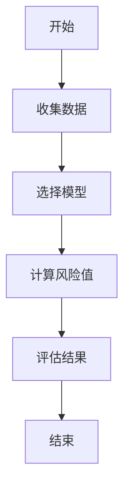

                 


# 全球资产配置：分散投资降低国别风险

> **关键词**：全球资产配置、分散投资、国别风险、资产配置策略、风险管理、投资组合优化

> **摘要**：全球资产配置是通过将资金分散投资于不同国家或地区的资产，以降低单一市场的风险。本文从国别风险的评估、分散投资的原理、资产配置策略、风险管理工具、系统架构设计等方面，详细分析全球资产配置的理论与实践，结合实际案例，探讨如何通过分散投资降低国别风险，实现资产的稳健增长。

---

## 第1章 全球资产配置的背景与定义

### 1.1 全球资产配置的背景

#### 1.1.1 经济全球化与投资多元化的需求

随着经济全球化的深入，资本的流动更加频繁，投资者可以轻松跨越国界进行投资。然而，不同国家的经济波动、政策变化、地缘政治等因素，都会对资产价值产生影响。为了降低单一市场的风险，投资者开始关注全球范围内的资产配置。

#### 1.1.2 传统投资模式的局限性

传统的投资模式往往集中在本国市场，这种集中投资的风险较高。例如，2008年的全球金融危机中，许多投资者因过于集中于本国市场而遭受重大损失。因此，分散投资成为降低风险的重要手段。

#### 1.1.3 全球资产配置的兴起与发展

随着金融市场的开放和信息技术的进步，投资者可以更方便地获取全球市场的信息和投资工具。全球资产配置逐渐成为一种主流的投资策略。

### 1.2 全球资产配置的定义与目标

#### 1.2.1 资产配置的定义

资产配置是指将资金分配到不同的资产类别（如股票、债券、房地产等）中，以实现风险和收益的平衡。

#### 1.2.2 全球资产配置的核心目标

全球资产配置的目标是通过分散投资，降低国别风险，实现资产的稳健增长。具体目标包括：分散风险、捕捉全球投资机会、优化资产回报率等。

#### 1.2.3 资产配置与投资收益的关系

资产配置是投资组合管理的核心，科学的资产配置可以最大化收益，同时最小化风险。研究表明，资产配置对投资收益的贡献度超过70%。

### 1.3 国别风险的概念与影响

#### 1.3.1 国别风险的定义

国别风险是指由于特定国家或地区的经济、政治、社会等因素的变化，导致投资者在该国的资产面临损失的风险。

#### 1.3.2 国别风险的主要影响因素

- **经济因素**：GDP增长率、通货膨胀率、财政赤字等。
- **政治因素**：政府稳定性、政策透明度、法律法规等。
- **社会因素**：社会动荡、民族矛盾等。
- **市场因素**：市场规模、流动性、市场深度等。

#### 1.3.3 国别风险与资产配置的关系

国别风险是全球资产配置的核心考虑因素之一。通过分散投资于不同国家的资产，可以有效降低因单一国家风险带来的损失。

### 1.4 本章小结

本章介绍了全球资产配置的背景、定义、目标以及国别风险的概念和影响。在全球化背景下，投资者需要通过分散投资来降低国别风险，实现资产的稳健增长。

---

## 第2章 国别风险的评估与分析

### 2.1 国别风险的评估指标

#### 2.1.1 经济指标

- **GDP增长率**：反映一个国家的经济发展状况。
- **通货膨胀率**：影响投资回报的实际价值。
- **财政赤字**：高赤字可能导致货币贬值和债务危机。

#### 2.1.2 政治指标

- **政治稳定性**：政府更迭频繁可能导致政策不确定性。
- **政策透明度**：政策是否透明直接影响投资环境。
- **法律体系**：法律的完善性和执行力度影响投资安全。

#### 2.1.3 制度指标

- **货币政策**：央行的货币政策直接影响市场流动性。
- **监管效率**：监管机构的效率影响市场的规范性。
- **税收政策**：税收政策影响投资成本和收益。

#### 2.1.4 市场指标

- **市场规模**：市场容量影响资产的流动性。
- **流动性**：资产能否快速变现。
- **市场深度**：市场参与者数量和交易活跃度。

### 2.2 国别风险的评估模型

#### 2.2.1 主要的国别风险评估模型

- **主权风险模型**：评估国家的主权信用风险。
- **经济风险模型**：评估经济波动对资产的影响。
- **政治风险模型**：评估政治因素对投资的影响。

#### 2.2.2 模型的优缺点对比

| 模型名称       | 优点                           | 缺点                           |
|----------------|--------------------------------|--------------------------------|
| 主权风险模型   | 考虑了国家的信用风险           | 未考虑市场和政策因素           |
| 经济风险模型   | 考虑了经济波动对资产的影响     | 未考虑政治和社会因素           |
| 政治风险模型   | 考虑了政治因素对投资的影响     | 未考虑经济和社会因素           |

### 2.3 国别风险的评估流程



### 2.4 本章小结

本章详细介绍了国别风险的评估指标和模型，帮助投资者更好地理解不同国家的投资风险。

---

## 第3章 分散投资的原理与策略

### 3.1 分散投资的核心原理

#### 3.1.1 风险分散的数学模型

投资组合的总风险可以通过以下公式计算：

$$ \text{总风险} = \sqrt{\sum_{i=1}^{n} w_i^2 \sigma_i^2 + 2 \sum_{i=1}^{n} \sum_{j>i} w_i w_j \sigma_{i,j}} $$

其中，\( w_i \) 是资产 \( i \) 的权重，\( \sigma_i \) 是资产 \( i \) 的标准差，\( \sigma_{i,j} \) 是资产 \( i \) 和 \( j \) 的协方差。

#### 3.1.2 资产相关性的概念与影响

资产的相关性是衡量资产价格变动方向和程度的指标。相关性越高，资产之间的风险分散效果越差。

#### 3.1.3 现代投资组合理论（MPT）简介

MPT由Harry Markowitz提出，强调通过分散投资降低风险，同时优化投资回报。

### 3.2 分散投资的策略

#### 3.2.1 资产类别分散

将资金分配到股票、债券、房地产等多种资产类别中，以降低特定资产类别的风险。

#### 3.2.2 地区分散

将资金分配到不同国家或地区的资产中，以降低国别风险。

#### 3.2.3 行业分散

将资金分配到不同行业的资产中，以降低行业风险。

### 3.3 分散投资的优缺点

#### 3.3.1 分散投资的优点

- 降低特定风险
- 捕捉多元化的收益机会

#### 3.3.2 分散投资的缺点

- 需要承担更多交易成本
- 需要更多的时间和精力进行管理

### 3.4 本章小结

本章介绍了分散投资的核心原理和策略，帮助投资者理解如何通过分散投资降低风险。

---

## 第4章 全球资产配置的策略与实践

### 4.1 全球资产配置的策略

#### 4.1.1 现代投资组合理论（MPT）应用

根据MPT，投资者可以通过优化资产组合，实现风险最小化和收益最大化。

#### 4.1.2 指数基金投资策略

通过投资全球指数基金，投资者可以分散投资于全球市场，降低国别风险。

#### 4.1.3 对冲基金策略

对冲基金通过做空和做多操作，可以在不同市场环境下获利。

### 4.2 全球资产配置的实践

#### 4.2.1 数据收集与分析

- 收集各国的经济、政治、市场数据
- 分析数据，评估国别风险

#### 4.2.2 资产组合构建

- 根据风险承受能力，确定资产配置比例
- 定期调整资产组合，保持最优配置

#### 4.2.3 风险管理

- 设置止损点
- 定期评估投资组合的风险

### 4.3 本章小结

本章介绍了全球资产配置的策略与实践，强调了数据收集、资产组合构建和风险管理的重要性。

---

## 第5章 系统架构设计与实现

### 5.1 系统功能设计

#### 5.1.1 预测模型

- 使用机器学习算法预测国别风险
- 基于历史数据，建立风险评估模型

#### 5.1.2 系统优化

- 优化算法，提高预测精度
- 提高系统的运行效率

### 5.2 系统架构设计


### 5.3 系统实现

#### 5.3.1 环境安装

- 安装Python、NumPy、Pandas、Scikit-learn等库

#### 5.3.2 核心代码实现

```python
import numpy as np
from sklearn.linear_model import LinearRegression

# 数据准备
X = np.array([[1], [2], [3], [4], [5]])
y = np.array([2, 4, 5, 4, 6])

# 建立模型
model = LinearRegression()
model.fit(X, y)

# 预测
print(model.predict([[6]]))
```

### 5.4 本章小结

本章介绍了系统架构设计与实现，包括功能设计、系统优化和代码实现。

---

## 第6章 最佳实践与小结

### 6.1 最佳实践

- 定期评估投资组合
- 根据市场变化调整配置
- 使用专业的工具和模型

### 6.2 小结

全球资产配置是一种有效的投资策略，通过分散投资降低国别风险，实现资产的稳健增长。

### 6.3 注意事项

- 风险管理是投资的核心
- 需要持续关注市场变化
- 资产配置需要根据个人风险承受能力调整

### 6.4 拓展阅读

- 《投资学》
- 《全球投资策略》
- 《风险管理实务》

---

## 附录

### 附录A: 全球资产配置工具

- **工具名称**：Global Asset Allocator
- **功能**：帮助投资者进行全球资产配置和风险评估
- **特点**：界面友好，功能强大，数据实时更新

### 附录B: 参考文献

- Harry Markowitz, "Portfolio Selection," Journal of Finance, 1952.
- Merton H. Miller, "The Theory of Rational Investment," Portfolio, 1976.

---

## 结语

全球资产配置是一种科学的投资策略，通过分散投资降低风险，实现资产的稳健增长。投资者需要结合市场环境、个人风险承受能力和专业工具，制定合理的资产配置方案。

---

**感谢您的阅读！**

