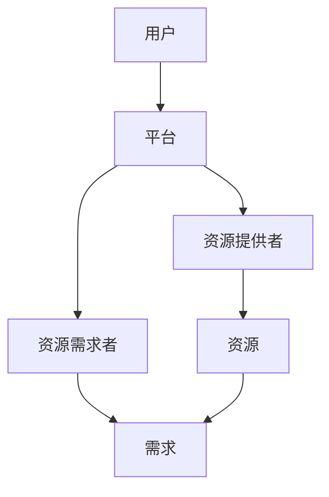

                 

# 共享经济模式对传统行业的影响与投资机会

## 关键词：
共享经济，传统行业，投资机会，商业模式，技术驱动

## 摘要：
共享经济作为一种新兴的经济模式，通过技术手段重新定义了资源分配和价值创造方式。它不仅对传统行业造成了深远的影响，还带来了巨大的投资机会。本文将详细分析共享经济的核心概念、对传统行业的具体影响、其商业模式的创新，以及在技术驱动下的发展趋势和投资机会。通过实际案例分析和数学模型的解读，我们将揭示共享经济的潜在价值和未来发展方向。

---

## 第一部分：共享经济的背景与核心概念

### 第1章：共享经济的定义与核心要素

#### 1.1 共享经济的定义与特点
- **1.1.1 共享经济的定义**  
  共享经济是一种基于数字化平台的经济模式，通过闲置资源的共享与匹配，实现资源的高效利用。其核心在于“使用权的共享”而非“所有权的转移”。  
  $$共享经济 = \text{资源闲置} + \text{技术平台} + \text{多方参与}$$

- **1.1.2 共享经济的核心特点**  
  - **去中心化**：通过平台连接供需双方，减少中间环节。  
  - **高效匹配**：利用大数据和算法实现资源与需求的精准匹配。  
  - **低成本高效率**：通过共享降低资源浪费，提升整体经济效率。  

- **1.1.3 共享经济与传统经济的对比**  
  | 比较维度 | 共享经济 | 传统经济 |
  |----------|----------|----------|
  | 资源利用 | 共享复用 | 单一占有 |
  | 成本结构 | 依赖平台技术 | 依赖固定资产 |
  | 利润模式 | 平台分成 | 产品销售或服务收费 |

---

### 第2章：共享经济的核心要素与系统架构

#### 2.1 共享经济的核心要素
- **用户角色**：参与者可以是供给方（资源提供者）或需求方（资源使用方）。  
- **平台技术**：基于互联网的平台，利用大数据和人工智能实现资源的动态匹配。  
- **信任机制**：通过评分系统、智能合约等建立用户间的信任关系。  

#### 2.2 共享经济的系统架构

---

## 第二部分：共享经济对传统行业的影响

### 第3章：共享经济对传统行业的颠覆性影响

#### 3.1 交通行业：从出租车到共享出行
- **传统模式**：出租车公司拥有大量车辆，用户需支付高昂的固定费用。  
- **共享模式**：通过平台（如滴滴出行），用户按需付费，资源利用效率大幅提升。  
  $$成本降低 = \text{空驶时间减少} + \text{车辆利用率提高}$$  

#### 3.2 住宿行业：从酒店到短租公寓
- **传统模式**：酒店提供标准化服务，成本高昂。  
- **共享模式**：通过Airbnb等平台，闲置房源被充分利用，用户体验更加灵活。  
  $$收益提升 = \text{资源利用率} \times \text{平台分成比例}$$  

---

### 第4章：共享经济的商业模式与投资机会

#### 4.1 共享经济的商业模式分析
- **双边平台模式**：连接供给方和需求方，通过平台收取佣金。  
- **P2P共享模式**：个人间直接共享资源，平台提供技术支持和服务。  

#### 4.2 共享经济的投资机会
- **市场潜力**：随着技术进步和用户需求增加，共享经济市场规模持续扩大。  
- **技术创新**：大数据、人工智能和区块链等技术的应用将推动共享经济的进一步发展。  

---

## 第三部分：技术驱动与未来趋势

### 第5章：共享经济的技术驱动因素

#### 5.1 大数据与人工智能
- **需求预测**：通过用户行为数据分析，精准预测需求，优化资源配置。  
- **动态定价**：利用算法实时调整价格，确保供需平衡。  

#### 5.2 区块链技术
- **信任机制**：通过区块链技术实现去中心化的信任体系，降低平台依赖。  
- **智能合约**：自动执行交易，减少中间环节。  

---

### 第6章：共享经济的未来发展趋势

#### 6.1 全球化与本地化
- **全球化趋势**：共享经济将从本地市场扩展到全球市场。  
- **本地化策略**：根据不同地区的文化差异调整商业模式。  

#### 6.2 可持续发展
- **绿色共享**：通过共享减少资源浪费，推动可持续发展。  
- **环保技术**：采用新能源和环保技术，降低碳排放。  

---

## 第四部分：挑战与对策

### 第7章：共享经济面临的挑战

#### 7.1 法律与政策
- **法律风险**：共享经济平台可能面临税收、劳动法等法律问题。  
- **政策不确定性**：不同地区的政策差异可能导致运营风险。  

#### 7.2 信任与安全
- **用户信任**：如何建立用户间的信任关系是关键挑战。  
- **数据安全**：平台需要保护用户数据不被滥用。  

---

## 第五部分：成功案例与总结

### 第8章：共享经济的成功案例分析

#### 8.1 滴滴出行：打车行业的颠覆者
- **模式创新**：通过移动APP实现即时匹配，降低叫车成本。  
- **市场扩展**：从中国扩展到全球多个市场，成为行业领导者。  

#### 8.2 Airbnb：住宿行业的重构者
- **资源利用**：将闲置房源转化为收入来源，提升资产价值。  
- **用户体验**：提供个性化服务，增强用户粘性。  

---

### 第9章：总结与展望

#### 9.1 总结
共享经济通过技术创新和模式创新，重构了传统行业的价值链条。其核心在于通过平台实现资源的高效匹配，降低交易成本，提升用户体验。  

#### 9.2 展望
未来，共享经济将更加依赖技术驱动，从单一领域向多领域扩展。同时，可持续发展和绿色经济将成为共享经济的重要方向。  

---

## 附录
- **附录A**：共享经济相关术语表  
- **附录B**：共享经济成功案例分析  
- **附录C**：数学模型与算法代码  

---

通过以上目录，我们可以看到共享经济对传统行业的影响是全方位的，从技术到商业模式，再到政策和文化，每个方面都面临机遇与挑战。对于投资者而言，抓住共享经济的潜力需要深入了解其核心机制，并结合技术趋势和市场动态制定策略。

