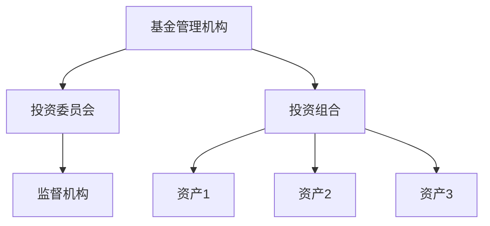

                 


# 养老基金投资策略：长期资本的配置逻辑

> 关键词：养老基金，长期资本配置，投资策略，风险管理，资产组合

> 摘要：本文深入探讨了养老基金的长期资本配置策略，从理论基础到实际应用，结合数学模型和系统架构，分析了影响资本配置的关键因素，并通过案例展示了如何在实际中应用这些策略。文章还讨论了风险管理的重要性，并展望了未来的投资趋势。

---

# 第1章 养老基金与长期资本配置概述

## 1.1 养老基金的基本概念

### 1.1.1 养老基金的定义与目标

养老基金是一种专门为退休人员提供经济支持的基金，其目标是确保退休人员在晚年能够获得稳定的收入来源。养老基金通常由政府、企业和个人共同缴纳，通过投资实现资金的保值与增值。

$$
\text{养老基金的目标：} \quad \text{确保退休人员的生活质量}
$$

### 1.1.2 养老基金在社会经济中的作用

养老基金不仅是社会保障体系的重要组成部分，也是金融市场的重要参与者。通过投资股票、债券、房地产等多种资产，养老基金为市场提供了大量流动性资金，支持了经济的发展。

### 1.1.3 长期资本配置的重要性

长期资本配置是养老基金实现保值与增值的核心策略。通过合理的资产分配，养老基金可以在不同市场环境下分散风险，同时追求长期稳定的收益。

## 1.2 养老基金的运作机制

### 1.2.1 养老基金的资金来源

养老基金的资金主要来源于以下几个方面：
1. **政府拨款**：由政府财政预算拨付的资金。
2. **企业缴纳**：企业根据员工工资的一定比例缴纳。
3. **个人缴纳**：个人根据收入的一定比例缴纳。

### 1.2.2 养老基金的管理结构

养老基金的管理结构通常包括以下几个部分：
1. **基金管理机构**：负责基金的日常管理与投资决策。
2. **投资委员会**：由专家组成的团队，负责制定和调整投资策略。
3. **监督机构**：对基金的运作进行监管，确保合规性。

### 1.2.3 养老基金的投资目标与约束

养老基金的投资目标是在确保资金安全的前提下，实现长期稳定的收益。投资约束包括：
1. **风险承受能力**：根据基金的性质确定可承受的风险水平。
2. **流动性需求**：确保在需要时能够迅速变现资产。
3. **合规性要求**：遵守相关法律法规。

## 1.3 长期资本配置的核心逻辑

### 1.3.1 长期资本配置的定义

长期资本配置是指将资金分配到不同的资产类别中，以实现长期的投资目标。这种配置通常基于对经济环境、市场趋势和资产特性的深入分析。

### 1.3.2 长期资本配置的必要性

1. **分散风险**：通过投资多种资产类别，降低单一资产的风险。
2. **追求稳定收益**：长期投资能够通过复利效应实现资产的增值。
3. **适应市场变化**：根据市场环境调整资产配置，确保基金的稳健运行。

### 1.3.3 长期资本配置与短期投资的区别

| 特性        | 长期资本配置          | 短期投资           |
|-------------|----------------------|-------------------|
| 目标         | 稳定收益与保值        | 短期收益最大化      |
| 时间跨度     | 5年以上               | 1年以内            |
| 风险承受能力 | 较高                  | 较低               |
| 投资策略     | 资产多元化，注重风险控制 | 灵活调整，快速变现   |

---

# 第2章 长期资本配置的理论基础

## 2.1 资产配置的理论框架

### 2.1.1 现代投资组合理论（MPT）

现代投资组合理论由Harry Markowitz提出，认为通过合理分配资产可以实现风险最小化的目标收益。

$$
\text{MPT的核心公式：} \quad \text{方差} = \sigma^2 = \mathbf{w}^T \mathbf{C} \mathbf{w}
$$

其中，$\mathbf{w}$是权重向量，$\mathbf{C}$是资产之间的协方差矩阵。

### 2.1.2 均值-方差优化模型

均值-方差优化模型通过最大化收益与风险的比值，找到最优的资产配置方案。

### 2.1.3 资产配置的三阶段模型

1. **确定目标收益与风险承受能力**。
2. **选择合适的资产类别**。
3. **调整配置以适应市场变化**。

---

## 2.2 长期投资的逻辑

### 2.2.1 复利效应与时间价值

复利效应是长期投资的核心优势，通过时间的积累，资产能够实现指数级增长。

$$
\text{复利公式：} \quad A = P(1 + r)^t
$$

其中，$P$是本金，$r$是年化收益率，$t$是时间。

### 2.2.2 长期投资的风险与收益平衡

长期投资的风险主要来源于市场波动和通货膨胀。通过分散投资和风险控制，可以实现收益与风险的平衡。

### 2.2.3 长期资本配置的稳定性与适应性

长期资本配置需要在稳定性和适应性之间找到平衡，既要能够抵御市场的波动，又要能够及时调整以抓住机会。

---

## 2.3 本章小结

本章介绍了长期资本配置的理论基础，包括现代投资组合理论、均值-方差优化模型以及资产配置的三阶段模型。通过这些理论，我们可以更好地理解长期资本配置的核心逻辑。

---

# 第3章 影响长期资本配置的因素

## 3.1 宏观经济环境

### 3.1.1 经济周期对资本配置的影响

经济周期包括复苏、繁荣、衰退和萧条四个阶段，不同阶段对资产配置的影响也不同。

### 3.1.2 利率政策与资本配置的关系

利率政策通过影响资金成本和资产收益，对资本配置产生重要影响。

### 3.1.3 通货膨胀与资本保值

通货膨胀会影响资产的实际收益，长期资本配置需要通过通胀预期进行调整。

---

## 3.2 市场环境与资产类别选择

### 3.2.1 不同资产类别的风险收益特征

| 资产类别 | 风险 | 收益 |
|----------|------|------|
| 股票     | 高   | 高   |
| 债券     | 中   | 中   |
| 房地产   | 高   | 高   |
| 现金     | 低   | 低   |

### 3.2.2 市场流动性与资本配置

流动性是指资产在短时间内变现的能力，影响资本配置决策。

### 3.2.3 全球化与资产配置

全球化背景下，资产配置可以跨越国界，分散风险。

---

## 3.3 本章小结

本章分析了影响长期资本配置的主要因素，包括宏观经济环境、市场环境和资产类别选择。这些因素相互作用，决定了资本配置的策略与效果。

---

# 第4章 长期资本配置的具体策略

## 4.1 战略资产配置

### 4.1.1 确定长期投资目标

根据基金的目标收益和风险承受能力，确定资产配置的总体方向。

### 4.1.2 资产类别选择与比例分配

根据市场环境和资产特性，选择合适的资产类别，并确定各类别的权重。

---

## 4.2 战术资产配置

### 4.2.1 短期市场机会捕捉

根据市场短期变化，调整资产配置以抓住投资机会。

### 4.2.2 风险控制与再平衡

定期对资产配置进行调整，确保与市场变化保持一致。

---

## 4.3 风险平价策略

### 4.3.1 风险平价的概念

风险平价是指在资产组合中，每种资产的风险贡献相等。

### 4.3.2 风险平价的实现

通过优化模型，使资产组合的风险在各资产类别间均衡分布。

---

## 4.4 本章小结

本章详细介绍了长期资本配置的具体策略，包括战略资产配置、战术资产配置和风险平价策略。这些策略可以帮助养老基金在不同市场环境下实现稳健的投资收益。

---

# 第5章 风险管理与资本配置

## 5.1 风险识别与评估

### 5.1.1 市场风险

市场风险是指资产价格波动带来的损失。

### 5.1.2 流动性风险

流动性风险是指资产难以迅速变现的风险。

### 5.1.3 通货膨胀风险

通货膨胀风险是指货币购买力下降的风险。

---

## 5.2 风险控制措施

### 5.2.1 多样化投资

通过投资不同资产类别和市场，分散风险。

### 5.2.2 风险对冲

通过衍生工具对冲特定风险。

### 5.2.3 风险监控与预警

建立风险监控体系，及时发现和预警潜在风险。

---

## 5.3 本章小结

本章讨论了风险管理在长期资本配置中的重要性，提出了多种风险控制措施，以确保资本配置的稳健性。

---

# 第6章 投资组合管理与资本配置

## 6.1 投资组合的构建

### 6.1.1 资产选择与权重分配

根据投资目标和风险偏好，选择合适的资产并确定权重。

### 6.1.2 组合优化

通过优化模型，找到最优的资产组合。

---

## 6.2 组合监控与再平衡

### 6.2.1 监控市场变化

定期监控市场变化，评估组合表现。

### 6.2.2 再平衡策略

根据市场变化和投资目标，调整资产配置。

---

## 6.3 本章小结

本章讨论了投资组合管理在资本配置中的作用，强调了监控与再平衡的重要性。

---

# 第7章 实践中的挑战与解决方案

## 7.1 资本配置的实践挑战

### 7.1.1 流动性管理

养老基金需要在流动性需求和投资收益之间找到平衡。

### 7.1.2 税负优化

通过合理的资产配置，降低税负成本。

### 7.1.3 利率变化的影响

应对利率变化对资本配置的影响。

---

## 7.2 解决方案

### 7.2.1 多样化投资策略

通过多样化投资，分散风险，提高收益。

### 7.2.2 灵活的再平衡机制

根据市场变化，灵活调整资产配置。

### 7.2.3 风险管理工具

使用衍生工具对冲风险，确保资本安全。

---

## 7.3 本章小结

本章分析了资本配置在实践中的挑战，并提出了相应的解决方案。

---

# 第8章 未来趋势与展望

## 8.1 养老基金的数字化转型

### 8.1.1 数字化投资工具

利用大数据和人工智能技术，优化资本配置。

### 8.1.2 智能投顾

通过智能投顾系统，实现个性化的资本配置。

---

## 8.2 可持续投资与ESG

### 8.2.1 ESG投资理念

环境、社会和治理（ESG）投资理念越来越受到重视。

### 8.2.2 可持续发展与资本配置

将可持续发展目标融入资本配置决策。

---

## 8.3 本章小结

本章展望了未来养老基金的发展趋势，强调了数字化转型和可持续投资的重要性。

---

# 第9章 总结与展望

## 9.1 总结

本文详细探讨了养老基金的长期资本配置策略，从理论基础到实际应用，分析了影响资本配置的关键因素，并提出了多种风险管理措施。

## 9.2 展望

未来，随着技术的进步和市场环境的变化，养老基金的资本配置策略将更加多样化和智能化。通过不断创新和完善，养老基金将更好地实现保障退休人员生活水平的目标。

---

# 附录

## 附录A: 常用数学模型

$$
\text{均值-方差优化公式：} \quad \text{最优权重} = \argmin_w \sigma^2 = \argmax_w \frac{E[r]}{\sigma}
$$

## 附录B: 系统架构图



## 附录C: Python代码示例

```python
import numpy as np
import pandas as pd

# 假设资产收益矩阵
returns = np.array([[0.1, 0.15, 0.05],
                    [0.08, 0.12, 0.07],
                    [0.12, 0.09, 0.08]])

# 计算协方差矩阵
cov_matrix = np.cov(returns)

# 确定权重
weights = np.array([0.3, 0.4, 0.3])

# 计算组合收益与风险
portfolio_return = np.sum(returns.mean() * weights)
portfolio_risk = np.sqrt(weights.T @ cov_matrix @ weights)

print(f"组合收益：{portfolio_return:.2%}")
print(f"组合风险：{portfolio_risk:.2%}")
```

---

# 结语

养老基金的长期资本配置策略是实现稳健收益与风险控制的关键。通过合理的资产配置、严格的风险管理和灵活的组合调整，养老基金可以在不同市场环境下实现长期稳定的收益。未来，随着技术的进步和市场环境的变化，养老基金的投资策略将更加多样化和智能化。

