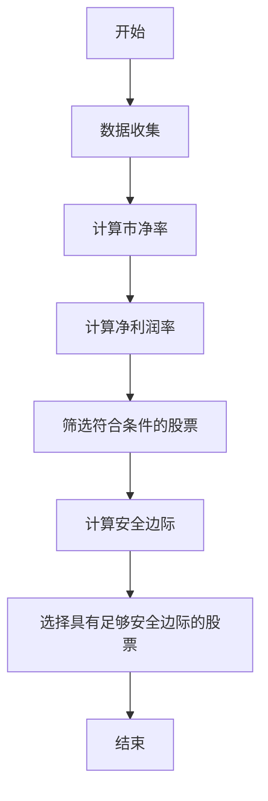
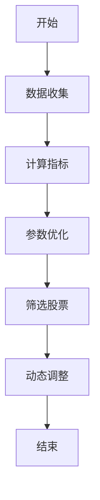
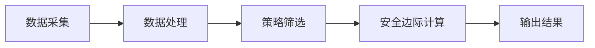
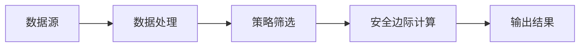
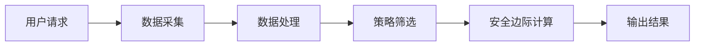

                 


# 净净股票策略：格雷厄姆理论的现代演绎

## 关键词
- 净净股票策略
- 格雷厄姆理论
- 价值投资
- 安全边际
- 内在价值
- 现代投资

## 摘要
本文系统地阐述了净净股票策略作为格雷厄姆价值投资理论的现代演绎，结合了传统投资理念与现代量化分析方法。通过分析策略的核心概念、算法原理、系统架构，并结合项目实战和最佳实践，本文为投资者提供了从理论到实践的全面指导。内容涵盖价值投资的起源、净净股票策略的定义、安全边际的计算、内在价值的评估，以及基于Python的策略实现，帮助投资者在现代市场中优化投资组合，降低风险，实现稳健收益。

---

## 第一部分：净净股票策略的背景与核心概念

### 第1章：价值投资的起源与格雷厄姆理论

#### 1.1 价值投资的起源
价值投资是投资领域的重要流派，起源于20世纪初。本节将介绍价值投资的起源及其发展历程，重点阐述格雷厄姆与多德对价值投资理论的贡献。

##### 1.1.1 投资理论的演变历程
- **早期投资理论**：19世纪末至20世纪初，投资理论主要基于基本面分析和市场情绪分析。
- **格雷厄姆与多德的贡献**：1924年，格雷厄姆与多德合著的《证券分析》奠定了价值投资的基础。
- **现代价值投资的发展**：以巴菲特为代表，将格雷厄姆的理论发扬光大，结合市场实际情况进行创新。

##### 1.1.2 格雷厄姆的价值投资理念
格雷厄姆提出的价值投资理念强调以低于内在价值的价格买入优质股票，注重安全边际和长期投资。

##### 1.1.3 格雷厄姆投资策略的核心思想
- **安全边际**：买入价格低于内在价值，确保投资的安全性。
- **长期持有**：避免频繁交易，降低交易成本。
- **分散投资**：通过分散投资降低风险。

#### 1.2 净净股票策略的定义与特点
净净股票策略是基于格雷厄姆理论的现代演绎，结合了现代量化分析方法。

##### 1.2.1 净净股票策略的定义
净净股票策略是一种以低市净率和高净利润率为核心指标，筛选具有安全边际的股票进行投资的策略。

##### 1.2.2 净净股票策略与传统价值投资的区别
- **传统价值投资**：注重内在价值和安全边际，但更多依赖主观判断。
- **净净股票策略**：结合量化指标（如市净率、净利润率）进行筛选，更具操作性。

##### 1.2.3 净净股票策略的现代发展
随着技术进步和数据量的增加，净净股票策略通过量化分析和算法优化，逐渐成为现代投资的重要方法之一。

---

### 第2章：格雷厄姆理论的核心要素

#### 2.1 格雷厄姆的安全边际概念
安全边际是格雷厄姆理论的核心要素，确保投资的安全性。

##### 2.1.1 安全边际的定义
安全边际是指买入价格与内在价值之间的差距，确保即使市场价格波动，也能保证盈利。

##### 2.1.2 安全边际的计算方法
- **内在价值计算**：通过DCF模型或其他方法计算股票的内在价值。
- **安全边际计算**：买入价格 = 内在价值 × (1 - 安全边际率)。

##### 2.1.3 安全边际在投资决策中的应用
在投资决策中，安全边际用于筛选股票，确保投资标的具有足够的安全空间。

#### 2.2 格雷厄姆的内在价值理论
内在价值是股票的真正价值，与市场波动无关。

##### 2.2.1 内在价值的定义
内在价值是股票未来现金流的现值，反映其真实价值。

##### 2.2.2 内在价值的计算公式
$$
\text{内在价值} = \sum_{t=1}^{n} \frac{\text{现金流}}{(1 + r)^t}
$$
其中，\( r \) 是折现率，\( t \) 是时间。

##### 2.2.3 内在价值与市场价值的关系
市场价值围绕内在价值波动，内在价值是投资决策的依据。

#### 2.3 格雷厄姆的投资策略
格雷厄姆的投资策略以安全边际为核心，注重长期持有和分散投资。

##### 2.3.1 买入并持有策略
- **买入策略**：以低于内在价值的价格买入股票。
- **持有策略**：长期持有，避免频繁交易。

##### 2.3.2 投资组合的构建原则
- **分散投资**：通过分散投资降低风险。
- **风险控制**：通过安全边际控制投资风险。

##### 2.3.3 风险控制的策略
- **止损策略**：设定止损点，避免重大损失。
- **动态调整**：定期审视投资组合，根据市场变化进行调整。

---

### 第3章：净净股票策略的现代演绎

#### 3.1 净净股票策略的核心要素
净净股票策略结合了格雷厄姆的安全边际概念和现代量化分析方法。

##### 3.1.1 净利润与市净率的结合
- **净利润率**：净利润率 = 净利润 / 收入。
- **市净率**：市净率 = 股价 / 每股净资产。

##### 3.1.2 净净股票的筛选标准
- **低市净率**：市净率 < 1.5。
- **高净利润率**：净利润率 > 10%。

##### 3.1.3 净净股票策略的优势与局限性
- **优势**：量化筛选，操作性强。
- **局限性**：可能遗漏某些优质成长股。

#### 3.2 净净股票策略与现代投资理论的结合
现代投资理论与净净股票策略的结合，提升了策略的科学性和可操作性。

##### 3.2.1 现代投资组合理论与净净股票策略的结合
- **资产配置**：通过现代投资组合理论优化资产配置。
- **风险分散**：通过分散投资降低系统性风险。

##### 3.2.2 净净股票策略在量化投资中的应用
- **量化筛选**：通过量化指标筛选股票。
- **算法交易**：结合算法交易优化投资策略。

---

## 第二部分：净净股票策略的算法原理

### 第4章：净净股票策略的算法实现

#### 4.1 策略筛选算法
本节将介绍净净股票策略的具体筛选算法。

##### 4.1.1 筛选条件
- **低市净率**：市净率 < 1.5。
- **高净利润率**：净利润率 > 10%。
- **稳定的盈利能力**：过去三年净利润持续增长。

##### 4.1.2 筛选流程
1. 数据收集：收集目标股票的财务数据。
2. 计算指标：计算市净率和净利润率。
3. 筛选股票：根据筛选条件筛选股票。
4. 评估安全边际：计算安全边际，选择具有足够安全边际的股票。

##### 4.1.3 算法流程图


#### 4.2 安全边际的计算
##### 4.2.1 安全边际计算公式
$$
\text{安全边际} = \text{内在价值} - \text{市场价格}
$$

##### 4.2.2 安全边际率
$$
\text{安全边际率} = \frac{\text{安全边际}}{\text{内在价值}} \times 100\%
$$

#### 4.3 内在价值的估算
##### 4.3.1 内在价值估算公式
$$
\text{内在价值} = \frac{\text{净利润}}{\text{资本成本} - \text{增长率}}
$$

##### 4.3.2 资本成本的估算
资本成本可以通过CAPM模型估算。

#### 4.4 策略优化
##### 4.4.1 策略优化方法
- **参数优化**：调整筛选条件，提高筛选效率。
- **动态调整**：根据市场变化动态调整策略。

##### 4.4.2 策略优化算法


---

## 第三部分：净净股票策略的系统架构设计

### 第5章：系统架构设计

#### 5.1 系统功能设计
##### 5.1.1 系统功能模块
- 数据采集模块：收集股票数据。
- 数据处理模块：计算市净率和净利润率。
- 策略筛选模块：筛选符合条件的股票。
- 安全边际计算模块：计算安全边际。

##### 5.1.2 功能模块之间的关系


#### 5.2 系统架构设计
##### 5.2.1 系统架构图


##### 5.2.2 系统接口设计
- 数据接口：提供数据采集和处理的接口。
- 策略接口：提供策略筛选的接口。
- 输出接口：提供结果输出的接口。

#### 5.3 系统交互设计
##### 5.3.1 系统交互流程


---

## 第四部分：净净股票策略的项目实战

### 第6章：项目实战

#### 6.1 环境安装
##### 6.1.1 环境要求
- Python 3.6以上版本
- 数据分析库（Pandas、NumPy）
- 可视化库（Matplotlib、Seaborn）
- 数据获取库（Yahoo Finance API）

##### 6.1.2 环境安装步骤
```bash
pip install pandas numpy matplotlib seaborn yfinance
```

#### 6.2 核心实现
##### 6.2.1 数据获取
```python
import yfinance as yf
import pandas as pd

# 获取股票数据
def get_data(ticker):
    df = yf.download(ticker, start='2020-01-01', end='2023-12-31')
    return df
```

##### 6.2.2 数据处理
```python
def process_data(df):
    df['市净率'] = df['Close'] / df['Book Value'].fillna(0)
    df['净利润率'] = df['Net Income'].fillna(0) / df['Revenue'].fillna(0)
    return df
```

##### 6.2.3 策略筛选
```python
def screen_stocks(df):
    selected = df[(df['市净率'] < 1.5) & (df['净利润率'] > 0.1)]
    return selected
```

##### 6.2.4 安全边际计算
```python
def calculate_margin(selected, intrinsic_value):
    margin = intrinsic_value - selected['Close']
    return margin
```

#### 6.3 代码解读与分析
##### 6.3.1 代码解读
- 数据获取：从Yahoo Finance获取股票数据。
- 数据处理：计算市净率和净利润率。
- 策略筛选：根据筛选条件筛选股票。
- 安全边际计算：计算安全边际。

##### 6.3.2 代码分析
- 数据获取模块：使用yfinance库获取数据。
- 数据处理模块：计算市净率和净利润率。
- 策略筛选模块：根据筛选条件筛选股票。
- 安全边际计算模块：计算安全边际。

#### 6.4 实际案例分析
##### 6.4.1 案例背景
假设我们要筛选2020-2023年的股票数据，选择市净率 < 1.5且净利润率 > 10%的股票。

##### 6.4.2 数据分析与结果展示
```python
import matplotlib.pyplot as plt

selected_stocks = screen_stocks(df)
selected_stocks[['市净率', '净利润率']].hist()
plt.show()
```

##### 6.4.3 策略表现分析
计算筛选出的股票的表现，包括收益率、波动率等。

#### 6.5 项目小结
通过项目实战，我们可以看到净净股票策略在实际中的应用，验证了策略的有效性和可操作性。

---

## 第五部分：净净股票策略的最佳实践

### 第7章：最佳实践

#### 7.1 小结
净净股票策略是一种有效的投资策略，结合了格雷厄姆的安全边际概念和现代量化分析方法。

#### 7.2 注意事项
- **数据质量**：确保数据准确可靠。
- **风险控制**：设置止损点，避免重大损失。
- **持续学习**：关注市场变化，优化策略。

#### 7.3 拓展阅读
- 格雷厄姆的《证券分析》。
- 巴菲特的《致股东的信》。
- 现代投资组合理论的相关书籍。

---

## 总结
通过本文的详细讲解，读者可以系统地了解净净股票策略的理论基础、算法实现、系统架构设计以及实际应用。希望本文能为投资者提供有价值的参考，帮助他们在现代股票市场中制定科学的投资策略，实现稳健的收益。

--- 

**感谢您的耐心阅读！如果有任何问题或建议，请随时与我联系。**

