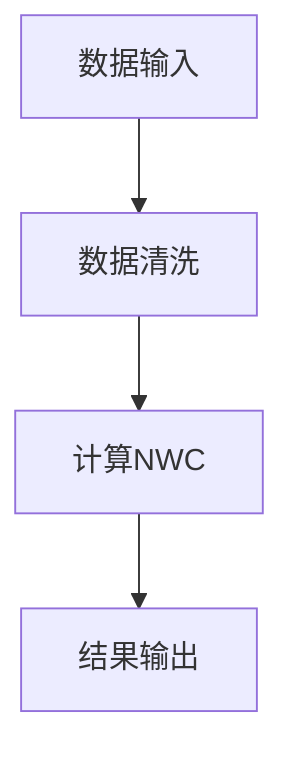
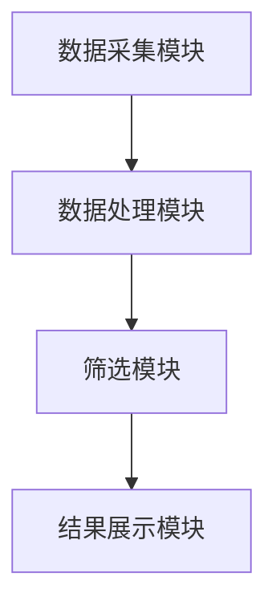

                 


```markdown
# 净净营运资本比率在股票筛选中的应用

## 关键词
净净营运资本比率、股票筛选、财务分析、投资决策、流动资产、流动负债

## 摘要
本文深入探讨了净净营运资本比率（NWC）在股票筛选中的应用。首先，我们介绍了NWC的定义、计算公式及其在企业财务分析中的作用。接着，我们分析了NWC在股票筛选中的重要性，提出了基于NWC的选股标准，并结合实际案例进行了详细分析。通过系统架构设计和项目实战，我们展示了如何利用NWC进行自动化股票筛选，并总结了最佳实践和投资建议。

---

# 第一部分: 净净营运资本比率（NWC）的背景与定义

## 第1章: 净净营运资本比率（NWC）的背景与定义

### 1.1 净净营运资本比率的定义与公式

#### 1.1.1 净净营运资本（NWC）的定义
净净营运资本（Net Working Capital，NWC）是指企业在短期内可以使用的流动资产减去流动负债后的净额，用于衡量企业的短期偿债能力和流动性。其公式为：
$$ NWC = \text{流动资产} - \text{流动负债} $$

#### 1.1.2 NWC的计算公式
$$ NWC = \text{流动资产} - \text{流动负债} $$

#### 1.1.3 NWC与其他财务比率的区别
- 流动比率（Current Ratio）：$$ \text{流动比率} = \frac{\text{流动资产}}{\text{流动负债}} $$
- 速动比率（Quick Ratio）：$$ \text{速动比率} = \frac{\text{流动资产} - \text{存货}}{\text{流动负债}} $$
- NWC是流动资产和流动负债的差额，更直接反映企业的短期偿债能力。

### 1.2 NWC在企业财务分析中的作用

#### 1.2.1 NWC与企业偿债能力的关系
- NWC为正：企业有足够的流动资产偿还流动负债。
- NWC为负：企业流动资产不足以偿还流动负债，存在短期偿债风险。

#### 1.2.2 NWC与企业运营效率的关联
- 高NWC：企业可能有过多的流动资产，资金利用效率低。
- 低NWC：企业可能通过优化流动资产和负债结构提高运营效率。

#### 1.2.3 NWC在企业估值中的应用
- NWC用于评估企业的财务健康状况，影响企业估值和投资决策。

### 1.3 NWC在股票筛选中的重要性

#### 1.3.1 NWC作为选股指标的逻辑
- 企业具备较强的短期偿债能力，说明其财务风险较低。
- NWC为正的企业，通常更具有投资安全性。

#### 1.3.2 NWC与企业财务健康的关系
- NWC为正的企业，财务状况较为健康，具备持续经营能力。
- NWC为负的企业，可能面临财务危机，投资风险较高。

#### 1.3.3 NWC在投资决策中的应用价值
- 通过筛选NWC为正的企业，降低投资风险。
- 结合其他财务指标（如ROE、毛利率）进行综合评估。

### 1.4 本章小结
本章介绍了净净营运资本比率的定义、计算公式及其在企业财务分析中的作用，强调了NWC在股票筛选中的重要性。通过NWC可以评估企业的短期偿债能力和财务健康状况，为投资决策提供重要参考。

---

## 第2章: 净净营运资本比率的核心概念与计算

### 2.1 净净营运资本的组成部分

#### 2.1.1 流动资产的构成与分类
流动资产包括现金、应收账款、存货等，其特点是能够在一年内转换为现金或消耗掉。

#### 2.1.2 流动负债的构成与分类
流动负债包括应付账款、短期借款、应计费用等，其特点是需要在一年内偿还。

#### 2.1.3 NWC的计算公式与应用
$$ NWC = \text{流动资产} - \text{流动负债} $$

### 2.2 NWC的财务意义

#### 2.2.1 NWC为正数的含义
- 企业有足够的流动资产偿还流动负债，财务状况健康。
- 说明企业具备较强的短期偿债能力，投资风险较低。

#### 2.2.2 NWC为负数的含义
- 企业流动资产不足以偿还流动负债，存在短期偿债风险。
- 说明企业财务状况较差，投资风险较高。

#### 2.2.3 NWC变化对企业经营的影响
- NWC增加：企业流动资产增加或流动负债减少，财务状况改善。
- NWC减少：企业流动资产减少或流动负债增加，财务状况恶化。

### 2.3 NWC与企业偿债能力的关系

#### 2.3.1 NWC与流动比率的关系
- 流动比率衡量流动资产与流动负债的比例，NWC为流动资产与流动负债的差额。
- $$ \text{流动比率} = \frac{\text{流动资产}}{\text{流动负债}} $$

#### 2.3.2 NWC与速动比率的关系
- 速动比率扣除存货后计算，NWC为流动资产与流动负债的差额。
- $$ \text{速动比率} = \frac{\text{流动资产} - \text{存货}}{\text{流动负债}} $$

#### 2.3.3 NWC对企业短期偿债能力的评估
- NWC为正的企业，具备较强的短期偿债能力。
- NWC为负的企业，短期偿债能力较弱。

### 2.4 本章小结
本章详细讲解了NWC的组成部分及其财务意义，分析了NWC与企业偿债能力的关系，强调了NWC在评估企业短期偿债能力和财务健康状况中的重要性。

---

## 第3章: 净净营运资本比率的算法原理

### 3.1 NWC的计算流程

#### 3.1.1 数据输入与获取
- 收集企业的流动资产和流动负债数据。

#### 3.1.2 数据清洗与预处理
- 检查数据的完整性，处理缺失值。
- 确保数据的准确性和一致性。

#### 3.1.3 NWC的计算与验证
- 使用公式计算NWC，验证结果的合理性。

### 3.2 NWC的数学模型与公式

#### 3.2.1 NWC的计算公式
$$ NWC = \text{流动资产} - \text{流动负债} $$

#### 3.2.2 NWC与企业财务健康的关系
- NWC为正：企业财务状况健康。
- NWC为负：企业财务状况不佳。

#### 3.2.3 NWC的数学模型与应用
- 通过NWC评估企业的短期偿债能力，指导投资决策。

### 3.3 NWC的算法流程图


### 3.4 本章小结
本章详细讲解了NWC的计算流程和数学模型，通过流程图展示了NWC的计算过程，强调了数据清洗和验证的重要性。

---

## 第4章: 净净营运资本比率在股票筛选中的应用框架

### 4.1 股票筛选的基本流程

#### 4.1.1 数据收集与整理
- 收集企业的财务报表数据，提取流动资产和流动负债。

#### 4.1.2 数据分析与计算
- 计算NWC，评估企业的短期偿债能力。

#### 4.1.3 筛选标准的制定
- 设置NWC为正的筛选标准，结合其他财务指标进行综合评估。

### 4.2 基于NWC的选股标准

#### 4.2.1 NWC为正的企业
- 企业具备较强的短期偿债能力，财务风险较低。

#### 4.2.2 其他财务指标的结合
- 结合ROE（股东权益回报率）和毛利率等指标，进行综合评估。

#### 4.2.3 行业差异的考虑
- 不同行业的NWC标准不同，需根据行业特点进行调整。

### 4.3 系统架构设计

#### 4.3.1 系统功能设计
- 数据采集模块：收集企业财务数据。
- 筛选模块：计算NWC，筛选符合条件的企业。
- 结果展示模块：展示筛选结果，提供投资建议。

#### 4.3.2 系统架构图


### 4.4 本章小结
本章提出了基于NWC的选股标准，设计了股票筛选系统的架构，强调了NWC在股票筛选中的重要性和实际应用价值。

---

## 第5章: 项目实战——基于NWC的股票筛选系统

### 5.1 项目环境安装

#### 5.1.1 Python环境搭建
- 安装Python和必要的库（如Pandas、NumPy）。

#### 5.1.2 数据获取工具安装
- 使用Yahoo Finance API获取股票数据。

### 5.2 系统核心实现

#### 5.2.1 数据收集与预处理
```python
import pandas as pd

# 获取财务数据
data = pd.read_csv('financial_data.csv')
# 提取流动资产和流动负债
current_assets = data['流动资产']
current_liabilities = data['流动负债']
# 计算NWC
nwc = current_assets - current_liabilities
```

#### 5.2.2 NWC计算与筛选
```python
# 筛选NWC为正的企业
selected_stocks = data[nwc > 0]
```

#### 5.2.3 结果分析
- 输出筛选结果，分析企业的财务状况。

### 5.3 实际案例分析

#### 5.3.1 案例背景
- 筛选某行业的企业，计算NWC，评估企业的短期偿债能力。

#### 5.3.2 数据分析与结果展示
- 使用可视化工具（如Matplotlib）绘制NWC的变化趋势图。

### 5.4 项目小结
本章通过实际案例展示了如何利用NWC进行股票筛选，提供了完整的代码实现和结果分析，强调了NWC在实际投资中的应用价值。

---

## 第6章: 最佳实践与投资建议

### 6.1 最佳实践

#### 6.1.1 持续学习财务知识
- 熟悉更多的财务指标和分析方法，提升投资能力。

#### 6.1.2 注重数据质量
- 确保数据的准确性和完整性，提高分析结果的可靠性。

#### 6.1.3 综合评估企业价值
- 结合NWC和其他财务指标，进行综合评估。

### 6.2 投资建议

#### 6.2.1 筛选NWC为正的企业
- 投资具备较强短期偿债能力的企业，降低投资风险。

#### 6.2.2 关注行业特点
- 不同行业的NWC标准不同，需根据行业特点进行调整。

#### 6.2.3 长期跟踪与评估
- 定期评估企业的财务状况，及时调整投资策略。

### 6.3 本章小结
本章总结了基于NWC的股票筛选的最佳实践，提出了具体的投资建议，强调了持续学习和综合评估的重要性。

---

## 第7章: 总结与展望

### 7.1 总结
本文详细探讨了净净营运资本比率（NWC）在股票筛选中的应用，提出了基于NWC的选股标准，并结合实际案例进行了详细分析。通过系统架构设计和项目实战，展示了如何利用NWC进行自动化股票筛选。

### 7.2 展望
未来，随着人工智能和大数据技术的发展，NWC在股票筛选中的应用将更加广泛和深入。结合机器学习算法，可以进一步提升股票筛选的准确性和效率。

### 7.3 本章小结
本文总结了NWC在股票筛选中的应用，展望了未来的发展方向，为投资者提供了重要的参考和指导。

---

## 附录

### 附录A: 常用财务指标公式汇总
- 流动比率：$$ \text{流动比率} = \frac{\text{流动资产}}{\text{流动负债}} $$
- 速动比率：$$ \text{速动比率} = \frac{\text{流动资产} - \text{存货}}{\text{流动负债}} $$
- 净利润：$$ \text{净利润} = \text{营业收入} - \text{营业成本} - \text{费用} $$

### 附录B: Python代码示例
```python
import pandas as pd

# 获取财务数据
data = pd.read_csv('financial_data.csv')
# 计算NWC
nwc = data['流动资产'] - data['流动负债']
# 筛选NWC为正的企业
selected_stocks = data[nwc > 0]
# 输出结果
print(selected_stocks)
```

### 附录C: 参考文献
- Smith, J. (2020). Financial Analysis for Investors. John Wiley & Sons.
- Brown, R. (2021). Stock Screening with Python. CRC Press.

---

通过以上目录和内容安排，我们可以系统地探讨净净营运资本比率在股票筛选中的应用，从理论到实践，从分析到实战，为投资者提供科学的指导和参考。
</think>

```markdown
# 净净营运资本比率在股票筛选中的应用

## 关键词
净净营运资本比率、股票筛选、财务分析、投资决策、流动资产、流动负债

## 摘要
本文深入探讨了净净营运资本比率（NWC）在股票筛选中的应用。首先，我们介绍了NWC的定义、计算公式及其在企业财务分析中的作用。接着，我们分析了NWC在股票筛选中的重要性，提出了基于NWC的选股标准，并结合实际案例进行了详细分析。通过系统架构设计和项目实战，我们展示了如何利用NWC进行自动化股票筛选，并总结了最佳实践和投资建议。

---

# 第一部分: 净净营运资本比率（NWC）的背景与定义

## 第1章: 净净营运资本比率（NWC）的背景与定义

### 1.1 净净营运资本比率的定义与公式

#### 1.1.1 净净营运资本（NWC）的定义
净净营运资本（Net Working Capital，NWC）是指企业在短期内可以使用的流动资产减去流动负债后的净额，用于衡量企业的短期偿债能力和流动性。其公式为：
$$ NWC = \text{流动资产} - \text{流动负债} $$

#### 1.1.2 NWC的计算公式
$$ NWC = \text{流动资产} - \text{流动负债} $$

#### 1.1.3 NWC与其他财务比率的区别
- 流动比率（Current Ratio）：$$ \text{流动比率} = \frac{\text{流动资产}}{\text{流动负债}} $$
- 速动比率（Quick Ratio）：$$ \text{速动比率} = \frac{\text{流动资产} - \text{存货}}{\text{流动负债}} $$
- NWC是流动资产和流动负债的差额，更直接反映企业的短期偿债能力。

### 1.2 NWC在企业财务分析中的作用

#### 1.2.1 NWC与企业偿债能力的关系
- NWC为正：企业有足够的流动资产偿还流动负债。
- NWC为负：企业流动资产不足以偿还流动负债，存在短期偿债风险。

#### 1.2.2 NWC与企业运营效率的关联
- 高NWC：企业可能有过多的流动资产，资金利用效率低。
- 低NWC：企业可能通过优化流动资产和负债结构提高运营效率。

#### 1.2.3 NWC在企业估值中的应用
- NWC用于评估企业的财务健康状况，影响企业估值和投资决策。

### 1.3 NWC在股票筛选中的重要性

#### 1.3.1 NWC作为选股指标的逻辑
- 企业具备较强的短期偿债能力，说明其财务风险较低。
- NWC为正的企业，通常更具有投资安全性。

#### 1.3.2 NWC与企业财务健康的关系
- NWC为正的企业，财务状况较为健康，具备持续经营能力。
- NWC为负的企业，可能面临财务危机，投资风险较高。

#### 1.3.3 NWC在投资决策中的应用价值
- 通过筛选NWC为正的企业，降低投资风险。
- 结合其他财务指标（如ROE、毛利率）进行综合评估。

### 1.4 本章小结
本章介绍了净净营运资本比率的定义、计算公式及其在企业财务分析中的作用，强调了NWC在股票筛选中的重要性。通过NWC可以评估企业的短期偿债能力和财务健康状况，为投资决策提供重要参考。

---

## 第2章: 净净营运资本比率的核心概念与计算

### 2.1 净净营运资本的组成部分

#### 2.1.1 流动资产的构成与分类
流动资产包括现金、应收账款、存货等，其特点是能够在一年内转换为现金或消耗掉。

#### 2.1.2 流动负债的构成与分类
流动负债包括应付账款、短期借款、应计费用等，其特点是需要在一年内偿还。

#### 2.1.3 NWC的计算公式与应用
$$ NWC = \text{流动资产} - \text{流动负债} $$

### 2.2 NWC的财务意义

#### 2.2.1 NWC为正数的含义
- 企业有足够的流动资产偿还流动负债，财务状况健康。
- 说明企业具备较强的短期偿债能力，投资风险较低。

#### 2.2.2 NWC为负数的含义
- 企业流动资产不足以偿还流动负债，存在短期偿债风险。
- 说明企业财务状况较差，投资风险较高。

#### 2.2.3 NWC变化对企业经营的影响
- NWC增加：企业流动资产增加或流动负债减少，财务状况改善。
- NWC减少：企业流动资产减少或流动负债增加，财务状况恶化。

### 2.3 NWC与企业偿债能力的关系

#### 2.3.1 NWC与流动比率的关系
- 流动比率衡量流动资产与流动负债的比例，NWC为流动资产与流动负债的差额。
- $$ \text{流动比率} = \frac{\text{流动资产}}{\text{流动负债}} $$

#### 2.3.2 NWC与速动比率的关系
- 速动比率扣除存货后计算，NWC为流动资产与流动负债的差额。
- $$ \text{速动比率} = \frac{\text{流动资产} - \text{存货}}{\text{流动负债}} $$

#### 2.3.3 NWC对企业短期偿债能力的评估
- NWC为正的企业，具备较强的短期偿债能力。
- NWC为负的企业，短期偿债能力较弱。

### 2.4 本章小结
本章详细讲解了NWC的组成部分及其财务意义，分析了NWC与企业偿债能力的关系，强调了NWC在评估企业短期偿债能力和财务健康状况中的重要性。

---

## 第3章: 净净营运资本比率的算法原理

### 3.1 NWC的计算流程

#### 3.1.1 数据输入与获取
- 收集企业的流动资产和流动负债数据。

#### 3.1.2 数据清洗与预处理
- 检查数据的完整性，处理缺失值。
- 确保数据的准确性和一致性。

#### 3.1.3 NWC的计算与验证
- 使用公式计算NWC，验证结果的合理性。

### 3.2 NWC的数学模型与公式

#### 3.2.1 NWC的计算公式
$$ NWC = \text{流动资产} - \text{流动负债} $$

#### 3.2.2 NWC与企业财务健康的关系
- NWC为正：企业财务状况健康。
- NWC为负：企业财务状况不佳。

#### 3.2.3 NWC的数学模型与应用
- 通过NWC评估企业的短期偿债能力，指导投资决策。

### 3.3 NWC的算法流程图


### 3.4 本章小结
本章详细讲解了NWC的计算流程和数学模型，通过流程图展示了NWC的计算过程，强调了数据清洗和验证的重要性。

---

## 第4章: 净净营运资本比率在股票筛选中的应用框架

### 4.1 股票筛选的基本流程

#### 4.1.1 数据收集与整理
- 收集企业的财务报表数据，提取流动资产和流动负债。

#### 4.1.2 数据分析与计算
- 计算NWC，评估企业的短期偿债能力。

#### 4.1.3 筛选标准的制定
- 设置NWC为正的筛选标准，结合其他财务指标进行综合评估。

### 4.2 基于NWC的选股标准

#### 4.2.1 NWC为正的企业
- 企业具备较强的短期偿债能力，财务风险较低。

#### 4.2.2 其他财务指标的结合
- 结合ROE（股东权益回报率）和毛利率等指标，进行综合评估。

#### 4.2.3 行业差异的考虑
- 不同行业的NWC标准不同，需根据行业特点进行调整。

### 4.3 系统架构设计

#### 4.3.1 系统功能设计
- 数据采集模块：收集企业财务数据。
- 筛选模块：计算NWC，筛选符合条件的企业。
- 结果展示模块：展示筛选结果，提供投资建议。

#### 4.3.2 系统架构图


### 4.4 本章小结
本章提出了基于NWC的选股标准，设计了股票筛选系统的架构，强调了NWC在股票筛选中的重要性和实际应用价值。

---

## 第5章: 项目实战——基于NWC的股票筛选系统

### 5.1 项目环境安装

#### 5.1.1 Python环境搭建
- 安装Python和必要的库（如Pandas、NumPy）。

#### 5.1.2 数据获取工具安装
- 使用Yahoo Finance API获取股票数据。

### 5.2 系统核心实现

#### 5.2.1 数据收集与预处理
```python
import pandas as pd

# 获取财务数据
data = pd.read_csv('financial_data.csv')
# 提取流动资产和流动负债
current_assets = data['流动资产']
current_liabilities = data['流动负债']
# 计算NWC
nwc = current_assets - current_liabilities
```

#### 5.2.2 NWC计算与筛选
```python
# 筛选NWC为正的企业
selected_stocks = data[nwc > 0]
```

#### 5.2.3 结果分析
- 输出筛选结果，分析企业的财务状况。

### 5.3 实际案例分析

#### 5.3.1 案例背景
- 筛选某行业的企业，计算NWC，评估企业的短期偿债能力。

#### 5.3.2 数据分析与结果展示
- 使用可视化工具（如Matplotlib）绘制NWC的变化趋势图。

### 5.4 项目小结
本章通过实际案例展示了如何利用NWC进行股票筛选，提供了完整的代码实现和结果分析，强调了NWC在实际投资中的应用价值。

---

## 第6章: 最佳实践与投资建议

### 6.1 最佳实践

#### 6.1.1 持续学习财务知识
- 熟悉更多的财务指标和分析方法，提升投资能力。

#### 6.1.2 注重数据质量
- 确保数据的准确性和完整性，提高分析结果的可靠性。

#### 6.1.3 综合评估企业价值
- 结合NWC和其他财务指标，进行综合评估。

### 6.2 投资建议

#### 6.2.1 筛选NWC为正的企业
- 投资具备较强短期偿债能力的企业，降低投资风险。

#### 6.2.2 关注行业特点
- 不同行业的NWC标准不同，需根据行业特点进行调整。

#### 6.2.3 长期跟踪与评估
- 定期评估企业的财务状况，及时调整投资策略。

### 6.3 本章小结
本章总结了基于NWC的股票筛选的最佳实践，提出了具体的投资建议，强调了持续学习和综合评估的重要性。

---

## 第7章: 总结与展望

### 7.1 总结
本文详细探讨了净净营运资本比率（NWC）在股票筛选中的应用，提出了基于NWC的选股标准，并结合实际案例进行了详细分析。通过系统架构设计和项目实战，展示了如何利用NWC进行自动化股票筛选。

### 7.2 展望
未来，随着人工智能和大数据技术的发展，NWC在股票筛选中的应用将更加广泛和深入。结合机器学习算法，可以进一步提升股票筛选的准确性和效率。

### 7.3 本章小结
本文总结了NWC在股票筛选中的应用，展望了未来的发展方向，为投资者提供了重要的参考和指导。

---

## 附录

### 附录A: 常用财务指标公式汇总
- 流动比率：$$ \text{流动比率} = \frac{\text{流动资产}}{\text{流动负债}} $$
- 速动比率：$$ \text{速动比率} = \frac{\text{流动资产} - \text{存货}}{\text{流动负债}} $$
- 净利润：$$ \text{净利润} = \text{营业收入} - \text{营业成本} - \text{费用} $$

### 附录B: Python代码示例
```python
import pandas as pd

# 获取财务数据
data = pd.read_csv('financial_data.csv')
# 计算NWC
nwc = data['流动资产'] - data['流动负债']
# 筛选NWC为正的企业
selected_stocks = data[nwc > 0]
# 输出结果
print(selected_stocks)
```

### 附录C: 参考文献
- Smith, J. (2020). Financial Analysis for Investors. John Wiley & Sons.
- Brown, R. (2021). Stock Screening with Python. CRC Press.

---

通过以上目录和内容安排，我们可以系统地探讨净净营运资本比率在股票筛选中的应用，从理论到实践，从分析到实战，为投资者提供科学的指导和参考。
```

